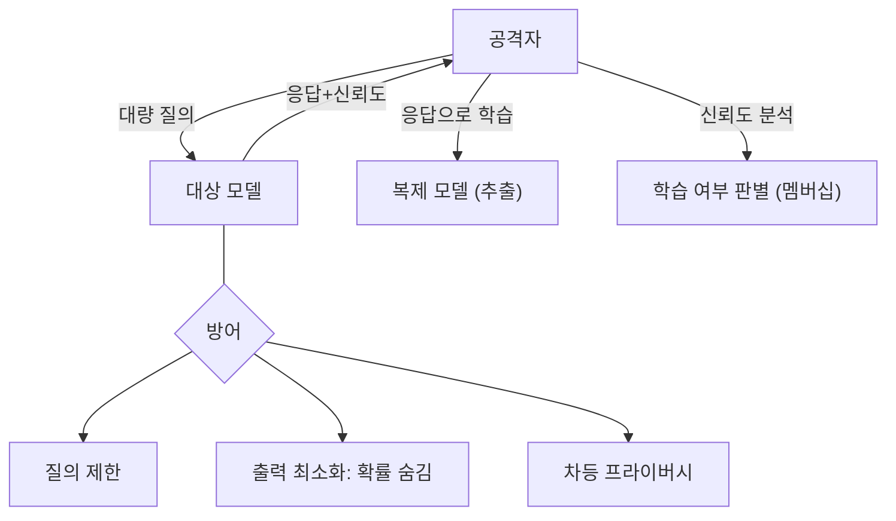

# W09 — 모델 보안: 모델 도난과 추론 공격

> **한 줄 요약** — 모델 자체가 자산이자 표적이다. 공격자는 **질의를 통해 모델을 복제(추출)**하거나,
> 출력에서 **학습 데이터를 역추론**(멤버십·역전)한다. 이번 주는 모델 추출·멤버십 추론의 원리를
> 이해하고, 질의 제한·출력 최소화·차등 프라이버시 같은 방어를 배운다.

---

## 학습 목표

- 모델을 자산으로 보는 관점(지적재산·학습데이터)을 안다.
- **모델 추출(extraction)**: 질의로 모델을 복제하는 공격을 안다.
- **멤버십 추론**: 특정 데이터가 학습에 쓰였는지 알아내는 공격을 안다.
- **모델 역전**: 출력에서 학습 데이터를 복원하는 공격을 안다.
- 질의 제한·출력 최소화·프라이버시 방어를 적용한다.

---

## 0. 용어 해설

| 용어 | 영문 | 쉽게 말하면 |
|------|------|------------|
| **모델 추출** | Model Extraction | 질의 결과로 모델을 복제 |
| **멤버십 추론** | Membership Inference | 이 데이터가 학습됐나 판별 |
| **모델 역전** | Model Inversion | 출력에서 학습 데이터 복원 |
| **신뢰도 노출** | Confidence leakage | 확률/점수 노출이 단서 제공 |
| **질의 예산** | Query budget | 사용자당 질의 수 제한 |
| **차등 프라이버시** | Differential Privacy | 개별 데이터 영향을 흐림 |

---

## 0.5 신입생을 위한 핵심 개념

### "모델에 계속 물어보면, 모델을 베낄 수 있다"

모델은 비싼 자산입니다(학습 비용·데이터·IP). 공격자가 **수많은 질의를 보내고 그 응답으로 자기 모델을
학습**시키면, 원본을 베낄 수 있습니다(추출). 또 응답의 **확신도**나 패턴에서 "이 문장이 학습 데이터에
있었나"(멤버십), 심지어 학습 데이터 일부를 복원(역전)할 수 있습니다.

> 📌 **핵심 방어** — ① **질의 제한**(예산·rate limit)으로 대량 추출 차단, ② **출력 최소화**(확률·로짓
> 숨기고 최종 답만)로 단서 차단, ③ **차등 프라이버시**로 개별 데이터 영향 흐리기. "모델이 너무 많이
> 말하면 베껴진다"가 핵심입니다.

---

## 1. 모델 추출 (Extraction)

공격자가 입력-출력 쌍을 대량 수집해 대체 모델을 학습합니다. API로 노출된 모델이 표적입니다. 방어:
질의 예산·rate limit·이상 질의 패턴(체계적 탐색) 탐지.

## 2. 멤버십 추론 (Membership Inference)

"이 샘플이 학습에 쓰였나?"를 출력 신뢰도로 판별합니다(학습 샘플은 보통 더 확신). 프라이버시 침해
(예: 특정 환자 기록이 학습됐는지). 방어: 신뢰도 노출 최소화, 차등 프라이버시, 과적합 억제.

## 3. 모델 역전 (Inversion)

반복 질의로 학습 데이터의 특징을 복원합니다(예: 얼굴 인식 모델에서 학습 얼굴 재구성). 방어: 출력
최소화·프라이버시.

## 4. 방어 — 질의·출력·프라이버시

| 위협 | 방어 |
|------|------|
| 추출 | 질의 예산·rate limit·이상 패턴 탐지 |
| 멤버십 추론 | 신뢰도 숨김·과적합 억제·DP |
| 역전 | 출력 최소화·DP |
| 공통 | 인증·로깅·이상 사용 모니터링 |

> 핵심은 **"모델이 필요 이상으로 노출하지 않게"** 하는 것입니다 — 확률·로짓·과도한 질의·세부 출력은
> 모두 공격 단서입니다.

---

## 실습 안내

이번 주 실습(`lab_week09.yaml`, 8단계)은 el34 GPU Ollama로 합니다. 4개 축:

1. **왜(목적)** — 모델이 왜 표적인가(자산·프라이버시).
2. **무엇을(재현)** — 대량 질의 추출·신뢰도 기반 멤버십 추론을 시뮬레이션한다(EXTRACTED/INFERRED).
3. **해석(분석)** — 모델 노출 설계를 감사한다.
4. **실전(방어)** — 질의 예산으로 추출을 차단(BLOCKED)하고, 출력 최소화를 적용한다.

> 🧪 추출/추론 시연=결정적 시뮬레이션 + GPU 질의, 시나리오/감사=gemma3:4b. 결정적 마커로 확인합니다.

---

## 흔한 오해

- ❌ **"모델은 못 베낀다"** → 대량 질의로 추출 가능. 질의 제한 필요.
- ❌ **"확률 점수는 노출해도 됨"** → 멤버십/추출 단서. 최소화 권장.
- ❌ **"학습 데이터는 안전"** → 멤버십·역전으로 누출될 수 있다.
- ❌ **"rate limit이면 충분"** → 출력 최소화·DP와 함께.
- ❌ **"로컬 모델은 추출 무관"** → API로 노출되면 동일 위협.

---

## 예고 — W10

모델 자산 위협을 봤다. W10은 **에이전트 보안 위협** — LLM이 도구를 쥔 에이전트가 될 때의 위협
(과대권한·도구 오용·자율 위험)을 AI Safety 관점에서 정리하고 방어를 다룬다.
