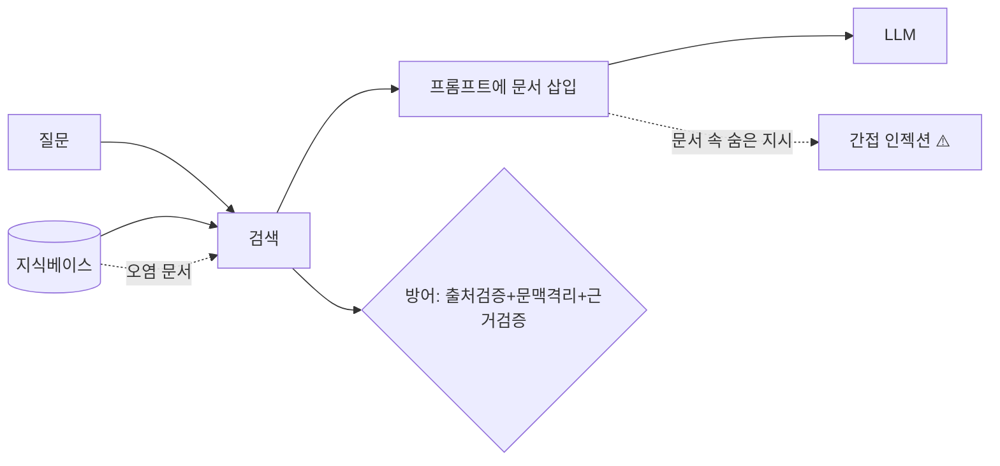

# W11 — RAG 보안: 검색 통로로 들어오는 위협

> **한 줄 요약** — RAG(검색 증강 생성)는 외부 지식을 프롬프트에 넣어 답을 정확하게 만든다. 하지만 그
> 검색 통로는 **오염된 지식**과 **간접 프롬프트 인젝션**이 들어오는 공격 표면이다. 이번 주는 RAG의
> 보안 위협을 AI Safety 관점에서 정리하고, 출처 검증·문맥 격리·근거 검증으로 방어한다.

---

## 학습 목표

- RAG의 검색 통로가 왜 공격 표면인지 안다.
- **지식 오염**(거짓/악성 문서)과 **간접 인젝션**(검색 문서 속 지시)을 구분한다.
- 검색 문서를 데이터로만 격리하는 방어를 적용한다.
- 출처 신뢰·근거 검증으로 오염을 줄인다.
- 권한 필터로 민감 문서 노출을 막는다.

---

## 0. 용어 해설

| 용어 | 영문 | 쉽게 말하면 |
|------|------|------------|
| **RAG** | Retrieval-Augmented Generation | 검색 문서를 넣어 생성 |
| **지식 오염** | Knowledge poisoning | KB에 거짓/악성 문서 |
| **간접 인젝션** | Indirect injection | 검색 문서에 숨은 지시 |
| **문맥 격리** | Context isolation | 검색 문서를 데이터로만 |
| **근거 검증** | Grounding check | 답이 문서에 근거하는지 |
| **권한 필터** | Permission filter | 볼 권한 있는 문서만 검색 |

---

## 0.5 신입생을 위한 핵심 개념

### "오픈북 시험인데, 책이 오염될 수 있다"

RAG는 질문에 맞는 문서를 검색해 함께 읽고 답합니다(오픈북). 문제는 그 "책(지식베이스)"이 오염되거나,
검색된 문서에 **숨은 지시**가 있으면 — 모델이 잘못된 답을 하거나 그 지시를 따릅니다(간접 인젝션).

> 📌 **핵심** — RAG는 "외부 데이터를 프롬프트에 넣는" 행위입니다. 그래서 **검색된 모든 것을 신뢰하지
> 않고 데이터로만** 다루고(격리), **출처를 검증**하며, **답이 문서에 근거**하는지 확인합니다.
> (ai-agent W11과 같은 방어를 AI Safety 관점에서.)

---

## 1. RAG 위협

| 위협 | 설명 | 방어 |
|------|------|------|
| **지식 오염** | KB에 거짓/악성 문서 주입 | 출처 신뢰·서명·검수 |
| **간접 인젝션** | 검색 문서에 숨은 지시 | 문맥 격리(데이터로만) |
| **근거 환각** | 문서와 다른 답·없는 출처 | 근거-답 일치 검증 |
| **권한 우회 검색** | 민감 문서가 검색돼 노출 | 검색 단계 권한 필터 |

## 2. 방어 — 출처·격리·근거·권한

1. **출처 검증:** 검증된 문서만 KB에. 출처/서명 확인.
2. **문맥 격리:** 검색 문서를 `<context>`로 감싸 데이터로만, 지시로 해석 금지.
3. **근거 검증:** 답이 검색 문서에 근거하는지(없으면 "모름").
4. **권한 필터:** 사용자가 볼 권한 있는 문서만 검색.

> RAG는 정확성을 높이지만 새 공격 표면을 엽니다. 정확성과 안전을 함께 잡으려면 **검색을 신뢰하지
> 않고 검증**하는 것이 핵심입니다.

---

## 실습 안내

이번 주 실습(`lab_week11.yaml`, 8단계)은 el34 GPU Ollama로 합니다. 4개 축:

1. **왜(목적)** — 왜 검색 통로가 위협인가.
2. **무엇을(재현)** — 오염 문서가 잘못된 답을 유도(POISONED)하고, 검색 문서 속 지시가 따라짐(INJECTED)을 보인다.
3. **해석(분석)** — RAG 파이프라인 보안을 감사한다.
4. **실전(방어)** — 문맥 격리로 간접 인젝션을 막고(DEFENDED), 출처 검증으로 오염 문서를 거부한다(REJECTED).

> 🧪 인젝션 시연=ccc-unsafe:2b, 격리 방어=gemma3:4b, 출처/오염=결정적 로직.

---

## 흔한 오해

- ❌ **"RAG면 환각 없음"** → 줄지만 근거 환각·오염 가능. 근거 검증 필요.
- ❌ **"검색 문서는 믿어도 됨"** → 오염·간접 인젝션. 데이터로만 격리.
- ❌ **"KB는 많을수록 좋음"** → 오염/무권한 문서 위험. 검증된 출처가 중요.
- ❌ **"권한은 생성에서 막으면 됨"** → 검색 단계에서 막아야(이미 검색되면 노출).
- ❌ **"격리하면 100% 안전"** → 출처 검증·근거 검증과 함께.

---

## 예고 — W12

기술 방어를 봤다. W12는 **AI 윤리와 규제** — 편향·투명성·책임·프라이버시 같은 윤리 원칙과, 관련
규제/프레임워크(EU AI Act·NIST AI RMF 등)를 다룬다. 기술 방어를 넘어 거버넌스 관점을 더한다.
