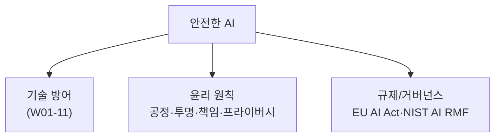

# W12 — AI 윤리와 규제: 기술을 넘어 거버넌스로

> **한 줄 요약** — 안전한 AI는 기술 방어만으로 완성되지 않는다. **편향·투명성·책임·프라이버시** 같은
> 윤리 원칙과, 이를 강제하는 **규제/프레임워크**(EU AI Act·NIST AI RMF·ISO/IEC 42001)가 함께 가야
> 한다. 이번 주는 윤리 원칙을 점검 가능한 형태로 다루고, 규제 요구를 통제로 매핑한다.

---

## 학습 목표

- AI 윤리 핵심 원칙(공정성·투명성·책임·프라이버시·안전)을 안다.
- **편향(bias)**을 데이터/출력에서 점검하는 법을 안다.
- **투명성**(AI 고지·설명 가능성)과 **책임**(감사 추적)의 의미를 안다.
- **프라이버시**(PII 최소화·동의)를 적용한다.
- 주요 규제/프레임워크(EU AI Act·NIST AI RMF)를 통제로 매핑한다.

---

## 0. 용어 해설

| 용어 | 영문 | 쉽게 말하면 |
|------|------|------------|
| **공정성** | Fairness | 집단 간 차별 없는 결과 |
| **편향** | Bias | 한쪽으로 치우친 판단 |
| **투명성** | Transparency | AI임을 알리고 근거를 설명 |
| **설명가능성** | Explainability | 왜 그렇게 판단했나 |
| **책임** | Accountability | 누가 책임지나·추적 가능 |
| **PII** | 개인식별정보 | 이름·이메일·주민번호 등 |
| **EU AI Act** | - | EU의 위험기반 AI 규제 |
| **NIST AI RMF** | - | 미국 AI 위험관리 프레임워크(Govern/Map/Measure/Manage) |

---

## 0.5 신입생을 위한 핵심 개념

### "안전한 AI = 기술 + 윤리 + 거버넌스"

지금까지(W01~W11) **기술 방어**(가드레일·탐지·격리)를 배웠습니다. 그런데 기술만으론 부족합니다 —
모델이 **편향**된 판단을 하거나(공정성), AI임을 숨기거나(투명성), 사고 시 책임 소재가 없으면
(책임), 개인정보를 함부로 쓰면(프라이버시) 안전하지 않습니다. 이것은 **거버넌스**의 영역입니다.

> 📌 **핵심** — 윤리 원칙은 추상적으로 끝나면 안 됩니다. **점검 가능한 통제**로 바꿉니다 — 편향은
> 집단별 결과 측정으로, 투명성은 AI 고지·로그로, 프라이버시는 PII 탐지·최소화로. 규제는 이 통제들을
> 요구하는 **체크리스트**입니다.

---

## 1. 윤리 원칙 → 점검 가능한 통제

| 원칙 | 점검 통제 |
|------|-----------|
| **공정성** | 집단별 결과 차이(disparity) 측정, 편향 데이터 점검 |
| **투명성** | AI 사용 고지, 근거/출처 제시, 결정 로그 |
| **책임** | 감사 추적, 책임자 지정, 이의제기 절차 |
| **프라이버시** | PII 최소 수집·탐지·마스킹, 동의·보존기간 |
| **안전** | 가드레일·평가·모니터링(W01-11) |

## 2. 편향 점검

같은 능력의 입력이 집단(성별·지역 등)에 따라 다른 결과를 받으면 편향입니다. **집단별 결과를 측정**해
차이를 봅니다. 학습 데이터의 대표성·균형도 점검합니다(W07과 연결).

## 3. 프라이버시 — PII 최소화

이름·이메일·주민번호 같은 PII는 **탐지해 마스킹**하고, 꼭 필요한 것만 수집하며(최소화), 보존기간을
둡니다. RAG/로그에 PII가 섞여 모델·출력으로 새지 않게 합니다(W09 멤버십 추론과 연결).

## 4. 규제/프레임워크 매핑

- **EU AI Act:** 위험 등급(금지/고위험/제한적/최소)에 따라 의무 차등. 고위험은 위험관리·데이터
  거버넌스·투명성·인간 감독 필수.
- **NIST AI RMF:** Govern·Map·Measure·Manage 4기능으로 위험을 관리.
- **ISO/IEC 42001:** AI 경영시스템 표준.

> 통제(편향 측정·PII 마스킹·감사 로그·인간 감독)를 프레임워크 항목에 **매핑**하면, "우리가 규제를
> 얼마나 덮는가(커버리지)"를 점검할 수 있습니다.

---

## 실습 안내

이번 주 실습(`lab_week12.yaml`, 8단계)은 el34 GPU Ollama로 합니다. 4개 축:

1. **왜(목적)** — 왜 기술만으론 부족한가(윤리·거버넌스).
2. **무엇을(점검)** — 편향(BIAS_DETECTED)·PII(REDACTED)를 점검 가능한 통제로 본다.
3. **해석(분석)** — 거버넌스 공백을 감사한다.
4. **실전(매핑)** — 통제를 규제 프레임워크에 매핑한다(MAPPED).

> 🧪 편향/PII/매핑=결정적 로직, 시나리오/감사=gemma3:4b. 결정적 마커로 확인합니다.

---

## 흔한 오해

- ❌ **"기술 방어면 안전"** → 편향·투명성·책임·프라이버시는 거버넌스 영역.
- ❌ **"윤리는 추상적이라 점검 불가"** → 측정 가능한 통제로 바꾼다(disparity·PII 탐지 등).
- ❌ **"규제는 법무팀 일"** → 엔지니어가 통제를 구현해야 충족된다.
- ❌ **"PII는 암호화하면 끝"** → 최소 수집·마스킹·보존기간까지.
- ❌ **"고위험/저위험 다 같은 의무"** → 위험기반 차등(EU AI Act).

---

## 예고 — W13

거버넌스를 봤다. W13은 **Red Teaming for AI** — 지금까지 배운 위협을 체계적인 레드팀 절차로 묶어,
모델/시스템의 약점을 능동적으로 찾는 방법론(공격 라이브러리·자동화·보고)을 다룬다.
