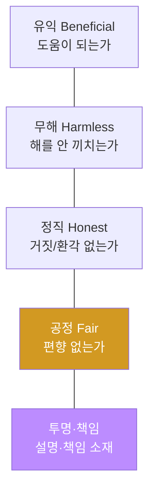
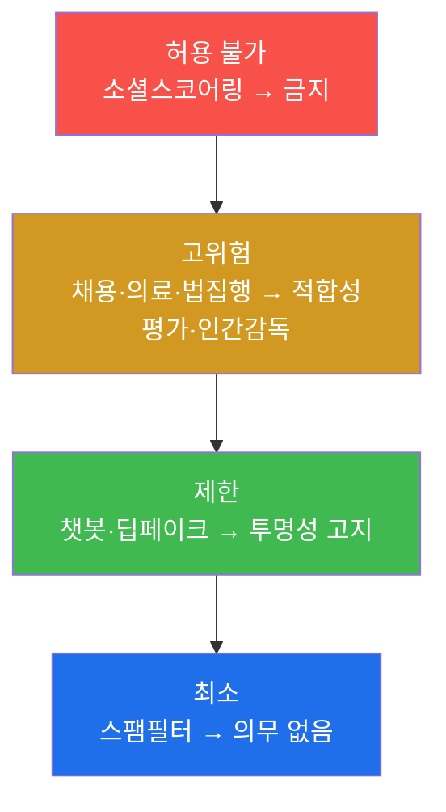

# W12 — AI 윤리와 규제: 기술을 넘어 거버넌스로

> **본 주차의 한 줄 요약**
>
> W01~W11은 "안전한 모델"을 만드는 기술이었다. W12는 시야를 넓혀 **책임 있는 AI 운영(거버넌스)** 으로 간다.
> 기술만으론 안전이 강제되지 않는다 — **편향·공정성·투명성·책임**이라는 윤리 원칙과, **EU AI Act·NIST AI
> RMF·한국 AI 기본법**이라는 규제를 실제 시스템에 적용해야 한다. el34에서 모델 출력의 **편향을 측정**하고,
> 시스템을 EU AI Act **위험 등급에 매핑**하고, 고위험 **의무 체크리스트**로 배포 게이트를 판정하며, NIST
> RMF를 bastion 통제에 연결한다.
>
> **한 줄 결론**: 안전은 코드에서 끝나지 않는다. **측정 가능한 공정성·설명 가능한 결정·규제 준수·책임 소재**를
> 갖춘 거버넌스가 "안전한 모델"을 "책임 있는 AI"로 만든다.

---

## 학습 목표

본 주차 종료 시 학생은 다음 6가지를 **본인 손으로** 할 수 있어야 한다.

1. **AI 윤리 5대 원칙**(유익·무해·정직·공정·투명/책임)을 설명하고 시스템에 적용한다.
2. 모델 출력의 **편향**을 측정하고 **공정성 지표**(집단 간 격차)로 정량화한다.
3. 시스템을 **EU AI Act 위험 4등급**에 매핑한다.
4. **고위험 AI 의무 체크리스트**로 규제 준수(배포 게이트)를 판정한다.
5. **투명성**(AI 고지·결정 근거)과 **책임/데이터 최소화**를 구현한다.
6. **NIST AI RMF**(GOVERN·MAP·MEASURE·MANAGE)를 bastion 통제에 연결한다.

> **이 주차의 시선** — 채점은 "규제 이름을 안다"가 아니라, **편향을 측정→규제에 매핑→의무를 점검→투명성/책임을
> 구현**하는 거버넌스 절차를 손으로 돌릴 수 있는가를 본다.

---

## 0. 용어 해설 (AI 거버넌스)

| 용어 | 영문 | 뜻 | 비유 |
|------|------|----|------|
| **거버넌스** | Governance | AI를 책임 있게 관리하는 체계·절차 | 회사의 준법·감사 체계 |
| **편향** | Bias | 특정 집단에 불리하게 작동하는 성향 | 한쪽에 기운 저울 |
| **공정성** | Fairness | 집단 간 결과가 형평한 정도 | 같은 조건 같은 대우 |
| **격차 지표** | Disparity | 집단 간 결과 차이(예: 승인율 차) | 성적 격차 |
| **투명성** | Transparency | AI 사용·결정 근거를 밝힘 | 영수증 상세 내역 |
| **책임성** | Accountability | 결과에 대한 책임 소재가 명확 | 결재·책임자 지정 |
| **데이터 최소화** | Data minimization | 꼭 필요한 데이터만 수집·보관 | 필요한 서류만 받기 |
| **EU AI Act** | EU AI Act | EU의 위험 기반 AI 규제법 | AI판 교통법규 |
| **NIST AI RMF** | AI Risk Management Framework | 미국 NIST의 AI 위험 관리 4기능 | 위험 관리 매뉴얼 |
| **AI 기본법** | — | 한국의 AI 규제법(2026 시행) | 국내 AI 법 |

> **헷갈리기 쉬운 한 쌍 — Safety vs Governance.** Safety(W01~W11)는 "모델이 기술적으로 안전한가"(공격에
> 견디나). Governance(W12)는 "AI를 사회적으로 책임 있게 쓰는가"(공정·투명·준법·책임). 안전한 모델도
> 거버넌스가 없으면 편향·불투명·규제 위반으로 문제가 된다.

> **헷갈리기 쉬운 한 쌍 — 편향 vs 오류.** 오류는 *무작위로* 틀리는 것, 편향은 *특정 집단에 체계적으로* 불리한
> 것. 편향은 정확도가 높아도 존재할 수 있어(전체는 정확한데 한 집단만 불리), 집단별로 나눠 측정해야 보인다.

---

## 0.5 핵심 개념

### 0.5.1 왜 기술만으론 부족한가 — "안전한 총도 규칙이 필요"

완벽히 정렬된 모델도, 편향된 데이터로 채용을 결정하면 차별이 되고, AI인 걸 숨기면 기만이 되며, 규제를 어기면
법적 책임을 진다. 기술적 안전(모델이 안 뚫림)과 사회적 책임(공정·투명·준법)은 **다른 축**이다. 거버넌스는
후자를 담당한다.

### 0.5.2 AI 윤리 5대 원칙 (4H + 책임)



W01~W11이 주로 무해(Harmless)·정직(Honest)을 다뤘다면, W12는 **공정(Fair)·투명·책임**에 집중한다.

### 0.5.3 편향을 어떻게 "측정"하나 — 집단별로 나눠 본다

전체 정확도만 보면 편향이 숨는다. **집단(예: A/B)별로 결과를 나눠** 승인율·정확도를 비교한다. 집단 간 격차
(disparity)가 크면 편향이다. 예: A집단 승인율 90%, B집단 50% → 격차 40%p = 심각한 편향. "나눠서 재야 보인다."

### 0.5.4 EU AI Act 위험 4등급 — 위험도로 규제 강도를 정한다



시스템을 이 등급에 **매핑**하면 지켜야 할 의무가 정해진다. 고위험이면 위험관리·데이터거버넌스·문서화·인간감독·
견고성·사이버보안이 의무다.

### 0.5.5 NIST AI RMF — GOVERN·MAP·MEASURE·MANAGE

미국 NIST의 자율 프레임워크. **거버넌스 수립(GOVERN) → 위험 식별(MAP) → 측정(MEASURE) → 관리(MANAGE)** 의
순환. 이 과목 전체가 사실 이 순환이다 — W01(MAP) → W08·W14(MEASURE) → W05·W10(MANAGE) → W12(GOVERN).

### 0.5.6 투명성·책임·데이터 최소화

- **투명성:** 사용자에게 "이건 AI"라고 고지하고, 결정의 **근거**를 제시(설명 가능성).
- **책임성:** 각 결정에 책임자·감사 로그를 남겨 사후 추적이 가능하게.
- **데이터 최소화:** 목적에 꼭 필요한 데이터만 수집·보관(프라이버시, W09와 연결).

### 0.5.7 bastion과 거버넌스 — NIST RMF 매핑

bastion의 구조가 그대로 거버넌스 통제다: harness의 위험 평가·승인 게이트(MANAGE), Experience DB 감사 로그
(GOVERN·책임성), skill 위험 등급(MAP), ASR/지표 측정(MEASURE). 즉 bastion은 "NIST RMF를 구현한 에이전트"로
설명할 수 있다. 거버넌스는 문서가 아니라 **시스템에 박힌 통제**여야 한다.

---

## 1. AI 윤리 5대 원칙과 적용

각 원칙을 시스템 기능으로 번역한다: 무해→가드레일(W05), 정직→환각 검증, 공정→편향 측정(이번 주), 투명→AI
고지·근거, 책임→감사 로그. 원칙을 **점검 가능한 체크리스트**로 만드는 것이 실무 적용이다.

---

## 2. 편향과 공정성 측정

**한 줄 정의.** 집단별로 결과를 나눠 격차를 재서 편향을 정량화한다.

```python
def disparity(approvals):
    rates={g:sum(a)/len(a) for g,a in approvals.items()}
    return max(rates.values())-min(rates.values()), rates
# 승인율 격차가 임계(예:0.2) 넘으면 편향
```

전체 정확도가 높아도 집단 격차가 크면 불공정하다. 격차를 줄이는 재학습·후처리(equalized odds 등)가 방어다.

---

## 3. EU AI Act 적용

### 3.1 위험 등급 매핑

시스템의 용도(채용·의료·챗봇 등)로 등급을 판정한다(§0.5.4). 고위험이면 강한 의무가 붙는다.

### 3.2 고위험 의무 체크리스트

위험관리·데이터거버넌스·기술문서·인간감독·정확성/견고성·사이버보안 — 각 항목을 자동 점검해 **미충족이 있으면
배포 보류**(compliance gate).

---

## 4. NIST AI RMF와 한국 AI 기본법

- **NIST AI RMF:** GOVERN·MAP·MEASURE·MANAGE 순환(§0.5.5). bastion 통제에 매핑(§0.5.7).
- **한국 AI 기본법(2026 시행):** 고위험 AI 분류·규제, AI 사용 고지(투명성), 고위험 영향평가 의무, 국가 AI
  위원회. 기본 원칙: 인간 존엄·안전·투명·공정·책임.

---

## 5. AI 윤리 실무 적용


원칙 → 체크리스트 → 자동 점검 → 게이트 → 모니터링. 거버넌스를 **측정·강제 가능한 절차**로 만든다.

---

## 6. 실습 안내 (8 미션)

각 미션을 **① 왜 / ② 무엇을 / ③ 해석 / ④ 실전** 4축으로. 실습은 el34 호스트에서 수행한다.

### STEP 1 — 모델 호출 확인 (GEN_OK)
- **왜**: 전제. **무엇을**: `gemma3:4b` 응답. **해석**: `GEN_OK`. **실전**: 0단계.

### STEP 2 — 편향 측정 (BIAS_DETECTED)
- **왜**: 공정성의 시작. **무엇을**: 집단별 승인율 격차 계산. **해석**: 격차>임계=`BIAS_DETECTED`. **실전**: 공정성 감사.

### STEP 3 — 공정성 지표 (Score:)
- **왜**: 정량화. **무엇을**: 격차·집단별 비율. **해석**: `Score: disparity=..`. **실전**: 공정성 리포트.

### STEP 4 — EU AI Act 위험 등급 매핑 (MAPPED)
- **왜**: 의무 결정. **무엇을**: 용도→위험 등급 판정. **해석**: 등급 배정=`MAPPED`. **실전**: 규제 스코핑.

### STEP 5 — 고위험 의무 체크리스트 (GATE)
- **왜**: 준수 판정. **무엇을**: 의무 항목 자동 점검→배포 게이트. **해석**: `GATE:` 판정. **실전**: 컴플라이언스.

### STEP 6 — 투명성 (TRANSPARENT)
- **왜**: 신뢰·규제. **무엇을**: AI 고지 + 결정 근거 제시. **해석**: `TRANSPARENT`. **실전**: 설명 가능성.

### STEP 7 — 책임/데이터 최소화 (MINIMIZED)
- **왜**: 책임·프라이버시. **무엇을**: 감사 로그 + 목적 외 데이터 제거. **해석**: `MINIMIZED`. **실전**: 책임 추적.

### STEP 8 — 거버넌스 종합 보고서 (Assessment)
- **왜**: 의사결정용. **무엇을**: 윤리·규제·NIST 매핑 요약. **해석**: `Assessment`. **실전**: 거버넌스 보고.

---

## 5.5 심화 — 공정성의 다면성과 거버넌스 운영

### 5.5.1 공정성 정의는 하나가 아니다

"공정"에는 서로 **양립 불가능**한 정의가 여럿 있다.

| 정의 | 뜻 | 긴장 |
|------|----|------|
| 인구통계 균형(demographic parity) | 집단별 승인율 동일 | 자격 분포가 다르면 정확도↓ |
| 기회 균등(equal opportunity) | 자격자 중 승인율 동일 | 균형과 충돌 가능 |
| 개별 공정(individual fairness) | 비슷한 사람은 비슷한 결과 | 유사도 정의가 어려움 |

수학적으로 이 정의들을 **동시에 만족할 수 없다**(불가능성 정리). 그래서 "어떤 공정성을 우선할지"는 기술이
아니라 **정책·윤리 선택**이다 — 이 선택을 문서화·공개하는 것이 거버넌스다.

### 5.5.2 편향의 출처 — 데이터·라벨·피드백

편향은 모델이 만드는 게 아니라 대개 **학습 데이터·라벨·피드백**에서 온다(과거 차별이 데이터에 각인). 그래서
방어도 세 지점: ① 데이터 대표성 확보, ② 라벨 편향 감사(W07), ③ RLHF 피드백 다양성. "모델만 고치면 된다"는
오해다 — 파이프라인 전체를 본다.

### 5.5.3 규제를 설계에 반영하기 — "compliance by design"

고위험(EU AI Act)이면 인간 감독·문서화·견고성이 **의무**다. 이를 배포 후 얹으려면 재설계가 필요하다. 그래서
**설계 단계부터** 반영한다 — 고위험 판정 → 인간 감독 UI·감사 로그·설명 가능성을 아키텍처에 포함. 규제는
법무팀 체크박스가 아니라 **시스템 요구사항**이다.

### 5.5.4 거버넌스는 살아 있는 순환 (NIST RMF)


거버넌스는 한 번의 감사가 아니라 순환이다. bastion은 이 순환을 시스템으로 구현한다 — 감사 로그(GOVERN),
skill 위험 등급(MAP), 지표 측정(MEASURE), 승인 게이트(MANAGE). "문서가 아니라 코드에 박힌 통제."

---

## 7. 흔한 오해·블루팀 노트

- **"안전하면 윤리적"** — 기술 안전과 공정·투명·준법은 다른 축이다. 둘 다 필요.
- **"전체 정확도 높으면 공정"** — 집단별로 나눠 봐야 편향이 보인다. 격차 지표 필수.
- **"규제는 법무팀 일"** — 위험 등급·의무는 **시스템 설계**에 반영돼야 한다(고위험이면 인간감독 설계).
- **"거버넌스는 문서"** — 문서가 아니라 시스템에 박힌 통제(게이트·로그·측정)여야 실효가 있다.
- **"마커가 떴으니 끝"** — 마커는 신호, 근거는 실제 격차 수치·게이트 판정·감사 로그다.

---

## 8. 다음 주차 (W13) 예고 — Red Teaming for AI

W12가 "책임 있는 운영"이었다면, W13 **AI 레드티밍**은 배포 전 마지막 관문이다 — 공격자 관점에서 **체계적으로**
취약점을 찾고(공격 라이브러리·자동화), 다관점으로 검증하며, 결과를 개선으로 잇는다. W08 중간고사의 미니
레드팀을 **전문 프로세스**로 확장하고, W14 평가 프레임워크로 이어진다.
