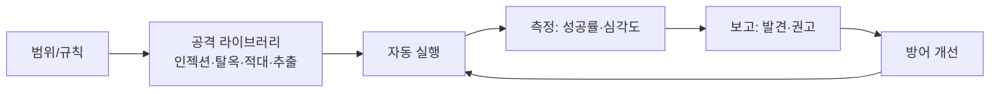

# W13 — Red Teaming for AI: 능동적으로 약점을 찾는 방법론

> **한 줄 요약** — 레드팀은 공격자처럼 생각해 **모델/시스템의 약점을 능동적으로 찾는** 체계적 활동이다.
> 지금까지 배운 위협(인젝션·탈옥·적대입력·데이터오염·추출)을 **공격 라이브러리**로 묶고, 자동화로
> 반복 실행하며, 결과를 보고로 정리한다. "방어는 공격해 봐야 검증된다."

---

## 학습 목표

- AI 레드팀의 목적과 절차(범위→공격→측정→보고)를 안다.
- 위협을 **공격 라이브러리**로 체계화한다.
- 자동 레드팀으로 다수 공격을 반복 실행·점수화한다.
- 방어 적용 후 재실행으로 효과를 검증한다.
- 레드팀 보고서(발견·심각도·재현·권고)를 작성한다.

---

## 0. 용어 해설

| 용어 | 영문 | 쉽게 말하면 |
|------|------|------------|
| **레드팀** | Red Team | 공격자 관점으로 약점 발굴 |
| **블루팀** | Blue Team | 방어·탐지 |
| **퍼플팀** | Purple Team | 레드+블루 협업 |
| **공격 라이브러리** | Attack library | 재사용 가능한 공격 모음 |
| **자동 레드팀** | Automated red-team | 공격을 자동 반복 |
| **재현성** | Reproducibility | 같은 결과를 재현 |
| **커버리지** | Coverage | 위협 대비 테스트 비율 |

---

## 0.5 신입생을 위한 핵심 개념

### "방어가 진짜 막는지는, 공격해 봐야 안다"

지금까지 위협(W01-11)과 방어(가드레일·탐지)를 배웠습니다. 레드팀은 그 방어를 **실제로 공격해
검증**합니다. 체계적으로: ① 범위/규칙 정하고, ② 공격 라이브러리로 다수 공격을 던지고, ③ 성공/실패를
측정하고, ④ 보고합니다.

> 📌 **핵심** — 레드팀은 **반복 가능·측정 가능**해야 합니다. 공격을 라이브러리로 만들어 자동 실행하면,
> 방어를 바꿀 때마다 "좋아졌나"를 숫자로 확인할 수 있습니다(W14 평가 프레임워크로 이어짐). ⚠️ 인가된
> 격리장(el34)에서만, 교전 규칙을 지켜 수행합니다.

---

## 1. 레드팀 절차

1. **범위·규칙(RoE):** 무엇을·어디까지·어떻게. 인가 확인.
2. **공격 라이브러리:** 위협별 공격(인젝션·탈옥·적대입력·추출 등)을 재사용 가능하게.
3. **실행:** 자동으로 다수 공격을 모델에 던짐.
4. **측정:** 성공률·심각도·커버리지.
5. **보고:** 발견·증거·재현 단계·권고.
6. **재검증:** 방어 적용 후 재실행.

## 2. 공격 라이브러리

W01-11의 공격을 모듈로 정리합니다 — `harmful_request`, `direct_injection`, `jailbreak_dan`,
`adversarial_leet`, `indirect_injection`, `extraction_probe`. 각 모듈은 입력·기대 결과·판정 로직을
가집니다. 새 기법이 나오면 라이브러리에 추가합니다.

## 3. 자동 레드팀과 측정

라이브러리를 모델에 자동 실행해 **성공률**을 냅니다(예: 6개 공격 중 5개 성공 = 83% 취약). 방어를
적용하고 재실행해 성공률이 떨어지는지(방어 효과) 확인합니다. 이것이 **퍼플팀**(레드로 찾고 블루로
막고 다시 레드로 검증)의 순환입니다.

## 4. 보고

발견별로 **위협·심각도·재현 단계·증거·권고**를 기록합니다. 경영진/개발팀이 우선순위를 정할 수 있게.

---

## 실습 안내

이번 주 실습(`lab_week13.yaml`, 8단계)은 el34 GPU Ollama로 합니다. 4개 축:

1. **왜(목적)** — 왜 능동적 레드팀인가(방어 검증).
2. **무엇을(실행)** — 공격 라이브러리를 취약 모델에 자동 실행해 취약점을 찾는다(VULNERABLE).
3. **해석(분석)** — 성공률로 점수화하고 레드팀 절차를 감사한다.
4. **실전(검증)** — 방어 적용 후 재실행으로 성공률 감소(BLOCKED)를 확인하고 보고한다.

> 🧪 공격=ccc-unsafe:2b, 방어/감사=결정적+gemma3:4b. ⚠️ 인가 격리장 한정. 결정적 마커로 확인합니다.

---

## 흔한 오해

- ❌ **"방어 설계했으면 안전"** → 공격해 검증해야 안다.
- ❌ **"레드팀은 일회성"** → 반복·자동화로 변경마다 재검증.
- ❌ **"성공률만 보면 됨"** → 심각도·커버리지도 본다.
- ❌ **"레드팀은 어디서나 가능"** → 인가·격리·규칙 필수.
- ❌ **"레드팀과 블루팀은 별개"** → 퍼플팀으로 협업해야 효과.

---

## 예고 — W14

레드팀으로 약점을 찾았다. W14는 **AI Safety 평가 프레임워크** — 레드팀 결과를 표준 지표·벤치마크로
체계화해, 모델 안전을 객관적으로 측정·비교·추적하는 프레임워크를 다룬다.
