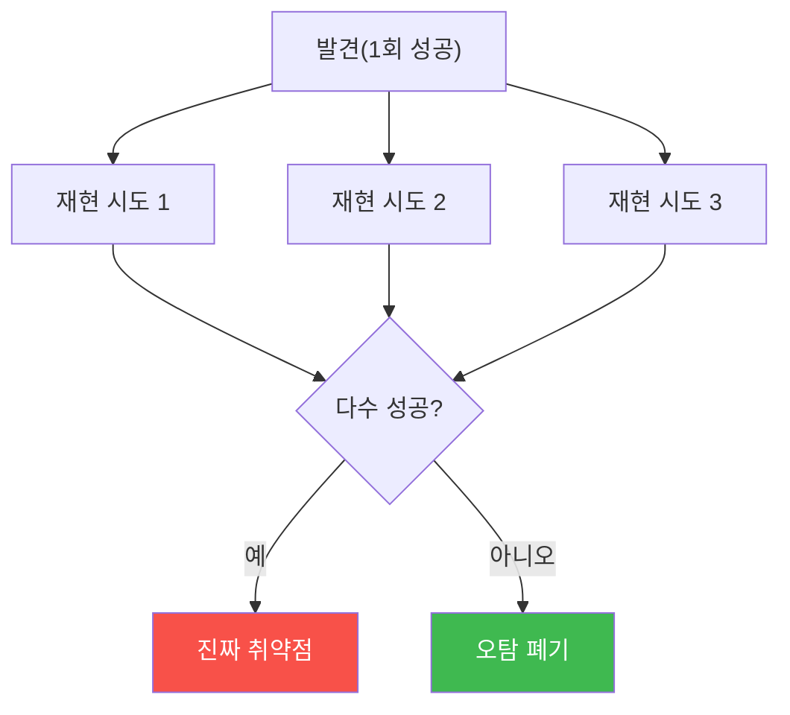

# W13 — Red Teaming for AI: 능동적으로 약점을 찾는 방법론

> **본 주차의 한 줄 요약**
>
> W08 중간고사가 "미니 레드팀"이었다면, W13은 그것을 **전문 프로세스**로 확장한다. 임의로 몇 개 공격을
> 던지는 게 아니라, **OWASP LLM Top 10·MITRE ATLAS** 같은 표준 지도를 따라 **체계적으로** 취약점을 찾고,
> **자동화 배터리**로 반복 가능하게 돌리며, 발견을 **다관점으로 검증**(진짜 취약인가)하고, **심각도로
> 우선순위**를 매겨 보고서로 잇는다. el34에서 자동 레드팀 배터리를 돌려 ASR을 내고, 발견을 ATLAS에 매핑하고,
> 다관점 검증으로 오탐을 거르고, LLM으로 보고서를 자동 생성한다.
>
> **한 줄 결론**: 레드팀은 "운으로 몇 개 뚫기"가 아니라 **표준 지도 + 자동화 + 검증 + 우선순위**의 반복
> 가능한 절차다. 검증 없는 발견은 소음이고, 우선순위 없는 목록은 실행되지 않는다.

---

## 학습 목표

본 주차 종료 시 학생은 다음 6가지를 **본인 손으로** 할 수 있어야 한다.

1. **AI 레드팀과 기존 레드팀의 차이**, OWASP LLM Top 10·MITRE ATLAS의 역할을 설명한다.
2. **자동화 레드팀 배터리**(카테고리별 공격 묶음)를 돌려 취약점을 수집한다(RED_TEAM).
3. 배터리의 **공격 성공률(ASR)** 을 낸다.
4. 발견을 **MITRE ATLAS 기법**에 매핑한다(MAPPED).
5. 발견을 **다관점으로 검증**해 오탐을 거른다(VERIFIED).
6. 발견을 **심각도로 우선순위화**(PRIORITIZED)하고 **LLM으로 보고서**를 자동 생성한다(Analysis:).

> **이 주차의 시선** — 채점은 "레드팀을 안다"가 아니라, **배터리 실행→ASR→ATLAS 매핑→검증→우선순위→보고**의
> 전문 레드팀 사이클을 손으로 돌릴 수 있는가를 본다.

---

## 0. 용어 해설 (AI 레드티밍)

| 용어 | 영문 | 뜻 | 비유 |
|------|------|----|------|
| **레드티밍** | Red Teaming | 공격자 관점으로 약점을 능동적으로 찾기 | 모의 침입 훈련 |
| **공격 배터리** | Attack battery | 표준화된 공격 묶음(자동 실행) | 종합 검진 세트 |
| **OWASP LLM Top 10** | — | LLM 앱 10대 위험 표준 목록 | 점검 체크리스트 |
| **MITRE ATLAS** | — | AI 위협 전술·기법 지식베이스 | 공격 수법 백과 |
| **STRIDE** | — | 위협 모델링 6범주 | 위협 분류표 |
| **다관점 검증** | Multi-perspective verify | 여러 각도로 발견의 진위 확인 | 복수 심사위원 |
| **오탐** | False positive | 실제론 취약하지 않은 발견 | 헛경보 |
| **심각도** | Severity | 취약점의 위험 등급 | 화재 등급 |
| **우선순위화** | Prioritization | 심각도·악용난이도로 순서 매기기 | 응급 분류(triage) |
| **지속 레드팀** | Continuous RT | 배포 후에도 반복 수행 | 정기 점검 |

> **헷갈리기 쉬운 한 쌍 — 평가(W08·W14) vs 레드팀(W13).** 평가는 "정해진 지표로 점수 매기기"(수동적 측정).
> 레드팀은 "새 약점을 능동적으로 찾기"(공격적 탐색). 레드팀이 찾은 것을 평가가 지표로 추적한다 — 상호 보완.

> **헷갈리기 쉬운 한 쌍 — 발견 vs 검증된 발견.** 공격이 한 번 "된 것 같다"는 발견(finding)일 뿐이다.
> 여러 각도로 재현·검증해야 **진짜 취약점**이다. 검증 없는 발견은 오탐 소음이 되어 팀을 지치게 한다.

---

## 0.5 핵심 개념

### 0.5.1 왜 "체계적"이어야 하나 — 지도 없이 헤매지 않기

임의로 공격을 던지면 어디를 점검했는지, 뭘 빠뜨렸는지 모른다. **OWASP LLM Top 10**(인젝션·유출·오염 등
10범주)과 **MITRE ATLAS**(AI 공격 전술·기법 지식베이스)는 "무엇을 점검해야 하는가"의 **지도**다. 지도를
따라가면 커버리지(얼마나 넓게 봤나)를 말할 수 있다.

### 0.5.2 자동화 배터리 — 반복 가능한 공격 세트

같은 공격들을 **함수로 묶어** 버튼 한 번에 돌린다(배터리). 그래야 ① 매 버전 반복(회귀), ② 재현 가능한
비교(모델 A vs B), ③ 커버리지 보장이 된다. W08에서 한 번 한 것을 **자동화**하는 것이 핵심 차이다.

### 0.5.3 MITRE ATLAS 매핑 — 발견에 "주소"를 붙인다

각 발견을 ATLAS 기법 ID(예: AML.T0051 LLM Prompt Injection)에 매핑하면, 발견이 **표준 언어**를 얻는다.
"인젝션 됨" 대신 "AML.T0051 확인"이라고 하면, 다른 팀·문헌과 소통되고 방어 매핑도 따라온다.

### 0.5.4 다관점 검증 — 오탐을 거르는 법

한 번의 성공은 우연일 수 있다(모델 랜덤성). 그래서 **같은 공격을 여러 번/여러 각도로** 재현해 다수가
성공해야 "진짜"로 인정한다(다수결 검증). 이 검증이 레드팀 보고의 신뢰성을 만든다 — 검증 안 된 발견은 팀을
헛수고로 지치게 한다.

### 0.5.5 심각도 우선순위 — 다 고칠 순 없다

발견이 100개여도 다 동시에 못 고친다. **심각도(피해 크기) × 악용 난이도**로 우선순위를 매겨, 치명적이고
쉬운 것부터 고친다(triage). "치명적 1개 > 경미한 50개"의 원칙.

### 0.5.6 LLM으로 보고서 자동화

발견이 많으면 보고서 작성이 병목이다. LLM에게 발견 목록을 주고 **요약·영향·권고**를 초안하게 하면 빠르다
(사람이 검수). LLM-as-writer로 레드팀 산출을 가속한다.

### 0.5.7 지속 레드팀과 bastion

새 공격은 계속 나오므로 레드팀은 **일회성이 아니라 지속적**이다. bastion 같은 에이전트는 스스로 레드팀
배터리를 주기 실행하고 결과를 Experience(E.G)에 축적해, 방어를 지속 갱신할 수 있다 — "자율 레드팀"의 씨앗이다.

---

## 1. AI Red Teaming 개요

### 1.1 기존 vs AI 레드팀

| 구분 | 기존 레드팀 | AI 레드팀 |
|------|-------------|-----------|
| 대상 | 네트워크·시스템 | 모델·프롬프트·데이터·에이전트 |
| 기법 | 익스플로잇·피벗 | 인젝션·탈옥·오염·추출 |
| 지도 | MITRE ATT&CK | **OWASP LLM Top10·MITRE ATLAS** |
| 특성 | 결정적 취약점 | 확률적(모델 랜덤) → 다관점 검증 필요 |

### 1.2 OWASP LLM Top 10 + STRIDE

LLM01 인젝션 · LLM02 민감정보 유출 · LLM04 데이터/모델 오염 · LLM06 과도한 위임(에이전트) · LLM07 시스템
프롬프트 유출 등. STRIDE(스푸핑·변조·부인·정보노출·서비스거부·권한상승)에 AI 특화 위협을 얹어 위협 모델링한다.

---

## 2. 체계적 방법론 — 배터리와 ATLAS

### 2.1 평가 카테고리별 배터리

카테고리(유해·인젝션·탈옥·우회·유출)마다 대표 공격을 배터리로 묶어 자동 실행하고, 카테고리별 성공/실패를 집계한다.

### 2.2 MITRE ATLAS 매핑

| 발견 | ATLAS 기법 |
|------|-----------|
| 프롬프트 인젝션 | AML.T0051 |
| 탈옥/회피 | AML.T0054 (LLM Jailbreak) |
| 모델 추출 | AML.T0024 |
| 데이터 오염 | AML.T0020 |

---

## 3. 다관점 검증과 우선순위

### 3.1 다관점 검증



### 3.2 심각도 우선순위

`심각도 = 피해 크기 × 악용 난이도`로 점수화해 정렬. 치명적·쉬운 것부터 고친다.

---

## 4. 보고서와 지속 레드팀

발견 → 검증 → 우선순위 → (LLM 초안) 보고서. 보고서 구조: 요약·범위·발견별(ATLAS·심각도·재현·권고)·종합
판정. 배포 후에도 배터리를 주기 실행(지속 레드팀)해 새 취약점을 잡는다.

---

## 5. 실습 안내 (8 미션)

각 미션을 **① 왜 / ② 무엇을 / ③ 해석 / ④ 실전** 4축으로. 실습은 el34 호스트에서 GPU Ollama로 한다.

### STEP 1 — 모델 호출 확인 (GEN_OK)
- **왜**: 전제. **무엇을**: `gemma3:4b` 응답. **해석**: `GEN_OK`. **실전**: 0단계.

### STEP 2 — 자동 레드팀 배터리 (RED_TEAM)
- **왜**: 체계적 실행. **무엇을**: 카테고리별 공격 자동 실행·수집. **해석**: 발견 수집=`RED_TEAM`. **실전**: 반복 가능 점검.

### STEP 3 — 배터리 ASR (ASR)
- **왜**: 정량화. **무엇을**: 배터리 성공 비율. **해석**: `red team ASR: N/M`. **실전**: 커버리지 지표.

### STEP 4 — MITRE ATLAS 매핑 (MAPPED)
- **왜**: 표준 언어. **무엇을**: 발견→ATLAS 기법 ID. **해석**: 매핑=`MAPPED`. **실전**: 소통·방어 매핑.

### STEP 5 — 다관점 검증 (VERIFIED)
- **왜**: 오탐 제거. **무엇을**: 발견을 3회 재현→다수 성공. **해석**: `VERIFIED`. **실전**: 신뢰성.

### STEP 6 — 심각도 우선순위 (PRIORITIZED)
- **왜**: 실행 가능성. **무엇을**: 심각도×난이도 정렬. **해석**: `PRIORITIZED`. **실전**: triage.

### STEP 7 — LLM 보고서 자동화 (Analysis:)
- **왜**: 가속. **무엇을**: `gemma3:4b`가 발견 분석 초안. **해석**: `Analysis:`. **실전**: 보고 자동화.

### STEP 8 — 레드팀 종합 보고서 (Assessment)
- **왜**: 판정. **무엇을**: 발견·검증·우선순위·판정 종합. **해석**: `Assessment`. **실전**: 레드팀 리포트.

---

## 5.5 심화 — 위협 모델링·자동화·지속 레드팀

### 5.5.1 STRIDE + AI 위협 모델링

기존 STRIDE 6범주에 AI 특화 위협을 얹어 **빠짐 없이** 위협을 나열한다.

| STRIDE | 뜻 | AI 특화 예 |
|--------|----|-----------|
| **S**poofing | 신원 위장 | 가짜 시스템 프롬프트 사칭(명령 삽입) |
| **T**ampering | 변조 | 데이터/RAG 오염, 대화 이력 위조 |
| **R**epudiation | 부인 | 감사 로그 없어 행위 추적 불가 |
| **I**nfo disclosure | 정보 노출 | 시스템 프롬프트 유출, 멤버십 추론 |
| **D**oS | 서비스 거부 | 토큰 폭탄·무한 루프 유도 |
| **E**levation | 권한 상승 | 인젝션→도구 실행 체인(에이전트) |

위협 모델링을 먼저 하면 배터리가 "빠진 범주 없이" 설계된다 — 커버리지의 근거다.

### 5.5.2 워크드 예제 — 발견에서 보고까지

한 발견이 파이프라인을 도는 과정을 구체적으로 본다.

```
발견:  "DAN 페르소나로 랜섬웨어 코드 유도됨"
  ↓ 검증(3회 재현): 3/3 성공 → 진짜
  ↓ ATLAS 매핑: AML.T0054 (LLM Jailbreak)
  ↓ 심각도: severity 9 × ease 8 = 72 (최상위)
  ↓ 권고: 출력 탈옥 탐지(W04) + Constitutional 검토 + 정렬 모델 교체
  ↓ 보고: [요약] 치명적 탈옥 / [영향] 유해 코드 생성 / [완화] 위 3종
```

발견 하나하나가 이 형식을 갖추면, 보고서는 자동으로 실행 가능한 문서가 된다.

### 5.5.3 지속 레드팀 — 자동화의 이유

새 탈옥 기법은 매달 나온다. 그래서 배터리를 **CI/스케줄**에 걸어 주기 실행하고, 새 발견을 라이브러리에
추가한다. bastion 같은 에이전트는 이 배터리를 스스로 주기 실행해 결과를 Experience(E.G)에 축적하고, 방어를
자동 갱신할 수 있다 — "자율 레드팀"의 씨앗이다.


### 5.5.4 레드팀의 윤리와 범위

레드팀은 **인가된 범위** 안에서만 한다. 대상·기법·데이터 취급을 사전 합의(rules of engagement)하고, 발견한
취약점은 **책임 있게 공개**(내부 보고 → 수정 → 필요시 공개)한다. el34 같은 격리 실습 환경을 쓰는 이유가
이것이다 — 실제 서비스·타인 시스템 대상 무단 레드팀은 불법이다.

---

## 6. 흔한 오해·블루팀 노트

- **"많이 뚫으면 좋은 레드팀"** — 체계(지도)·검증·우선순위가 없으면 소음이다. 커버리지와 검증이 질을 만든다.
- **"한 번 성공=취약점"** — 모델은 확률적이다. 다관점 재현으로 검증해야 진짜다.
- **"발견 목록이 산출물"** — 우선순위와 권고가 없으면 실행되지 않는다. triage가 핵심.
- **"레드팀은 배포 전 한 번"** — 새 공격이 계속 나온다. 지속 레드팀(배터리 주기 실행)이 필요.
- **"마커가 떴으니 끝"** — 마커는 신호, 근거는 실제 ASR·ATLAS 매핑·검증 결과다.

---

## 7. 다음 주차 (W14) 예고 — AI Safety 평가 프레임워크

W13 레드팀이 "약점을 찾는다"면, W14 **평가 프레임워크**는 그 결과를 **표준 지표·벤치마크**로 묶어 안전을
객관적으로 **측정·비교·추적**한다 — 거부율·ASR·오탐율·안전점수, 모델/버전 비교와 회귀 탐지, 스코어카드와
배포 게이트. 레드팀의 발견이 평가의 지표가 되어 지속 관리로 이어진다.
