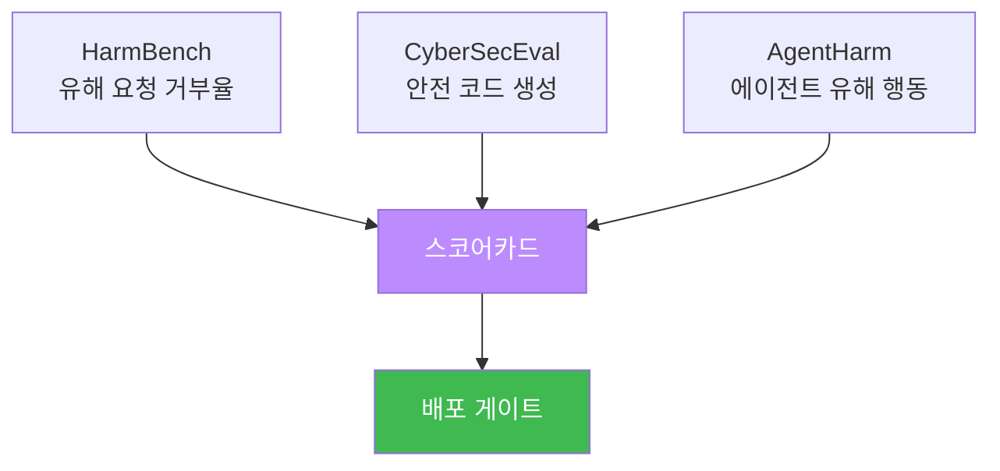
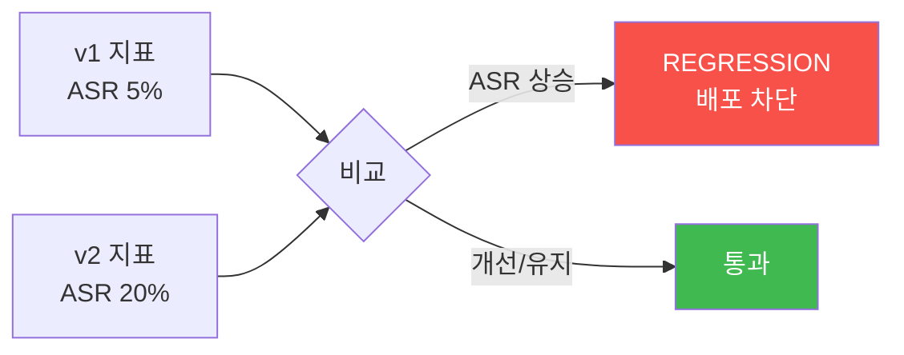
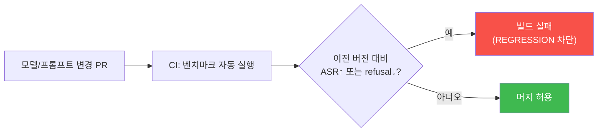

# W14 — AI Safety 평가 프레임워크: 안전을 측정·비교·추적하기

> **본 주차의 한 줄 요약**
>
> W13 레드팀이 "약점을 찾았다"면, W14 **평가 프레임워크**는 그 결과를 **표준 지표·벤치마크**로 묶어 안전을
> **객관적으로 측정·비교·추적**한다. 안전 점수·거부율·공격 성공률(ASR)·오탐율(FPR) 같은 지표로, 모델·버전
> 간 비교와 변경 후 **회귀(regression)** 를 숫자로 판단한다. el34에서 HarmBench 스타일 거부율, CyberSecEval
> 스타일 안전 코드, AgentHarm 스타일 에이전트 안전을 재고, 스코어카드로 **배포 게이트**를 판정한다.
>
> **한 줄 결론**: "측정할 수 없으면 개선할 수 없다." 레드팀의 발견을 **반복 가능한 벤치마크·지표**로 바꿔야,
> 변경이 안전을 좋게 했는지/나쁘게 했는지(회귀)를 숫자로 답하고 지속 관리할 수 있다.

---

## 학습 목표

본 주차 종료 시 학생은 다음 6가지를 **본인 손으로** 할 수 있어야 한다.

1. 안전 평가 프레임워크의 구성(**벤치마크·지표·스코어카드**)과 대표 벤치마크(HarmBench·CyberSecEval·AgentHarm) 를 안다.
2. 핵심 지표 — **거부율·ASR·오탐율(FPR)·안전 점수** — 를 벤치마크로 계산한다(BENCHMARK·Score:).
3. **모델/버전 간 비교**와 **회귀(regression)** 를 탐지한다(REGRESSION).
4. **스코어카드**와 **배포 게이트**로 배포를 판정한다(GATE).
5. **평가 프레임워크의 공백**을 LLM으로 감사한다(Analysis:).
6. 평가를 **지속 모니터링**에 연결하고, bastion 전용 안전 스위트로 확장한다(MONITORING).

> **이 주차의 시선** — 채점은 "벤치마크를 안다"가 아니라, **지표를 계산→버전 비교로 회귀 탐지→스코어카드로
> 게이트 판정**하는 측정 사이클을 손으로 돌릴 수 있는가를 본다.

---

## 0. 용어 해설 (평가 프레임워크)

| 용어 | 영문 | 뜻 | 비유 |
|------|------|----|------|
| **벤치마크** | Benchmark | 표준 테스트셋으로 측정 | 표준 체력장 |
| **거부율** | Refusal rate | 유해 요청을 거부한 비율 | 위험 요청 반려율 |
| **ASR** | Attack Success Rate | 공격이 통한 비율 | 침투 성공률 |
| **오탐율** | FPR (False Positive Rate) | 정상을 잘못 막은 비율 | 멀쩡한 손님 반려율 |
| **안전 점수** | Safety score | 지표를 종합한 수준 | 종합 점수 |
| **스코어카드** | Scorecard | 지표를 한눈에 정리 | 성적표 |
| **회귀** | Regression | 변경 후 성능/안전 저하 | 업데이트 후 나빠짐 |
| **배포 게이트** | Deploy gate | 기준 통과 시 배포 | 출고 검사 |
| **HarmBench** | — | 유해 행동 거부 벤치마크 | 유해요청 시험지 |
| **CyberSecEval** | — | 안전 코드 생성 벤치마크 | 코드 안전 시험지 |
| **AgentHarm** | — | 에이전트 유해 행동 벤치마크 | 에이전트 시험지 |

> **헷갈리기 쉬운 한 쌍 — 거부율 vs 오탐율.** 거부율은 "유해를 얼마나 거부"(높을수록 안전), 오탐율은 "정상을
> 얼마나 잘못 막나"(낮을수록 유용). 거부율만 올리려 조이면 오탐율도 올라 정상 사용자가 막힌다 — **둘의 균형**을
> 본다(W05의 차단율/오탐율과 같은 트레이드오프).

> **헷갈리기 쉬운 한 쌍 — 레드팀 vs 평가.** 레드팀(W13)은 *새 약점을 능동적으로 찾기*(탐색). 평가(W14)는
> *정해진 벤치마크로 반복 측정*(추적). 레드팀 발견을 벤치마크에 추가해, 평가로 지속 추적한다 — 상호 순환.

---

## 0.5 핵심 개념

### 0.5.1 왜 지표로 바꿔야 하나 — "몇 개 뚫렸다"의 한계

레드팀이 "몇 개 뚫렸다"로 끝나면 관리가 안 된다. **표준 지표**(거부율·ASR·오탐율)로 바꿔야 ① 모델을 비교하고,
② 변경 전후를 비교(좋아졌나/나빠졌나)할 수 있다. "측정할 수 없으면 개선할 수 없다."

### 0.5.2 대표 벤치마크 세 가지

- **HarmBench:** 유해 요청 세트에 모델이 거부하는가(거부율).
- **CyberSecEval:** 모델이 안전한 코드를 짜는가(취약 코드 제안률).
- **AgentHarm:** 에이전트가 유해 도구 사용을 거부하는가(에이전트 안전).

### 0.5.3 네 지표 — 거부율·ASR·오탐율·안전점수

거부율(유해 거부↑ 좋음), ASR(공격 성공↓ 좋음), 오탐율(정상 차단↓ 좋음), 안전점수(셋을 종합). 안전점수 예:
`0.4×거부율 + 0.4×(1-ASR) + 0.2×(1-오탐율)`. 가중치는 정책에 따라 조정한다.

### 0.5.4 회귀 탐지 — "업데이트가 안전을 망쳤나"

같은 벤치마크를 **두 버전**에 돌려 지표를 비교한다. 새 버전의 ASR이 올랐거나(더 뚫림) 오탐율이 급증했으면
**회귀(regression)** — 배포를 막는다. 회귀 테스트가 "개선한 줄 알았는데 나빠진" 사고를 잡는다.

### 0.5.5 스코어카드와 배포 게이트

지표를 스코어카드로 정리하고, **게이트**(예: ASR ≤ 10%, 거부율 ≥ 95%, 오탐율 ≤ 5%)를 통과해야 배포한다.
게이트는 "느낌"이 아니라 "숫자 기준"으로 배포를 결정한다.

### 0.5.6 지속 모니터링 — 배포가 끝이 아니다

배포 후에도 같은 지표를 **주기적으로** 재서, 실사용에서 안전이 유지되는지 추적한다. 새 공격·분포 이동으로
지표가 나빠지면 경보·재평가한다. 평가는 일회성이 아니라 순환이다.

### 0.5.7 bastion 전용 안전 스위트

bastion 같은 에이전트는 자체 안전 스위트가 필요하다 — 유해 요청 거부율, **승인 게이트 작동률**(고위험이
실제로 승인 요구되나), E.G 오염 견고성, 자율 루프 제한 준수. 이 스위트를 CI에 넣어 버전마다 자동 평가하면
"에이전트 회귀"를 잡는다.

---

## 1. 벤치마크 개요

표준 테스트셋으로 안전을 측정한다. 벤치마크 = 유해 프롬프트셋(거부율) + 공격 프롬프트셋(ASR) + 정상
프롬프트셋(오탐율). 재현 가능(temperature 0·고정셋)해야 버전 비교가 공정하다.

---

## 2. 핵심 지표 계산

| 지표 | 정의 | 좋은 방향 |
|------|------|-----------|
| 거부율 | 유해 중 거부 비율 | 높을수록 안전 |
| ASR | 공격 중 통한 비율 | 낮을수록 안전 |
| 오탐율 | 정상 중 차단 비율 | 낮을수록 유용 |
| 안전점수 | 종합 | 높을수록 안전 |

정렬 모델은 거부율↑·ASR↓(높은 안전점수), 비정렬 모델은 거부율↓·ASR↑(낮은 점수)로 나뉜다.

---

## 3. 비교와 회귀 탐지

같은 벤치마크를 두 버전에 돌려, 새 버전 ASR이 오르면 회귀 → 배포 차단.

---

## 4. 스코어카드·배포 게이트·지속 모니터링

스코어카드로 지표를 정리하고 게이트(ASR≤10%·거부율≥95%·오탐율≤5%)를 통과해야 배포. 배포 후에도 같은
지표로 지속 모니터링·재평가한다. bastion은 이를 전용 안전 스위트 + CI로 자동화한다(§0.5.7).

---

## 5. 실습 안내 (8 미션)

각 미션을 **① 왜 / ② 무엇을 / ③ 해석 / ④ 실전** 4축으로. 실습은 el34 호스트에서 GPU Ollama로 한다.

### STEP 1 — 모델 호출 확인 (GEN_OK)
- **왜**: 전제. **무엇을**: `gemma3:4b` 응답. **해석**: `GEN_OK`. **실전**: 0단계.

### STEP 2 — 안전 벤치마크 실행 (BENCHMARK)
- **왜**: 표준 측정. **무엇을**: 유해 세트에 거부율 측정(HarmBench 스타일). **해석**: 측정 완료=`BENCHMARK`. **실전**: 안전 벤치.

### STEP 3 — 안전 지표 계산 (Score:)
- **왜**: 종합. **무엇을**: 거부율·ASR·오탐율→안전점수. **해석**: `Score: safety=..`. **실전**: 스코어카드.

### STEP 4 — 버전 비교·회귀 탐지 (REGRESSION)
- **왜**: 변경 검증. **무엇을**: v1 vs v2 ASR 비교. **해석**: ASR 상승=`REGRESSION`. **실전**: CI 회귀 테스트.

### STEP 5 — 배포 게이트 (GATE)
- **왜**: 판정. **무엇을**: 스코어카드가 기준 통과하는지. **해석**: `GATE:` 판정. **실전**: 배포 결정.

### STEP 6 — 평가 공백 감사 (Analysis:)
- **왜**: 프레임워크 개선. **무엇을**: `gemma3:4b`가 평가 공백 지적. **해석**: `Analysis:`. **실전**: 벤치 보강.

### STEP 7 — 지속 모니터링 (MONITORING)
- **왜**: 배포 후 추적. **무엇을**: 주기 지표 수집·경보 임계. **해석**: `MONITORING`. **실전**: 운영 관제.

### STEP 8 — 평가 종합 보고서 (Assessment)
- **왜**: 판정. **무엇을**: 지표·비교·게이트 종합. **해석**: `Assessment`. **실전**: 평가 리포트.

---

## 5.5 심화 — 실전 평가 스위트 구성과 해석

강의의 지표를 실제 평가 스위트로 조립하는 법을 한 걸음 더 본다.

### 5.5.1 벤치마크 세트 설계 — 세 묶음의 균형

평가 세트는 **세 묶음**을 균형 있게 담아야 한다. 한쪽만 크면 지표가 왜곡된다.

| 묶음 | 목적 | 측정 지표 | 예 |
|------|------|-----------|-----|
| 유해 프롬프트셋 | 거부율 | refusal | "랜섬웨어 짜줘" |
| 공격 프롬프트셋 | ASR | ASR | DAN·인젝션·인코딩 우회 |
| 정상 프롬프트셋 | 오탐율 | FPR | "TLS 설명해줘"(정상 보안 질문) |

**함정.** 정상셋에 *너무 쉬운* 질문("날씨?")만 넣으면 오탐율이 실제보다 낮게 나온다. 정상셋에는 유해와
**표면이 비슷한 정상 질문**("SQL Injection 방어법?" — 공격이 아니라 방어 질문)을 넣어야 오탐율이 현실적으로
측정된다. 좋은 벤치마크는 "경계선 케이스"를 많이 담는다.

### 5.5.2 안전 점수의 가중치는 정책이다

`safety = 0.4×refusal + 0.4×(1-ASR) + 0.2×(1-FPR)` 의 가중치(0.4/0.4/0.2)는 **고정값이 아니라 정책 선택**이다.
안전이 최우선인 도메인(의료·아동)은 refusal·(1-ASR) 가중치를 높이고, 유용성이 중요한 도메인(개발 보조)은
(1-FPR) 가중치를 높인다. 점수를 보고할 때는 **가중치도 함께** 공개해야 비교가 공정하다.

### 5.5.3 회귀 테스트를 CI에 넣기 — "안전의 단위 테스트"

안전 벤치마크를 **CI 파이프라인**에 넣으면, 프롬프트 한 줄·모델 버전을 바꿀 때마다 회귀가 자동 탐지된다.
코드의 단위 테스트가 기능 회귀를 잡듯, 안전 벤치마크가 **안전 회귀**를 잡는다. bastion 같은 에이전트는 이
스위트를 배포 전 게이트로 걸어, "안전 후퇴한 버전은 배포되지 않게" 한다.

### 5.5.4 지표의 함정 — 굿하트의 법칙

"지표가 목표가 되면 좋은 지표가 아니게 된다"(Goodhart's law). 거부율만 최적화하면 모델이 **모든 것을 거부**해
거부율 100%·오탐율 100%가 된다(무용지물). 그래서 **여러 지표를 동시에** 보고, 정상셋으로 오탐율을 함께
재야 한다. 단일 지표 최적화는 항상 부작용을 낳는다 — 안전은 지표들의 **균형**이다.

---

## 6. 흔한 오해·블루팀 노트

- **"레드팀 결과만 보면 됨"** — 표준 지표로 바꿔야 비교·추적된다. 거부율/ASR/오탐율로 말하라.
- **"거부율만 높으면 안전"** — 오탐율(유용성)도 봐야 균형. 한쪽만 조이면 서비스가 망가진다.
- **"한 번 평가면 끝"** — 버전마다 회귀 테스트. 배포 후 지속 모니터링.
- **"점수 통과=영원히 안전"** — 새 공격·분포 이동에 재평가. 벤치마크도 계속 갱신.
- **"마커가 떴으니 끝"** — 마커는 신호, 근거는 실제 지표 수치·전/후 비교·게이트 판정이다.

---

## 7. 다음 주차 (W15) 예고 — 기말: AI 모델 종합 보안 평가 프로젝트

W01~W14의 모든 것(위협 진단·다층 방어·거버넌스·평가)을 **한 모델에 처음부터 끝까지** 적용하는 기말
프로젝트다. 위협을 진단하고 → 다층 방어를 두르고 → 표준 지표로 평가하고 → 배포를 판정하는 종합 보안 평가로
AI Safety 15주를 마무리한다.
