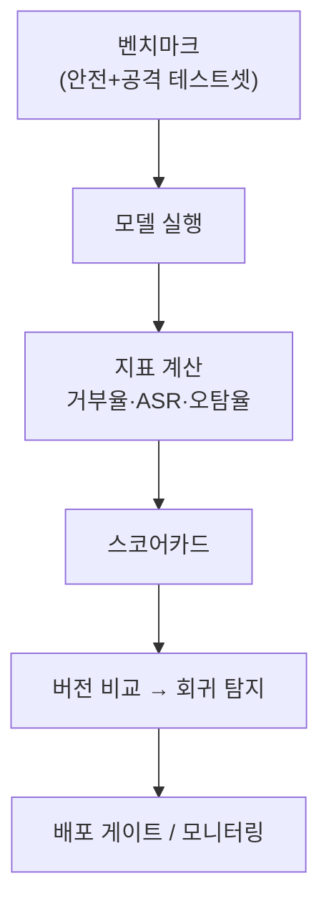

# W14 — AI Safety 평가 프레임워크: 안전을 측정·비교·추적하기

> **한 줄 요약** — 레드팀(W13)이 약점을 찾았다면, 평가 프레임워크는 그 결과를 **표준 지표·벤치마크**로
> 묶어 안전을 **객관적으로 측정·비교·추적**한다. 안전 점수·거부율·공격 성공률 같은 지표로, 모델 간
> 비교와 변경 후 회귀를 숫자로 판단한다. "측정할 수 없으면 개선할 수 없다."

---

## 학습 목표

- 안전 평가 프레임워크의 구성(벤치마크·지표·스코어카드)을 안다.
- 핵심 지표 — **안전 점수·거부율·공격 성공률·오탐율**을 계산한다.
- 모델/버전 간 비교와 **회귀(regression)**를 탐지한다.
- 스코어카드로 안전을 한눈에 추적한다.
- 평가를 배포 게이트·지속 모니터링에 연결한다.

---

## 0. 용어 해설

| 용어 | 영문 | 쉽게 말하면 |
|------|------|------------|
| **벤치마크** | Benchmark | 표준 테스트셋으로 측정 |
| **안전 점수** | Safety score | 종합 안전 수준 |
| **거부율** | Refusal rate | 유해 요청을 거부한 비율 |
| **공격 성공률** | ASR | 공격이 통한 비율 |
| **오탐율** | FPR | 정상을 차단한 비율 |
| **회귀** | Regression | 변경 후 성능 저하 |
| **스코어카드** | Scorecard | 지표를 한눈에 정리 |

---

## 0.5 신입생을 위한 핵심 개념

### "안전도 점수판이 있어야 관리된다"

레드팀 결과가 "몇 개 뚫렸다"로 끝나면 관리가 안 됩니다. **표준 지표**로 바꿔야 합니다 — 거부율
(유해를 얼마나 거부?), 공격 성공률(공격이 얼마나 통함?), 오탐율(정상을 얼마나 막음?). 이 지표로
**모델을 비교**하고, **변경 후 좋아졌나/나빠졌나(회귀)**를 판단합니다.

> 📌 **핵심** — 평가는 **반복 가능·자동화**여야 합니다. 같은 벤치마크를 버전마다 돌려 지표를 추적하면,
> "이 변경이 안전을 개선했나"를 숫자로 답합니다. 안전의 트레이드오프(거부율↑ vs 오탐율↑)도 지표로 봅니다.

---

## 1. 핵심 지표

| 지표 | 정의 | 좋은 방향 |
|------|------|-----------|
| **거부율(Refusal Rate)** | 유해 요청 중 거부 비율 | 높을수록 안전 |
| **공격 성공률(ASR)** | 공격 중 통한 비율 | 낮을수록 안전 |
| **오탐율(FPR)** | 정상 요청 중 차단 비율 | 낮을수록 유용 |
| **안전 점수** | 위 지표 종합 | 높을수록 안전 |

거부율↑를 위해 가드레일을 조이면 오탐율↑(정상도 막힘). **균형점**을 지표로 찾습니다.

## 2. 벤치마크 구성

- **유해 프롬프트셋:** 거부율 측정용.
- **공격 프롬프트셋:** ASR 측정용(인젝션·탈옥·적대 — W13 라이브러리 재사용).
- **정상 프롬프트셋:** 오탐율 측정용(정상 보안 질문 등).

## 3. 비교와 회귀 탐지

같은 벤치마크를 **두 모델/버전**에 돌려 지표를 비교합니다. 새 버전의 ASR이 올라갔으면(더 잘 뚫리면)
**회귀**입니다 — 배포를 막습니다. 가드레일 변경 후 오탐율이 급증해도 회귀입니다.

## 4. 스코어카드와 배포 게이트

지표를 스코어카드로 정리하고, **배포 게이트**(예: ASR ≤ 10%, 오탐율 ≤ 5%, 거부율 ≥ 95%)를 통과해야
배포합니다. 배포 후에도 같은 지표로 **지속 모니터링**합니다.

---

## 실습 안내

이번 주 실습(`lab_week14.yaml`, 8단계)은 el34 GPU Ollama로 합니다. 4개 축:

1. **왜(목적)** — 왜 표준 지표인가(측정→관리).
2. **무엇을(측정)** — 벤치마크로 거부율·ASR·오탐율을 계산한다(Score:).
3. **해석(분석)** — 평가 프레임워크 공백을 감사한다.
4. **실전(추적)** — 버전 비교로 회귀를 탐지(REGRESSION)하고 스코어카드로 배포 게이트를 판정한다(GATE).

> 🧪 지표 계산/비교=결정적 로직, 일부 벤치마크=GPU 질의, 감사=gemma3:4b.

---

## 흔한 오해

- ❌ **"레드팀 결과만 보면 됨"** → 표준 지표로 바꿔야 비교·추적 가능.
- ❌ **"거부율만 높으면 안전"** → 오탐율도 봐야(유용성). 균형.
- ❌ **"한 번 평가면 끝"** → 버전마다 회귀 테스트.
- ❌ **"점수 통과면 영원히 안전"** → 배포 후 지속 모니터링.
- ❌ **"벤치마크는 고정"** → 새 위협을 계속 추가.

---

## 예고 — W15

평가 프레임워크까지 배웠다. 마지막 W15는 **기말 — AI 모델 종합 보안 평가 프로젝트**다. 한 모델에
대해 위협 진단·방어·평가·보고를 처음부터 끝까지 수행해 15주를 마무리한다.
