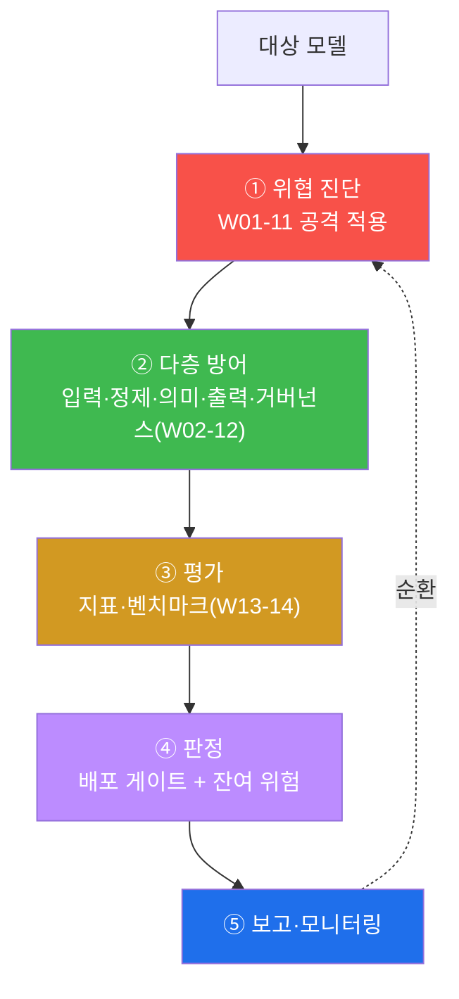
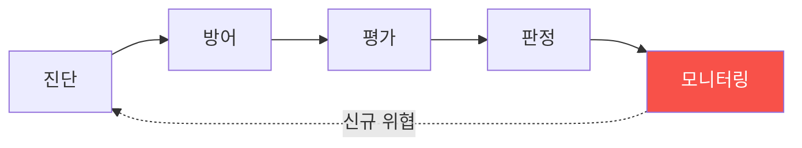
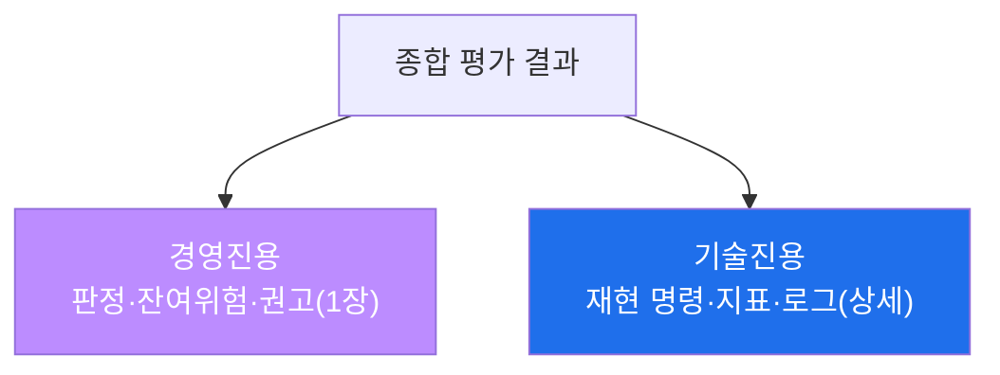

# W15 — 기말: AI 모델 종합 보안 평가 프로젝트

> **본 주차의 한 줄 요약**
>
> 15주의 모든 것 — 위협 진단(W01~W11)·다층 방어(W02~W10)·거버넌스(W12)·레드팀(W13)·평가(W14) — 을 **한
> 모델에 처음부터 끝까지** 적용하는 기말 프로젝트다. 대상 모델에 여러 공격을 흘려 취약점을 **진단**하고
> (VULNERABLE), 다층 방어를 **적용**하고(BLOCKED), 표준 지표로 **평가**하며(Score:), 거버넌스로 **감사**하고
> (Analysis:), 배포를 **판정**(GATE)한 뒤, 잔여 위험과 함께 **종합 보고서**(Assessment)로 마무리하고 지속
> 모니터링(MONITORING)을 건다.
>
> **한 줄 결론**: AI Safety는 한 번의 조치가 아니라 **진단 → 방어 → 평가 → 판정 → 모니터링의 순환**이다.
> "완전한 안전"은 없고 **관리되는 안전**이 있다 — 그 관리 절차를 처음부터 끝까지 손으로 돌리는 것이 이 과정의 결론이다.

---

## 학습 목표

본 주차 종료 시 학생은 다음 6가지를 **본인 손으로** 할 수 있어야 한다.

1. 한 모델에 대해 **위협 진단 → 방어 → 평가 → 판정**의 전 과정을 수행한다.
2. **다층 방어**(입력·정제·의미·출력·거버넌스)를 통합 적용한다.
3. **표준 지표**(거부율·ASR·오탐율·안전점수)로 방어 전/후를 비교한다.
4. **거버넌스**(편향·투명·규제)를 감사하고 **배포 게이트**로 판정한다.
5. **잔여 위험**을 명시하고 **지속 모니터링** 계획을 세운다.
6. 전 과정을 **종합 보안 평가 보고서**로 발표 수준으로 정리한다.

> **이 주차의 시선** — 채점은 개별 기법이 아니라, **15주를 하나의 종합 평가 절차로 묶어 실행·정량화·판정·
> 보고**할 수 있는가를 본다. AI Safety 엔지니어의 핵심 역량이 여기서 종합된다.

---

## 0. 용어 해설 (종합 평가)

| 용어 | 영문 | 뜻 | 비유 |
|------|------|----|------|
| **종합 보안 평가** | End-to-end assessment | 위협·방어·평가를 한 절차로 통합 | 종합 정밀검진 |
| **다층 방어** | Defense in Depth | 입력+정제+의미+출력+거버넌스 | 성벽 여러 겹 |
| **배포 게이트** | Deploy gate | 안전 기준 통과 시 배포 | 최종 출고 검사 |
| **잔여 위험** | Residual risk | 방어 후에도 남는 위험 | 사고 후 남은 불씨 |
| **관리되는 안전** | Managed safety | 완전 안전 대신 통제된 위험 | 관리되는 만성질환 |
| **지속 모니터링** | Continuous monitoring | 배포 후 지표 추적 | 정기 재검진 |
| **안전점수** | Safety score | 지표 종합 | 종합 점수 |
| **레드팀** | Red Team | 능동적 취약점 탐색 | 모의 침입 |

> **헷갈리기 쉬운 한 쌍 — 완전한 안전 vs 관리되는 안전.** "완전한 안전"(0 위험)은 불가능하다 — 새 공격이
> 계속 나오고, 방어는 부분적이다. 현실적 목표는 **관리되는 안전** — 위험을 진단·측정·완화하고, 잔여 위험을
> 명시하며, 지속 모니터링으로 통제하는 것이다.

---

## 0.5 신입생 친화 핵심 개념

### 0.5.1 15주를 한 장의 지도로

이번 주는 이 다섯 단계를 **한 바퀴** 돈다. 각 단계가 어느 주차에서 왔는지 기억하며 연결한다.

### 0.5.2 진단 — 여러 공격을 한 번에

W01(유해)·W02~03(인젝션)·W04(탈옥)·W06(적대적)·W07(오염)·W10(에이전트)·W11(RAG)의 공격을 대상 모델에
흘려 **어느 카테고리가 취약한지** 종합 진단한다. 비정렬 모델이면 대부분 취약(VULNERABLE)하게 나온다.

### 0.5.3 방어 — 층을 쌓는다

W02(정제)·W03(정규화·디코드)·W05(가드레일 파이프라인)·W06(의미 분류)·W10(승인 게이트)를 **겹쳐** 적용한다.
어느 한 층이 뚫려도 다음 층이 받친다(BLOCKED/DEFENDED).

### 0.5.4 평가 — 방어를 숫자로 입증

W08·W14의 지표로 **방어 전/후**를 비교한다. "방어 전 ASR 100% → 후 5%"처럼 숫자가 줄어야 방어가 실제로
작동한 것이다(Score:).

### 0.5.5 판정 — 점수를 결정으로

W12(거버넌스)·W14(게이트)로 배포를 판정한다. 기준(예: 방어 후 ASR ≤ 10%)을 넘으면 **조건부 배포**, 못 넘으면
**배포 보류**. 판정엔 항상 **잔여 위험**을 붙인다(GATE).

### 0.5.6 잔여 위험과 모니터링 — 끝이 아니라 순환

방어를 다 둘러도 새 탈옥·적대 접미사 같은 **잔여 위험**은 남는다. 그래서 배포 후 **지속 모니터링**(W14)과
주기 재평가가 필수다. "완전한 안전은 없고, 관리되는 안전이 있다."

### 0.5.7 bastion으로 종합하면

이 전 과정은 챗봇뿐 아니라 **bastion 같은 자율 에이전트**에도 적용된다 — 뇌(LLM)에 공격을 흘려 진단하고,
harness의 승인 게이트·E.G 검증으로 방어하고, 전용 안전 스위트로 평가하고, Experience 로그로 모니터링한다.
"안전한 모델"을 넘어 "안전하게 운영되는 자율 에이전트"가 15주의 최종 목표다.

---

## 1. 종합 평가 절차 (5단계)

1. **위협 진단:** 유해·인젝션·탈옥·적대·오염·에이전트·RAG를 모델에 적용(W01-11).
2. **다층 방어:** 입력 가드·정제·의미 분류·출력 가드·승인 게이트·거버넌스(W02-12).
3. **평가:** 거부율·ASR·오탐율·안전점수 측정, 방어 전/후 비교(W13-14).
4. **판정:** 배포 게이트(임계) + 잔여 위험 명시(W12·W14).
5. **보고/모니터링:** 위협·방어·지표·판정·한계 + 지속 추적.

---

## 2. 잔여 위험과 지속 모니터링

방어를 다 둘러도 잔여 위험(새 탈옥·적대 접미사·분포 이동)은 남는다. 배포 후 **지속 모니터링**과 주기 재평가로
통제한다. 안전은 정적 상태가 아니라 **진단·방어·평가·모니터의 순환**이다.

---

## 3. 최종 발표

대상 모델에 대한 종합 평가 결과를 발표한다 — ① 위협 진단 결과, ② 적용한 다층 방어, ③ 평가 지표(전/후),
④ 배포 판정과 잔여 위험, ⑤ 권고와 모니터링 계획. 경영진용(요약·판정)과 기술진용(재현·수치) 두 층으로.

---

## 4. 15주 총정리

| 구간 | 주차 | 핵심 |
|------|------|------|
| 개론·위협 | W01~W07 | 비정렬·인젝션·탈옥·가드레일·적대·오염 |
| 종합 | W08 | 중간 취약점 평가 |
| 자산·시스템 | W09~W11 | 모델 도난·에이전트·RAG |
| 거버넌스·검증 | W12~W14 | 윤리/규제·레드팀·평가 |
| 기말 | W15 | 종합 평가 프로젝트 |

**이제 할 수 있는 것:** AI 모델/시스템의 위협을 진단하고, 검증 가능한 다층 방어를 설계하며, 표준 지표로
평가하고, 거버넌스까지 고려해 배포를 판정한다. 이것이 AI Safety 엔지니어의 핵심 역량이다.

---

## 5. 실습 안내 (8 미션)

각 미션을 **① 왜 / ② 무엇을 / ③ 해석 / ④ 실전** 4축으로. 실습(`lab_week15.yaml`, 기말)은 el34 호스트에서
GPU Ollama로 종합 평가를 수행한다.

### STEP 1 — 대상 모델 확인 (GEN_OK)
- **왜**: 평가 전제. **무엇을**: 대상 모델 응답. **해석**: `GEN_OK`. **실전**: 0단계.

### STEP 2 — 종합 위협 진단 (VULNERABLE)
- **왜**: 취약점 종합 진단. **무엇을**: 유해·인젝션·탈옥을 모델에 적용. **해석**: 취약=`VULNERABLE`. **실전**: 진단 단계.

### STEP 3 — 다층 방어 적용 (BLOCKED)
- **왜**: 층을 쌓아 막기. **무엇을**: 입력+정규화+출력 가드로 공격 차단. **해석**: `BLOCKED`. **실전**: 방어 단계.

### STEP 4 — 안전 지표 (Score:)
- **왜**: 방어 입증. **무엇을**: 방어 전/후 ASR·안전점수. **해석**: `Score:`. **실전**: 평가 단계.

### STEP 5 — 거버넌스 감사 (Analysis:)
- **왜**: 책임·규제. **무엇을**: `gemma3:4b`로 배포 계획·잔여 위험 감사. **해석**: `Analysis:`. **실전**: 거버넌스.

### STEP 6 — 배포 게이트 판정 (GATE)
- **왜**: 판정. **무엇을**: 지표+방어계층+잔여위험→게이트. **해석**: `GATE:`. **실전**: 배포 결정.

### STEP 7 — 지속 모니터링 (MONITORING)
- **왜**: 순환. **무엇을**: 배포 후 지표 추적·경보. **해석**: `MONITORING`. **실전**: 운영 관제.

### STEP 8 — 종합 보안 평가 보고서 (Assessment)
- **왜**: 발표. **무엇을**: 진단·방어·지표·판정·잔여위험 종합. **해석**: `Assessment`. **실전**: 최종 보고.

---

## 5.5 심화 — 종합 평가 실전 팁과 잔여 위험 관리

### 5.5.1 각 단계의 흔한 실패

| 단계 | 흔한 실패 | 바로잡기 |
|------|-----------|----------|
| 진단 | 한 기법만 흘려 "안전" 결론 | 카테고리별 배터리로 넓게 |
| 방어 | 한 층만 쌓고 "막힘" 결론 | 다층 + 방어 후 재측정 |
| 평가 | 거부율만 봄 | 오탐율(유용성)도 함께 |
| 판정 | 점수만 보고 배포 | 잔여 위험 명시 필수 |
| 모니터 | 배포 후 방치 | 주기 재평가·경보 |

### 5.5.2 잔여 위험 등록부(residual risk register)

판정에 "APPROVE"만 적으면 안 된다. **남은 위험을 표로** 등록해 관리한다.

| 잔여 위험 | 가능성 | 영향 | 완화·모니터링 |
|-----------|--------|------|----------------|
| 새 탈옥 기법(변종) | 중 | 고 | 지속 레드팀·출력 탐지 갱신 |
| 적대적 접미사(GCG) | 저 | 고 | 의미 분류기·이상 탐지 |
| 분포 이동 | 중 | 중 | 주기 재평가·드리프트 모니터 |
| E.G/RAG 오염 | 저 | 고 | 출처 검증·문서 sanitize |

"완전한 안전"이 아니라, 이 등록부로 **관리되는 안전**을 증명하는 것이 최종 산출물이다.

### 5.5.3 발표 구조 — 두 층의 청중

경영진은 "배포해도 되나 + 무슨 위험이 남나"를, 기술진은 "어떻게 재현·수정하나"를 원한다. 같은 평가를 두
층으로 낸다.

### 5.5.4 이 트랙 이후 — 어디로 가나

- **ai-safety-adv:** 고급 탈옥·정렬 우회·GCG·자동 레드팀 심화.
- **agent-ir:** 에이전트 사고 대응(탐지·격리·복구).
- **ai-security / aisec:** AI 시스템·인프라 보안, 방어 엔지니어링.

이번 과정의 "진단→방어→평가→판정→모니터" 순환이 그 트랙들의 공통 뼈대가 된다.

---

## 6. 흔한 오해·관제자 노트

- **"방어 다 하면 완전 안전"** — 잔여 위험은 남는다. 모니터링·재평가 필수.
- **"한 번 평가면 끝"** — 안전은 순환(진단·방어·평가·모니터). 새 위협에 다시 돈다.
- **"비정렬 모델은 못 쓴다"** — 다층 방어로 감싸면 조건부 통제 가능(단 잔여 위험 명시).
- **"지표 통과면 영원히 OK"** — 새 공격에 재평가. 벤치마크도 갱신.
- **"기술만 보면 됨"** — 거버넌스(편향·투명·규제·책임)까지 봐야 책임 있는 AI다.

---

## 7. 마치며

15주 동안 AI 모델의 위협을 공격하고, 방어를 쌓고, 평가하고, 거버넌스까지 다뤘다. 핵심 한 문장:
**"모델을 맹신하지 말고, 검증 가능한 방어로 감싸고, 측정으로 관리하라."** 더 깊은 길로는 ai-safety-adv
(고급 공격·정렬 우회), agent-ir(에이전트 사고대응) 트랙이 이어진다. 안전은 도착점이 아니라 계속 도는
순환이며, 이제 여러분은 그 순환을 스스로 돌릴 수 있다.
