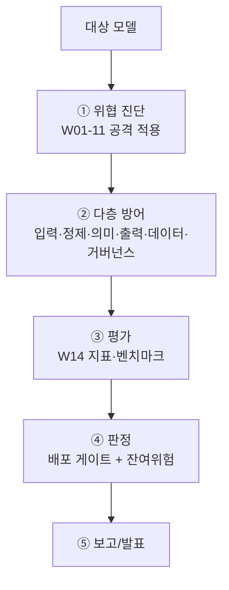

# W15 — 기말: AI 모델 종합 보안 평가 프로젝트

> **한 줄 요약** — 15주의 모든 것(위협 진단·다층 방어·평가 프레임워크)을 한 모델에 처음부터 끝까지
> 적용한다. 위협을 진단하고 → 다층 방어를 두르고 → 표준 지표로 평가하고 → 배포 가능성을 판정하는
> **종합 보안 평가**를 수행하며 AI Safety 과정을 마무리한다.

---

## 학습 목표

- 한 모델에 대해 위협 진단→방어→평가→판정의 전 과정을 수행한다.
- 다층 방어(입력·정제·의미·출력·데이터·거버넌스)를 통합 적용한다.
- 표준 지표(거부율·ASR·오탐율)로 안전을 평가한다.
- 배포 게이트로 종합 판정하고 보고서를 작성한다.
- 15주를 종합하고 발표한다.

---

## 0. 용어 해설

| 용어 | 뜻 |
|------|----|
| **종합 보안 평가** | 위협·방어·평가를 한 절차로 통합 |
| **다층 방어** | 입력+정제+의미+출력+데이터+거버넌스 |
| **배포 게이트** | 안전 기준 통과 시 배포 |
| **잔여 위험** | 방어 후에도 남는 위험 |

---

## 0.5 신입생을 위한 핵심 개념 — 15주의 종합

> 📌 **15주의 결론** — **"모델을 못 믿으면, 검증 가능한 방어로 감싸고, 측정으로 관리한다."** 비정렬
> 모델도 다층 방어 + 지속 평가로 위험을 통제할 수 있습니다. 안전은 한 번의 조치가 아니라 **진단·방어·
> 평가·모니터링의 순환**입니다.

---

## 1. 종합 평가 절차

1. **위협 진단:** 유해·인젝션·탈옥·적대·추출을 모델에 적용(W01-11).
2. **다층 방어:** 입력 가드·정제·의미 분류·출력 가드·데이터 검증·거버넌스(W02-12).
3. **평가:** 거부율·ASR·오탐율 측정, 방어 전/후 비교(W14).
4. **판정:** 배포 게이트(임계) + 잔여 위험 명시.
5. **보고/발표:** 위협·방어·지표·판정·한계.

## 2. 잔여 위험과 모니터링

방어를 다 둘러도 **잔여 위험**(새 탈옥·적대 접미사 등)은 남습니다. 그래서 배포 후 **지속 모니터링**과
**주기적 재평가**가 필수입니다. "완전한 안전은 없고, 관리되는 안전이 있다."

## 3. 최종 발표

대상 모델에 대한 종합 평가 결과를 발표합니다 — ① 위협 진단 결과, ② 적용한 다층 방어, ③ 평가 지표
(전/후), ④ 배포 판정과 잔여 위험, ⑤ 권고와 모니터링 계획.

---

## 4. 15주 총정리

| 구간 | 주차 | 핵심 |
|------|------|------|
| 위협 | W1-7 | 비정렬·인젝션·탈옥·적대·데이터오염 |
| 종합 | W8 | 중간 취약점 평가 |
| 자산·시스템 | W9-11 | 모델 도난·에이전트·RAG |
| 거버넌스·검증 | W12-14 | 윤리/규제·레드팀·평가 |
| 기말 | W15 | 종합 평가 프로젝트 |

**이제 할 수 있는 것:** AI 모델/시스템의 위협을 진단하고, 검증 가능한 다층 방어를 설계하며, 표준
지표로 평가하고, 거버넌스까지 고려해 배포를 판정한다. 이것이 AI Safety 엔지니어의 핵심 역량입니다.

---

## 실습 안내

이번 주 실습(`lab_week15.yaml`, 8단계, 기말)은 el34 GPU Ollama로 종합 평가를 수행한다. 4개 축:

1. **왜(목적)** — 안전은 진단·방어·평가·모니터링의 순환.
2. **무엇을(진단)** — 모델에 위협을 적용해 취약점을 종합 진단한다(VULNERABLE).
3. **해석(평가)** — 다층 방어를 적용해 막고(BLOCKED), 지표로 평가한다(Score:).
4. **실전(판정)** — 배포 게이트로 종합 판정(GATE)하고 최종 보고서를 만든다.

> 🧪 취약 시연=ccc-unsafe:2b, 방어/지표=결정적, 시나리오/감사=gemma3:4b.

---

## 흔한 오해

- ❌ **"방어 다 하면 완전 안전"** → 잔여 위험은 남는다. 모니터링·재평가 필수.
- ❌ **"한 번 평가면 끝"** → 안전은 순환(진단·방어·평가·모니터).
- ❌ **"비정렬 모델은 못 쓴다"** → 다층 방어로 감싸면 통제 가능(조건부).
- ❌ **"지표 통과면 영원히 OK"** → 새 위협에 재평가.
- ❌ **"기술만 보면 됨"** → 거버넌스(윤리·규제)까지.

---

## 마치며

15주 동안 AI 모델의 위협을 공격하고, 방어를 쌓고, 평가하고, 거버넌스까지 다뤘습니다. 핵심 한 문장:
**"모델을 맹신하지 말고, 검증 가능한 방어로 감싸고, 측정으로 관리하라."** 더 깊은 길로는
ai-safety-adv(고급 공격·정렬 우회), agent-ir(에이전트 사고대응) 트랙이 이어집니다.
