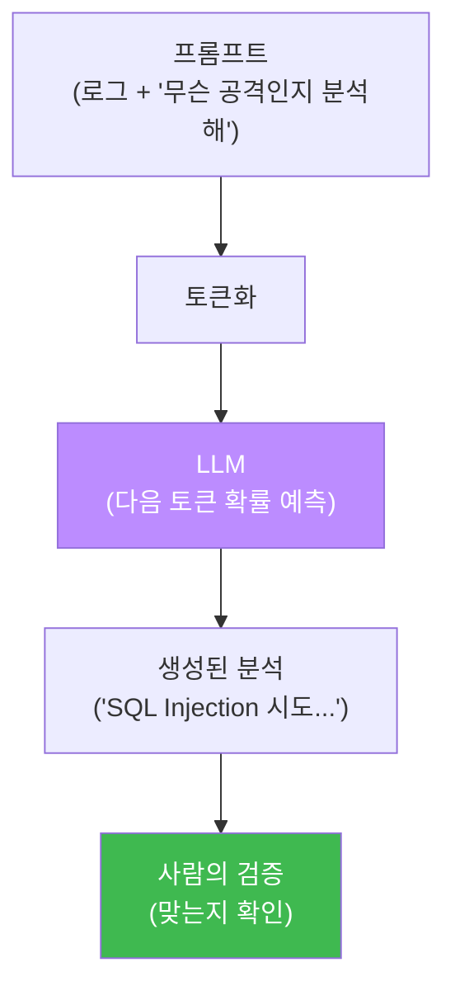
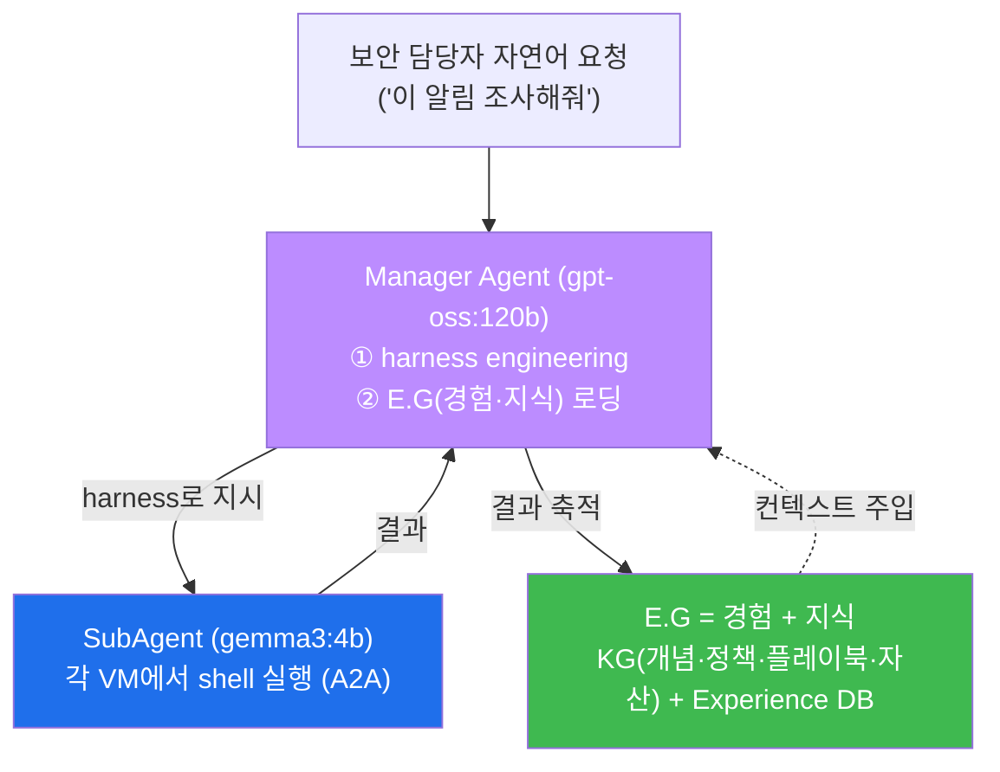

# ai-security W01 — AI/LLM 보안 활용 개론: LLM 기초·Ollama·첫 로그 분석

> **본 주차의 한 줄 요약**
>
> 이 과목은 "AI를 **공격하는**" 과목(ai-safety)이 아니라, **AI를 방어자의 무기로 쓰는** 과목이다. 보안 분석가가
> 수천 줄의 로그를 밤새 뒤지던 일을, LLM에게 시켜 **요약·분류·판단**하게 만든다. 이번 첫 주는 그 토대를 잡는다:
> LLM이 무엇이고 어떻게 동작하는지(Transformer·토큰·temperature), 사이버보안에서 AI가 쓰이는 영역(로그 분석·
> 위협 탐지·취약점 평가·SOAR), 그리고 **el34 GPU의 LLM을 API로 호출**해 실제 보안 로그를 분석시키는 첫 실습을
> 손으로 해 본다. 이 과목의 궁극 목표는 el34의 자율보안 에이전트 **bastion** — LLM을 머리로, 도구를 손발로
> 쓰는 시스템 — 을 이해하고 만드는 것이며, 이번 주는 그 머리(LLM)를 부르는 법부터 배운다.
>
> **한 줄 결론**: AI 보안 활용의 핵심은 "LLM에게 **무엇을 어떻게 시키는가**"다. 좋은 질문(프롬프트)이 좋은
> 분석을 만든다. 그리고 LLM은 만능이 아니라 **틀릴 수 있는 조수**이므로, 그 답을 **검증**하는 습관을 함께 배운다.

---

## 학습 목표

본 주차 종료 시 학생은 다음 5가지를 **본인 손으로** 할 수 있어야 한다.

1. LLM의 기본 동작(토큰·확률적 생성·temperature)과 Transformer의 개념을 설명한다.
2. 사이버보안에서 AI가 쓰이는 주요 영역(로그 분석·위협 탐지·취약점 평가·SOAR)을 예로 든다.
3. **Ollama API**(`/api/generate`, `/api/chat`)로 el34 GPU의 LLM을 호출한다.
4. LLM에게 **보안 로그를 분석**시켜 공격 유형·심각도를 뽑아낸다.
5. LLM 출력의 **한계**(환각·비결정성)를 알고, 왜 검증이 필요한지 설명한다.

> **이 주차의 시선** — 화려한 자동화가 아니라, "LLM을 정확히 부르고 그 답을 해석·검증하는" 기본기를 잡는 주다.

---

## 0. 용어 해설 (AI 보안 활용 입문)

| 용어 | 영문 | 뜻 | 비유 |
|------|------|----|------|
| **LLM** | Large Language Model | 방대한 텍스트로 학습한 언어 모델 | 박식한 조수 |
| **토큰** | Token | 모델이 다루는 텍스트 조각(단어·부분단어) | 레고 블록 |
| **Transformer** | Transformer | 현대 LLM의 핵심 신경망 구조(어텐션) | 문맥 집중 엔진 |
| **temperature** | temperature | 출력 무작위성(0=일관, 높을수록 다양) | 창의성 손잡이 |
| **Ollama** | Ollama | 로컬에서 LLM을 API로 서빙하는 도구 | 모델 발전소 |
| **프롬프트** | Prompt | 모델에게 주는 지시/질문 | 질문지 |
| **system 메시지** | System Message | 모델의 역할·규칙을 정하는 상위 지시 | 근무 수칙 |
| **SOAR** | Security Orchestration, Automation and Response | 보안 대응 자동화 | 자동 대응 관제 |
| **bastion** | — | el34의 자율보안 에이전트(이 과목의 대상 시스템) | 스스로 판단·실행하는 보안 당직자 |

> **헷갈리기 쉬운 한 쌍** — *system 메시지* 는 "너는 SOC 분석가다" 같은 **역할·규칙**을, *user 메시지* 는
> "이 로그 분석해" 같은 **실제 요청**을 담는다. 역할을 system에 고정하면 답의 형식과 관점이 일관돼진다.

---

## 0.5 핵심 개념

### 0.5.1 LLM은 어떻게 "이해"하나 — 토큰과 확률적 생성

LLM은 텍스트를 **토큰**(단어·부분단어 조각)으로 쪼개, "지금까지의 토큰 다음에 올 **가장 그럴듯한 토큰**"을
확률적으로 이어 붙인다. 그래서 두 가지 성질이 나온다: ① 문맥을 반영해 자연스러운 답을 만든다, ② 같은 질문에도
**매번 조금씩 다른 답**이 나온다(비결정성, `temperature`가 클수록 심함). 보안 실무에선 재현성을 위해 분석
작업에 `temperature`를 낮게(0~0.3) 둔다.



핵심: LLM의 답은 **확률적 초안**이다. 편리하지만 틀릴 수 있으니(환각) 반드시 사람이 검증한다 — 이 과목 내내
지킬 원칙이다.

### 0.5.2 AI가 보안에서 하는 일 — 이 과목의 지도

| 영역 | AI가 하는 일 | 이 과목 주차 |
|------|-------------|-------------|
| 로그 분석 | 대량 로그에서 이상 요약·분류 | W04 |
| 탐지 룰 생성 | Sigma/Suricata 룰 자동 작성 | W05 |
| 취약점 분석 | 코드/설정의 취약점 발견·수정안 | W06 |
| 에이전트 자동화 | 도구를 호출해 조사·대응 | W07·W09~W14 |

이번 주는 이 중 **로그 분석의 맛보기**를 한다. 앞으로 각 영역을 깊게 파고, 마지막엔 이 모두를 자율로 수행하는
**bastion 에이전트**로 통합한다.

### 0.5.3 el34 GPU의 LLM을 부르는 법 — Ollama API

el34 실습은 GPU에 올라간 Ollama의 두 엔드포인트를 쓴다.

- `POST /api/generate` — 단발 생성. `{"model":..., "prompt":..., "stream":false}` → `response`.
- `POST /api/chat` — 대화형. `messages`에 system/user 역할을 분리해 담는다.

```bash
curl -s http://211.170.162.139:10934/api/generate \
  -d '{"model":"gemma3:4b","prompt":"What is a brute force attack in one sentence?","stream":false,"options":{"num_predict":50}}' \
 | python3 -c "import sys,json; print(json.load(sys.stdin)['response'])"
```

`options.num_predict`는 생성 토큰 수, `temperature`는 무작위성이다. 분석에는 낮은 temperature를 쓴다.

### 0.5.4 우리가 만들 대상 — el34의 자율보안 에이전트 "bastion"

이 과목의 종착지는 단순 LLM 호출이 아니라, LLM을 머리로 쓰는 **자율 에이전트 bastion**이다. 구조를 미리 그려
둔다.



- **harness(에이전트 동작 방식)** — Manager Agent가 작업이 들어올 때마다 **즉석에서 구성하는 "일하는 방식"** 이다.
  "어떤 도구(skill)를 어떤 순서로 쓰고, 위험 단계는 사람 승인을 받고, 실패하면 스스로 진단해 다시 시도하고
  (self-correction), 결과를 검증한다"는 절차의 골격을 Manager가 **자동으로 짜서**(*harness engineering*)
  SubAgent에게 내려 준다.
- **E.G(경험 및 지식, Experience & Knowledge)** — Manager가 일을 시작하기 전에 **컨텍스트로 불러오는 두 가지**:
  ① *지식(Knowledge)* — 개념·정책·플레이북·자산 정보의 지식 베이스(KG), ② *경험(Experience)* — 과거 유사
  작업의 처리 기록(Experience DB). bastion은 **백지에서 일하지 않고** "이런 일은 예전에 이렇게 풀었고 규칙은
  이렇다"를 알고 시작하며, 실행 결과는 다시 E.G에 쌓인다.

이번 주 우리가 손으로 하는 "LLM에게 로그 분석 시키기"가, bastion에서는 Manager가 harness를 짜고 E.G를 불러와
**자동으로** 수행하는 일의 축소판이다. 이 과목은 그 축소판에서 시작해 W09부터 bastion 자체를 만들어 간다.

---

## 1. AI 보안 도구의 한계 — 왜 검증이 필수인가

LLM은 강력하지만 다음 한계가 있다. 이것을 모르면 위험하다.

- **환각(Hallucination)** — 그럴듯한 거짓을 자신 있게 말한다(없는 CVE 번호를 지어내는 식).
- **비결정성** — 같은 로그도 실행마다 조금 다르게 분석할 수 있다.
- **맥락 한계** — 아주 긴 로그는 다 못 본다(컨텍스트 윈도우).
- **최신성** — 학습 시점 이후의 신종 공격은 모른다.

그래서 이 과목의 철칙: **LLM 출력은 "분석가의 초안"이지 "최종 판단"이 아니다.** 사람이(또는 결정론적 규칙이)
검증한다. 이번 주 실습에서도 LLM의 분석을 실제 로그와 대조해 확인한다.

---

## 2. 실습 안내 (5 미션)

실행 위치 el34 **호스트**(`ssh ccc@{{TARGET_IP}}`, 비밀번호 `1`), GPU는 `http://211.170.162.139:10934`.

### STEP 1 — GPU 헬스체크 → GEN_OK
- **왜/무엇을:** 이후 모든 실습이 GPU 호출에 의존. 모델이 응답하는지 먼저 확인.

### STEP 2 — system/user 분리 호출 → CHAT_OK
- **왜?** 역할(system)을 고정하면 답의 형식·관점이 일관돼진다.
- **무엇을?** system="너는 SOC 분석가다"로 고정하고 user 질문을 던져, 역할이 반영된 답을 받는다.
- **해석:** 프롬프트 엔지니어링의 첫걸음 — 역할 부여.

### STEP 3 — SSH 브루트포스 로그 분석 → BRUTEFORCE
- **왜?** 로그 분석의 대표 사례.
- **무엇을?** 반복 실패 로그를 LLM에 주고 공격 유형을 분석시킨다(브루트포스 식별).
- **해석:** 대량 로그를 사람이 다 읽지 않고 요약·분류.

### STEP 4 — 웹 공격 로그 분석(SQLi) → SQLI_FOUND
- **왜?** 웹 로그에서 공격 페이로드 식별.
- **무엇을?** `UNION SELECT` 가 든 웹 로그를 LLM에 주고 공격 유형을 뽑아낸다.
- **해석:** LLM이 페이로드를 SQL Injection으로 분류. (실제 el34 ModSec 로그로도 확장 가능.)

### STEP 5 — 구조화 트리아지 → TRIAGED
- **왜?** 분석을 표준 형식(심각도·조치)으로 만든다.
- **무엇을?** LLM에게 "심각도와 권고 조치를 정해진 형식으로" 답하게 한다.
- **해석:** SOAR 자동화의 씨앗 — 구조화 출력이 있어야 후속 자동 처리가 가능. 단, 결과는 검증 대상.

---

## 3. 흔한 오해·블루팀 노트

- **"LLM이 분석했으니 맞다"** — 환각·비결정성 때문에 검증이 필수. 실제 로그·결정론 규칙과 대조한다.
- **"temperature는 아무 값이나"** — 분석엔 낮게(0~0.3) 둬야 재현성이 생긴다.
- **"긴 로그를 통째로 넣으면 된다"** — 컨텍스트 한계로 뒤가 잘린다. 요약·청크·핵심 추출을 먼저.
- **관제 관점** — bastion은 로그 분석을 자동화하되, LLM 판단을 **Assessor 실측·결정론 규칙과 대조**하고, 위험
  조치는 사람 승인을 거친다(LLM은 조수, 최종 판단은 검증 후).

---

## 4. 다음 주차 (W02) 예고 — LLM 기초 + Ollama 심화

이번 주가 "맛보기"였다면, W02는 Ollama와 LLM 파라미터(temperature·top_p·num_ctx)를 더 깊이 다루고, 여러
모델을 비교하며, 보안 작업에 맞는 모델·설정을 고르는 법을 배운다. 좋은 도구를 정확히 다루는 것이 자동화의 첫걸음이다.
