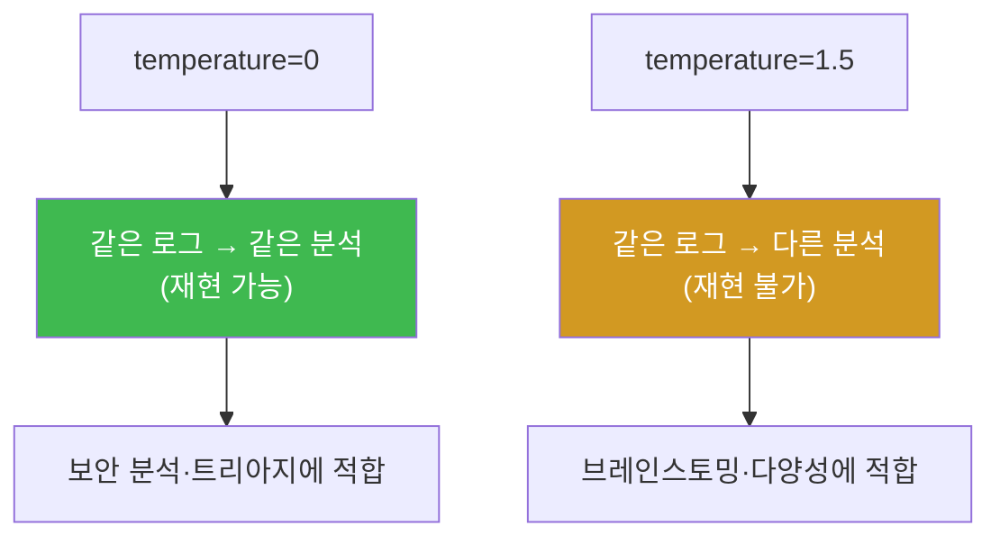

# ai-security W02 — LLM 기초 + Ollama 심화: 파라미터·결정성·구조화 출력·모델 선택

> **본 주차의 한 줄 요약**
>
> W01에서 LLM을 "불러 봤다면", W02는 그 도구를 **정밀하게 다루는 법**을 배운다. 같은 질문도 `temperature`를
> 0으로 두면 매번 **똑같은 답**(결정성)이 나오고, 높이면 다양해진다 — 보안 분석엔 재현성이 중요하므로 낮게
> 둔다. 또한 LLM에게 **JSON 같은 구조화 형식**으로 답하게 하면(그냥 문장이 아니라), 그 출력을 프로그램이
> 받아 **자동 처리**할 수 있다 — 이것이 SOAR·bastion 자동화의 결정적 전제다. 마지막으로 작업에 맞는 **모델을
> 고르는** 법(정확도·속도·크기의 균형)을 익힌다.
>
> **한 줄 결론**: 자동화의 문은 **"구조화된, 재현 가능한 출력"** 에서 열린다. 문장은 사람이 읽지만, JSON은
> 기계가 처리한다. temperature를 낮춰 재현성을 잡고, 형식을 고정해 자동화를 연다.

---

## 학습 목표

본 주차 종료 시 학생은 다음 5가지를 **본인 손으로** 할 수 있어야 한다.

1. LLM 주요 파라미터(`temperature`·`num_predict`·`top_p`)의 의미와 보안 작업에 맞는 값을 설명한다.
2. `temperature=0` 이 **결정적**(재현 가능) 출력을 주는 것을 실측한다(DETERMINISTIC).
3. LLM에게 **JSON 구조화 출력**을 받아 프로그램이 처리 가능하게 만든다(JSON_OK).
4. 같은 보안 질문에 **여러 모델을 비교**해 작업에 맞는 모델을 고른다(COMPARED).
5. 출력 길이(`num_predict`)를 제어해 비용·지연을 관리한다.

> **이 주차의 시선** — "LLM을 정확히 조율하는" 기본기. 재현성(temperature)과 구조화(JSON)가 자동화의 두 축이다.

---

## 0. 용어 해설 (LLM 파라미터)

| 용어 | 영문 | 뜻 | 비유 |
|------|------|----|------|
| **temperature** | temperature | 출력 무작위성(0=일관, 높을수록 다양) | 창의성 손잡이 |
| **top_p** | nucleus sampling | 후보 토큰을 확률 상위 p%로 제한 | 후보 좁히기 |
| **num_predict** | max tokens | 생성할 최대 토큰 수 | 답 길이 제한 |
| **결정성** | Determinism | 같은 입력=같은 출력 | 계산기 |
| **구조화 출력** | Structured Output | JSON 등 기계가 파싱 가능한 형식 | 서식 양식 |
| **format=json** | — | Ollama가 유효한 JSON을 강제 생성 | JSON 강제 모드 |
| **OpenAI 호환 API** | — | `/v1/chat/completions` 형식 지원 | 표준 콘센트 |

> **헷갈리기 쉬운 한 쌍** — *temperature* 는 "얼마나 다양하게", *top_p* 는 "어떤 후보 중에서" 뽑을지를 정한다.
> 분석 작업은 둘 다 낮게(temperature 0~0.3) 두어 재현성을 확보한다.

---

## 0.5 핵심 개념

### 0.5.1 temperature와 결정성 — 왜 분석엔 0에 가깝게

LLM은 다음 토큰을 확률로 뽑는다. `temperature`는 그 확률 분포를 얼마나 "평평하게"(다양하게) 만들지 정한다.

- `temperature=0` → 항상 **가장 확률 높은 토큰**만 선택 → **같은 입력엔 같은 출력**(결정적).
- `temperature=1.5` → 낮은 확률 토큰도 자주 선택 → 다양·창의적이지만 **매번 다름**.



보안 분석·트리아지·룰 생성처럼 **재현성이 중요한** 작업은 `temperature`를 0~0.3으로 둔다. 이번 주 실습에서
`temperature=0` 으로 같은 프롬프트를 두 번 보내 **출력이 완전히 같음**을 실측한다.

### 0.5.2 구조화 출력 — 문장 대신 JSON을 받는 이유

LLM이 "이건 SQL Injection이고 심각도는 높습니다"라고 **문장**으로 답하면 사람은 읽지만 **프로그램은 못 쓴다**.
대신 `{"attack":"sqli","severity":"high","action":"block_ip"}` 같은 **JSON**으로 받으면, 프로그램이 파싱해
자동으로 방화벽을 차단하고 티켓을 만들 수 있다.

```mermaid
graph TD
    L["LLM 분석"] -->|문장| H["사람이 읽음<br/>(자동화 불가)"]
    L -->|JSON(format=json)| P["프로그램이 파싱<br/>→ 자동 차단·티켓·경보"]
    style P fill:#3fb950,color:#fff
    style H fill:#d29922,color:#fff
```

Ollama의 `format=json` 옵션은 모델이 **유효한 JSON**을 내도록 강제한다. 이 구조화 출력이 **SOAR 자동화와
bastion**의 결정적 전제다 — Manager가 SubAgent 결과를 JSON으로 주고받아야 자동 조율이 가능하다.

### 0.5.3 모델 선택 — 정확도·속도·크기의 균형

모델은 클수록 대체로 똑똑하지만 느리고 무겁다. 작업에 맞게 고른다.

| 작업 | 권장 성향 | 예 |
|------|----------|-----|
| 빠른 분류·트리아지 | 작고 빠른 모델 | gemma3:4b · llama3.2:3b |
| 복잡한 추론·계획 | 크고 강한 모델 | gpt-oss:120b (Manager) |
| 공격 페이로드 생성(공격 과목) | derestricted 모델 | (공격 과목 한정) |

bastion은 이 원리로 **Manager(큰 모델)** 가 계획하고 **SubAgent(작은 모델)** 가 실행한다. 큰 모델로 다 하면
느리고 비싸기 때문이다.

### 0.5.4 우리가 만들 대상 — bastion의 파라미터·구조화

bastion의 Manager Agent는 **harness engineering** 으로 작업 절차를 짜고 **E.G(경험·지식)** 를 컨텍스트로
불러온다. 이때 Manager↔SubAgent, Manager↔도구 사이의 **주고받는 데이터가 구조화(JSON)** 되어야 자동
조율이 된다. 또 분석·판단의 **재현성**을 위해 낮은 temperature를 쓴다. 즉 이번 주 배우는 "결정성 + 구조화"가
bastion 자동화의 문법이다.

---

## 1. Ollama API 정리

| 엔드포인트 | 용도 | 핵심 필드 |
|-----------|------|----------|
| `POST /api/generate` | 단발 생성 | `prompt` → `response` |
| `POST /api/chat` | 대화(역할 분리) | `messages[]` → `message.content` |
| `GET /api/tags` | 설치 모델 목록 | — |
| 옵션 `format:"json"` | JSON 강제 | 구조화 출력 |
| 옵션 `options.temperature` | 무작위성 | 0~0.3 분석용 |
| 옵션 `options.num_predict` | 최대 토큰 | 길이·비용 제어 |

---

## 2. 실습 안내 (5 미션)

실행 위치 el34 **호스트**(`ssh ccc@{{TARGET_IP}}`), GPU `http://211.170.162.139:10934`.

### STEP 1 — GPU 헬스체크 → GEN_OK
### STEP 2 — temperature=0 결정성 → DETERMINISTIC
- **왜/무엇을:** 같은 프롬프트를 `temperature=0` 으로 두 번 보내 출력이 완전히 같음을 확인.
- **해석:** 분석·트리아지는 재현성이 필요 → 낮은 temperature.

### STEP 3 — JSON 구조화 출력 → JSON_OK
- **왜?** 자동화의 전제.
- **무엇을?** `format=json` 으로 severity·action 필드를 담은 JSON을 받아 파싱.
- **해석:** 기계가 처리 가능한 출력 → SOAR·bastion 자동화의 문.

### STEP 4 — 모델 비교 → COMPARED
- **왜?** 작업에 맞는 모델 선택.
- **무엇을?** 같은 보안 질문을 두 모델(gemma3:4b·llama3.2:3b)에 보내 답을 비교.
- **해석:** 속도·정확도·크기의 균형으로 선택.

### STEP 5 — 출력 길이 제어 → LENGTH_OK
- **왜?** 비용·지연 관리.
- **무엇을?** `num_predict` 를 작게/크게 바꿔 출력 길이가 제어됨을 확인.
- **해석:** 대량 자동화에선 길이 제어가 곧 비용 제어.

---

## 3. 흔한 오해·블루팀 노트

- **"temperature는 클수록 똑똑"** — 아니다. 클수록 다양·불안정. 분석엔 낮게.
- **"JSON은 그냥 문자열"** — `format=json` 은 유효 JSON을 강제한다. 파싱 실패 위험을 크게 줄인다(단 100%는 아님 → 파싱 예외 처리).
- **"큰 모델이 항상 낫다"** — 느리고 비싸다. 빠른 분류엔 작은 모델이 낫다.
- **관제 관점** — bastion은 분석에 낮은 temperature, 조율에 JSON 구조화, 역할에 맞는 모델(Manager 큰/Sub 작은)을
  쓴다. 이 파라미터 규율이 자동화의 안정성을 만든다.

---

## 4. 다음 주차 (W03) 예고 — 프롬프트 엔지니어링 for 보안

이번 주가 "파라미터"였다면, W03은 **프롬프트 자체를 설계**하는 법 — 역할 부여·few-shot 예시·출력 형식 지정·
체인 오브 소트 — 을 보안 작업에 맞춰 배운다. 좋은 프롬프트가 좋은 분석을 만든다. 자동화 품질의 8할이 프롬프트다.
