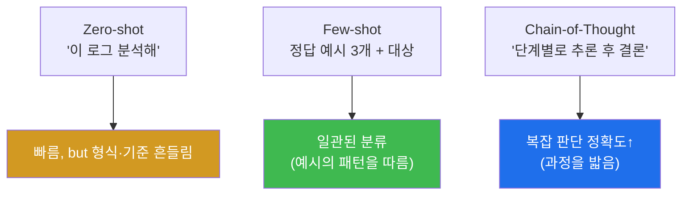

# ai-security W03 — 프롬프트 엔지니어링 for 보안: Zero/Few-shot·Chain-of-Thought·보안 템플릿

> **본 주차의 한 줄 요약**
>
> W02가 "LLM 손잡이(파라미터)"였다면, W03은 **LLM에게 무엇을 어떻게 시키는가(프롬프트)** 를 설계한다. 같은
> 모델도 프롬프트를 어떻게 쓰느냐에 따라 분석 품질이 하늘과 땅 차이다. 핵심 기법 셋: ① **Zero-shot**(예시 없이
> 바로 요청) — 빠르지만 형식이 흔들린다, ② **Few-shot**(정답 예시 몇 개를 먼저 보여 줌) — 모델이 그 패턴을
> 따라 **일관되게** 분류한다, ③ **Chain-of-Thought**(단계적으로 추론하게 함) — 복잡한 판단의 정확도를 올린다.
> 이 기법들을 로그 분석·취약점 설명·보고서 생성 같은 **보안 업무별 프롬프트 템플릿**으로 굳힌다.
>
> **한 줄 결론**: 자동화 품질의 8할은 **프롬프트**에서 나온다. 좋은 예시(few-shot)와 좋은 사고 유도
> (chain-of-thought), 그리고 명확한 역할·형식 지정이 LLM을 신뢰할 만한 보안 조수로 만든다.

---

## 학습 목표

본 주차 종료 시 학생은 다음 5가지를 **본인 손으로** 할 수 있어야 한다.

1. **Zero-shot / Few-shot / Chain-of-Thought** 의 차이와 적합한 상황을 설명한다.
2. **Few-shot 예시**로 로그 분류의 일관성을 높인다(FEWSHOT_OK).
3. **Chain-of-Thought** 로 복잡한 이벤트의 판단 정확도를 높인다(COT_OK).
4. 역할·형식·작업을 결합한 **보안 프롬프트 템플릿**을 만든다(TEMPLATE_OK).
5. 프롬프트가 왜 자동화 품질을 좌우하는지, 그리고 그 한계(여전히 검증 필요)를 설명한다.

> **이 주차의 시선** — "좋은 질문이 좋은 답을 만든다." 프롬프트 설계가 곧 자동화 설계다.

---

## 0. 용어 해설 (프롬프트 엔지니어링)

| 용어 | 영문 | 뜻 | 비유 |
|------|------|----|------|
| **프롬프트 엔지니어링** | Prompt Engineering | 원하는 출력을 얻도록 지시를 설계 | 질문 잘하기 |
| **Zero-shot** | Zero-shot | 예시 없이 바로 요청 | 맨몸 요청 |
| **Few-shot** | Few-shot | 정답 예시 몇 개를 먼저 제시 | 예시 따라하기 |
| **Chain-of-Thought** | CoT | 단계적으로 추론하게 유도 | 풀이 과정 쓰기 |
| **역할 부여** | Role Prompting | "너는 SOC 분석가다"로 관점 고정 | 배역 지정 |
| **출력 형식 지정** | Output Format | JSON·표 등 형식 강제 | 답안 양식 |
| **프롬프트 템플릿** | Prompt Template | 재사용 가능한 프롬프트 골격 | 서식 |

> **헷갈리기 쉬운 한 쌍** — *Few-shot* 은 "**예시**로 패턴을 가르침"(무엇을 답할지), *Chain-of-Thought* 은
> "**과정**을 밟게 함"(어떻게 판단할지). 분류엔 few-shot, 복잡 추론엔 CoT가 효과적이며, 둘을 함께 쓰기도 한다.

---

## 0.5 핵심 개념

### 0.5.1 Zero → Few → CoT — 셋의 차이

- **Zero-shot** — "이 로그가 악성인지 판단해." 빠르지만 기준·형식이 매번 다를 수 있다.
- **Few-shot** — 먼저 "이런 건 BENIGN, 저런 건 MALICIOUS"라고 **예시 몇 개**를 보여 준 뒤 대상을 준다. 모델이
  그 패턴을 따라 **일관되게** 분류한다. 이번 주 실습에서 few-shot으로 경로 순회 공격을 정확히 MALICIOUS로
  분류시킨다.
- **Chain-of-Thought** — "단계별로 추론한 뒤 결론을 내라." 200회 로그인 시도 같은 복잡한 이벤트를, 모델이
  **근거를 밟아** 브루트포스로 판단하게 만든다.

### 0.5.2 보안 프롬프트의 4요소

좋은 보안 프롬프트는 다음을 명시한다.

1. **역할(Role)** — "너는 SOC L2 분석가다." (관점 고정)
2. **작업(Task)** — "이 로그를 분석해 공격 유형을 판단하라." (무엇을)
3. **형식(Format)** — "SEVERITY/ACTION 두 줄로, 또는 JSON으로." (기계 처리 가능하게)
4. **예시/근거(Examples/Reasoning)** — few-shot 예시 또는 "단계별 추론". (품질·일관성)

이 4요소를 결합한 **템플릿**을 만들어 두면, 로그마다 골격을 재사용해 안정적 자동화가 된다.

### 0.5.3 프롬프트도 만능은 아니다 — 검증은 여전히 필요

좋은 프롬프트는 품질을 크게 올리지만, LLM의 환각·비결정성을 **없애지는 못한다**. Few-shot·CoT로 정확도를
높인 뒤에도, 최종 판단은 **실제 로그·결정론 규칙과 대조**해 검증한다. 프롬프트는 초안의 질을 높이는 도구이지
검증을 대체하지 않는다.

### 0.5.4 우리가 만들 대상 — bastion의 프롬프트가 곧 harness의 일부

bastion의 Manager Agent가 하는 **harness engineering** 은 본질적으로 "SubAgent에게 줄 프롬프트(작업 지시)를
상황에 맞게 설계"하는 일이다. 즉 이번 주 배우는 프롬프트 4요소(역할·작업·형식·예시)가 bastion이 자동으로
구성하는 harness의 구성 요소다. 또 Manager는 **E.G(경험·지식)** 에서 유사 작업의 좋은 프롬프트·예시를 few-shot
으로 끌어와 품질을 높인다. 좋은 프롬프트 설계 능력이 곧 좋은 에이전트 설계 능력이다.

---

## 1. 보안 업무별 프롬프트 템플릿(예)

| 업무 | 역할 | 형식 | 기법 |
|------|------|------|------|
| 로그 분석 | SOC 분석가 | JSON(attack,severity,action) | few-shot |
| 취약점 설명 | 보안 컨설턴트 | 요약+수정안 | zero/CoT |
| 인시던트 보고 | IR 담당 | 정형 보고서 | CoT |
| 탐지 룰 생성 | 탐지 엔지니어 | Sigma/Suricata 룰 | few-shot |

각 템플릿은 §0.5.2의 4요소를 조합한다. 다음 주차들에서 이 템플릿을 각 업무에 적용한다.

---

## 2. 실습 안내 (5 미션)

실행 위치 el34 **호스트**(`ssh ccc@{{TARGET_IP}}`), GPU `http://211.170.162.139:10934`.

### STEP 1 — GPU 헬스체크 → GEN_OK
### STEP 2 — Zero-shot 기준선 → ZEROSHOT_OK
- **왜/무엇을:** 예시 없이 바로 로그 분석을 요청해 기준선을 본다.
- **해석:** 빠르지만 형식이 흔들릴 수 있음 → few-shot 필요성.

### STEP 3 — Few-shot 분류 → FEWSHOT_OK
- **왜?** 예시로 일관성을 높인다.
- **무엇을?** BENIGN/MALICIOUS 예시 3개를 보여 준 뒤 경로 순회 로그를 분류시킨다.
- **해석:** 모델이 예시 패턴을 따라 MALICIOUS로 정확히 분류.

### STEP 4 — Chain-of-Thought → COT_OK
- **왜?** 복잡한 판단의 정확도를 올린다.
- **무엇을?** 200회 로그인 이벤트를 "단계별 추론 후 VERDICT"로 판단시킨다.
- **해석:** 과정을 밟아 브루트포스로 정확히 결론.

### STEP 5 — 보안 프롬프트 템플릿(역할+형식+작업) → TEMPLATE_OK
- **왜?** 재사용 가능한 자동화 골격.
- **무엇을?** 역할(SOC)+형식(JSON)+작업(분석)을 결합한 템플릿으로 로그를 분석해 구조화 출력.
- **해석:** 4요소 결합 → 안정적 자동화. 단 출력은 검증 대상.

---

## 3. 흔한 오해·블루팀 노트

- **"프롬프트만 좋으면 검증 불필요"** — 아니다. 품질은 오르지만 환각·비결정성은 남는다. 검증은 필수.
- **"few-shot 예시는 많을수록 좋다"** — 너무 많으면 컨텍스트를 차지하고 느려진다. 대표 예시 2~5개면 충분한 경우가 많다.
- **"CoT는 항상 켜라"** — CoT는 토큰·지연을 늘린다. 단순 분류엔 과하다. 복잡 판단에만.
- **관제 관점** — bastion의 harness는 상황별로 프롬프트 4요소를 조합하고, E.G에서 좋은 few-shot 예시를 끌어와
  품질을 높인다. 프롬프트 품질이 곧 에이전트 신뢰성이다(그래도 결과는 Assessor·규칙으로 검증).

---

## 4. 다음 주차 (W04) 예고 — LLM 기반 로그 분석

W03의 프롬프트 기법을 **로그 분석 업무에 본격 적용**한다. el34의 실제 로그(Wazuh 알림·ModSec audit·sshd)를
LLM에 흘려 대량 이벤트를 요약·상관·우선순위화하고, 그 분석을 결정론 규칙으로 검증하는 실전 워크플로우를 만든다.
