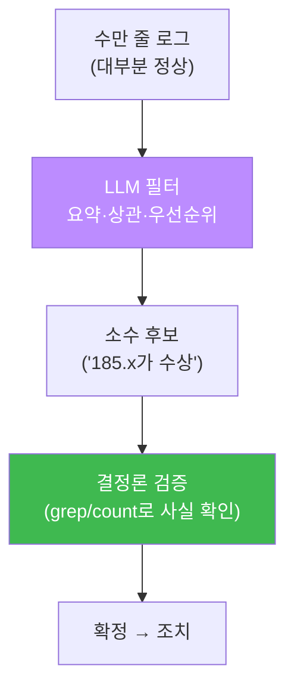
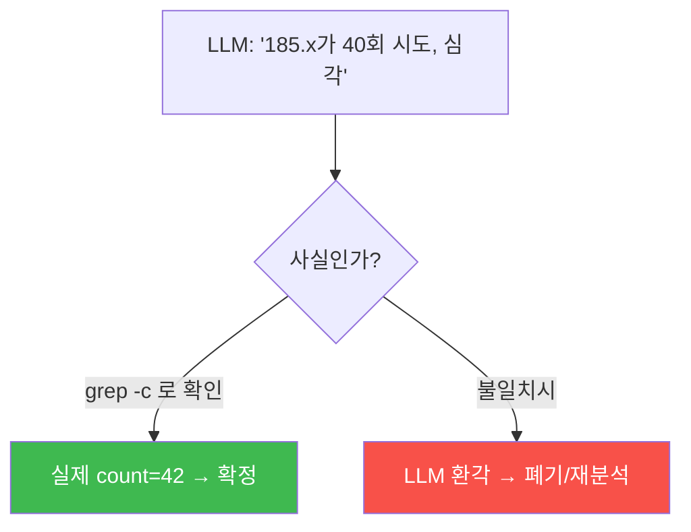
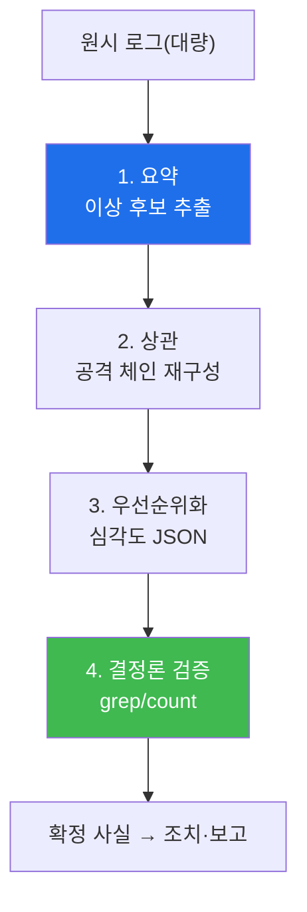

# ai-security W04 — LLM 기반 로그 분석: 요약·상관·우선순위화·결정론 검증

> **본 주차의 한 줄 요약**
>
> W03의 프롬프트 기법을 **로그 분석 실무**에 본격 적용한다. 보안 장비(FW·IPS·WAF·Wazuh)는 하루에 수만~수십만
> 줄의 로그를 쏟아낸다. 사람이 다 읽을 수 없다. LLM에게 시키면 ① 대량 로그에서 **이상 징후를 요약**하고,
> ② 흩어진 이벤트를 **상관**(같은 IP가 브루트포스→성공→SQLi로 이어진 체인)시키고, ③ **우선순위**를 매긴다.
> 그러나 이번 주의 진짜 교훈은 마지막에 있다: **LLM의 분석은 반드시 결정론 규칙으로 검증한다.** LLM이 "이 IP가
> 수상하다"고 하면, `grep`으로 실제 그 IP가 몇 번 나왔는지 세어 **사실을 확인**한 뒤에 조치한다.
>
> **한 줄 결론**: LLM은 대량 로그를 **좁혀 주는 필터**이지 **최종 판정관**이 아니다. LLM으로 후보를 좁히고,
> 결정론 규칙으로 확정한다 — 이 2단 구조가 신뢰할 수 있는 AI 로그 분석의 핵심이다.

---

## 학습 목표

본 주차 종료 시 학생은 다음 5가지를 **본인 손으로** 할 수 있어야 한다.

1. LLM으로 대량 로그에서 **이상 징후를 요약**한다(SUMMARIZED).
2. 흩어진 이벤트를 **상관**해 공격 체인을 재구성한다(CORRELATED).
3. 이벤트를 **심각도로 우선순위화**해 구조화 출력한다(PRIORITIZED).
4. LLM의 판단을 **결정론 규칙(grep/count)으로 검증**한다(VERIFIED).
5. "LLM 필터 + 결정론 확정" 2단 구조가 왜 필요한지 설명한다.

> **이 주차의 시선** — "LLM으로 좁히고 규칙으로 확정한다." 편리함(LLM)과 정확성(규칙)을 결합하는 실무 감각을 기른다.

---

## 0. 용어 해설 (LLM 로그 분석)

| 용어 | 영문 | 뜻 | 비유 |
|------|------|----|------|
| **로그 요약** | Log Summarization | 대량 로그의 핵심·이상을 압축 | 요약 브리핑 |
| **이벤트 상관** | Correlation | 흩어진 이벤트를 하나의 사건으로 연결 | 점 잇기 |
| **공격 체인** | Attack Chain | 정찰→침투→성공으로 이어진 흐름 | 킬체인 |
| **우선순위화** | Prioritization | 심각도·긴급도로 순서 매김 | 분류 상자 |
| **결정론 검증** | Deterministic Verification | 규칙(grep/count)으로 사실 확인 | 팩트체크 |
| **오탐/미탐** | FP/FN | 잘못 경보/놓침 | 헛경보/놓친 침입 |

> **헷갈리기 쉬운 한 쌍** — *요약* 은 "무엇이 있었나"(압축), *상관* 은 "그것들이 어떻게 이어지나"(연결)다.
> 요약이 개별 이상을 보여 주면, 상관이 그것을 하나의 공격 스토리로 엮는다.

---

## 0.5 핵심 개념

### 0.5.1 왜 LLM으로 로그를 분석하나 — 규모의 문제

방화벽·IPS·WAF·Wazuh는 초당 수십~수백 이벤트를 만든다. 대부분은 정상 노이즈이고, 진짜 위협은 그 속에 **소수**로
숨어 있다. 사람이 다 읽는 것은 불가능하다. LLM은 이 대량 텍스트를 빠르게 훑어 **"여기 이상해 보이는 것들"** 로
좁혀 준다.

### 0.5.2 상관 — 흩어진 점을 공격 스토리로

한 줄씩 보면 놓치는 것이, 이어 보면 드러난다. 예: "185.x가 root로 40번 로그인 실패" + "185.x가 root로 성공" +
"185.x가 SQLi 요청" → 이 셋을 **상관**하면 "브루트포스로 뚫고 웹 공격까지 이어진 침해"라는 스토리가 나온다.
LLM은 여러 줄을 함께 보며 이런 연결을 잘 만든다.

### 0.5.3 왜 검증이 필수인가 — LLM은 틀린다

LLM은 환각한다: 없는 IP를 지어내거나, 횟수를 틀리게 셀 수 있다. 그래서 LLM이 "185.x가 40번 시도"라고 하면,
그대로 믿지 말고 **`grep -c 185.x` 로 실제 횟수를 센다**. LLM은 **후보를 좁히는 데** 쓰고, **사실 확정은
결정론 규칙**이 한다. 이번 주 실습에서 LLM이 지목한 IP를 실제 로그에서 카운트해 검증한다.

### 0.5.4 우리가 만들 대상 — bastion의 로그 분석 + Assessor 검증

bastion의 Manager Agent는 사건 조사에서 로그를 LLM으로 분석하되, 그 판단을 **el34 Assessor(결정론 체크:
file/log/port/process/wazuh_alert)** 와 **대조**해 확정한다. 즉 "LLM 필터 + 결정론 검증"의 2단 구조가 bastion
설계에 그대로 들어 있다. Manager는 harness에 "분석 후 반드시 Assessor로 검증" 단계를 넣고, 검증된 사실만 E.G에
축적한다. 이번 주 실습이 그 2단 구조의 축소판이다.

---

## 1. LLM 로그 분석 워크플로우

각 단계는 W03의 프롬프트 기법을 쓴다(역할·형식·CoT). 마지막 검증 단계가 신뢰성을 만든다.

---

## 2. 실습 안내 (5 미션)

실행 위치 el34 **호스트**(`ssh ccc@{{TARGET_IP}}`), GPU `http://211.170.162.139:10934`.
(로그는 재현 가능한 샘플을 쓴다. **el34 실 로그 확장**: `el34-siem` 의 Wazuh `alerts.json`, `el34-web` 의
접근/audit 로그를 같은 방식으로 분석할 수 있다.)

### STEP 1 — GPU 헬스체크 → GEN_OK
### STEP 2 — 대량 로그 요약 → SUMMARIZED
- **왜/무엇을:** 혼합 로그에서 이상 징후를 요약하고 수상한 IP를 지목.
- **해석:** 대량 노이즈 속 소수 위협을 좁힌다.

### STEP 3 — 이벤트 상관 → CORRELATED
- **왜?** 흩어진 점을 공격 스토리로.
- **무엇을?** 브루트포스→성공→SQLi로 이어진 **단일 IP**를 LLM이 상관해 찾는다.
- **해석:** 한 줄씩 보면 놓칠 체인을 재구성.

### STEP 4 — 우선순위화(구조화) → PRIORITIZED
- **왜?** 조치 순서를 정한다.
- **무엇을?** 이벤트들을 심각도로 순위 매겨 JSON으로 출력.
- **해석:** 구조화 출력이 자동 티켓팅·에스컬레이션의 입력.

### STEP 5 — 결정론 검증 → VERIFIED
- **왜?** LLM은 틀린다. 사실을 규칙으로 확정.
- **무엇을?** LLM이 지목한 IP를 실제 로그에서 카운트(grep/count)해 임계 이상인지 확인.
- **해석:** LLM 후보를 결정론으로 확정 → 신뢰. 불일치면 환각으로 폐기.

---

## 3. 흔한 오해·블루팀 노트

- **"LLM이 40번이라 했으니 40번"** — LLM은 수를 틀린다. `grep -c` 로 실제로 센다.
- **"요약만 하면 끝"** — 상관·우선순위·검증까지 가야 조치로 이어진다.
- **"긴 로그 통째로"** — 컨텍스트 한계. 청크·전처리(핵심 필드 추출) 후 분석.
- **관제 관점** — bastion은 LLM 로그 분석을 Assessor 결정론 체크와 **반드시 대조**하고, 검증된 사실만 조치·
  E.G 축적에 쓴다. "LLM 필터 + 결정론 확정"이 자율 관제의 신뢰 기반이다.

---

## 4. 다음 주차 (W05) 예고 — 탐지 룰 자동 생성

W04가 "로그를 분석"했다면, W05는 그 분석에서 배운 패턴으로 **탐지 룰(Sigma·Suricata)을 LLM으로 자동 생성**한다.
분석(사후)에서 탐지(사전)로 나아가며, 생성된 룰을 실제 로그에 돌려 오탐/미탐을 검증하는 법을 배운다.
