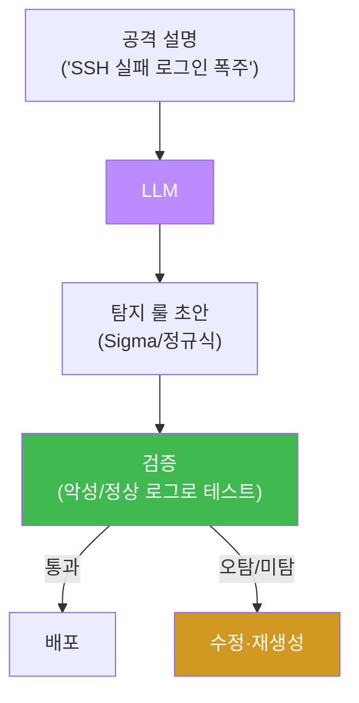
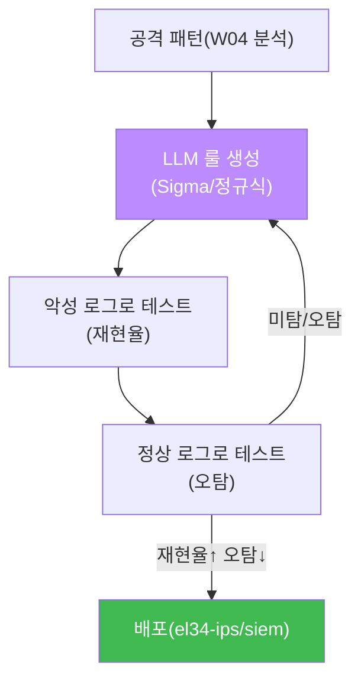

# ai-security W05 — 탐지 룰 자동 생성: Sigma·Wazuh·LLM 생성·룰 품질 검증

> **본 주차의 한 줄 요약**
>
> W04가 "이미 일어난 공격을 분석(사후)"했다면, W05는 그 분석에서 배운 패턴으로 **다음 공격을 잡는 탐지 룰을
> 미리 만든다(사전)**. 탐지 룰(Sigma·Wazuh·Suricata)은 "이런 로그가 보이면 경보하라"는 규칙이다. LLM에게
> 공격 설명을 주면 그 룰을 **자동으로 초안**해 준다 — 사람이 룰 문법을 외우지 않아도 된다. 그러나 이번 주의
> 핵심은 역시 **검증**이다. LLM이 만든 룰을 실제 악성 로그와 정상 로그에 돌려 **악성은 잡고(재현율) 정상은
> 안 잡는지(오탐)** 확인한 뒤에야 배포한다. 검증 없는 자동 생성 룰은 오탐 폭탄이 되어 방어를 무력화한다.
>
> **한 줄 결론**: LLM은 탐지 룰의 **초안 작성기**다. 초안은 빠르게 얻되, **악성/정상 로그로 반드시 검증**한
> 뒤 배포한다. "생성 → 검증 → 배포"의 파이프라인이 신뢰할 수 있는 자동 룰 생성이다.

---

## 학습 목표

본 주차 종료 시 학생은 다음 5가지를 **본인 손으로** 할 수 있어야 한다.

1. **Sigma / Wazuh** 탐지 룰의 기본 구조(detection·condition)를 설명한다.
2. LLM으로 공격 패턴에서 **Sigma 룰을 자동 생성**한다(SIGMA_OK).
3. LLM으로 **탐지 정규식**을 생성하고, 악성/정상 로그로 **검증**한다(RULE_TESTED).
4. 룰의 **오탐(FP)** 을 정상 로그 세트로 점검한다(QUALITY_OK).
5. "생성→검증→배포" 파이프라인이 왜 필요한지(검증 없는 룰의 위험) 설명한다.

> **이 주차의 시선** — "빠른 초안(LLM) + 엄격한 검증(로그)". 자동 생성의 편리함과 배포의 안전을 양립시킨다.

---

## 0. 용어 해설 (탐지 룰)

| 용어 | 영문 | 뜻 | 비유 |
|------|------|----|------|
| **Sigma** | Sigma | 벤더 중립 탐지 룰 표준(YAML) | 탐지 룰 에스페란토 |
| **Wazuh 룰** | Wazuh Rule | Wazuh SIEM의 탐지 규칙(XML) | el34 SIEM 룰 |
| **Suricata 룰** | Suricata Rule | 네트워크 IDS 탐지 룰 | 네트워크 감시 룰 |
| **detection** | detection | "무엇을 찾을지"(패턴) | 수배 전단 |
| **condition** | condition | "언제 경보할지"(조건) | 발동 조건 |
| **재현율** | Recall | 실제 공격 중 잡은 비율 | 놓침 적음 |
| **오탐** | False Positive | 정상을 공격으로 오경보 | 헛경보 |

> **헷갈리기 쉬운 한 쌍** — *detection* 은 "**무엇을** 찾나"(예: 실패 로그인 이벤트), *condition* 은 "**언제**
> 경보하나"(예: 5분에 10회 이상). 둘이 합쳐져야 완전한 룰이 된다.

---

## 0.5 신입생 친화 핵심 개념

### 0.5.1 탐지 룰이란 — "이게 보이면 경보하라"

탐지 룰은 로그·트래픽에서 **특정 패턴이 나타나면 경보**하는 규칙이다. 예: "동일 IP에서 5분간 실패 로그인 10회
이상 → 브루트포스 경보". Sigma는 이런 룰을 벤더 중립 YAML로 쓰고, 이를 Wazuh·Splunk 등 각 SIEM 문법으로
변환한다.

```yaml
# Sigma 예(개념)
detection:
  selection:
    event: "failed login"
  condition: selection | count() by ip > 10
```

### 0.5.2 왜 LLM으로 생성하나 — 문법 장벽을 낮춘다

Sigma·Wazuh·Suricata는 각각 문법이 다르고 외우기 번거롭다. LLM에게 "SSH 브루트포스 탐지 Sigma 룰 써 줘"라고
하면 **초안**을 즉시 만들어 준다. 분석가는 룰 문법이 아니라 **탐지 논리**에 집중할 수 있다.



### 0.5.3 검증이 없으면 룰은 재앙이 된다

LLM이 만든 룰은 틀릴 수 있다: 너무 넓으면(정상까지 잡음) **오탐 폭탄**, 너무 좁으면(공격을 놓침) **미탐**.
그래서 룰을 배포하기 전에 **① 실제 악성 로그에 돌려 잡는지(재현율), ② 정상 로그에 돌려 안 잡는지(오탐)** 를
반드시 확인한다. 오탐이 많은 룰은 분석가를 지치게 해 결국 **경보를 무시**하게 만든다 — 방어의 자살골이다.

### 0.5.4 우리가 만들 대상 — bastion의 룰 생성·검증 자동화

bastion의 Manager Agent는 새 공격을 관측하면 **harness**에 "탐지 룰 생성 → 검증 → (통과 시) el34-siem/ips에
배포"의 절차를 구성하고, **E.G(경험·지식)** 의 기존 룰·패턴을 참조해 초안 품질을 높인다. 검증(악성/정상 로그
대조)은 결정론 단계로, LLM이 만든 룰을 **자동으로 시험**한 뒤에만 배포한다. 이번 주 실습이 그 "생성+검증"
루프의 축소판이다.

---

## 1. 룰 생성 파이프라인



---

## 2. 실습 안내 (5 미션)

실행 위치 el34 **호스트**(`ssh ccc@{{TARGET_IP}}`), GPU `http://211.170.162.139:10934`.

### STEP 1 — GPU 헬스체크 → GEN_OK
### STEP 2 — Sigma 룰 자동 생성 → SIGMA_OK
- **왜/무엇을:** LLM에게 SSH 브루트포스 Sigma 룰을 생성시킨다(detection·condition 포함).
- **해석:** 문법 장벽 없이 탐지 논리에 집중.

### STEP 3 — 탐지 정규식 생성 + 검증 → RULE_TESTED
- **왜?** 룰은 반드시 검증.
- **무엇을?** LLM으로 SQLi 탐지 정규식을 생성하고, 악성 로그엔 매치·정상엔 미매치인지 확인.
- **해석:** 재현율(악성 잡음)과 정밀도(정상 안 잡음)를 동시에 확인.

### STEP 4 — 오탐 품질 점검 → QUALITY_OK
- **왜?** 오탐 폭탄 방지.
- **무엇을?** 생성한 룰을 정상 로그 세트에 돌려 오탐 0인지 확인.
- **해석:** 오탐이 있으면 룰이 너무 넓음 → 좁혀 재생성.

### STEP 5 — 종합(파이프라인 요약) → Assessment
- 생성·검증·오탐 점검을 묶어 룰 배포 가부·권고(Assessment).

---

## 3. 흔한 오해·블루팀 노트

- **"LLM이 만든 룰이니 바로 배포"** — 검증 없이 배포하면 오탐 폭탄·미탐 구멍. 반드시 악성/정상 로그로 시험.
- **"넓게 잡을수록 안전"** — 오탐이 폭증해 분석가가 경보를 무시하게 된다. 정밀도도 챙긴다.
- **"룰 문법을 다 외워야"** — LLM이 초안을 만든다. 분석가는 논리·검증에 집중.
- **관제 관점** — bastion은 룰을 LLM으로 생성하되, 배포 전 악성/정상 로그로 **자동 검증**하고, 검증 통과 룰만
  el34-ips/siem에 반영하며 결과를 E.G에 축적한다.

---

## 4. 다음 주차 (W06) 예고 — 취약점 분석

W05가 "탐지 룰"이었다면, W06은 **코드·설정의 취약점을 LLM으로 분석**한다. 소스 코드에서 SQLi·XSS·하드코딩
비밀을 찾고 수정안을 받되, LLM의 발견을 실제 확인(정적 규칙·PoC)으로 검증하는 법을 배운다. AI 코드 리뷰의
가능성과 한계를 함께 본다.
