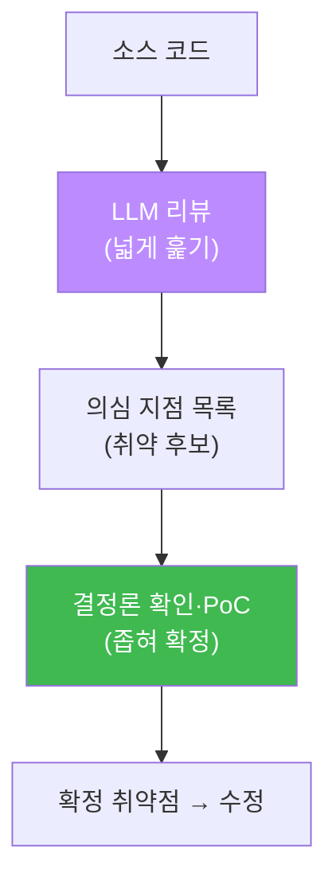
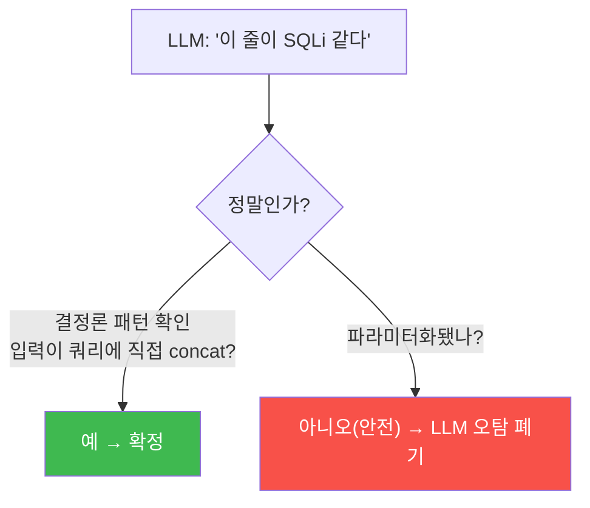

# ai-security W06 — 취약점 분석: LLM 코드 리뷰·CVE 영향 평가·오탐 한계·결정론 검증

> **본 주차의 한 줄 요약**
>
> LLM은 코드를 읽고 **취약점을 찾아** 줄 수 있다. 소스에서 SQL Injection·XSS·하드코딩 비밀을 지적하고 수정안을
> 제시한다. CVE 설명을 주면 영향과 완화책도 요약한다. 그러나 이번 주의 가장 중요한 교훈은 **한계**다: LLM은
> 안전한 코드(파라미터화 쿼리)를 **취약하다고 오탐**하기도 하고, 없는 취약점을 지어내기도 한다. 그래서 LLM의
> 코드 리뷰는 **초안**일 뿐, 실제 취약 여부는 **결정론 규칙(패턴 확인)·PoC**로 검증해야 한다. 이번 주 실습에서
> 우리는 LLM이 취약 코드를 정확히 잡는 것과, **안전한 코드를 잘못 취약하다고 하는 것**을 둘 다 눈으로 확인한다.
>
> **한 줄 결론**: LLM 코드 리뷰는 "의심 지점을 빠르게 넓게 훑는" 데 강하지만, **확정은 못 한다**. 넓게
> 훑고(LLM) 좁혀 확인(결정론·사람)하는 2단 구조가 안전한 AI 코드 감사다.

---

## 학습 목표

본 주차 종료 시 학생은 다음 5가지를 **본인 손으로** 할 수 있어야 한다.

1. LLM으로 소스 코드의 취약점(SQLi·XSS·하드코딩 비밀)을 찾고 수정안을 받는다(VULN_FOUND).
2. LLM의 발견을 **결정론 패턴 확인**으로 검증한다(VERIFIED).
3. **CVE 정보**를 LLM으로 분석해 영향·완화를 요약한다(CVE_ANALYZED).
4. LLM이 **안전한 코드를 오탐**하는 한계를 실측하고, 결정론 검증이 왜 필요한지 설명한다(DET_SAFE).
5. AI 코드 감사의 "넓게 훑기(LLM) + 좁혀 확인(규칙)" 2단 구조를 설명한다.

> **이 주차의 시선** — LLM의 강점(넓은 훑기)과 약점(오탐·환각)을 둘 다 직접 보고, 검증의 필요성을 체득한다.

---

## 0. 용어 해설 (취약점 분석)

| 용어 | 영문 | 뜻 | 비유 |
|------|------|----|------|
| **코드 리뷰** | Code Review | 소스에서 결함·취약점 검토 | 원고 교정 |
| **SAST** | Static Application Security Testing | 실행 없이 코드 분석 | 설계도 점검 |
| **CVE** | Common Vulnerabilities and Exposures | 공개 취약점 식별자 | 취약점 주민번호 |
| **파라미터화 쿼리** | Parameterized Query | `?` 자리표시자로 입력 분리(SQLi 방어) | 서식 빈칸 |
| **오탐** | False Positive | 안전한 것을 취약하다고 지적 | 헛경보 |
| **PoC** | Proof of Concept | 취약점을 실제로 재현하는 증명 | 실물 증거 |

> **헷갈리기 쉬운 한 쌍** — *취약 코드* 는 사용자 입력을 쿼리에 **직접 이어 붙임**(`"...".$_GET[...]`),
> *안전 코드* 는 **파라미터화**(`prepare("...?"); execute([$input])`)로 입력을 분리한다. LLM은 이 둘을 헷갈릴
> 수 있어(오탐), 결정론 확인이 필요하다.

---

## 0.5 핵심 개념

### 0.5.1 LLM 코드 리뷰의 강점 — 빠르고 넓게

LLM은 코드를 읽고 "여기 사용자 입력이 쿼리에 그대로 들어가네요 → SQL Injection"처럼 **의심 지점을 빠르게**
짚는다. 여러 언어·패턴을 두루 알아 넓게 훑는다. 수백 파일의 1차 스크리닝에 유용하다.

### 0.5.2 LLM 코드 리뷰의 한계 — 오탐과 환각

그러나 LLM은 **틀린다**. 이번 주 실습에서 우리는 **안전한 파라미터화 쿼리**를 LLM에게 주는데, LLM이 그것을
**"취약하다"고 오탐**하는 것을 본다(실측). LLM은 표면 패턴("$_GET이 보인다")에 반응해, 그 입력이 실제로
안전하게 분리됐는지는 놓치기도 한다. 반대로 없는 취약점을 지어내기도(환각) 한다. 그래서:

- **오탐** — 안전한 코드를 취약하다고 함 → 개발자 시간 낭비, 신뢰 하락.
- **환각** — 없는 CVE·취약점을 지어냄 → 잘못된 조치.

결론: **LLM의 지적은 "확인해 볼 후보"이지 "확정된 취약점"이 아니다.**

### 0.5.3 2단 구조 — 넓게 훑고(LLM) 좁혀 확인(결정론)

이번 주는 취약 코드에서 LLM 지적을 결정론으로 **확정**하고(VERIFIED), 안전 코드에서 LLM 오탐을 결정론으로
**기각**한다(DET_SAFE). 두 경우 모두 결정론이 최종 판정관이다.

### 0.5.4 우리가 만들 대상 — bastion의 취약점 분석 + PoC 검증

bastion이 코드·설정을 감사할 때, Manager는 LLM으로 넓게 훑어 후보를 뽑되, **harness**에 "각 후보를 결정론
규칙 또는 실제 PoC(el34-attacker에서 시도)로 확인" 단계를 넣는다. 확인된 취약점만 보고·조치하고 E.G에 축적한다.
LLM의 오탐·환각을 이 검증 단계가 걸러 낸다. 즉 이번 주 "LLM + 결정론 검증"이 bastion 감사의 신뢰 장치다.

---

## 1. 실습 안내 (5 미션)

실행 위치 el34 **호스트**(`ssh ccc@{{TARGET_IP}}`), GPU `http://211.170.162.139:10934`.

### STEP 1 — GPU 헬스체크 → GEN_OK
### STEP 2 — LLM 코드 리뷰(취약 코드) → VULN_FOUND
- **왜/무엇을:** 사용자 입력을 쿼리에 직접 이어 붙인 PHP를 LLM에 주고 취약점·수정안을 JSON으로 받는다.
- **해석:** LLM이 SQL Injection을 정확히 지적(넓게 훑기의 강점).

### STEP 3 — 결정론 검증 → VERIFIED
- **왜?** LLM 지적을 확정.
- **무엇을?** 코드에 "미검증 입력이 쿼리에 직접 들어가는 패턴"이 있는지 결정론적으로 확인.
- **해석:** 패턴이 있으면 진짜 취약 → 확정.

### STEP 4 — 한계 실측(안전 코드 오탐) → DET_SAFE
- **왜?** LLM의 오탐 한계를 본다.
- **무엇을?** 안전한 파라미터화 쿼리를 LLM에 주면 LLM은 취약하다고 오탐할 수 있다. 결정론으로 그 코드가 실제로
  안전함(prepare+파라미터)을 확인.
- **해석:** LLM 오탐을 결정론이 기각 → 결정론이 최종 판정관.

### STEP 5 — CVE 분석 → CVE_ANALYZED
- **왜?** 공개 취약점의 영향 이해.
- **무엇을?** LLM에게 Log4Shell(CVE-2021-44228)의 영향·완화를 요약시킨다.
- **해석:** CVE 설명·완화 브리핑에 유용(단 세부 사실은 공식 소스로 재확인).

---

## 2. 흔한 오해·블루팀 노트

- **"LLM이 취약하다 했으니 취약"** — 안전 코드도 오탐한다(실측). 결정론·PoC로 확정.
- **"LLM이 안전하다 했으니 안전"** — 미탐도 있다. LLM 단독으로 "안전 확정"은 위험. 결정론 확인 병행.
- **"CVE 세부를 LLM 답 그대로 인용"** — 버전·CVSS는 틀릴 수 있다. NVD 공식으로 재확인.
- **관제 관점** — bastion은 LLM 감사 결과를 결정론 규칙·PoC로 검증한 뒤에만 취약점으로 확정·조치한다. LLM은
  후보를 넓게 뽑는 스크리너, 확정은 검증 단계가 한다.

---

## 3. 다음 주차 (W07) 예고 — AI 에이전트 아키텍처

W01~W06이 "LLM을 도구로 쓰기"였다면, W07은 그 도구들을 **자율로 엮는 에이전트**의 구조를 배운다. LLM(두뇌)+
도구(손발)+메모리(경험)로 이뤄진 에이전트가 어떻게 계획·실행·검증하는지, 그리고 이것이 el34의 **bastion**으로
어떻게 구현되는지(Manager harness engineering + E.G)를 본다. W08 중간고사 전, 에이전트의 큰 그림을 잡는 주다.
