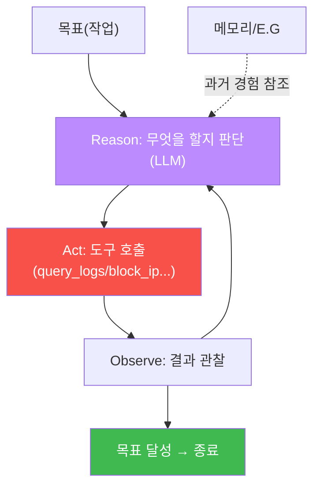
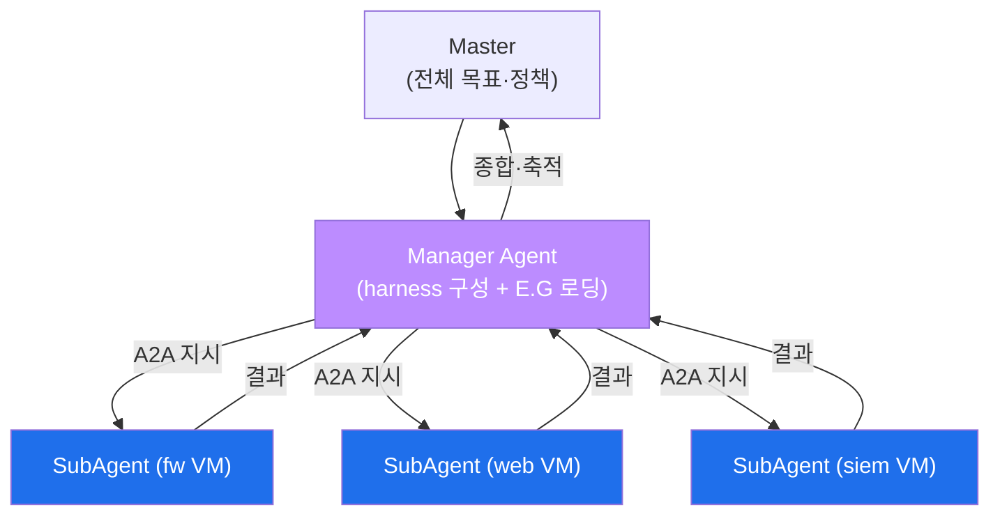

# ai-security W07 — AI 에이전트 아키텍처: LLM+도구+메모리·Manager/SubAgent·A2A·bastion

> **본 주차의 한 줄 요약**
>
> W01~W06은 "LLM을 하나의 도구로 부르기"였다. W07은 그 도구를 **자율로 엮는 에이전트(Agent)** 의 구조를
> 배운다. 에이전트는 **LLM(두뇌) + 도구(손발) + 메모리(경험)** 로 이뤄져, "생각→행동→관찰→다시 생각"의
> 루프(ReAct)를 돌며 스스로 일한다. el34의 자율보안 에이전트 **bastion**은 이 구조의 실물이다: **Manager
> Agent**가 작업을 받아 **harness engineering**(일하는 방식을 즉석 구성)을 하고 **E.G(경험·지식)** 를 불러온 뒤,
> **SubAgent**에게 **A2A(Agent-to-Agent)** 로 지시해 각 VM에서 실행시킨다. 이번 주는 미니 에이전트를 만들어
> "도구 결정→관찰→다음 행동"을 손으로 돌려 보고, 그 원리가 bastion으로 어떻게 확장되는지 이해한다.
>
> **한 줄 결론**: 에이전트는 "LLM에게 **도구와 판단 권한**을 준 것"이다. 강력한 만큼, **무엇을 시킬지(harness)와
> 무엇을 알고 시킬지(E.G)** 를 잘 설계해야 하고, 위험 행동엔 사람 승인을 둔다. W08 중간고사 전, 이 큰 그림을 잡는다.

---

## 학습 목표

본 주차 종료 시 학생은 다음 5가지를 **본인 손으로** 할 수 있어야 한다.

1. 에이전트의 3요소(**LLM·도구·메모리**)와 ReAct 루프를 설명한다.
2. 미니 에이전트가 작업에 맞는 **도구를 결정**하게 만든다(TOOL_DECIDED).
3. **ReAct 루프**(관찰 결과로 다음 행동 결정)를 실행한다(REACT_OK).
4. **Master–Manager–SubAgent** 계층과 **A2A** 통신, bastion의 harness+E.G를 설명한다(DELEGATED).
5. 에이전트의 위험(과도한 자율)과 통제(승인 게이트·검증)를 설명한다.

> **이 주차의 시선** — 지금까지의 조각(프롬프트·로그분석·룰생성·취약점분석)이 하나의 자율 시스템으로 합쳐지는
> 큰 그림을 본다.

---

## 0. 용어 해설 (에이전트)

| 용어 | 영문 | 뜻 | 비유 |
|------|------|----|------|
| **에이전트** | Agent | LLM이 도구를 호출해 자율로 일하는 시스템 | 손발 달린 두뇌 |
| **도구** | Tool | 에이전트가 호출하는 함수(쿼리·차단·실행) | 연장 |
| **메모리** | Memory | 과거 대화·경험 저장 | 수첩 |
| **ReAct** | Reason+Act | 생각→행동→관찰 반복 | 시행착오 |
| **Manager Agent** | Manager | 작업을 받아 계획·조율하는 상위 에이전트 | 현장 반장 |
| **SubAgent** | SubAgent | 실제 실행을 맡는 하위 에이전트 | 작업자 |
| **A2A** | Agent-to-Agent | 에이전트 간 통신 프로토콜 | 무전기 |
| **harness** | harness | Manager가 짜는 "일하는 방식" 골격 | 작업 지시서 |
| **E.G** | Experience & Knowledge | 경험(Experience DB)+지식(KG) | 업무 매뉴얼+경험록 |

> **헷갈리기 쉬운 한 쌍** — *Manager* 는 "**무엇을 어떻게** 할지 계획·조율"(머리), *SubAgent* 는 "**실제 실행**"
> (손발)이다. Manager가 harness로 절차를 짜서 A2A로 SubAgent에게 내려 주고, SubAgent가 VM에서 명령을 돌린다.

---

## 0.5 신입생 친화 핵심 개념

### 0.5.1 에이전트 = LLM + 도구 + 메모리 + 루프

챗봇은 말만 한다. 에이전트는 **도구를 호출해 행동**하고, **관찰 결과로 다음을 판단**한다.

이번 주 실습에서 미니 에이전트는 "수상한 IP 조사"라는 목표에, 먼저 `query_logs`/`check_reputation`으로
**조사(Reason→Act)** 하고, "MALICIOUS(botnet)"라는 **관찰(Observe)** 후 `block_ip`를 **결정**한다. 이 루프가
에이전트의 심장이다.

### 0.5.2 계층 구조 — Master · Manager · SubAgent

혼자 다 하기엔 복잡한 작업은 **계층**으로 나눈다.

- **Master** — 전체 목표·정책의 최상위(예: "이 사건을 조사·대응하라").
- **Manager Agent** — 목표를 받아 **harness engineering**(어떤 도구를 어떤 순서로, 위험 단계는 승인, 실패 시
  재시도)을 하고 **E.G**(개념·정책·플레이북·자산 지식 + 과거 경험)를 컨텍스트로 불러온다. 큰 모델(gpt-oss:120b).
- **SubAgent** — Manager의 지시를 받아 **각 VM에서 실제 shell을 실행**한다. 작은 모델(gemma3:4b). Manager와는
  **A2A** 로 통신한다.

### 0.5.3 harness와 E.G — bastion을 강하게 만드는 두 축

- **harness(어떻게 일할지)** — Manager가 작업마다 **즉석에서 구성**하는 절차의 골격. 사람이 매번 짜 주는 게
  아니라 Manager가 **자동으로**(harness engineering) 짠다. "도구 순서·승인 지점·재시도·검증"이 여기 담긴다.
- **E.G(무엇을 알고 일할지)** — Manager가 시작 전 불러오는 **지식(KG)+경험(Experience DB)**. bastion은 백지가
  아니라 "이런 사건은 예전에 이렇게 처리했고 규칙은 이렇다"를 **알고** 시작한다. 결과는 다시 E.G에 축적된다.

즉 bastion은 **harness(방식) + E.G(지식·경험)** 가 모두 갖춰진 상태에서 자율로 움직인다. 이것이 단순 LLM
호출과 결정적으로 다른 점이다.

### 0.5.4 에이전트의 위험과 통제

에이전트는 **행동**하므로, 잘못되면 실제 피해(방화벽 오조작·차단 실수)가 난다. 그래서:
- **최소 권한** — 필요한 도구만.
- **승인 게이트** — 위험 행동(차단·삭제)은 사람 승인.
- **검증** — LLM 판단을 결정론(Assessor)으로 확인(W04·W06).
- **모니터링** — 도구 호출 시퀀스를 로깅·감시.

(이 통제들은 ai-safety 트랙에서 공격 관점으로 깊이 다룬다. 이 과목은 **만드는** 관점에서 왜 필요한지를 본다.)

---

## 1. 실습 안내 (5 미션)

실행 위치 el34 **호스트**(`ssh ccc@{{TARGET_IP}}`), GPU `http://211.170.162.139:10934`.

### STEP 1 — GPU 헬스체크 → GEN_OK
### STEP 2 — 도구 결정 → TOOL_DECIDED
- **왜/무엇을:** 조사 도구(query_logs/check_reputation/block_ip)를 준 에이전트가 "수상 IP 조사" 작업에 **조사
  도구를 먼저** 선택.
- **해석:** 성급히 차단하지 않고 조사부터 — 합리적 판단.

### STEP 3 — ReAct 루프 → REACT_OK
- **왜?** 관찰로 다음 행동 결정.
- **무엇을?** "check_reputation 결과 = MALICIOUS(botnet)" 관찰을 주고 다음 행동을 결정 → block_ip.
- **해석:** 생각→행동→관찰→행동의 루프가 도는 것을 확인.

### STEP 4 — 계층 위임(A2A) → DELEGATED
- **왜?** 복잡 작업의 분업.
- **무엇을?** Manager가 작업을 유형별 SubAgent(fw/web/siem)에게 위임하는 라우팅을 결정론으로 시뮬레이션.
- **해석:** Manager(계획)+SubAgent(실행)의 A2A 분업 구조.

### STEP 5 — 종합(에이전트 통제) → Assessment
- 도구·ReAct·위임·통제를 묶어 에이전트 설계 권고(Assessment).

---

## 2. 흔한 오해·관제자 노트

- **"에이전트는 LLM에 도구만 붙이면 끝"** — harness(절차)·E.G(지식·경험)·통제(승인·검증)가 있어야 신뢰 가능.
- **"똑똑하니 알아서 안전"** — 행동하는 만큼 위험도 크다. 승인 게이트·검증이 필수.
- **"큰 모델 하나로 다 하자"** — 느리고 비싸다. Manager(큰)+SubAgent(작은) 분업이 효율적.
- **관제 관점** — bastion은 Manager가 harness를 짜고 E.G를 불러와 SubAgent가 실행하되, 위험 행동은 승인 게이트,
  판단은 Assessor 검증을 거친다. 이 구조 이해가 이후 W09~W14(bastion 심화)의 토대다.

---

## 3. 다음 주차 (W08) 예고 — 중간고사: LLM 보안 도구 구축

W01~W07을 종합해, LLM으로 **작동하는 보안 도구**(로그 분석기·룰 생성기·트리아지 봇 중 하나)를 처음부터 구축한다.
프롬프트 설계·구조화 출력·결정론 검증을 결합한 실전 미니 프로젝트다. 이후 W09부터는 bastion 자체를 만들어 간다.
