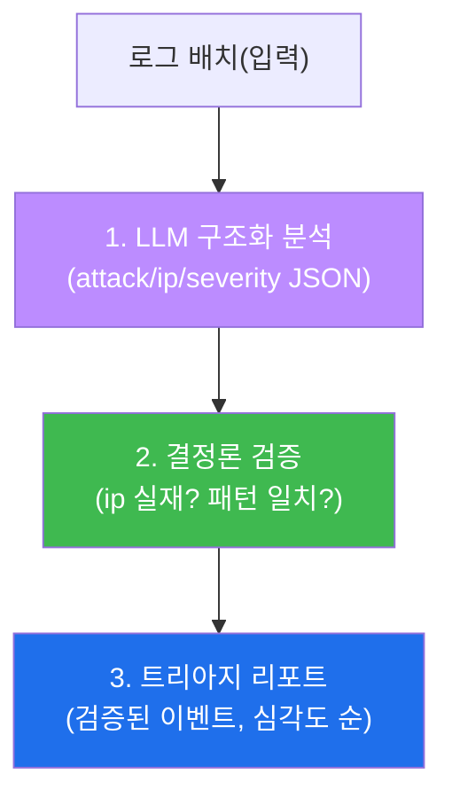

# ai-security W08 — 중간고사: LLM 보안 도구 구축 (트리아지 봇 종합 프로젝트)

> **본 주차의 한 줄 요약**
>
> W01~W07에서 배운 조각들 — LLM 호출(W01·W02), 프롬프트 설계(W03), 로그 분석(W04), 룰 생성(W05), 취약점
> 분석(W06), 에이전트 구조(W07) — 을 하나로 합쳐 **실제로 작동하는 LLM 보안 도구**를 처음부터 만든다. 이번
> 중간고사의 결과물은 **트리아지 봇(Triage Bot)**: 로그 배치를 입력받아 ① LLM으로 각 이벤트를 **구조화(JSON)
> 분석**하고, ② 그 분석을 **결정론 규칙으로 검증**하며, ③ 검증된 이벤트를 **심각도 순 트리아지 리포트**로
> 내놓는 도구다. 지금까지 강조해 온 원칙 — **"LLM으로 넓게 훑고, 결정론으로 좁혀 확정한다"** — 을 코드로
> 구현하는 것이 목표다.
>
> **한 줄 결론**: 좋은 AI 보안 도구는 LLM의 편리함과 결정론의 신뢰를 **결합**한다. LLM 단독은 위험하고 규칙
> 단독은 유연하지 못하다. 둘을 엮는 파이프라인이 이 과목 전반부의 결론이다.

---

## 학습 목표 (중간고사 평가 항목)

본 주차 종료 시 학생은 다음 5가지를 **본인 손으로** 할 수 있어야 한다.

1. 로그를 입력받아 LLM으로 **구조화(JSON) 분석**하는 봇을 만든다(TOOL_BUILT).
2. LLM 분석 결과를 **결정론 규칙으로 검증**하는 단계를 넣는다(VERIFIED).
3. 배치 입력을 처리해 **end-to-end 트리아지 리포트**를 산출한다(E2E_OK).
4. 도구의 **오탐·환각을 검증이 어떻게 걸러내는지** 설명한다.
5. 자신의 도구를 **평가**(정확도·오탐)하고 개선점을 제시한다.

> **이 주차의 시선** — 배운 것을 "돌아가는 것"으로 합친다. 채점은 지식이 아니라 **작동하는 파이프라인**을 본다.

---

## 0. 프로젝트 개요 — 트리아지 봇

세 단계는 각각 지금까지 배운 것이다:
- **분석(A)** — W03 프롬프트 설계 + W02 구조화 출력(JSON).
- **검증(V)** — W04·W06의 결정론 검증(LLM 판단을 사실로 확인).
- **리포트(R)** — W04의 우선순위화.

---

## 1. 구현 요소

### 1.1 구조화 분석 함수
LLM에게 로그를 주고 `{"attack","ip","severity"}` JSON을 받는다(`format=json`, 낮은 temperature).

### 1.2 결정론 검증 함수
LLM이 뽑은 `ip`가 실제 로그 문자열에 있는지 확인한다(환각 IP 배제). 필요하면 공격 패턴(예: `UNION SELECT`)의
실재도 확인한다. **검증 실패 = LLM 환각 → 해당 결과 폐기 또는 재분석.**

### 1.3 트리아지 리포트
검증을 통과한 이벤트만 모아 심각도 순으로 정렬해 출력한다. 이 구조화 리포트가 SOAR·티켓팅의 입력이 된다.

---

## 2. 실습 안내 (중간고사, 5 미션)

실행 위치 el34 **호스트**(`ssh ccc@{{TARGET_IP}}`), GPU `http://211.170.162.139:10934`.

### STEP 1 — GPU 헬스체크 → GEN_OK
### STEP 2 — 구조화 분석 함수 → TOOL_BUILT
- **왜/무엇을:** 단일 로그를 LLM으로 분석해 `{attack,ip,severity}` JSON을 얻는다.
- **해석:** 봇의 핵심 부품 완성.

### STEP 3 — 결정론 검증 → VERIFIED
- **왜?** LLM 환각(없는 IP) 배제.
- **무엇을?** LLM이 뽑은 IP가 실제 로그에 있는지 확인.
- **해석:** 검증 통과만 신뢰.

### STEP 4 — end-to-end 배치 처리 → E2E_OK
- **왜?** 실제 도구는 배치를 처리.
- **무엇을?** 로그 배치를 분석+검증해 트리아지 리포트(JSON 리스트)를 산출.
- **해석:** 파이프라인이 통째로 돈다 — 중간고사 핵심.

### STEP 5 — 도구 평가 → Assessment
- 정확도·오탐·개선점을 정리한 평가 리포트(Assessment).

---

## 3. 평가 기준(루브릭)

| 항목 | 배점 | 확인 |
|------|------|------|
| 구조화 분석(JSON) 동작 | 20 | TOOL_BUILT |
| 결정론 검증 포함 | 30 | VERIFIED |
| end-to-end 배치 처리 | 30 | E2E_OK |
| 자기 평가·개선점 | 20 | Assessment |

**핵심 감점 요인**: 검증 단계가 없이 LLM 출력을 그대로 신뢰하는 도구는 대폭 감점(이 과목의 핵심 원칙 위반).

---

## 4. 다음 주차 (W09) 예고 — Bastion (1) 기본

중간고사로 "LLM 도구"를 만들었다면, 후반부(W09~W14)는 el34의 실물 자율 에이전트 **bastion** 자체를 다룬다.
W09는 bastion의 기본 구조(Manager–SubAgent, harness, E.G)를 실제로 들여다보고, 자연어로 bastion에게 보안
작업을 시켜 그 자율 실행을 관찰한다. 지금까지의 모든 개념이 bastion에서 하나로 합쳐진다.
