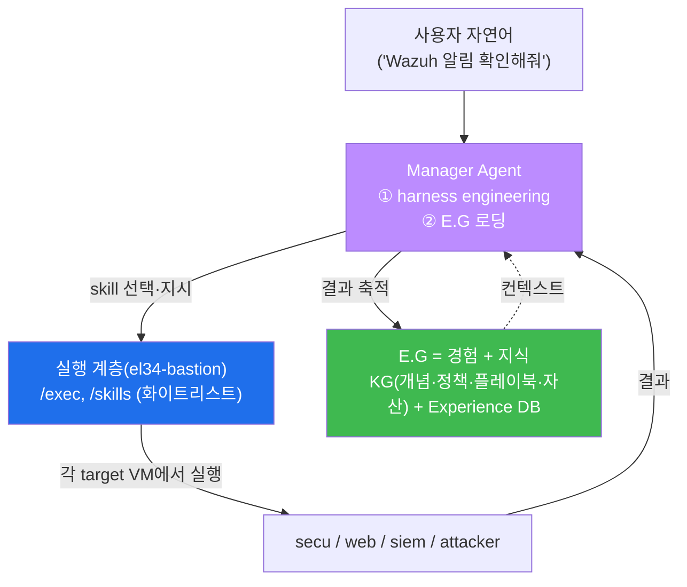
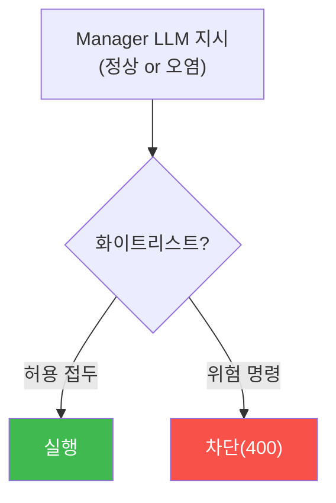

# ai-security W09 — Bastion (1) 기본: 구조·스킬·안전 실행(whitelist)·Manager harness

> **본 주차의 한 줄 요약**
>
> 후반부(W09~W14)는 el34의 실물 자율보안 에이전트 **bastion**을 직접 다룬다. W09는 그 기본 구조를 실제 API로
> 들여다본다. el34-bastion은 **FastAPI 실행 계층**으로, `/health`(상태)·`/skills`(할 수 있는 일 목록)·
> `/exec`(명령 실행)·`/targets`(대상 VM)을 제공하며, `/exec`는 **안전 화이트리스트**(허용된 명령만 실행,
> `rm -rf /` 같은 위험 명령은 차단)로 보호된다. 이 화이트리스트가 바로 ai-safety에서 배운 **allowlist 안전
> 통제**의 실물이다. 그리고 이 실행 계층 위에 **Manager Agent**가 얹혀, 사용자 자연어 요청을 받아 **harness
> engineering**(어떤 skill을 어떤 순서로 쓸지 즉석 구성)을 하고 **E.G(경험·지식)** 를 불러와 SubAgent(실행
> 계층)에게 지시한다. 이번 주는 실물 bastion API를 호출해 상태·스킬·안전 실행을 확인하고, Manager가 작업에 맞는
> skill을 고르는 과정을 GPU로 재현한다.
>
> **한 줄 결론**: bastion = **Manager(계획·harness·E.G) + 실행 계층(스킬·안전 화이트리스트)**. 실행 계층의
> 화이트리스트가 "LLM이 무엇을 시키든 위험 명령은 못 하게" 막는 마지막 안전선이다.

---

## 학습 목표

본 주차 종료 시 학생은 다음 5가지를 **본인 손으로** 할 수 있어야 한다.

1. el34-bastion의 API 구조(`/health`·`/skills`·`/exec`·`/targets`)를 설명한다.
2. bastion `/skills` 로 사용 가능한 스킬(대상 VM 매핑)을 조회한다(BASTION_OK).
3. `/exec` 의 **안전 화이트리스트**로 안전 명령은 실행되고 위험 명령은 차단됨을 확인한다(WHITELIST_OK).
4. **Manager Agent** 가 작업에 맞는 skill을 고르는 **harness** 과정을 재현한다(HARNESS_OK).
5. Manager(계획)+실행 계층(스킬·화이트리스트)+E.G(경험·지식)의 관계를 설명한다.

> **이 주차의 시선** — 개념으로 배운 에이전트(W07)를 el34의 실물 API로 만난다. 안전 화이트리스트가 실제로
> 작동하는 것을 눈으로 본다.

---

## 0. 용어 해설 (Bastion 기본)

| 용어 | 영문 | 뜻 | 비유 |
|------|------|----|------|
| **bastion** | — | el34의 자율보안 에이전트 | 보안 당직자 |
| **실행 계층** | Execution Layer | 실제 명령을 돌리는 API(el34-bastion) | 손발 |
| **skill** | Skill | bastion이 할 수 있는 정해진 작업 | 연장 세트 |
| **target** | Target | 명령을 실행할 대상 VM(secu/web/siem/attacker) | 작업 현장 |
| **화이트리스트** | Whitelist/Allowlist | 허용된 명령만 실행 | 출입 허가 명단 |
| **Manager Agent** | Manager | 계획·harness·E.G를 담당하는 두뇌 | 반장 |
| **harness** | harness | Manager가 짜는 "일하는 방식" | 작업 지시서 |
| **E.G** | Experience & Knowledge | 경험(Experience DB)+지식(KG) | 매뉴얼+경험록 |

> **el34 사실(정확히)** — el34-bastion API: 컨테이너 `el34-bastion`, 포트 `9100`, 헤더 `X-API-Key: ccc-api-key-2026`.
> 라우트 `/health`·`/skills`·`/targets`·`/exec`. `/exec` 화이트리스트 접두: `ping `·`uptime`·`hostname`·`date`·
> `whoami`·`ip a`·`ip route`·`nslookup `·`dig `·`curl http`. (교육용 안전 실행기 — 위험 명령 차단.)

---

## 0.5 신입생 친화 핵심 개념

### 0.5.1 bastion의 두 층 — 계획(Manager)과 실행(실행 계층)

- **실행 계층(el34-bastion)** — "무엇을 할 수 있나(skills)"와 "안전하게 실행(whitelist)"을 담당한다. 이 층은
  LLM이 아니라 **결정론적 안전 게이트**다. LLM이 뭐라 하든 화이트리스트 밖 명령은 실행하지 않는다.
- **Manager Agent** — 사용자 요청을 받아 **어떤 skill을 어떤 순서로** 쓸지 harness를 짜고, E.G에서 관련 지식·
  경험을 불러온다. 큰 모델(gpt-oss:120b)이 담당.

### 0.5.2 화이트리스트 — 마지막 안전선

el34-bastion `/exec`는 허용된 명령 접두만 실행한다. `hostname`·`uptime`·`curl http...`는 되지만 `rm -rf /`는
차단된다. 이것이 왜 중요한가? **Manager LLM이 탈취되거나 실수해 위험 명령을 지시해도, 실행 계층의 화이트리스트가
막는다.** ai-safety-adv에서 배운 "신뢰를 프롬프트가 아니라 권한 모델에 둔다"가 여기 실물로 구현돼 있다.

### 0.5.3 harness engineering — Manager가 스스로 절차를 짠다

사용자가 "Wazuh 알림 확인해줘"라고 하면, Manager는 skills 목록에서 `wazuh.alerts`(target=siem)를 고르고,
"이 skill을 실행 → 결과를 분석 → 이상하면 추가 조사"라는 **절차(harness)** 를 즉석에서 구성한다. 사람이 매번
절차를 짜 주는 게 아니라 Manager가 **자동으로**(harness engineering) 짠다. 이번 주 실습에서 Manager가 작업에
맞는 skill을 고르는 것을 GPU로 재현한다(el34-bastion은 `llm_configured:false` 인 경량 실행기라, Manager의 LLM
계획은 GPU로 시연한다).

### 0.5.4 E.G — Manager가 백지에서 일하지 않는 이유

Manager는 skill을 고를 때 **E.G(경험·지식)** 를 참조한다. 예: "이 host는 이전에 브루트포스를 받은 적 있음
(경험)", "Wazuh 룰 5710은 SSH 실패(지식)". 그래서 더 정확히 판단한다. 결과는 다시 E.G에 쌓여 다음 판단을
개선한다. (W13에서 이 E.G의 분산 지식 구조를 깊게 다룬다.)

---

## 1. 실습 안내 (5 미션)

실행 위치 el34 **호스트**(`ssh ccc@{{TARGET_IP}}`, 비밀번호 `1`). bastion API는 컨테이너 `el34-bastion:9100`
(헤더 `X-API-Key: ccc-api-key-2026`). GPU는 `http://211.170.162.139:10934`.

### STEP 1 — GPU 헬스체크 → GEN_OK
### STEP 2 — bastion 상태·스킬 조회 → BASTION_OK
- **왜/무엇을:** bastion `/health`·`/skills`를 호출해 실행 계층이 살아 있고 어떤 스킬이 있는지 확인.
- **해석:** bastion이 할 수 있는 일(skills)과 대상(target VM)을 파악.

### STEP 3 — 안전 화이트리스트 → WHITELIST_OK
- **왜?** 실행 계층의 마지막 안전선을 확인.
- **무엇을?** `/exec`로 안전 명령(hostname)은 실행되고, 위험 명령(rm -rf /)은 차단됨을 확인.
- **해석:** LLM이 뭐라 하든 위험 명령은 코드가 막는다.

### STEP 4 — Manager harness(skill 선택) → HARNESS_OK
- **왜?** Manager의 계획을 재현.
- **무엇을?** GPU Manager에게 skills 목록을 주고 "Wazuh 알림 확인" 작업에 맞는 skill을 고르게 한다 → wazuh.alerts.
- **해석:** Manager가 작업→skill 매핑(harness)을 자동 구성.

### STEP 5 — 종합 → Assessment
- 실행 계층·화이트리스트·Manager harness·E.G를 묶어 bastion 구조 설명(Assessment).

---

## 2. 흔한 오해·블루팀 노트

- **"bastion = LLM 하나"** — 아니다. Manager(LLM 계획)+실행 계층(결정론 안전 게이트)+E.G(경험·지식)의 결합.
- **"화이트리스트는 불편"** — 그 불편이 위험 명령을 막는 안전선이다. Manager가 오염돼도 실행 계층이 방어.
- **"Manager가 다 안다"** — Manager는 E.G를 참조해 판단한다. E.G가 없으면 백지에서 실수한다.
- **관제 관점** — el34-bastion의 화이트리스트·skill 매핑을 이해하고, Manager의 skill 선택이 합리적인지, 위험
  스킬에 승인 게이트가 있는지 점검한다. 실행 계층이 최종 안전선임을 잊지 않는다.

---

## 3. 다음 주차 (W10) 예고 — Bastion (2) Playbook + RL

W09가 "bastion 기본 구조"였다면, W10은 반복 대응을 표준화하는 **Playbook**과, 경험으로 판단을 개선하는
**강화학습(RL) steering**의 기초를 다룬다. Manager가 harness를 짤 때 playbook을 참조하고, 성공/실패 경험으로
skill 선택을 점점 잘하게 되는 원리를 배운다.
