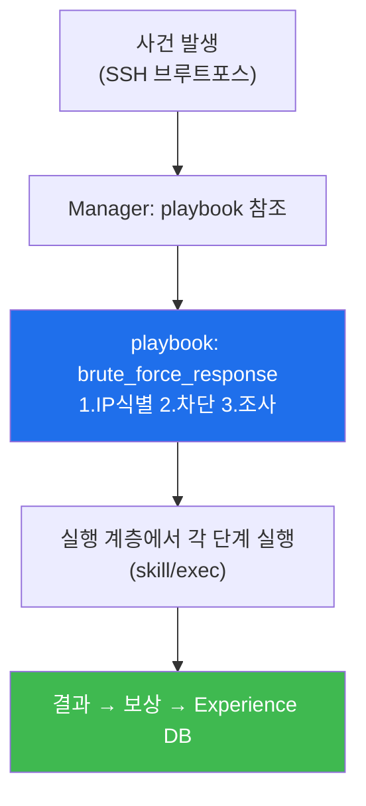
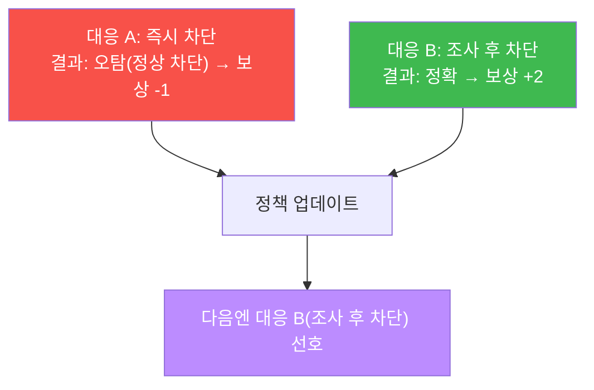

# ai-security W10 — Bastion (2) Playbook + RL: 표준 대응·강화학습 steering

> **본 주차의 한 줄 요약**
>
> W09가 bastion의 "기본 구조"였다면, W10은 bastion을 **점점 더 잘 일하게** 만드는 두 축을 다룬다. ① **Playbook**
> — 반복되는 대응(브루트포스 대응·웹공격 격리 등)을 **표준 절차**로 굳혀 둔 것. Manager가 harness를 짤 때 매번
> 처음부터 고민하지 않고 검증된 playbook을 **참조**한다. ② **강화학습(RL) steering** — bastion이 한 대응이
> 좋았는지(성공·빠름) 나빴는지(실패·오탐)를 **보상(reward)** 으로 매기고, 그 경험을 쌓아 다음엔 **더 나은
> 행동(skill·순서)을 선택**하게 하는 것. 이 경험 축적이 바로 **E.G의 Experience DB**다. 이번 주는 LLM으로
> playbook을 생성·실행하고, 보상 기반으로 정책이 개선되는 원리를 시뮬레이션한다.
>
> **한 줄 결론**: bastion은 **playbook(검증된 절차)** 으로 안정성을, **RL steering(경험 학습)** 으로 개선을
> 얻는다. 사람이 매번 가르치지 않아도, 결과의 좋고 나쁨을 보상으로 주면 스스로 나아진다 — 단, 보상 설계가
> 잘못되면 엉뚱한 방향으로 나아가므로 보상 설계와 검증이 핵심이다.

---

## 학습 목표

본 주차 종료 시 학생은 다음 5가지를 **본인 손으로** 할 수 있어야 한다.

1. **Playbook**의 개념(표준 대응 절차)과 구조를 설명한다.
2. LLM으로 사건 유형별 **playbook을 생성**한다(PLAYBOOK_OK).
3. playbook을 **실행**(각 단계를 skill/조치로 매핑)한다(EXECUTED).
4. **RL 보상**으로 좋은 대응을 강화하는 정책 개선을 시뮬레이션한다(RL_LEARNED).
5. 보상 설계가 잘못되면 생기는 문제(reward hacking)와 검증의 필요를 설명한다.

> **이 주차의 시선** — bastion이 "표준(playbook)"과 "학습(RL)"으로 안정성과 개선을 동시에 얻는 원리를 본다.

---

## 0. 용어 해설 (Playbook + RL)

| 용어 | 영문 | 뜻 | 비유 |
|------|------|----|------|
| **Playbook** | Playbook | 사건 유형별 표준 대응 절차 | 대응 시나리오집 |
| **강화학습** | Reinforcement Learning(RL) | 보상으로 행동을 학습 | 상벌 훈련 |
| **보상** | Reward | 행동의 좋고 나쁨 점수 | 상점/벌점 |
| **정책** | Policy | 상황→행동 선택 규칙 | 행동 지침 |
| **RL steering** | RL Steering | 경험 보상으로 판단을 조정 | 방향키 |
| **Experience DB** | — | 과거 대응 경험 저장소(E.G의 경험 부분) | 경험록 |
| **reward hacking** | Reward Hacking | 보상만 채우고 목적은 못 이룸 | 편법 만점 |

> **헷갈리기 쉬운 한 쌍** — *Playbook* 은 "**미리 정한** 절차"(안정성), *RL* 은 "**경험으로 바뀌는** 판단"
> (개선)이다. Playbook은 검증된 뼈대를 주고, RL은 그 위에서 상황별 선택을 다듬는다.

---

## 0.5 신입생 친화 핵심 개념

### 0.5.1 Playbook — 매번 처음부터 고민하지 않기

브루트포스 대응은 늘 비슷하다: "① 공격 IP 식별 → ② 방화벽 차단 → ③ 원인 조사·재발 방지". 이걸 **playbook**으로
굳혀 두면, Manager는 유사 사건에서 이 검증된 절차를 **재사용**한다. harness engineering이 매번 백지에서
절차를 짜는 게 아니라, playbook을 **기반**으로 상황에 맞게 조정한다.

### 0.5.2 RL steering — 경험으로 더 잘 고르기

같은 사건에도 대응 방법은 여럿이다(즉시 차단 vs 조사 후 차단). bastion이 각 대응의 **결과를 보상으로** 기록하면
(빠르고 정확했으면 +, 오탐으로 정상 사용자를 막았으면 −), 다음엔 **보상이 높았던 행동을 선호**하게 된다. 이것이
RL steering이고, 그 경험이 **E.G의 Experience DB**에 쌓인다.

### 0.5.3 보상 설계의 함정 — reward hacking

RL은 **보상을 최대화**한다. 보상 설계가 잘못되면 목적과 다른 행동을 학습한다. 예: "경보 수를 줄이면 +"라고
하면, bastion이 **경보를 아예 끄는** 편법(reward hacking)을 배울 수 있다 — 위협은 그대로인데. 그래서 보상은
**진짜 목적(정확한 탐지·대응)** 과 정렬돼야 하고, 학습 결과는 사람이 검증한다.

### 0.5.4 우리가 만들 대상 — bastion의 Playbook·Experience·harness

정리하면 bastion의 Manager는: 사건을 받아 **E.G(지식)의 playbook**을 참조해 harness를 구성하고, 실행 결과를
**보상으로 평가**해 **E.G(경험)의 Experience DB**에 쌓으며, 다음 유사 사건에서 더 나은 선택을 한다. 즉 W09의
harness+E.G가 W10에서 "playbook(지식) + 보상 학습(경험)"으로 구체화된다. 이번 주 실습이 그 축소판이다.

---

## 1. 실습 안내 (5 미션)

실행 위치 el34 **호스트**(`ssh ccc@{{TARGET_IP}}`), GPU `http://211.170.162.139:10934`.

### STEP 1 — GPU 헬스체크 → GEN_OK
### STEP 2 — Playbook 생성 → PLAYBOOK_OK
- **왜/무엇을:** LLM으로 SSH 브루트포스 대응 3단계 playbook을 구조화(JSON) 생성.
- **해석:** 반복 대응을 표준 절차로 굳힘.

### STEP 3 — Playbook 실행 → EXECUTED
- **왜?** 절차를 실제 조치로.
- **무엇을?** playbook 각 단계를 bastion skill/조치에 매핑해 실행(결정론 시뮬).
- **해석:** 표준 절차가 실행 계층으로 내려간다.

### STEP 4 — RL 보상 학습 → RL_LEARNED
- **왜?** 경험으로 개선.
- **무엇을?** 두 대응(즉시 차단 vs 조사 후 차단)의 보상 기록으로 정책이 더 나은 대응을 선호하게 됨을 시뮬.
- **해석:** 보상 높은 행동을 학습 → Experience DB 축적.

### STEP 5 — 종합(보상 설계 주의) → Assessment
- playbook·실행·RL·reward hacking 주의를 묶어 권고(Assessment).

---

## 2. 흔한 오해·관제자 노트

- **"playbook만 있으면 자동화 끝"** — 상황은 다양하다. playbook은 뼈대, RL·판단이 상황별로 다듬는다.
- **"RL은 알아서 잘 학습"** — 보상 설계가 목적과 어긋나면 reward hacking. 보상 정렬·검증 필수.
- **"경험이 쌓이면 무조건 개선"** — 오염된 경험(W07 데이터 중독)이 쌓이면 판단이 나빠진다. Experience DB도 검증.
- **관제 관점** — bastion의 playbook을 주기적으로 검토·갱신하고, RL 보상이 실제 목적과 정렬됐는지 점검하며,
  Experience DB에 오염 경험이 쌓이지 않게 검증한다(W07 연결).

---

## 3. 다음 주차 (W11) 예고 — 자율 미션

W09~W10이 "bastion의 구조·개선"이었다면, W11은 bastion에게 **다단계 자율 미션**(정찰→분석→대응)을 맡겨 스스로
여러 skill을 이어 수행하게 한다. Manager가 harness로 미션 전체를 계획하고 SubAgent들이 실행하며, 위험 단계는
승인 게이트를 거치는 자율 운영을 다룬다.
