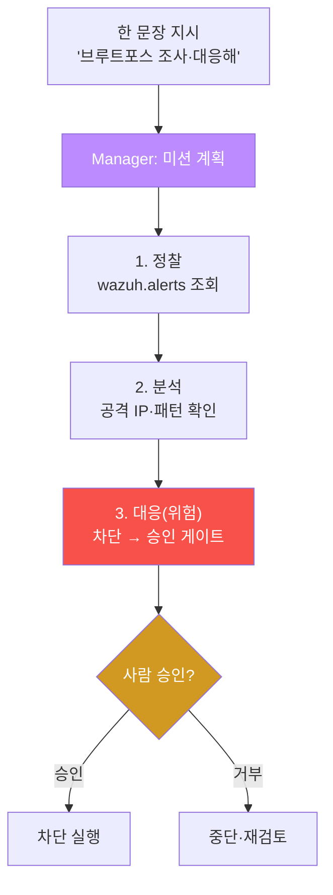

# ai-security W11 — 자율 미션: 다단계 자율 실행·Red/Blue/Purple·승인 게이트

> **본 주차의 한 줄 요약**
>
> W09~W10이 bastion의 "단일 작업"이었다면, W11은 **여러 단계를 스스로 이어 수행하는 자율 미션**을 다룬다.
> 사람이 "SSH 브루트포스 조사하고 대응해"라고 한 문장을 던지면, Manager가 **미션 전체를 계획**(정찰→분석→대응)
> 하고 SubAgent들이 각 단계를 이어 실행한다. 공격 관점의 **Red Team** 자율 미션(취약점 탐색)과 방어 관점의
> **Blue Team** 자율 미션(탐지·대응), 그리고 둘을 함께 돌려 방어를 검증하는 **Purple Team** 자동화를 배운다.
> 핵심 안전 장치는 여전히 **승인 게이트** — 자율이라도 위험 단계(차단·삭제)는 사람 승인을 거친다.
>
> **한 줄 결론**: 자율 미션은 "한 번의 지시로 다단계 작업을 완주"하는 것이다. 강력하지만, **각 단계의 결과를
> 검증**하고 **위험 단계는 승인**을 거쳐야 폭주하지 않는다. 자율성과 통제의 균형이 자율 미션의 핵심이다.

---

## 학습 목표

본 주차 종료 시 학생은 다음 5가지를 **본인 손으로** 할 수 있어야 한다.

1. **자율 미션**(한 지시로 다단계 완주)과 수동 실행의 차이를 설명한다.
2. Manager가 **다단계 미션을 계획**(정찰→분석→대응)하게 만든다(MISSION_PLANNED).
3. 계획된 미션을 **단계별로 실행**한다(MISSION_RUN).
4. 위험 단계에 **승인 게이트**를 적용한다(GATED).
5. **Red/Blue/Purple** 팀 자율 미션의 개념과 Purple 자동화의 가치를 설명한다.

> **이 주차의 시선** — "한 문장 지시 → 다단계 완주"의 편리함과, 그것을 안전하게 만드는 검증·승인의 균형을 본다.

---

## 0. 용어 해설 (자율 미션)

| 용어 | 영문 | 뜻 | 비유 |
|------|------|----|------|
| **자율 미션** | Autonomous Mission | 한 지시로 다단계를 스스로 완주 | 자동 완주 |
| **Red Team** | Red Team | 공격 관점(취약점 탐색) | 침입자 역할 |
| **Blue Team** | Blue Team | 방어 관점(탐지·대응) | 수비수 역할 |
| **Purple Team** | Purple Team | Red+Blue 함께 돌려 방어 검증 | 공수 합동 훈련 |
| **미션 계획** | Mission Planning | 목표를 단계로 분해 | 작전 계획 |
| **승인 게이트** | Approval Gate | 위험 단계에 사람 승인 | 이중 결재 |

> **헷갈리기 쉬운 한 쌍** — *Red* 는 "뚫으려 시도"(공격), *Blue* 는 "막고 잡음"(방어), *Purple* 은 "Red로 공격을
> 만들어 Blue의 탐지가 되는지 검증"(합동)이다. Purple 자동화는 방어를 지속적으로 시험한다.

---

## 0.5 신입생 친화 핵심 개념

### 0.5.1 수동 실행 vs 자율 미션

- **수동** — 사람이 매 단계를 지시한다: "로그 봐줘" → (결과 보고) → "IP 차단해줘" → …. 사람이 계속 개입.
- **자율 미션** — 사람이 목표만 준다: "이 사건 조사하고 대응해". Manager가 **정찰→분석→대응**을 스스로 계획·
  실행하고, 위험 단계에서만 사람 승인을 구한다.

### 0.5.2 Red / Blue / Purple 자율 미션

- **Red 자율 미션** — "이 웹앱의 취약점을 찾아줘" → Manager가 정찰(nmap)→스캔→PoC를 이어 수행(공격 도구는
  격리 환경·인가 하에서만).
- **Blue 자율 미션** — "이 알림을 조사하고 대응해" → 탐지→분석→(승인 후) 차단·룰 추가.
- **Purple 자동화** — Red 미션으로 공격을 만들고 Blue 미션으로 그게 탐지되는지 확인 → **방어의 빈틈을
  지속적으로 발견**. 이것이 Purple 자동화의 보안적 가치다.

### 0.5.3 자율성의 위험과 승인 게이트

자율 미션은 여러 단계를 **사람 확인 없이** 이어간다. 그래서 중간에 잘못된 판단(환각·오탐)이 **다음 단계로
전파**될 수 있다. 방어:
- **각 단계 결과 검증**(W04·W06의 결정론 검증) — 다음 단계로 넘어가기 전 확인.
- **위험 단계 승인 게이트**(W05·W09) — 차단·삭제 같은 되돌리기 어려운 행동은 사람 승인.
- **미션 로깅·중단 조건** — 이상 시 자동 중단(circuit breaker).

### 0.5.4 우리가 만들 대상 — bastion 자율 미션의 harness

bastion에서 자율 미션은 Manager의 **harness engineering**이 미션 전체를 하나의 절차로 구성하는 것이다: "정찰
skill → 결과 검증 → 분석 → (위험) 승인 게이트 → 대응 skill". E.G의 playbook(W10)을 뼈대로 삼고, 각 단계는
실행 계층(skill·화이트리스트)에서 안전하게 실행된다. 이번 주 실습은 Manager가 다단계 미션을 계획하고, 위험
단계에 승인 게이트가 걸리는 것을 재현한다.

---

## 1. 실습 안내 (5 미션)

실행 위치 el34 **호스트**(`ssh ccc@{{TARGET_IP}}`), GPU `http://211.170.162.139:10934`.
(el34-bastion은 경량 실행기라 다단계 자율 계획은 GPU Manager로 시연하고, 실행은 bastion `/exec`·skill로 매핑한다.)

### STEP 1 — GPU 헬스체크 → GEN_OK
### STEP 2 — 다단계 미션 계획 → MISSION_PLANNED
- **왜/무엇을:** Manager에게 "브루트포스 조사·대응" 목표를 주고 정찰→분석→대응 단계를 JSON으로 계획하게 한다.
- **해석:** 한 지시가 다단계 계획으로 분해된다.

### STEP 3 — 미션 단계 실행 → MISSION_RUN
- **왜?** 계획을 실제 실행으로.
- **무엇을?** 각 단계를 bastion skill/조치에 매핑해 순차 실행(결정론 시뮬).
- **해석:** 정찰→분석→대응이 이어서 수행된다.

### STEP 4 — 승인 게이트 → GATED
- **왜?** 자율이라도 위험 단계는 통제.
- **무엇을?** 대응(차단) 단계에서 승인 게이트가 걸려 사람 승인 전엔 실행 안 됨을 확인.
- **해석:** 자율성과 통제의 균형.

### STEP 5 — 종합(Purple 가치) → Assessment
- 미션 계획·실행·승인·Purple 자동화를 묶어 권고(Assessment).

---

## 2. 흔한 오해·관제자 노트

- **"자율이니 사람은 필요 없다"** — 위험 단계 승인·각 단계 검증은 필수. 자율≠무통제.
- **"미션이 다 알아서 완주"** — 중간 오판이 전파된다. 단계별 검증·중단 조건이 안전장치.
- **"Red 미션은 위험"** — 인가된 격리 환경(el34)에서, 승인 하에, 교육/방어 검증 목적으로만.
- **관제 관점** — bastion 자율 미션은 harness에 단계별 검증·위험 단계 승인 게이트·중단 조건을 넣고, 미션 전
  과정을 로깅한다. Purple 자동화로 방어 빈틈을 주기적으로 발견·보완한다.

---

## 3. 다음 주차 (W12) 예고 — Agent Daemon

W11이 "요청 기반 자율 미션"이었다면, W12는 사람 지시 없이도 **상시 돌며 스스로 감시·대응하는 Agent Daemon**을
다룬다. 이벤트(알림·이상)를 트리거로 미션을 자동 시작하는 상시 자율 운영과, 그 위험(폭주)을 막는 통제를 배운다.
