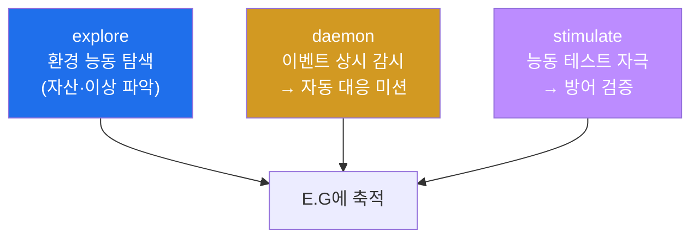
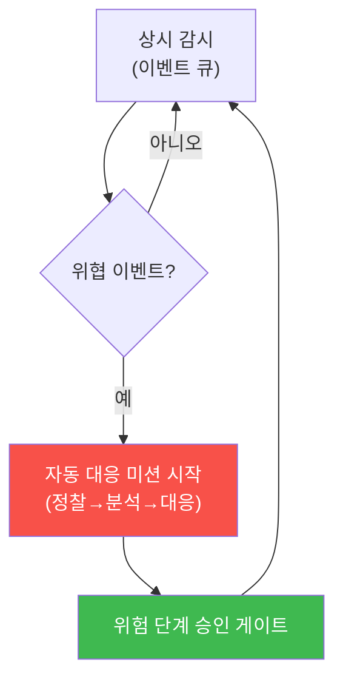

# ai-security W12 — Agent Daemon: explore·daemon·stimulate 모드·상시 자율 관제

> **본 주차의 한 줄 요약**
>
> W11의 자율 미션이 "사람이 목표를 주면 완주"였다면, W12는 사람 지시 없이도 **상시 돌며 스스로 감시·대응하는
> Agent Daemon**을 다룬다. bastion은 세 모드로 동작한다: ① **explore** — 환경을 능동 탐색해 자산·이상을 파악,
> ② **daemon** — 이벤트(알림·이상)를 트리거로 상시 감시하다 자동으로 대응 미션을 시작, ③ **stimulate** —
> 능동적으로 테스트 자극을 넣어 방어가 작동하는지 확인(Purple 자동화의 상시판). 상시 자율은 강력하지만
> **폭주 위험**이 크다 — 그래서 **속도 제한·회로 차단기(circuit breaker)·위험 행동 승인 게이트**가 필수다.
>
> **한 줄 결론**: Agent Daemon은 "24시간 자율 보안 당직자"다. 사람이 자는 사이에도 감시·대응한다. 그러나
> 상시 자율일수록 **통제(속도 제한·차단기·승인)** 를 촘촘히 해야 오작동이 재앙이 되지 않는다.

---

## 학습 목표

본 주차 종료 시 학생은 다음 5가지를 **본인 손으로** 할 수 있어야 한다.

1. Agent Daemon의 3모드(**explore·daemon·stimulate**)를 구분해 설명한다.
2. **daemon 모드**의 이벤트 트리거 상시 감시·자동 대응을 시뮬레이션한다(DAEMON_OK).
3. **stimulate 모드**로 능동 보안 테스트(방어 검증)를 수행한다(STIMULATE_OK).
4. 상시 자율의 위험을 막는 **회로 차단기(circuit breaker)** 를 구현한다(BREAKER_OK).
5. 상시 자율 관제의 가치와 통제(속도 제한·승인)의 필요를 설명한다.

> **이 주차의 시선** — "사람 없이도 도는" 자율의 편리함과, 그것이 폭주하지 않게 하는 통제의 균형을 본다.

---

## 0. 용어 해설 (Agent Daemon)

| 용어 | 영문 | 뜻 | 비유 |
|------|------|----|------|
| **Daemon** | Daemon | 상시 백그라운드로 도는 프로세스 | 24시간 당직 |
| **explore 모드** | Explore | 환경을 능동 탐색·파악 | 순찰 |
| **daemon 모드** | Daemon | 이벤트 트리거 상시 감시·대응 | 대기·출동 |
| **stimulate 모드** | Stimulate | 능동 테스트 자극 투입 | 모의 훈련 |
| **회로 차단기** | Circuit Breaker | 이상 시 자동 중단 | 누전 차단기 |
| **속도 제한** | Rate Limit | 단위 시간 행동 수 제한 | 과속 방지 |
| **폭주** | Runaway | 통제 없이 반복·확산 | 브레이크 고장 |

> **헷갈리기 쉬운 한 쌍** — *daemon 모드* 는 "이벤트가 오면 반응"(수동적 상시), *stimulate 모드* 는 "먼저 자극을
> 넣어 확인"(능동적 상시)이다. 전자는 감시, 후자는 시험이다.

---

## 0.5 신입생 친화 핵심 개념

### 0.5.1 세 모드 — 순찰·대기·훈련

- **explore** — "이 환경에 뭐가 있나"를 스스로 훑어 자산·구성·이상을 파악하고 E.G에 쌓는다(순찰).
- **daemon** — 평소엔 대기하다 **이벤트(Wazuh 알림·이상 로그)** 가 오면 자동으로 대응 미션(W11)을 시작한다(출동).
- **stimulate** — 먼저 안전한 테스트 자극(예: 인가된 스캔)을 넣어 **탐지·대응이 작동하는지** 능동 검증한다(훈련).

### 0.5.2 daemon 모드 — 사람 없이 감시·대응

daemon 모드의 핵심 루프: **이벤트 감시 → 트리거 → 자동 미션 → 대응(위험 단계 승인)**.

사람이 자는 사이에도 도니 강력하지만, 이벤트마다 미션을 마구 시작하면 **폭주**한다 — 그래서 통제가 필수(§0.5.4).

### 0.5.3 stimulate 모드 — 방어를 능동 검증

방어는 "실제 공격이 올 때만" 시험되면 늦다. stimulate 모드는 **인가된 안전 자극**(예: 알려진 시그니처를 가진
테스트 요청)을 주기적으로 넣어, 탐지 룰·대응이 살아 있는지 능동 확인한다. 이것이 W11 Purple 자동화의 상시판이다.

### 0.5.4 상시 자율의 통제 — 폭주를 막는 3장치

- **속도 제한(rate limit)** — 단위 시간당 행동 수 상한(예: 분당 대응 미션 3건). 초과 시 대기.
- **회로 차단기(circuit breaker)** — 짧은 시간에 오류·위험 행동이 임계 이상이면 **자동 중단**(사람 개입 요청).
- **위험 행동 승인 게이트** — 차단·삭제 같은 되돌리기 어려운 행동은 여전히 사람 승인(W05·W11).

bastion daemon은 이 셋을 갖춰야 "24시간 자율"이 "24시간 폭주"가 되지 않는다.

### 0.5.5 우리가 만들 대상 — bastion daemon의 harness와 안전장치

bastion daemon은 Manager가 이벤트를 받아 **harness**로 대응 미션을 구성하고 실행하되, **rate limit·circuit
breaker·승인 게이트**를 harness에 내장한다. explore로 얻은 지식과 daemon 대응 경험은 **E.G**에 쌓여 판단을
개선한다. 이번 주 실습은 daemon 루프·stimulate·회로 차단기를 시뮬레이션한다.

---

## 1. 실습 안내 (5 미션)

실행 위치 el34 **호스트**(`ssh ccc@{{TARGET_IP}}`), GPU `http://211.170.162.139:10934`. (daemon/모드는 결정론
시뮬레이션으로, 판단이 필요한 부분만 GPU로 시연.)

### STEP 1 — GPU 헬스체크 → GEN_OK
### STEP 2 — daemon 모드 이벤트 트리거 → DAEMON_OK
- **왜/무엇을:** 이벤트 큐를 감시하다 위협 이벤트가 오면 자동 대응 미션을 시작(결정론 시뮬).
- **해석:** 사람 지시 없이 감시→대응.

### STEP 3 — stimulate 모드 능동 검증 → STIMULATE_OK
- **왜?** 방어가 살아 있는지 능동 확인.
- **무엇을?** 알려진 테스트 시그니처를 주입하고 탐지 룰이 잡는지 확인(결정론).
- **해석:** Purple 자동화의 상시판.

### STEP 4 — 회로 차단기 → BREAKER_OK
- **왜?** 폭주 방지.
- **무엇을?** 짧은 시간 위험 행동이 임계 이상이면 daemon을 자동 중단(결정론).
- **해석:** 24시간 자율이 24시간 폭주가 되지 않게.

### STEP 5 — 종합 → Assessment
- 3모드·통제(속도 제한·차단기·승인)를 묶어 권고(Assessment).

---

## 2. 흔한 오해·관제자 노트

- **"daemon은 켜두면 끝"** — 통제(속도 제한·차단기·승인) 없이는 폭주 위험. 상시 자율일수록 통제가 촘촘해야.
- **"stimulate는 위험"** — 인가된 안전 자극만, 격리 환경에서. 진짜 공격이 아니라 방어 점검용.
- **"자율이니 사람 불필요"** — 위험 행동 승인·차단기 개입은 사람 몫. 자율은 반복 감시·대응에.
- **관제 관점** — bastion daemon의 rate limit·circuit breaker·승인 게이트가 제대로 걸려 있는지, explore/daemon
  경험이 E.G에 건전하게 쌓이는지 점검한다. 폭주 징후(대응 미션 급증)를 모니터링한다.

---

## 3. 다음 주차 (W13) 예고 — 분산 지식

W12가 "상시 자율 운영"이었다면, W13은 여러 SubAgent가 **지식을 나눠 갖고 전달**하는 분산 지식 구조를 다룬다.
`local_knowledge.json` 구조, SubAgent 간 knowledge transfer, 그리고 분산 지식이 E.G를 어떻게 확장하는지 배운다.
