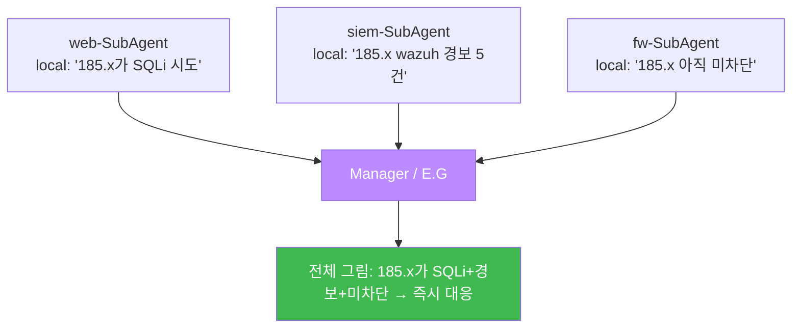

# ai-security W13 — 분산 지식: local_knowledge·SubAgent 지식 전달·E.G 확장

> **본 주차의 한 줄 요약**
>
> bastion은 하나의 두뇌가 아니라 여러 SubAgent가 **각 VM에서 일하며 각자의 지식**을 쌓는 구조다. W13은 이
> **분산 지식(Distributed Knowledge)** 을 다룬다. 각 SubAgent는 자기가 담당한 VM의 상태·이력을
> `local_knowledge.json` 에 갖고, 필요할 때 다른 SubAgent나 Manager에게 **전달(knowledge transfer)** 한다.
> 그러면 web-SubAgent가 발견한 공격 흔적을 siem-SubAgent가 자기 분석에 활용하는 식으로, **부분 지식이 합쳐져
> 전체 그림**이 된다. 이 합쳐진 지식이 bastion의 **E.G(경험·지식)** 를 구성하고, 각 판단을 더 정확하게 만든다.
> 단, 분산 지식도 **오염될 수 있으므로**(W07) 출처·검증이 필요하다.
>
> **한 줄 결론**: 분산 지식은 "각자 아는 것을 나눠, 아무도 혼자서는 못 보는 전체를 함께 본다"는 것이다.
> 부분의 합보다 큰 통찰이 나오지만, 나누는 지식이 신뢰할 만할 때만 그렇다.

---

## 학습 목표

본 주차 종료 시 학생은 다음 5가지를 **본인 손으로** 할 수 있어야 한다.

1. **분산 지식 아키텍처**의 개념과 필요성을 설명한다.
2. **local_knowledge.json** 의 구조(각 SubAgent의 로컬 지식)를 파악한다(KNOWLEDGE_OK).
3. SubAgent 간 **지식 전달(knowledge transfer)** 을 시뮬레이션한다(TRANSFER_OK).
4. 부분 지식을 **병합**해 개별로는 못 보는 통찰을 얻는다(MERGED).
5. 분산 지식의 **오염 위험**(W07)과 출처·검증의 필요를 설명한다.

> **이 주차의 시선** — "나눠 갖고 합치는" 지식의 힘과, 그 지식이 신뢰할 만해야 한다는 조건을 함께 본다.

---

## 0. 용어 해설 (분산 지식)

| 용어 | 영문 | 뜻 | 비유 |
|------|------|----|------|
| **분산 지식** | Distributed Knowledge | 여러 에이전트가 나눠 가진 지식 | 부서별 자료 |
| **local_knowledge** | Local Knowledge | 각 SubAgent의 로컬 지식 저장 | 개인 업무 수첩 |
| **지식 전달** | Knowledge Transfer | 에이전트 간 지식 공유 | 인수인계 |
| **병합** | Merge | 부분 지식을 합쳐 전체를 구성 | 조각 맞추기 |
| **E.G** | Experience & Knowledge | bastion 전체의 경험·지식 베이스 | 회사 지식경영 |
| **지식 오염** | Knowledge Poisoning | 잘못·조작된 지식 유입 | 헛소문 |

> **헷갈리기 쉬운 한 쌍** — *local_knowledge* 는 "한 SubAgent가 아는 것"(부분), *E.G* 는 "그것들이 합쳐진
> bastion 전체의 지식"(전체)이다. 전달·병합으로 부분이 전체가 된다.

---

## 0.5 신입생 친화 핵심 개념

### 0.5.1 왜 지식을 나눠 갖나 — 각자 보는 것이 다르다

bastion의 각 SubAgent는 담당 VM이 다르다: web-SubAgent는 웹 로그를, siem-SubAgent는 Wazuh 알림을,
fw-SubAgent는 방화벽 상태를 본다. **아무도 전체를 혼자 못 본다.** 그래서 각자 자기 영역의 지식을
`local_knowledge.json` 에 쌓고, 필요할 때 나눈다.

### 0.5.2 지식 전달 — 인수인계

한 SubAgent가 발견한 것을 다른 SubAgent가 쓰려면 **전달**해야 한다. 예: web-SubAgent가 "185.x가 공격 중"을
발견 → fw-SubAgent에게 전달 → fw-SubAgent가 그 IP를 주시. 이 전달로 **한 곳의 발견이 다른 곳의 행동**이 된다.

### 0.5.3 병합 — 부분의 합보다 큰 통찰

각자의 부분 지식을 병합하면, **개별로는 안 보이던 패턴**이 드러난다. 예: web(SQLi 시도) + siem(경보 5건) +
fw(미차단)를 합치면 "실재하는 미대응 위협"이라는 결론이 나온다. 한 조각만으론 확신할 수 없던 것이 합치면
확실해진다. 이번 주 실습에서 세 SubAgent의 로컬 지식을 병합해 이 통찰을 만든다.

### 0.5.4 분산 지식의 위험 — 오염과 검증

분산 지식도 **오염될 수 있다**(W07 데이터 중독의 지식판). 조작된 local_knowledge("이 IP는 안전")가 전달되면,
전체 판단이 틀어진다. 그래서 지식에도 **출처(어느 SubAgent가·언제)** 와 **검증**(결정론 대조)이 필요하다.
신뢰할 수 없는 지식은 병합에서 배제하거나 가중치를 낮춘다.

### 0.5.5 우리가 만들 대상 — bastion E.G의 분산 구조

bastion의 **E.G**는 이 분산 지식이 합쳐진 것이다: 각 SubAgent의 local_knowledge + 전달·병합 + 출처·검증.
Manager는 harness를 짤 때 이 E.G를 참조해 더 정확히 판단하고, 대응 결과를 다시 각 local과 E.G에 축적한다.
이번 주 실습은 그 분산 지식의 전달·병합·검증을 시뮬레이션한다.

---

## 1. 실습 안내 (5 미션)

실행 위치 el34 **호스트**(`ssh ccc@{{TARGET_IP}}`), GPU `http://211.170.162.139:10934`. (분산 지식은 결정론
시뮬레이션으로, 종합 판단만 GPU로.)

### STEP 1 — GPU 헬스체크 → GEN_OK
### STEP 2 — local_knowledge 구조 → KNOWLEDGE_OK
- **왜/무엇을:** 각 SubAgent의 local_knowledge(담당 VM 지식)를 확인.
- **해석:** 각자 보는 것이 다르다.

### STEP 3 — 지식 전달 → TRANSFER_OK
- **왜?** 한 곳의 발견을 다른 곳의 행동으로.
- **무엇을?** web-SubAgent의 발견을 fw-SubAgent에게 전달(출처 포함).
- **해석:** 인수인계로 지식이 흐른다.

### STEP 4 — 지식 병합·통찰 → MERGED
- **왜?** 부분의 합보다 큰 통찰.
- **무엇을?** 세 SubAgent의 로컬 지식을 병합해 "실재하는 미대응 위협" 결론 도출.
- **해석:** 개별론 못 보던 패턴이 합치면 드러남.

### STEP 5 — 종합(오염 주의) → Assessment
- 분산 지식·전달·병합·오염 검증을 묶어 권고(Assessment).

---

## 2. 흔한 오해·관제자 노트

- **"지식은 중앙에 다 모으면 된다"** — 각 VM의 실시간 지식은 로컬에서 나온다. 분산+전달이 현실적.
- **"전달된 지식은 믿는다"** — 오염될 수 있다(W07). 출처·검증 필요.
- **"많이 합칠수록 좋다"** — 오염 지식이 섞이면 결론이 틀어진다. 신뢰 낮은 지식은 배제/가중치 하향.
- **관제 관점** — bastion E.G에 들어가는 각 SubAgent 지식의 출처를 추적하고, 결정론(Assessor)과 대조 검증하며,
  오염 의심 지식은 병합에서 배제한다. 분산 지식의 신뢰가 전체 판단의 신뢰다.

---

## 3. 다음 주차 (W14) 예고 — RL Steering

W13이 "지식을 나누고 합치기"였다면, W14는 그 위에서 **보상 함수(reward function)로 에이전트 행동을 조향**하는
강화학습 steering을 깊게 다룬다. 좋은 보상 설계가 어떻게 좋은 행동을 만들고, 잘못된 보상이 어떻게 reward
hacking을 부르는지, 그리고 보상을 진짜 목적과 정렬하는 법을 배운다.
