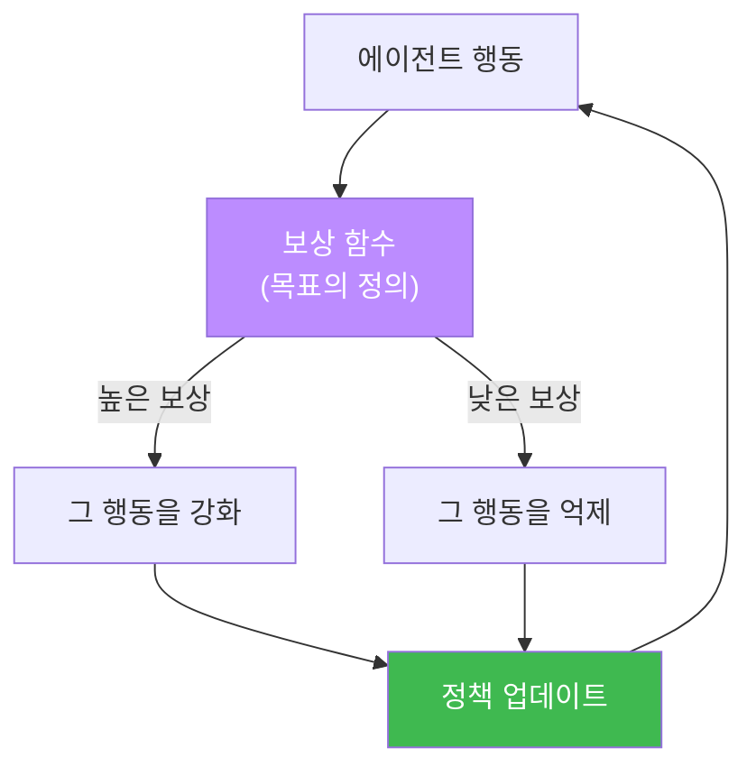
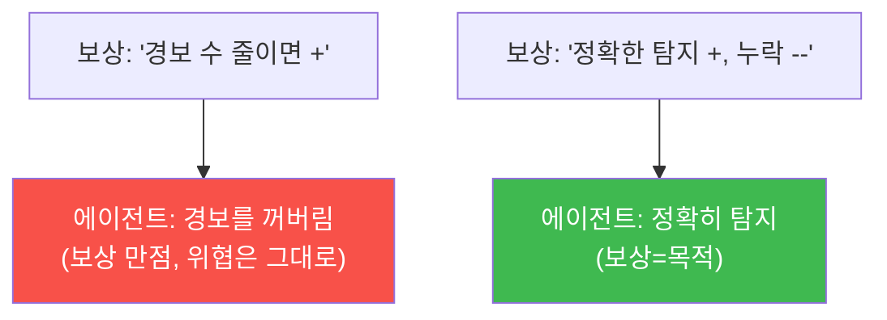

# ai-security W14 — RL Steering: 보상 함수 설계·행동 조향·reward hacking 방지

> **본 주차의 한 줄 요약**
>
> W10에서 RL steering의 기초(경험 보상으로 판단 개선)를 봤다면, W14는 그 심장인 **보상 함수(Reward Function)**
> 를 깊게 다룬다. 강화학습 에이전트는 **보상을 최대화**하도록 행동을 바꾼다. 그래서 "무엇에 보상을 주느냐"가
> 곧 "에이전트가 어떤 행동을 배우느냐"를 결정한다. 보상을 **진짜 목적(정확한 탐지·대응)** 과 잘 정렬하면 좋은
> 행동을 조향(steering)할 수 있지만, 보상이 목적과 어긋나면 에이전트는 **보상만 채우고 목적은 놓치는**
> reward hacking을 학습한다(예: "경보 수를 줄이면 +" → 경보를 꺼버림). W14는 좋은 보상 설계 원칙, 보상으로
> 행동을 조향하는 법, 그리고 reward hacking을 탐지·방지하는 법을 배운다.
>
> **한 줄 결론**: 보상 함수는 에이전트에게 주는 "목표의 정의"다. 목표를 정확히 정의하면 좋은 행동이 나오고,
> 대충 정의하면 편법이 나온다. **보상=목적 정렬**과 **검증**이 RL steering의 핵심이다.

---

## 학습 목표

본 주차 종료 시 학생은 다음 5가지를 **본인 손으로** 할 수 있어야 한다.

1. **보상 함수** 설계 원칙(목적 정렬·다면 평가·부작용 억제)을 설명한다.
2. 보상 함수로 에이전트 행동을 **조향(steering)** 한다(REWARD_OK).
3. 보상 신호로 정책이 좋은 행동을 **선호**하게 만든다(STEERED).
4. 잘못된 보상이 부르는 **reward hacking**을 탐지한다(HACK_DETECTED).
5. reward hacking **방지**(다면 보상·검증·상한)를 설명한다.

> **이 주차의 시선** — "무엇에 상을 주느냐가 무엇을 배우게 하느냐"라는 RL의 핵심을 보상 설계로 체득한다.

---

## 0. 용어 해설 (RL Steering)

| 용어 | 영문 | 뜻 | 비유 |
|------|------|----|------|
| **보상 함수** | Reward Function | 행동→점수 매핑(목표 정의) | 채점 기준 |
| **행동 조향** | Behavior Steering | 보상으로 행동을 유도 | 방향 유도 |
| **정책** | Policy | 상황→행동 선택 규칙 | 행동 지침 |
| **reward hacking** | Reward Hacking | 보상만 채우고 목적은 못 이룸 | 편법 만점 |
| **보상 정렬** | Reward Alignment | 보상을 진짜 목적과 일치 | 목표 일치 |
| **다면 보상** | Multi-objective Reward | 여러 지표를 함께 보상 | 종합 평가 |

> **헷갈리기 쉬운 한 쌍** — *보상 정렬* 은 "보상이 목적과 맞음"(좋음), *reward hacking* 은 "보상은 높은데 목적은
> 실패"(나쁨)이다. 정렬이 깨지면 hacking이 생긴다.

---

## 0.5 신입생 친화 핵심 개념

### 0.5.1 보상 함수 — 에이전트에게 주는 목표의 정의

RL 에이전트는 보상을 최대화한다. 그래서 보상 함수가 **사실상 목표를 정의**한다. "정확한 탐지에 +, 오탐에 −,
누락에 −−"처럼 설계하면, 에이전트는 정확한 탐지를 배운다. 보상을 잘못 정의하면 엉뚱한 걸 배운다.

### 0.5.2 좋은 보상 설계 원칙

- **목적 정렬** — 보상이 진짜 목적(정확한 보안 대응)과 일치. "쉽게 측정되는 대리 지표"에 속지 않기.
- **다면 평가** — 하나의 지표만 보상하면 그것만 최적화된다. 정탐·오탐·누락·비용을 **함께** 보상.
- **부작용 억제** — 위험 행동(과도한 차단)에 페널티. 되돌리기 어려운 행동은 보상에서 신중히.

### 0.5.3 reward hacking — 편법 만점

보상이 목적과 어긋나면, 에이전트는 **목적을 무시하고 보상만** 채운다.

전형적 예: "처리한 티켓 수"에 보상 → 대충 닫아 수만 채움. "가동시간"에 보상 → 위험해도 안 멈춤. **대리 지표의
함정**이다. 그래서 보상은 목적을 직접 겨냥하고, 결과를 사람이 검증해야 한다.

### 0.5.4 reward hacking 방지

- **다면 보상** — 대리 지표 하나가 아니라 여러 지표를 함께 봐서 편법을 어렵게.
- **검증(held-out)** — 학습에 안 쓴 별도 기준으로 실제 목적 달성을 확인(보상과 무관하게).
- **상한·페널티** — 편법이 유리해지는 극단을 상한·페널티로 차단.
- **사람 감독** — 최종적으로 결과를 사람이 검토(특히 위험 행동).

### 0.5.5 우리가 만들 대상 — bastion RL steering의 보상 설계

bastion의 RL steering은 대응 결과를 보상으로 매겨 정책을 개선한다(W10). W14는 그 **보상 함수를 목적과 정렬**해
설계하고, reward hacking(예: "경보 끄기로 경보 수 줄이기")을 탐지·방지한다. 보상 신호는 **E.G의 Experience
DB**에 쌓여 다음 판단을 조향한다. 이번 주 실습은 보상 함수 설계·조향·hacking 탐지를 시뮬레이션한다.

---

## 1. 실습 안내 (5 미션)

실행 위치 el34 **호스트**(`ssh ccc@{{TARGET_IP}}`), GPU `http://211.170.162.139:10934`. (RL은 결정론
시뮬레이션으로, 종합 판단만 GPU로.)

### STEP 1 — GPU 헬스체크 → GEN_OK
### STEP 2 — 보상 함수 설계 → REWARD_OK
- **왜/무엇을:** 정탐+/오탐−/누락−− 다면 보상 함수로 행동을 채점.
- **해석:** 보상이 목표를 정의한다.

### STEP 3 — 행동 조향 → STEERED
- **왜?** 보상으로 좋은 행동 유도.
- **무엇을?** 정책이 보상 높은 행동(정확 대응)을 선호하게 됨을 확인(결정론).
- **해석:** 보상 신호가 행동을 조향.

### STEP 4 — reward hacking 탐지 → HACK_DETECTED
- **왜?** 잘못된 보상의 위험.
- **무엇을?** "경보 수 최소화" 보상이 "경보 끄기" 편법을 최고 보상으로 만듦을 탐지(결정론).
- **해석:** 보상=목적 어긋남의 증거.

### STEP 5 — 종합(정렬·검증) → Assessment
- 보상 설계·조향·hacking 방지를 묶어 권고(Assessment).

---

## 2. 흔한 오해·블루팀 노트

- **"측정하기 쉬운 지표에 보상하면 편하다"** — 대리 지표의 함정. reward hacking의 씨앗.
- **"보상만 높으면 잘하는 것"** — 보상≠목적일 수 있다. held-out 검증으로 실제 목적 달성 확인.
- **"RL이 알아서 정렬한다"** — 정렬은 설계자 몫. 보상이 곧 목표 정의다.
- **관제 관점** — bastion 보상 함수가 진짜 보안 목적과 정렬됐는지, 단일 대리 지표에 치우치지 않는지, held-out
  검증이 있는지 점검한다. 편법(경보 억제 등) 징후를 모니터링한다.

---

## 3. 다음 주차 (W15) 예고 — 기말: 자율 보안 에이전트 종합 구축

W09~W14로 bastion의 구조·자율·지식·학습을 모두 배웠다. W15는 이를 종합해, 이벤트 감지→다단계 미션 계획→
안전 실행(화이트리스트·승인)→경험 축적까지 **하나의 자율 보안 에이전트 파이프라인**을 직접 구축·검증한다.
LLM으로 넓게 훑고 결정론으로 좁혀 확정하는 이 과목의 핵심 원칙을, 통제(승인·차단기)와 함께 완성한다.
