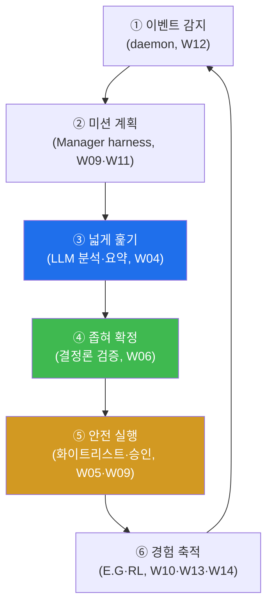

# ai-security W15 — 기말: 자율 보안 에이전트 종합 구축·검증

> **본 주차의 한 줄 요약**
>
> 마지막 주는 W01~W14에서 배운 모든 것을 하나로 묶는다. LLM 기초(W01~03) → 보안 활용(W04~06) → 에이전트
> (W07~08) → bastion 자율(W09~14)을 종합해, **이벤트 감지 → 다단계 미션 계획 → 안전 실행(화이트리스트·승인)
> → 경험 축적**의 **자율 보안 에이전트 파이프라인**을 직접 구축하고 검증한다. 핵심은 이 과목을 관통한 두 원칙의
> 결합이다: ① **"LLM으로 넓게 훑고 결정론으로 좁혀 확정"** (LLM의 유연함 + 결정론의 신뢰), ② **"자율에는
> 통제를"** (화이트리스트·승인 게이트·회로 차단기). 강력한 자율 에이전트를, 신뢰할 수 있고 통제 가능하게 만드는
> 것 — 그것이 이 과목의 결론이다.
>
> **한 줄 결론**: 좋은 자율 보안 에이전트 = **LLM(넓게 훑기) + 결정론(좁혀 확정) + 통제(안전장치)**. 셋 중
> 하나라도 빠지면 신뢰할 수 없다.

---

## 학습 목표

본 주차 종료 시 학생은 다음 5가지를 **본인 손으로** 할 수 있어야 한다.

1. W01~W14의 핵심을 **하나의 파이프라인**으로 통합해 설명한다.
2. 이벤트→계획→실행→축적의 **자율 에이전트 파이프라인**을 구축·실행한다(PIPELINE_OK).
3. 실물 **el34-bastion API**로 한 단계를 실제 실행한다(BASTION_E2E).
4. 파이프라인의 **안전장치**(화이트리스트·승인·검증)를 검증한다(SAFE_OK).
5. "LLM으로 넓게 훑고 결정론으로 좁혀 확정 + 통제"의 결합을 설명한다.

> **이 주차의 시선** — 부분들을 배웠으니, 이제 그것들이 하나로 동작하는 전체를 만들어 본다.

---

## 0. 용어 해설 (종합)

| 용어 | 영문 | 뜻 | 관련 주차 |
|------|------|----|-----------|
| **파이프라인** | Pipeline | 감지→계획→실행→축적의 연결 | W09~W14 |
| **넓게 훑기** | Broad Sweep | LLM으로 넓게 후보 파악 | W03·W04 |
| **좁혀 확정** | Deterministic Narrowing | 결정론으로 검증·확정 | W02·W06 |
| **안전장치** | Safety Controls | 화이트리스트·승인·차단기 | W09·W11·W12 |
| **경험 축적** | Experience Accumulation | 결과를 E.G에 저장 | W10·W13 |

---

## 0.5 종합 — 파이프라인으로 다시 보기

### 0.5.1 전체 그림 — 이벤트에서 경험까지

각 단계가 이전 주차의 학습이다. W15는 이 여섯 단계를 **하나로 이어** 동작시킨다.

### 0.5.2 두 원칙의 결합

- **LLM으로 넓게 훑고 결정론으로 좁혀 확정** — LLM(②③)이 유연하게 상황을 파악·계획하고, 결정론(④)이 그
  결과를 검증해 신뢰를 준다. LLM만 믿으면 환각, 결정론만 쓰면 경직 — 둘의 결합이 답이다.
- **자율에는 통제를** — 화이트리스트(위험 명령 차단)·승인 게이트(되돌리기 어려운 행동)·회로 차단기(폭주 중단)가
  ⑤에 겹층으로 들어간다. 자율이 강할수록 통제가 촘촘해야 한다.

### 0.5.3 실물 bastion과의 연결

이 파이프라인의 ⑤ 안전 실행은 실물 **el34-bastion**(`/skills`·`/exec`, 화이트리스트)으로 내려간다. Manager의
계획(LLM)은 GPU로, 실제 실행·안전 게이트는 bastion으로 — 개념과 실물이 만난다. (el34-bastion은 경량 실행기라
Manager LLM 계획은 GPU 시연이지만, 안전 실행·화이트리스트는 실물 그대로다.)

### 0.5.4 이 과목이 남기는 것

AI를 보안에 쓰는 법은 "LLM에게 다 맡기기"가 아니다. **LLM의 유연함을 결정론의 신뢰로 감싸고, 자율을 통제로
길들이는 것**이다. bastion은 그 구현체이고, 여러분은 이제 그 구조를 이해하고 만들 수 있다. 기말 과제는 그것을
직접 조립해 증명하는 것이다.

---

## 1. 기말 실습 안내 (5 미션 — 종합 구축)

실행 위치 el34 **호스트**(`ssh ccc@{{TARGET_IP}}`), GPU `http://211.170.162.139:10934`, bastion `el34-bastion:9100`
(`X-API-Key: ccc-api-key-2026`).

### STEP 1 — GPU 헬스체크 → GEN_OK
### STEP 2 — 자율 파이프라인 구축·실행 → PIPELINE_OK
- **왜/무엇을:** 이벤트→계획→분석→검증→안전실행→축적 6단계를 하나로 이어 실행(결정론+LLM).
- **해석:** 부분들이 하나로 동작.

### STEP 3 — 실물 bastion 실행 → BASTION_E2E
- **왜?** 개념을 실물로.
- **무엇을?** bastion `/skills`+`/exec`(안전 명령)로 파이프라인의 실행 단계를 실제 수행.
- **해석:** Manager 계획이 실물 실행 계층으로.

### STEP 4 — 안전장치 검증 → SAFE_OK
- **왜?** 자율의 신뢰.
- **무엇을?** 화이트리스트(위험 명령 차단) + 승인 게이트(위험 단계) + 검증(결정론)이 작동함을 확인.
- **해석:** 통제가 겹층으로 작동.

### STEP 5 — 기말 종합 보고 → Assessment
- 파이프라인·실물·안전·두 원칙을 묶어 최종 보고(Assessment).

---

## 2. 흔한 오해·관제자 노트

- **"자율 에이전트면 사람은 불필요"** — 승인·차단기·검증은 사람/결정론 몫. 자율은 반복 작업에.
- **"LLM이 똑똑하니 검증 불필요"** — 환각·오판은 상수. 결정론 검증이 신뢰의 근거.
- **"통제는 자율을 방해"** — 통제가 있어야 자율을 믿고 맡길 수 있다. 통제=자율의 전제.
- **관제 관점** — 자율 보안 에이전트의 각 단계(감지·계획·검증·실행·축적)에 로깅·검증·승인이 걸려 있는지,
  화이트리스트·차단기가 작동하는지, E.G에 오염이 없는지 종합 점검한다. 이 과목의 모든 관제 관점의 통합이다.

---

## 3. 과목을 마치며

W01의 LLM 기초부터 W15의 자율 에이전트까지, 여러분은 **AI를 보안에 신뢰할 수 있게 쓰는 법**을 배웠다. 핵심은
변함없다: **LLM으로 넓게 훑고, 결정론으로 좁혀 확정하고, 통제로 자율을 길들인다.** 이 원칙은 bastion을 넘어
앞으로 만날 모든 AI 보안 시스템에 적용된다. 수고했다.
