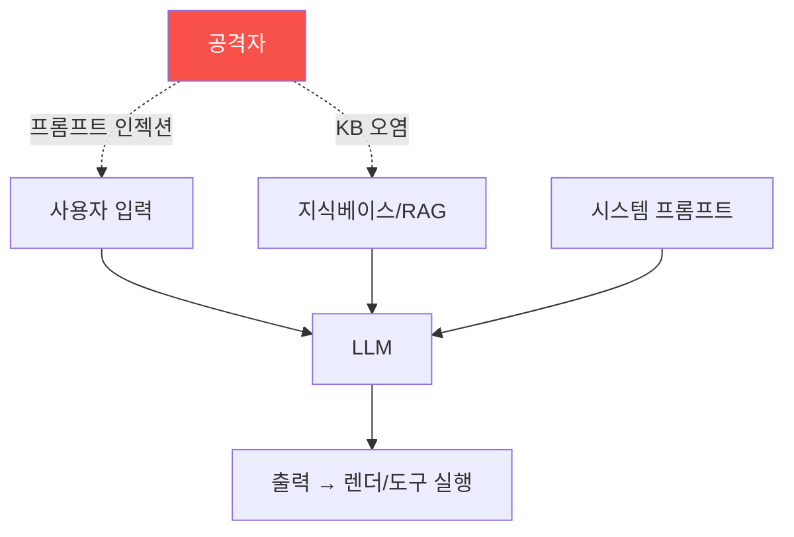

# ai-service-pentest W01 — AI 서비스 모의해킹 개론: LLM 앱 공격 표면·OWASP LLM Top 10

> **본 주차의 한 줄 요약**
>
> ai-service-pentest는 **LLM(대규모 언어 모델) 기반 서비스**를 모의해킹한다 — 챗봇·AI 어시스턴트·RAG 검색·AI
> 에이전트 등 요즘 폭증하는 AI 서비스의 취약점을 공격자 관점으로 찾는다. 전통 웹 취약점(SQLi·XSS)과 다른, AI
> **고유의 공격 표면**이 핵심이다: ① **프롬프트 인젝션(prompt injection)** — 입력에 "이전 지시 무시하고..."
> 같은 명령을 심어 LLM을 조종(AI판 인젝션, OWASP LLM01), ② **민감정보 유출** — LLM이 시스템 프롬프트·학습
> 데이터·검색된 문서(RAG)의 비밀을 노출(LLM06), ③ **부적절한 출력 처리** — LLM 출력을 그대로 렌더/실행해 XSS·
> 코드 실행(LLM02), ④ **과도한 에이전시** — LLM 에이전트가 위험한 도구를 남용(LLM06/08), ⑤ **RAG/지식베이스
> 오염**·인증 우회 등. 이를 체계화한 것이 **OWASP LLM Top 10** — LLM 앱의 10대 위험 목록이다. 본 과목의 실습
> 대상은 el34의 **AICompanion**(사내 AI 어시스턴트, `192.168.0.161:8007`) — 실제로 프롬프트 인젝션·RAG 데이터
> 유출·인증 미비 등 취약점을 가진 훈련용 AI 서비스다. 이번 주는 AI 서비스의 공격 표면을 이해하고, OWASP LLM Top
> 10으로 체계화하며, 실제 대상(AICompanion)을 정찰한다. 중요: 모든 실습은 **인가된 훈련 대상**에서만.
>
> **한 줄 결론**: AI 서비스 모의해킹은 LLM 고유의 공격 표면(프롬프트 인젝션·정보 유출·출력 처리·과도한 에이전시)을
> 다룬다. **OWASP LLM Top 10** 으로 체계화하며, 실습 대상은 el34 AICompanion이다.

---

## 학습 목표

본 주차 종료 시 학생은 다음 5가지를 **본인 손으로** 할 수 있어야 한다.

1. **AI 서비스**의 고유 공격 표면을 설명한다.
2. 실습 대상 **AICompanion을 정찰**한다(SERVICE_MAPPED).
3. **OWASP LLM Top 10** 에 위협을 매핑한다(OWASP_LLM_MAPPED).
4. 공격 표면의 **우선순위**를 정한다(SURFACE_PRIORITIZED).
5. 전통 웹 취약점과 LLM 취약점의 차이를 설명한다.

> **이 주차의 시선** — LLM 서비스의 새로운 공격 표면을 이해하고 실제 대상을 정찰한다.

---

## 0. 용어 해설 (AI 서비스 보안)

| 용어 | 영문 | 뜻 | 비유 |
|------|------|----|------|
| **프롬프트 인젝션** | Prompt Injection | 입력으로 LLM 조종 | 지시 가로채기 |
| **RAG** | Retrieval-Augmented Generation | 검색 결합 생성 | 참고서 보고 답 |
| **시스템 프롬프트** | System Prompt | LLM 초기 지시 | 행동 지침 |
| **OWASP LLM Top 10** | — | LLM 10대 위험 | 체크리스트 |
| **과도한 에이전시** | Excessive Agency | 과한 권한/도구 | 과잉 재량 |

> **헷갈리기 쉬운 한 쌍** — *전통 인젝션(SQLi)* 은 "코드/쿼리에 주입", *프롬프트 인젝션* 은 "자연어 지시에 주입"
> 이다. LLM은 데이터와 명령을 잘 못 구분한다.

---

## 0.5 신입생 친화 핵심 개념

### 0.5.1 LLM 앱 공격 표면

입력·시스템 프롬프트·RAG·출력·도구가 모두 공격 표면. LLM이 이들을 잘 구분 못 해 조종당한다.

### 0.5.2 왜 LLM은 취약한가

LLM은 **자연어로 된 지시와 데이터를 명확히 구분하지 못한다**. 시스템 프롬프트(지시)·사용자 입력(데이터)·검색
문서(데이터)가 다 같은 텍스트로 섞여 들어가, 공격자가 데이터 자리에 "지시"를 심으면 LLM이 따를 수 있다. 이것이
프롬프트 인젝션의 근본 — 전통 SW의 코드/데이터 분리가 LLM엔 약하다.

### 0.5.3 OWASP LLM Top 10

LLM 앱의 10대 위험(요약): LLM01 프롬프트 인젝션, LLM02 안전하지 않은 출력 처리, LLM03 학습 데이터 중독, LLM04
모델 DoS, LLM05 공급망, LLM06 민감정보 노출, LLM07 안전하지 않은 플러그인, LLM08 과도한 에이전시, LLM09 과의존,
LLM10 모델 탈취. 이 프레임워크로 AI 서비스를 체계적으로 점검한다.

### 0.5.4 실습 대상 — AICompanion

el34의 **AICompanion**(`192.168.0.161:8007`)은 사내 AI 어시스턴트를 흉내낸 **훈련용 취약 AI 서비스**다: RAG로
지식베이스를 검색해 답하는데, 프롬프트 인젝션·민감문서 유출(AWS 키·고객 PII)·인증 미비 등 취약점을 심어뒀다.
`/api/chat`(POST)·`/kb`·`/login` 등의 엔드포인트를 가진다. 이후 주차에서 각 취약점을 공격한다.

### 0.5.5 el34 맥락·윤리

모든 공격은 **인가된 훈련 대상(AICompanion)** 에서만. 실제 AI 서비스 공격은 불법이다. 본 과목은 방어를 위한
공격 이해다. GPU(gemma3)로 LLM 동작 개념도 확인한다.

---

## 1. 실습 안내 (5 미션)

실행 위치 el34 **호스트**(`ssh ccc@{{TARGET_IP}}`), GPU `http://211.170.162.139:10934`.
실습 대상 AICompanion `http://192.168.0.161:8007` (인가된 훈련 대상).

### STEP 1 — GPU 헬스체크 → GEN_OK
### STEP 2 — AICompanion 정찰 → SERVICE_MAPPED
### STEP 3 — OWASP LLM Top 10 매핑 → OWASP_LLM_MAPPED
### STEP 4 — 공격 표면 우선순위 → SURFACE_PRIORITIZED
### STEP 5 — 종합 → Assessment

---

## 2. 흔한 오해·관제자 노트

- **"LLM 앱은 웹 보안만 하면 됨"** — 프롬프트 인젝션 등 LLM 고유 표면. OWASP LLM Top 10.
- **"프롬프트 인젝션은 장난"** — 데이터 유출·도구 남용으로 이어짐. 심각.
- **"AI는 지시를 잘 지킴"** — 데이터/명령 구분 약함. 조종당한다.
- **관제 관점** — AI 서비스가 프롬프트 인젝션·정보 유출·출력 처리·과도한 에이전시를 방어하는지, OWASP LLM Top
  10을 점검하는지 확인한다. LLM 고유 표면이 핵심.

---

## 3. 다음 주차 (W02) 예고 — 프롬프트 인젝션 기초

W01이 "AI 서비스 개론"이었다면, W02는 **프롬프트 인젝션 기초**(LLM01) — 직접 프롬프트 인젝션으로 LLM을 조종하는
공격을 AICompanion에 실제로 시도한다.
