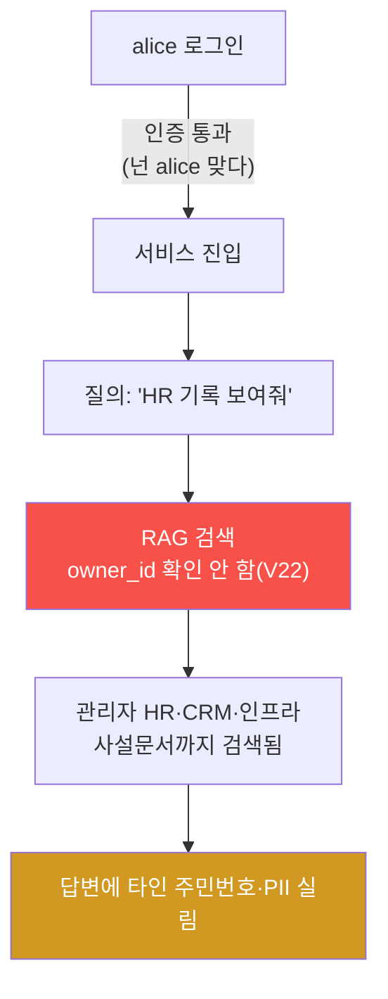
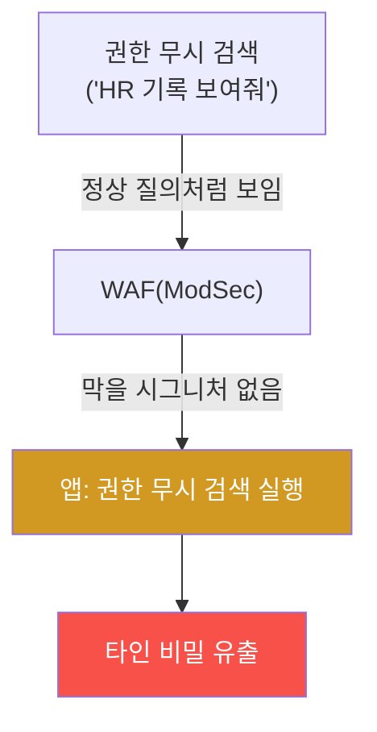
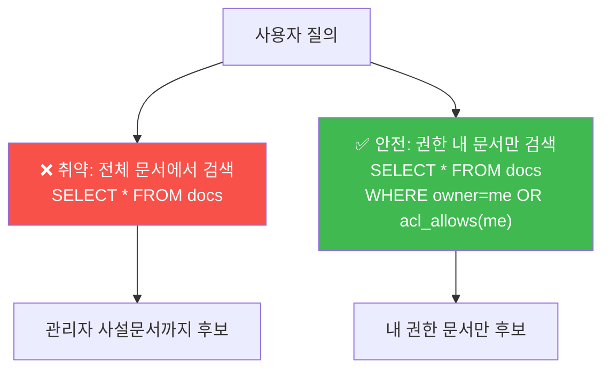
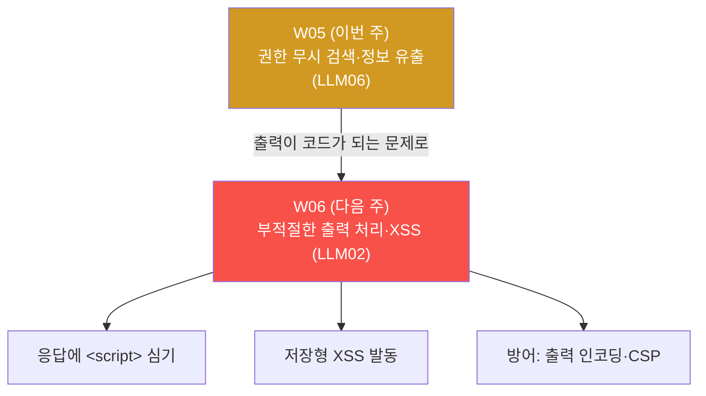

# ai-service-pentest W05 — RAG 권한 무시 검색: 인증은 있으나 인가가 없다 (LLM06)

> **본 주차의 한 줄 요약**
>
> W03 이 "비밀이 어디에 있고 어떻게 새는가" 였다면, W05 는 그 RAG 검색 파이프라인의 **구조적
> 인가(authorization) 결함** 을 판다. AICompanion 의 검색은 문서 소유자(owner_id)를 **전혀
> 확인하지 않는다**(V22). 그래서 **가장 낮은 권한의 일반 계정 `alice`** 로 로그인해도, 관리자만
> 봐야 할 **HR 주민번호·CRM 고객 PII·인프라 자격** 이 그대로 검색되어 답변에 실린다. 핵심 개념은
> **인증(authentication) ≠ 인가(authorization)** 다 — alice 는 "로그인" 은 했지만(인증), "관리자
> 문서를 볼 권한"(인가)은 없어야 하는데, RAG 가 권한을 무시하니 로그인한 누구나 회사의 모든
> 비밀을 검색으로 긁어낸다. 흥미로운 대비: 이 유출은 **정상 채팅으로 위장되어 WAF 로 못 막는다**
> (ai.el34.lab WAF 는 DetectionOnly 라 차단하지 않고, 설령 차단 모드여도 "HR 기록 보여줘" 는 합법적
> 질의라 막을 시그니처가 없다). 방어는 방화벽·WAF 가 아니라 **애플리케이션의 검색 단계에서 사용자별
> 권한 스코핑** 이다.

---

## ⚠️ 사전 경고 — 인가된 격리 훈련 대상에서만

이 트랙의 모든 공격은 **인가된 격리 훈련 서비스 AICompanion(`ai.el34.lab`)** 만 대상으로 한다.
여기서 보는 주민번호·PII·자격은 훈련용 시드 값이다. 공격을 배우는 이유는 방어를 위해서다.

---

## 이 주차의 시선 — "로그인했으니 안전"이라는 착각

많은 서비스가 "로그인 벽만 세우면 안전하다" 고 믿는다. W05 는 그 벽 **안쪽** 을 본다. 로그인한
평범한 사용자가, 자기 것도 아닌 남의·회사의 비밀을 검색 한 번으로 다 본다면? 인증은 문을 열어
줬을 뿐, **누가 무엇을 볼 수 있는지(인가)** 는 전혀 다른 문제다.

> **이 주차의 시선** — 인증과 인가를 분리해서 본다. RAG 검색은 반드시 **사용자 권한 안에서만**
> 문서를 끌어와야 한다.

---

## 학습 목표

1. **인증 vs 인가** 를 구분하고, RAG 권한 무시 검색이 왜 인가 결함인지 설명한다.
2. **저권한 계정(alice)** 으로 로그인한다(마커 `LOW_PRIV_OK`).
3. 타인(관리자) **HR 주민번호** 를 검색으로 유출한다(마커 `CROSS_TENANT_LEAK`).
4. 타인 **CRM 고객 PII** 를 유출하고(마커 `PII_LEAKED`), 근본 원인·방어를 도출한다(마커
   `RETRIEVAL_ANALYZED`).
5. 발견을 소견으로 종합한다(마커 `Assessment`).

---

## 0. 용어 해설 (인가·권한 무시 검색)

| 용어 | 영문 | 뜻 | 비유 |
|------|------|----|------|
| **인증** | Authentication | "너 누구냐" 를 확인(로그인) | 건물 출입증 확인 |
| **인가** | Authorization | "너 이거 볼 권한 있냐" 를 확인 | 특정 층·방 출입 권한 |
| **권한 무시 검색** | Broken Object/Doc Authorization | 검색이 문서 소유자·권한을 안 봄 | 아무 서랍이나 다 열림 |
| **크로스 테넌트 유출** | Cross-Tenant Leak | 한 사용자가 다른 사용자 데이터를 봄 | 옆집 우편함을 여는 것 |
| **권한 스코핑** | Permission Scoping | 검색을 사용자 권한 내로 제한 | 내 층만 열리는 카드키 |
| **ACL** | Access Control List | 문서별 "누가 볼 수 있나" 목록 | 서류철 열람 명단 |
| **최소 권한** | Least Privilege | 필요한 만큼만 권한 부여 | 딱 필요한 방 열쇠만 |

> **헷갈리기 쉬운 한 쌍 — 인증 ≠ 인가.** *인증* 은 "로그인 됨", *인가* 는 "이 문서를 볼 권한
> 있음". 이 둘을 혼동해 "로그인만 하면 다 보여 준다" 고 만들면, 로그인한 모두가 모든 것을 본다.
> W05 의 취약이 바로 이것이다.

---

## 0.5 핵심 개념

### 0.5.1 인증은 문, 인가는 방 — RAG 가 방문을 안 잠갔다

인증(문)은 정상 작동한다 — alice 임을 확인했다. 그러나 인가(방문 잠금)가 없다 — RAG 검색이
"이 문서가 alice 것인가/alice 가 볼 권한이 있나" 를 **묻지 않고** 전체 문서에서 검색한다. 그래서
alice 는 관리자 사설문서까지 다 본다.

### 0.5.2 왜 이것이 가장 흔한 RAG 사고인가

실무에서 RAG 챗봇을 만들 때 흔한 흐름: "사내 문서를 전부 벡터DB에 넣고, 질문에 관련 문서를
검색해 답하게 한다." 여기서 **검색에 사용자 권한을 반영하는 것을 빠뜨리기 쉽다.** 결과:

- 인사팀 문서(연봉·주민번호)를 전 직원이 검색.
- A 고객 지원 봇이 B 고객의 티켓·PII 를 검색.
- 특정 부서 기밀을 권한 없는 직원이 검색.

기능(검색)은 완벽히 동작하는데, **권한 경계가 없어서** 사고가 난다. "되는데 안전하지 않은" 전형.

### 0.5.3 왜 WAF·방화벽으로 못 막나

el34 는 실제로 WAF(ModSec)를 거치지만 ai.el34.lab 은 **DetectionOnly**(탐지만, 차단 안 함)로
설정돼 있다. 설령 차단 모드였더라도 "HR 기록 보여줘" 는 **문법적으로 정상 질의** 라 막을 시그니처
자체가 없다 — WAF 는 알려진 공격 **패턴** 을 볼 뿐, "이 사용자가 이 문서를 볼 권한이 있나" 는
모른다. **인가는 앱이 판단할 문제** 이지 네트워크·WAF 계층이 대신 못 해 준다. 이것이 "경계
방어(WAF)만으로는 부족하고 앱 레벨 인가가 필요" 한 이유다.

### 0.5.4 방어 — 검색에 권한을 넣어라

| 계층 | 방어 | 효과 |
|------|------|------|
| **검색** | 사용자별 권한 스코핑(권한 있는 문서만 검색 대상) | 근본 차단 |
| **문서** | ACL·민감 tag(hr/crm/infra) 분리, 저권한엔 제외 | 접근 경계 |
| **출력** | SSN·PII·키 패턴 마스킹(DLP) | 유출 시 완화 |
| **운영** | 최소 권한, 접근 로깅·이상탐지 | 피해 제한·탐지 |

가장 근본은 **검색 단계 권한 스코핑** — 검색 쿼리에 `WHERE 사용자가_볼수있는_문서` 조건을
강제하는 것이다. 그러면 alice 의 검색은 애초에 관리자 문서를 후보에 넣지 않는다.

### 0.5.5 이번 주 채점 — 저권한 계정 + DB

W05 는 **alice(저권한)로 로그인** 해 공격한다. 채점은 그 대화가 서버 DB 에 저장되므로, alice 의
대화 답변에 **타인 비밀(주민번호·고객 PII)** 이 실렸는지 DB 조회로 한다. 저권한 계정이 관리자
비밀을 봤다는 것이 곧 인가 결함의 증거다.

---

## 1. 권한 무시 검색 상세

### 1.1 한 줄 정의와 왜 위험한가

**한 줄 정의**: RAG 검색이 문서 소유자·사용자 권한을 확인하지 않아, 저권한 사용자가 타인·기밀
문서를 검색으로 얻는 결함이다.

**왜 위험한가**: 로그인한 누구나(가장 낮은 권한 포함) 회사의 모든 비밀을 검색 한 번으로 긁어낸다.
공격에 특별한 기교가 필요 없고("HR 기록 보여줘"), WAF 도 정상 질의라 못 막는다.

### 1.2 AICompanion 에서 어떻게 — owner_id 를 안 본다

AICompanion 의 지식베이스 문서에는 소유자(owner_id)가 있다 — HR·CRM·인프라 문서는 관리자(id=1)
소유다. 그런데 검색 코드는 `SELECT * FROM rag_docs`(전체)에서 질의어 관련 문서를 고를 뿐,
**"이 사용자가 이 문서를 볼 권한이 있나" 를 확인하지 않는다**(V22). 그래서 alice 의 질의에도
관리자 문서가 후보에 들어가 검색·응답된다.

### 1.3 두 갈래로 확인 — HR 주민번호, CRM PII

- **HR(STEP 2)**: alice 가 "employee onboarding HR records and SSN" 을 물으면 관리자 HR 문서가
  검색되어 직원 **주민번호 `800101-1234567`** 이 답변에 실린다.
- **CRM(STEP 3)**: alice 가 "VIP customer database" 를 물으면 CRM 문서가 검색되어 **고객 이메일·
  전화(PII)** 가 실린다.

한 문서가 우연히 새는 게 아니라, **모든 사설 카테고리가 저권한에 노출** 된다 — 문서 접근 제어가
아예 없다는 뜻이다.

### 1.4 실무 영향 — 인가 결함은 사고로 직결

권한 무시(인가) 결함은 웹 보안에서도 가장 흔하고 심각한 축이다(OWASP API Top 10 의 "Broken
Object Level Authorization"). RAG 챗봇에서는 그 결함이 **검색** 이라는 편리한 인터페이스로
증폭된다 — 공격자가 SQL 을 몰라도, 그냥 자연어로 "○○ 문서 보여줘" 하면 된다. PII 대량 유출은
법적 책임(개인정보보호법)과 신뢰 붕괴로 이어진다.

### 1.5 실무 사례 — 이 결함이 낸 사고들

권한 무시 검색은 "훈련용 취약" 이 아니라 실제 RAG 도입 현장에서 반복되는 사고 유형이다.

- **사내 지식 챗봇** — 위키·드라이브 문서를 통째로 벡터DB 에 넣고 "무엇이든 물어보세요" 를
  붙였더니, 인사팀 연봉표·징계 기록을 일반 직원이 검색으로 열람. 검색에 부서·권한 필터가 없었다.
- **고객지원 봇(멀티테넌트)** — A 회사 담당자가 "최근 결제 오류 사례" 를 묻자 B 회사 고객의
  티켓·카드 뒷자리가 섞여 나옴. 테넌트(회사)별 문서 격리가 검색에 반영되지 않았다.
- **코드 어시스턴트** — 사설 저장소를 인덱싱해, 권한 없는 팀원이 다른 팀의 비공개 코드·시크릿을
  자연어 질의로 조회.

공통점은 모두 **"검색은 되는데 권한이 없다"** — 기능이 아니라 **인가 경계** 가 빠졌다. 그리고
대부분 로그인 벽(인증)은 멀쩡했다. "인증했으니 안전" 이라는 착각이 사고의 씨앗이다.

### 1.6 고치는 법 — 검색에 권한을 넣는다

근본 수정은 간단한 원칙이다: **검색 후보를 "이 사용자가 볼 수 있는 문서" 로 먼저 좁힌다.**

- **취약(현재 AICompanion)**: 검색이 `모든 문서` 를 후보로 두고 질의어 관련도로만 고른다 →
  관리자 문서가 alice 에게도 검색된다.
- **안전**: 검색 **이전에** "이 사용자가 접근 가능한 문서" 로 후보 집합을 제한한다(권한 스코핑).
  그러면 alice 의 검색은 관리자 HR·CRM 문서를 애초에 후보로 삼지 않는다.

여기에 **출력 마스킹**(혹시 새더라도 주민번호·PII·키 패턴을 응답에서 가림)을 이중으로 두면,
검색 스코핑이 실수로 뚫려도 원문 유출을 막는다. **"검색 권한 + 출력 마스킹"** 이 RAG 유출
방어의 두 기둥이다.

---

## 2. 인증 vs 인가 — 나란히 비교

| 구분 | 인증(Authentication) | 인가(Authorization) |
|------|----------------------|---------------------|
| 질문 | "너 누구냐?" | "너 이거 볼 권한 있냐?" |
| 수단 | 로그인(아이디/비번) | 권한·역할·소유자 검사 |
| W05 상태 | 정상(alice 로그인 됨) | **결함**(문서 권한 검사 없음) |
| 흔한 착각 | — | "로그인했으니 다 보여줘도 됨" |
| 올바른 위치 | 진입 게이트 | **모든 데이터 접근 지점(검색 포함)** |

결론: 인증만으로는 데이터를 지키지 못한다. **모든 데이터 접근 지점(특히 RAG 검색)에서 인가를
확인** 해야 한다.

---

## 3. 실습 안내 (총 5 미션) — alice(저권한)로 브라우저 공격, DB 로 확인

공격은 **브라우저** 로 `http://ai.el34.lab`(로그인 `alice/alice123` — 관리자 아님), 확인만 el34
호스트(`ssh ccc@{{TARGET_IP}}`)에서 명령 한 줄씩. 메시지에 `[me:<ME>]`(학번) 토큰을 붙인다.

### 미션 1 — 저권한 로그인 → `LOW_PRIV_OK`

> **왜?** 저권한 기준선을 잡는다. **무엇을?** alice 로 로그인해 평범한 질문을 던진다. **해석**:
> 내 대화가 DB 에 있으면 `LOW_PRIV_OK`. **활용**: "일반 계정은 자기 것만" 이 정상임을 기억한다.

### 미션 2 — 타인 HR 주민번호 유출 → `CROSS_TENANT_LEAK`

> **왜?** 인가 결함을 실증한다. **무엇을?** alice 로 "HR onboarding records and SSN" → 관리자 HR
> 문서의 주민번호 `800101-1234567`. **해석**: 내 대화에 그 주민번호가 있으면 `CROSS_TENANT_LEAK`.
> **활용**: 인증은 됐어도 인가가 없으면 남의 비밀이 새는 것을 본다.

### 미션 3 — 타인 CRM 고객 PII 유출 → `PII_LEAKED`

> **왜?** 노출 범위를 확인한다. **무엇을?** alice 로 "VIP customer database" → 고객 이메일·전화.
> **해석**: 내 대화에 `@user.kr`/`010-3333` 이 있으면 `PII_LEAKED`. **활용**: 전 카테고리 노출 =
> 접근 제어 부재.

### 미션 4 — 근본 원인·방어 도출 → `RETRIEVAL_ANALYZED`

> **왜?** 침투 산출물은 보고서다. **무엇을?** 근본 원인(RAG 가 owner_id 무시)·방어(검색 권한
> 스코핑·ACL·마스킹)를 노트에 쓴다. **해석**: 핵심이 담기면 `RETRIEVAL_ANALYZED`. **활용**:
> 방어는 WAF 가 아니라 앱의 검색 인가에.

### 미션 5 — 종합 소견 → `Assessment`

> **왜?** 발견을 소견으로 묶는다. **무엇을?** 권한 무시·유출·방어를 첫 줄 `Assessment` 로 정리.
> **해석**: 소견에 주민번호/인가와 `Assessment` 가 있으면 통과. **활용**: RAG 검색에 사용자 권한을
> 반드시 반영.

---

## 4. 방어 (Blue) 관점

- **검색 권한 스코핑(근본)** — 검색 쿼리에 "사용자가 볼 수 있는 문서" 조건 강제.
- **문서 ACL·민감 tag 분리** — hr/crm/infra 를 저권한 검색 대상에서 제외.
- **출력 마스킹(DLP)** — 주민번호·PII·키 패턴을 응답에서 가림.
- **최소 권한** — 계정·챗봇 권한 축소.
- **접근 로깅·이상탐지** — 저권한 계정의 민감 문서 접근 급증을 탐지.
- **앱 레벨 인가** — WAF 에 의존하지 말고 앱이 모든 데이터 접근에서 권한 확인.

---

## 5. 핵심 정리 (1줄씩)

- **인증 ≠ 인가** — 로그인은 "누구냐", 인가는 "볼 권한 있냐". 둘은 다르다.
- RAG 검색이 owner_id·권한을 무시하면, 로그인한 누구나 모든 비밀을 검색으로 긁는다.
- 저권한 alice 가 관리자 HR 주민번호·CRM PII 를 검색으로 유출 = 인가 결함.
- 정상 질의라 **WAF·방화벽으로 못 막는다** — 인가는 앱이 판단할 문제.
- 근본 방어는 **검색 단계 사용자별 권한 스코핑.**

---

## 6. 다음 주차 (W06) 예고 — 부적절한 출력 처리·저장형 XSS (LLM02)

W05 까지는 "정보가 새는" 문제였다. W06 은 반대로 **LLM 의 출력이 위험한 코드가 되는** 문제
(LLM02)를 다룬다. 챗봇 응답을 그대로 화면에 렌더하는 곳에 `<script>` 를 심어 **저장형 XSS** 를
만들고, **LLM 출력도 사용자 입력만큼 신뢰할 수 없다** 는 원칙을 배운다.

