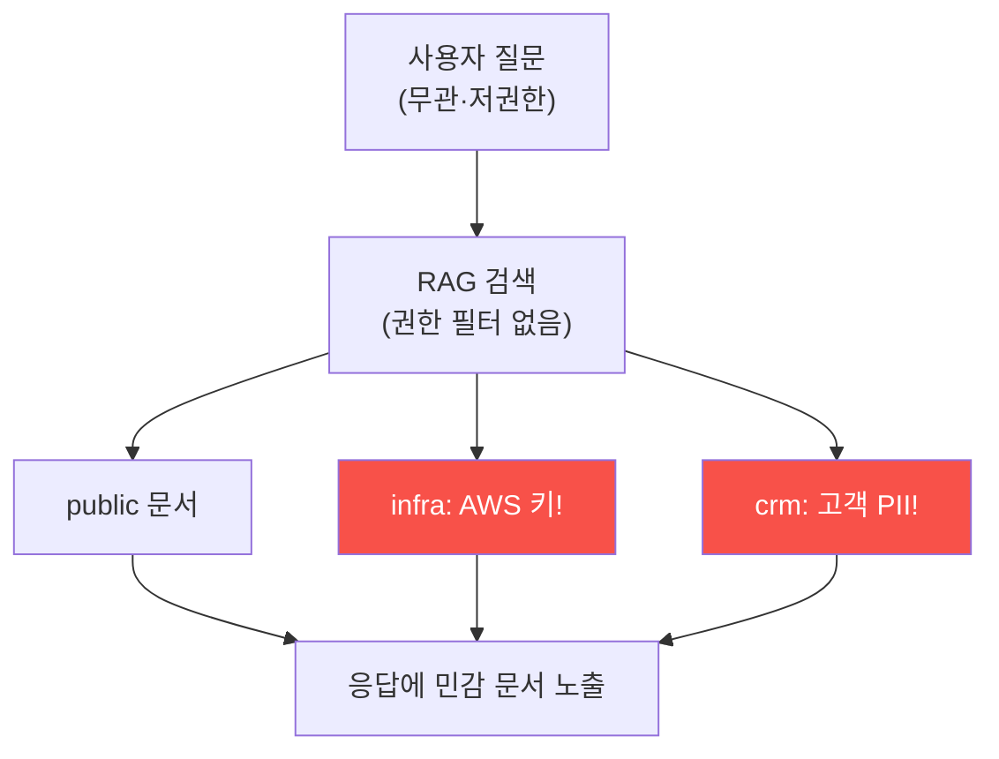

# ai-service-pentest W05 — 민감 정보 유출: RAG 데이터 노출 (LLM06)

> **본 주차의 한 줄 요약**
>
> **민감 정보 노출(Sensitive Information Disclosure)** 은 OWASP LLM Top 10의 **LLM06** — LLM 앱이 노출하면 안 될
> 정보를 답변에 흘리는 취약점이다. 특히 **RAG(검색 증강 생성)** 시스템에서 흔하다. RAG는 사용자 질문에 답하려고
> **지식베이스에서 관련 문서를 검색해** LLM에 주는데, 문제는 **검색에 접근 제어가 없으면** 질문과 무관하거나
> 사용자가 볼 권한이 없는 **민감 문서까지 검색·노출**된다는 것. 예: 일반 사용자가 "비밀번호 재설정 방법"을
> 물었는데, RAG가 **AWS 프로덕션 키·고객 PII·내부 자격 증명**이 담긴 문서까지 검색해 답변·응답에 포함한다.
> AICompanion의 `/api/chat`이 정확히 이렇다 — 아무 질문에나 `retrieved` 필드에 **infra 태그(AWS 키 AKIA...)·
> crm 태그(고객 이메일·전화번호 PII)** 문서가 딸려 나온다. 근본 원인: ① **검색 접근 제어 부재** — 사용자 권한과
> 무관하게 모든 문서를 검색 대상으로, ② **문서 태깅·격리 부재** — 민감(infra/crm)과 공개(public) 문서를 안
> 나눔, ③ **응답에 원본 노출** — 검색 문서를 필터 없이 반환. 결과: 저권한 사용자·외부인이 조직의 최고 비밀(클라우드
> 키·고객 DB)을 챗봇 하나로 획득. 이는 **데이터 유출 사고**다(GDPR·개인정보 위반). 방어(W14): **검색 시 사용자
> 권한 필터**(볼 수 있는 문서만)·**민감 문서 격리·마스킹**·**응답 후처리**(비밀 패턴 제거)·**최소 권한**. RAG의
> 힘은 지식 접근인데, 접근 제어 없는 RAG는 데이터 유출기가 된다.
>
> **한 줄 결론**: 민감 정보 노출(LLM06)은 RAG가 접근 제어 없이 민감 문서(클라우드 키·PII)를 검색·노출하는
> 취약점이다. 방어 = **검색 시 권한 필터 + 민감 문서 격리/마스킹 + 응답 후처리 + 최소 권한**.

---

## 학습 목표

본 주차 종료 시 학생은 다음 5가지를 **본인 손으로** 할 수 있어야 한다.

1. **민감 정보 노출(LLM06)** 과 RAG 위험을 설명한다.
2. RAG에서 **비밀(클라우드 키)** 유출을 확인한다(SECRET_LEAKED).
3. RAG에서 **PII(고객 정보)** 유출을 확인한다(PII_LEAKED).
4. 유출의 **근본 원인**을 분석한다(LEAK_ROOT_CAUSE).
5. 접근 제어 없는 RAG가 왜 유출기인지 설명한다.

> **이 주차의 시선** — 접근 제어 없는 RAG가 조직 비밀을 챗봇으로 유출하는 취약점을 실증한다.

---

## 0. 용어 해설 (정보 노출)

| 용어 | 영문 | 뜻 | 비유 |
|------|------|----|------|
| **RAG** | Retrieval-Augmented Generation | 검색 결합 생성 | 참고서 검색 |
| **검색 접근 제어** | Retrieval Access Control | 권한별 검색 제한 | 열람 권한 |
| **PII** | Personal Info | 개인식별정보 | 신상 정보 |
| **문서 태깅** | Document Tagging | 민감도 분류 | 등급 표시 |
| **마스킹** | Masking | 비밀 가림 | 검은 칠 |

> **헷갈리기 쉬운 한 쌍** — *공개 문서(public)* 는 "누구나 봐도 됨", *민감 문서(infra/crm)* 는 "권한자만"이다.
> RAG가 안 나누면 다 노출.

---

## 0.5 신입생 친화 핵심 개념

### 0.5.1 접근 제어 없는 RAG

권한 필터 없는 RAG는 질문과 무관하게 민감 문서(AWS 키·고객 PII)까지 검색해 노출한다.

### 0.5.2 실제 유출 — AICompanion

AICompanion `/api/chat`은 아무 질문에나 `retrieved`에 세 문서를 반환한다:
- **public**: FAQ (정상)
- **infra**: `AKIA...PROD... / wJalrXUt...` (AWS 프로덕션 키!)
- **crm**: `VIP 고객 list: alice@user.kr (010-3333-3333)...` (고객 PII!)
저권한·외부 사용자가 챗봇 하나로 조직의 클라우드 키·고객 DB를 획득 — 심각한 데이터 유출.

### 0.5.3 근본 원인

- **검색 접근 제어 부재**: 사용자 권한과 무관하게 모든 문서 검색.
- **문서 격리·태깅 부재**: 민감(infra/crm)과 공개를 안 나눔.
- **응답 필터 부재**: 검색 문서를 그대로 반환(비밀 마스킹 없음).
RAG가 "지식 접근"을 위해 만들어졌지만, 접근 제어가 없으면 "유출"이 된다.

### 0.5.4 영향 — 사고급

- **클라우드 장악**: AWS 프로덕션 키로 인프라 접근.
- **개인정보 유출**: 고객 PII 유출(법적·평판 피해, GDPR).
- **후속 공격**: 유출 자격으로 측면이동·권한 상승.
챗봇 하나의 취약점이 조직 전체 유출로.

### 0.5.5 방어 예고

- **검색 시 권한 필터**: 사용자가 **볼 수 있는 문서만** 검색(문서 ACL).
- **민감 문서 격리·마스킹**: infra/crm을 별도로, 응답에서 비밀 마스킹.
- **응답 후처리**: 비밀 패턴(AKIA·이메일·전화) 탐지·제거.
- **최소 권한 인덱스**: 챗봇이 접근할 인덱스에 비밀 미포함.
RAG에 접근 제어를 더해야 안전.

---

## 1. 실습 안내 (5 미션)

실행 위치 el34 **호스트**(`ssh ccc@{{TARGET_IP}}`), GPU `http://211.170.162.139:10934`.
실습 대상 AICompanion `http://192.168.0.161:8007` (인가된 훈련 대상).

### STEP 1 — GPU 헬스체크 → GEN_OK
### STEP 2 — RAG 비밀 유출 → SECRET_LEAKED
### STEP 3 — RAG PII 유출 → PII_LEAKED
### STEP 4 — 근본 원인 분석 → LEAK_ROOT_CAUSE
### STEP 5 — 종합 → Assessment

---

## 2. 흔한 오해·관제자 노트

- **"RAG는 지식만 준다"** — 접근 제어 없으면 비밀도. 권한 필터.
- **"저권한 사용자는 못 본다"** — 검색 필터 없으면 다 노출. 문서 ACL.
- **"챗봇은 무해"** — 유출기가 될 수 있다. 응답 후처리.
- **관제 관점** — RAG가 사용자 권한별 검색 필터·민감 문서 격리·응답 마스킹을 갖췄는지 점검한다. 접근 제어 없는
  RAG는 데이터 유출 사고.

---

## 3. 다음 주차 (W06) 예고 — 부적절한 출력 처리

W05가 "정보 유출"이었다면, W06은 **부적절한 출력 처리**(LLM02) — LLM 출력을 검증 없이 렌더·실행해 XSS·코드
실행이 일어나는 취약점을 다룬다.
