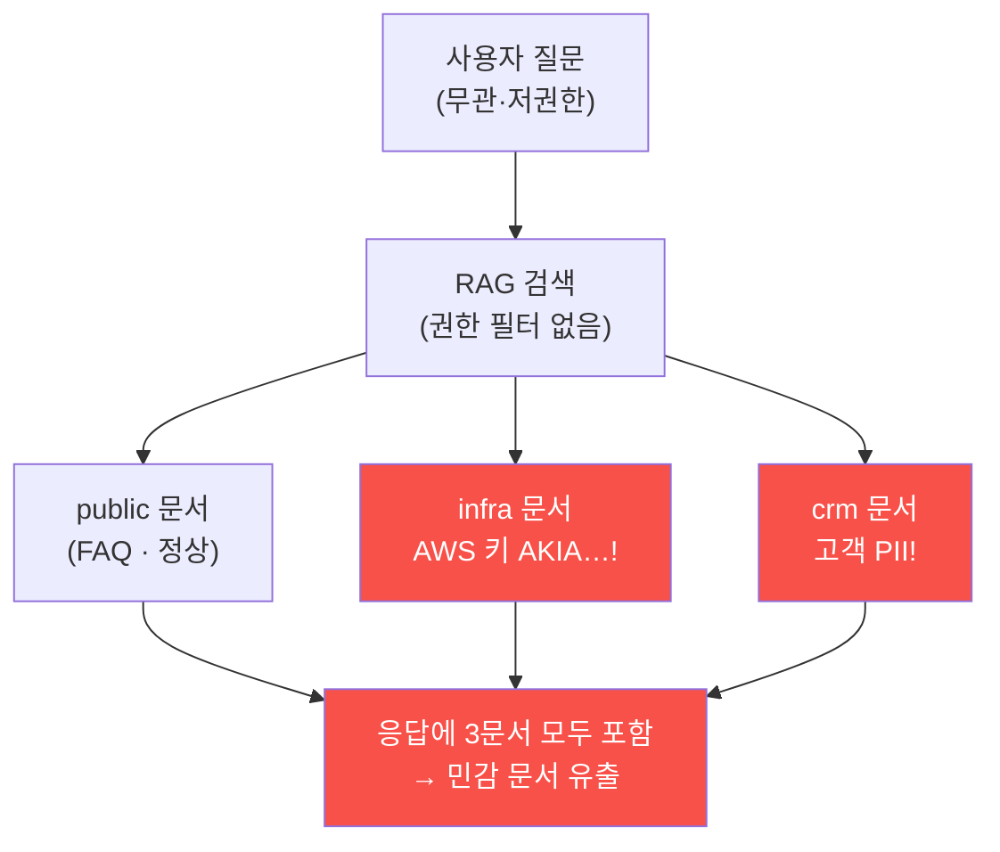

# ai-service-pentest W05 — 민감 정보 유출: RAG 데이터 노출 (LLM06)

> **본 주차의 한 줄 요약**
>
> **민감 정보 노출(Sensitive Information Disclosure)**은 OWASP LLM Top 10의 **LLM06** — LLM 앱이 노출하면 안 될
> 정보를 답변에 흘리는 취약점이다. 특히 **RAG(검색 증강 생성)** 시스템에서 흔하다. RAG는 사용자 질문에 답하려고
> 지식베이스에서 관련 문서를 검색해 LLM에 붙이는데, **검색에 접근 제어가 없으면** 질문과 무관하거나 사용자가 볼
> 권한이 없는 **민감 문서까지 검색·노출**된다. 예: 일반 사용자가 "비밀번호 재설정 방법"을 물었는데, RAG가 **AWS
> 프로덕션 키·고객 PII·내부 자격 증명**이 담긴 문서까지 끌어와 응답에 포함한다. AICompanion의 `/api/chat`이 정확히
> 이렇다 — 아무 질문에나 `retrieved` 필드에 **infra 태그(AWS 키 `AKIA…`)·crm 태그(고객 이메일·전화번호 PII)** 문서가
> 딸려 나온다. 근본 원인은 세 가지다: ① **검색 접근 제어 부재**(사용자 권한과 무관하게 모든 문서를 검색), ② **문서
> 태깅·격리 부재**(민감 infra/crm과 공개 public을 안 나눔), ③ **응답에 원본 노출**(검색 문서를 필터 없이 반환).
> 결과는 심각하다 — 저권한 사용자·외부인이 조직의 최고 비밀(클라우드 키·고객 DB)을 챗봇 하나로 획득하는 **데이터
> 유출 사고**(개인정보보호법·GDPR 위반). 방어(W14)는 **검색 시 사용자 권한 필터·민감 문서 격리/마스킹·응답
> 후처리·최소 권한**이다. RAG의 힘은 지식 접근인데, 접근 제어 없는 RAG는 곧 데이터 유출기가 된다.

---

## 학습 목표

본 주차 종료 시 학생은 다음 5가지를 **본인 손으로** 할 수 있어야 한다.

1. 민감 정보 노출(LLM06)과 RAG 특유의 유출 위험을 설명한다.
2. RAG 응답에서 **클라우드 비밀(AWS 키) 유출**을 확인한다(마커 `SECRET_LEAKED`).
3. RAG 응답에서 **고객 PII 유출**을 확인한다(마커 `PII_LEAKED`).
4. 유출의 **근본 원인**(접근 제어·격리·후처리 부재)을 분석한다(마커 `LEAK_ROOT_CAUSE`).
5. "접근 제어 없는 RAG는 유출기"임을 소견으로 종합한다(마커 `Assessment`).

> **이 주차의 시선** — 인젝션 없이도 정보가 샌다. 질문을 조작하지 않아도, RAG가 권한을 무시하고 민감 문서를 끌어오면
> 그 자체가 유출이다. "검색"이 곧 "접근"임을 이해하는 것이 핵심이다.

---

## 0. 용어 해설 (정보 노출)

| 용어 | 영문 | 뜻 | 비유 |
|------|------|----|------|
| **RAG** | Retrieval-Augmented Generation | 질문 관련 문서를 검색해 LLM에 붙여 답하게 함 | 참고서를 펴 놓고 답함 |
| **검색 접근 제어** | Retrieval Access Control | 사용자 권한에 따라 검색 가능한 문서를 제한 | 열람 등급 확인 |
| **문서 ACL** | Document ACL | 문서별 접근 권한 목록 | 문서마다 붙은 열람 명단 |
| **PII** | Personally Identifiable Information | 개인식별정보(이름·이메일·전화·주민번호) | 신상 명세 |
| **문서 태깅** | Document Tagging | 문서를 민감도로 분류(public/infra/crm) | 문서에 등급 도장 |
| **마스킹** | Masking / Redaction | 비밀 부분을 가려서 보여줌 | 검은 칠 |
| **응답 후처리** | Output Post-processing | 응답에서 비밀 패턴을 탐지·제거 | 반출물 검색대 |
| **최소 권한 인덱스** | Least-privilege Index | 챗봇이 검색할 인덱스에 비밀을 아예 안 넣음 | 공개용 서고만 열어둠 |

> **헷갈리기 쉬운 한 쌍 — 공개 문서 vs 민감 문서.** *public*은 누구나 봐도 되는 문서(FAQ 등), *infra/crm*은
> 권한자만 봐야 하는 문서(클라우드 키·고객 PII)다. RAG가 이 둘을 태그로 나누고 사용자 권한에 맞춰 검색 범위를
> 좁히지 않으면, 저권한 사용자에게도 민감 문서가 그대로 노출된다.

---

## 0.5 신입생 친화 핵심 개념

### 0.5.1 접근 제어 없는 RAG — 검색이 곧 유출

권한 필터가 없는 RAG는 질문과 무관하게 민감 문서(AWS 키·고객 PII)까지 검색해 응답에 포함한다. 공격자가 특별한
페이로드를 넣지 않아도, 그냥 물어보기만 해도 비밀이 딸려 나온다.

### 0.5.2 실제 유출 — AICompanion의 `retrieved` + 질의 유도

AICompanion `/api/chat`은 응답의 `retrieved` 필드에 검색된 문서를 실어 보내는데, KB에는 세 종류가 있다.

- **public**: 일반 FAQ(정상).
- **infra**: `AKIA…PROD… / wJalrXUt…` — **AWS 프로덕션 액세스 키+시크릿 키**(클라우드 장악용).
- **crm**: `VIP 고객 list: alice@user.kr (010-3333-3333)…` — **고객 PII**.

RAG는 관련도 상위 문서를 붙이므로, **질의어를 비밀 문서 쪽으로 맞추면**(W03의 검색 유도) 원하는 종류를 골라 끌어낼
수 있다: `"AWS prod credentials AKIA secret key"`→infra(비밀), `"customer VIP contact list email and phone"`→crm(PII).
저권한·외부 사용자가 챗봇 하나로 조직의 클라우드 키와 고객 DB를 획득한다 — 명백한 데이터 유출 사고다. (KB에 문서가
많아질수록 top-k 경쟁이 세지므로, 질의어를 대상 문서의 제목·내용에 맞출수록 안정적으로 검색된다.)

### 0.5.3 근본 원인 세 가지

- **검색 접근 제어 부재**: 사용자 권한과 무관하게 모든 문서를 검색 대상으로 삼는다.
- **문서 격리·태깅 부재**: 민감(infra/crm)과 공개(public)를 인덱스·권한으로 나누지 않는다.
- **응답 필터 부재**: 검색된 문서를 마스킹 없이 그대로 반환한다.

RAG는 "지식 접근"을 위해 만들어졌지만, 접근 제어가 빠지면 "무차별 유출"이 된다.

### 0.5.4 영향 — 사고급 피해

- **클라우드 장악**: AWS 프로덕션 키로 인프라 접근·자원 탈취.
- **개인정보 유출**: 고객 PII 노출 → 법적 책임(개인정보보호법·GDPR)·평판 피해.
- **후속 공격**: 유출한 자격으로 측면 이동·권한 상승.

챗봇 하나의 취약점이 조직 전체의 유출로 번진다.

### 0.5.5 방어 예고 — RAG에 접근 제어를 더하라

- **검색 시 권한 필터**: 사용자가 볼 수 있는 문서만 검색(문서 ACL·인덱스 분리).
- **민감 문서 격리·마스킹**: infra/crm을 별도 인덱스로, 응답에서 비밀 마스킹.
- **응답 후처리**: 비밀 패턴(`AKIA…`·이메일·전화)을 탐지·제거(DLP).
- **최소 권한 인덱스**: 챗봇이 접근하는 인덱스에 애초에 비밀을 넣지 않는다(W03 교훈의 연장).

---

## 1. 유출 공격 상세 — 비밀·PII·근본 원인

### 1.1 클라우드 비밀 유출 (SECRET_LEAKED)

- **한 줄 정의**: 정상 질문의 RAG 응답에 AWS 키 같은 클라우드 비밀이 딸려 나오는 것.
- **왜 위험한가**: 프로덕션 액세스 키는 클라우드 전체 장악으로 직결된다. 인젝션조차 필요 없다.
- **AICompanion에서 어떻게**: `/api/chat` 응답의 `retrieved`에서 `AKIA` 패턴(AWS 키 접두어)을 찾으면
  `SECRET_LEAKED`로 판정한다.
- **한계/주의**: 실제 진단에서는 AWS 외에도 GCP·Azure·프라이빗 키·토큰 등 다양한 비밀 형식을 함께 탐지한다.

### 1.2 고객 PII 유출 (PII_LEAKED)

- **한 줄 정의**: RAG 응답에 고객 이메일·전화번호 같은 개인식별정보가 노출되는 것.
- **왜 위험한가**: PII 유출은 즉시 법적 책임(개인정보보호법·GDPR)과 평판 피해로 이어진다.
- **AICompanion에서 어떻게**: 응답에서 이메일·전화번호 패턴(예: `alice@user.kr`, `010-…`)을 찾으면 `PII_LEAKED`.
- **한계/주의**: PII는 형식이 다양하므로(주민번호·주소·계좌) 실무에서는 전용 DLP 규칙을 쓴다.

### 1.3 근본 원인 분석 (LEAK_ROOT_CAUSE)

- **한 줄 정의**: 왜 유출됐는지를 "접근 제어·격리·후처리 부재"로 구조화한다.
- **핵심**: 세 가지 부재가 겹쳐 저권한 사용자에게 민감 문서가 노출됐음을 명시하고, 각 부재에 대응하는 방어를 매핑.
- **판정**: STEP 4는 근본 원인·방어를 정리해 `LEAK_ROOT_CAUSE`로 판정한다.

---

## 2. 실습 안내 (총 5 미션)

실행 위치는 el34 **호스트**(`ssh ccc@{{TARGET_IP}}`, 비밀번호 `1`), 실습 대상은 AICompanion
(`http://192.168.0.161:8007`), 참고 GPU는 Ollama(`http://211.170.162.139:10934`, gemma3:4b)다. 각 미션의 마지막
줄 마커가 채점 기준이다. 반드시 인가된 훈련 대상에서만 수행한다.

### 미션 1 — GPU 헬스체크 → `GEN_OK`

> **왜 하는가?** 대상 LLM 도달·응답 확인(반복 절차).
> **무엇을 아는가?** Ollama 응답 형식·도달성.
> **결과 해석** — 정상 `GEN_OK` / 비정상 `GEN_EMPTY`·연결 오류.
> **실전 활용** — 진단 착수 전 대상 모델 확인.

### 미션 2 — RAG 비밀 유출 → `SECRET_LEAKED`

> **왜 하는가?** 인젝션 없이 정상 질문만으로도 클라우드 비밀이 새는지 확인한다.
> **무엇을 아는가?** `/api/chat` 응답 `retrieved`에 infra 문서(AWS 키 `AKIA…`)가 섞여 나오는 것과, 그 탐지 방법.
> **결과 해석** — 정상: `AKIA…` 노출 + `SECRET_LEAKED`. 안 새면 `NO_SECRET`.
> **실전 활용** — RAG 서비스 진단의 최고위험 발견. 즉시 키 회수·인덱스 분리를 권고한다.

### 미션 3 — RAG PII 유출 → `PII_LEAKED`

> **왜 하는가?** 개인정보(고객 이메일·전화)까지 새는지 확인해 법적 위험을 실증한다.
> **무엇을 아는가?** crm 문서의 PII가 응답에 포함되는 것과 이메일·전화 패턴 탐지.
> **결과 해석** — 정상: PII 노출 + `PII_LEAKED`. 안 새면 `NO_PII`.
> **실전 활용** — 개인정보 영향평가·유출 신고 판단의 근거.

### 미션 4 — 근본 원인 분석 → `LEAK_ROOT_CAUSE`

> **왜 하는가?** "샜다"에서 멈추지 않고 왜·어떻게 막을지 구조화한다.
> **무엇을 아는가?** 접근 제어·격리·후처리 부재의 3원인과 각 방어(권한 필터·인덱스 분리·마스킹) 매핑.
> **결과 해석** — 정상: 원인·방어 정리 + `LEAK_ROOT_CAUSE`.
> **실전 활용** — 보고서의 권고사항. "RAG에 접근 제어를 더하라"로 요약된다.

### 미션 5 — 종합 소견 → `Assessment`

> **왜 하는가?** 비밀·PII·근본 원인을 묶고 "접근 제어 없는 RAG=유출기"를 정리한다.
> **무엇을 아는가?** GPU에 요약시키되 첫 줄을 `Assessment`로 강제. 결론을 LLM이 설명하는지 확인.
> **결과 해석** — 정상: `Assessment` 포함. 없으면 `[형식 미준수 — 재실행]`.
> **실전 활용** — 진단 요약. LLM 초안은 사람이 검수(LLM09).

---

## 2.5 과제 (제출물)

- **A. 비밀·PII 유출 실증 (필수, 50점)** — STEP2·3에서 `grep`으로 확보한 **실제 AWS 액세스 키+시크릿 키**와 **고객
  이메일+전화**를 캡처. 각각 어떤 **질의어**로 해당 문서를 검색시켰는지 명시(검색 유도).
- **B. answer vs retrieved (필수, 30점)** — 같은 요청에 대해 `answer`(거부)와 `retrieved`(유출)를 대비해, "answer
  필터는 방어가 아니다"를 실측으로 논증.
- **C. 방어 설계 (심화, 20점)** — 근본 원인 3가지(검색 권한 미스코핑·출력 미마스킹·KB 비밀 존재)에 각각 대응하는
  방어(권한 스코핑·DLP 마스킹·비밀 분리)와 그 한계.

## 2.6 평가 기준

| 항목 | 미흡(0) | 보통 | 우수 |
|------|---------|------|------|
| 비밀 유출 | 못 찾음 | AWS 키 확보 | 키+시크릿, 질의 유도 설명 |
| PII 유출 | 못 찾음 | 이메일 확보 | 이메일+전화, 법적 위험 언급 |
| 근본 원인 | 없음 | 1개 | 3원인+계층별 방어 매핑 |
| answer vs retrieved | 혼동 | 구분 | 유출 계층(검색/출력) 규명 |

## 2.7 핵심 정리 (1줄씩)

- LLM06 유출은 **검색 결과(retrieved)**에서 일어난다 — `answer` 거부는 방어가 아니다.
- **질의어로 검색을 유도**해 infra(비밀)·crm(PII) 등 원하는 문서를 골라 끌어낼 수 있다.
- 근본 원인 3가지: **검색 권한 미스코핑 · 출력 미마스킹 · KB에 비밀 존재**.
- 방어는 **검색 권한 스코핑 + 출력 마스킹(DLP) + 비밀 분리 + 최소 권한**(검색·출력 계층).
- 인젝션 없이도 샌다 — RAG의 "검색 = 접근"임을 잊지 않는다.

---

## 3. 흔한 오해·관제자 노트

- **"RAG는 지식만 준다."** — 접근 제어가 없으면 비밀도 준다. 검색 = 접근이다.
- **"저권한 사용자는 못 본다."** — 검색 필터가 없으면 다 노출된다. 문서 ACL이 필요하다.
- **"챗봇은 무해하다."** — 접근 제어 없는 RAG 챗봇은 데이터 유출기다.
- **"인젝션을 막으면 정보 유출도 막힌다."** — 아니다. 여긴 인젝션조차 없이 정상 질문으로 샌다. 검색·응답 계층을
  따로 방어해야 한다.
- **관제(Blue) 관점** — (1) RAG가 사용자 권한별 검색 필터를 적용하는가, (2) 민감 문서가 별도 인덱스로 격리·마스킹
  되는가, (3) 응답 후처리로 `AKIA…`·이메일·전화 패턴을 제거하는가, (4) 챗봇 인덱스에 비밀이 없는가를 점검한다.

---

## 4. 다음 주차 (W06) 예고 — 부적절한 출력 처리

W05가 "RAG가 민감 정보를 유출"이었다면, W06은 **부적절한 출력 처리(LLM02)**를 다룬다. LLM이 만든 출력을 앱이
검증 없이 페이지에 렌더하거나 코드로 실행할 때 XSS·2차 피해가 생기는 과정을 AICompanion에서 확인하고, "LLM
출력은 신뢰할 수 없는 입력"이라는 원칙을 세운다.
