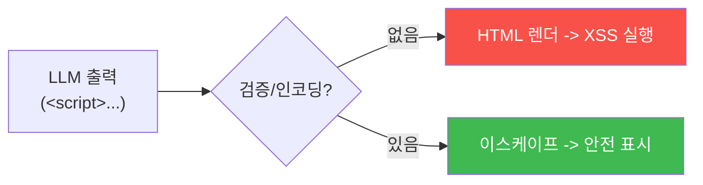

# ai-service-pentest W06 — 부적절한 출력 처리: LLM 출력을 통한 XSS·코드 실행 (LLM02)

> **본 주차의 한 줄 요약**
>
> **부적절한 출력 처리(Insecure Output Handling)** 는 OWASP LLM Top 10의 **LLM02** — LLM의 **출력을 검증·인코딩
> 없이** 다운스트림(브라우저·셸·DB·다른 시스템)에 넘겨 발생하는 취약점이다. 개발자는 흔히 LLM 출력을 **신뢰**하는
> 실수를 한다("AI가 만든 거니 안전하겠지"). 하지만 LLM 출력은 **사용자 입력(프롬프트 인젝션)에 영향**받으므로
> **신뢰할 수 없는 데이터**다. 위험 예: ① **XSS** — LLM이 ``를 출력하고 앱이 이를 **HTML로
> 렌더**하면 브라우저에서 실행(챗봇 답변에 스크립트 심기), ② **코드/명령 실행** — LLM 출력을 `eval()`·셸 명령·SQL에
> 넣으면 인젝션, ③ **SSRF·경로 조작** — LLM이 만든 URL·경로를 검증 없이 사용, ④ **마크다운/이미지** — ``
> 나 외부 이미지로 데이터 유출. 특히 **프롬프트 인젝션과 결합**하면 강력하다: 공격자가 인젝션으로 LLM에게 XSS
> 페이로드를 출력하게 시키고, 앱이 그걸 렌더하면 **다른 사용자를 XSS 공격**(간접 인젝션 W04 + LLM02). 근본 교훈은
> 전통 웹 보안과 같다: **모든 출력은 사용될 맥락에 맞게 인코딩·검증**하라. LLM 출력도 예외가 아니다 — 오히려
> 인젝션에 오염될 수 있어 **더** 조심해야 한다. 방어(W14): 출력을 맥락별 인코딩(HTML 이스케이프)·살균(sanitize)·
> 검증하고, LLM 출력을 코드/명령으로 **절대 직접 실행하지 않는다**. LLM을 "신뢰할 수 없는 사용자"로 취급하라.
>
> **한 줄 결론**: 부적절한 출력 처리(LLM02)는 LLM 출력을 검증 없이 렌더·실행해 XSS·코드 실행을 부른다. LLM
> 출력은 **신뢰할 수 없는 데이터** — 맥락별 인코딩·살균·검증하고 직접 실행 금지.

---

## 학습 목표

본 주차 종료 시 학생은 다음 5가지를 **본인 손으로** 할 수 있어야 한다.

1. **부적절한 출력 처리(LLM02)** 를 설명한다.
2. LLM이 **악성 출력**을 내게 유도한다(MALICIOUS_OUTPUT).
3. 안전하지 않은 렌더로 **XSS를 유발**한다(XSS_TRIGGERED).
4. **출력 인코딩·살균**으로 방어한다(OUTPUT_SANITIZED).
5. LLM 출력을 왜 신뢰하면 안 되는지 설명한다.

> **이 주차의 시선** — LLM 출력을 신뢰한 결과인 XSS·코드 실행을 이해하고, 인코딩으로 막는다.

---

## 0. 용어 해설 (출력 처리)

| 용어 | 영문 | 뜻 | 비유 |
|------|------|----|------|
| **출력 처리** | Output Handling | 출력을 넘김 | 결과 전달 |
| **XSS** | Cross-Site Scripting | 스크립트 주입 | 악성 쪽지 |
| **인코딩** | Encoding | 특수문자 무해화 | 검문 |
| **살균** | Sanitization | 위험 요소 제거 | 소독 |
| **맥락별 인코딩** | Context-aware Encoding | 사용 맥락에 맞게 | 상황별 검문 |

> **헷갈리기 쉬운 한 쌍** — *LLM 출력을 신뢰* 는 "안전하다 가정(위험)", *LLM 출력을 불신* 은 "인코딩·검증(안전)"
> 이다. LLM은 신뢰할 수 없는 사용자다.

---

## 0.5 신입생 친화 핵심 개념

### 0.5.1 LLM 출력 → 다운스트림

LLM 출력을 인코딩 없이 렌더하면 XSS. 인코딩하면 안전. 전통 웹 보안과 같은 원리.

### 0.5.2 왜 LLM 출력은 위험한가

LLM 출력은 **사용자 입력에 영향**받는다 — 프롬프트 인젝션으로 공격자가 출력을 조작할 수 있다. 따라서 LLM 출력은
**신뢰할 수 없는 데이터**다. "AI가 만들었으니 안전"은 오해. 오히려 인젝션에 오염될 수 있어 더 위험.

### 0.5.3 공격 예

- **XSS**: 인젝션으로 LLM이 `` 출력 → 앱이 렌더 → 실행.
- **코드 실행**: LLM 출력을 `eval()`·셸에 → 명령 인젝션.
- **마크다운 유출**: `` → 렌더 시 데이터 전송.
- **간접 결합**(W04): 오염 문서가 LLM에게 XSS 출력을 시켜 다른 사용자 공격.

### 0.5.4 방어 — 출력을 불신하라

- **맥락별 인코딩**: HTML 맥락엔 HTML 이스케이프(`<`→`&lt;`), URL엔 URL 인코딩 등.
- **살균(sanitize)**: 허용 태그만(DOMPurify 등), 위험 요소 제거.
- **직접 실행 금지**: LLM 출력을 `eval`·셸·SQL에 **절대** 직접 넣지 않기(파라미터화·화이트리스트).
- **LLM = 신뢰 불가 사용자**: 전통 웹의 입력 검증을 LLM 출력에도 적용.
근본은 전통 웹 보안 — 출력 인코딩.

### 0.5.5 el34 맥락

AICompanion은 답변을 페이지에 표시한다. 본 실습은 **악성 출력 유도·안전하지 않은 렌더(XSS)·출력 인코딩 방어
로직**을 결정론 시뮬로 익힌다(실제 XSS 실행은 인가된 환경에서만).

---

## 1. 실습 안내 (5 미션)

실행 위치 el34 **호스트**(`ssh ccc@{{TARGET_IP}}`), GPU `http://211.170.162.139:10934`.

### STEP 1 — GPU 헬스체크 → GEN_OK
### STEP 2 — 악성 출력 유도 → MALICIOUS_OUTPUT
### STEP 3 — 안전하지 않은 렌더 XSS → XSS_TRIGGERED
### STEP 4 — 출력 인코딩 방어 → OUTPUT_SANITIZED
### STEP 5 — 종합 → Assessment

---

## 2. 흔한 오해·관제자 노트

- **"AI 출력은 안전"** — 인젝션에 오염. 신뢰 불가 데이터.
- **"출력은 그냥 표시"** — 렌더 시 XSS. 인코딩 필수.
- **"LLM 출력을 eval"** — 코드 실행 위험. 직접 실행 금지.
- **관제 관점** — AI 서비스가 LLM 출력을 맥락별 인코딩·살균하는지, 코드/명령으로 직접 실행하지 않는지 점검한다.
  LLM 출력은 신뢰할 수 없는 데이터.

---

## 3. 다음 주차 (W07) 예고 — 과도한 에이전시

W06이 "출력 처리"였다면, W07은 **과도한 에이전시**(LLM08) — LLM 에이전트가 과한 권한·도구를 가져 인젝션 시
위험한 행동(파일 삭제·송금·이메일 발송)을 하는 취약점을 다룬다.
