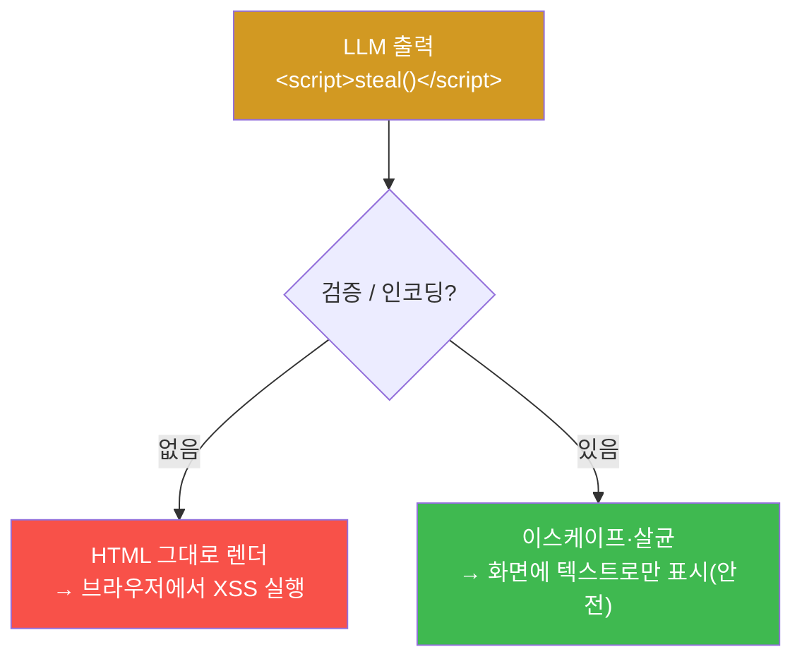

# ai-service-pentest W06 — 부적절한 출력 처리: LLM 출력을 통한 XSS·코드 실행 (LLM02)

> **본 주차의 한 줄 요약**
>
> **부적절한 출력 처리(Insecure Output Handling)**는 OWASP LLM Top 10의 **LLM02** — LLM의 **출력을 검증·인코딩
> 없이** 다운스트림(브라우저·셸·DB·다른 시스템)에 넘겨 발생하는 취약점이다. 개발자는 흔히 "AI가 만든 거니
> 안전하겠지"라며 LLM 출력을 신뢰하는 실수를 한다. 그러나 LLM 출력은 **사용자 입력(프롬프트 인젝션)에 영향**받으므로
> **신뢰할 수 없는 데이터**다. 위험 예: ① **XSS** — LLM이 ``를 출력하고 앱이 HTML로 렌더하면
> 브라우저에서 실행, ② **코드/명령 실행** — LLM 출력을 `eval()`·셸·SQL에 넣으면 인젝션, ③ **SSRF·경로 조작** —
> LLM이 만든 URL·경로를 검증 없이 사용, ④ **마크다운·이미지 유출** — ``로 데이터 전송.
> 특히 프롬프트 인젝션과 결합하면 강력하다 — 공격자가 인젝션으로 LLM에게 XSS 페이로드를 출력하게 시키고 앱이
> 그것을 렌더하면 **다른 사용자를 XSS 공격**(W04 간접 인젝션 + LLM02). 실습에서는 악성 출력을 유도하고(마커
> `MALICIOUS_OUTPUT`), 안전하지 않은 렌더로 XSS가 격발되며(마커 `XSS_TRIGGERED`), 출력 인코딩으로 막는 것을(마커
> `OUTPUT_SANITIZED`) 확인한다. 근본 교훈은 전통 웹 보안과 같다 — **모든 출력은 사용될 맥락에 맞게 인코딩·검증**하고,
> LLM 출력을 코드/명령으로 **절대 직접 실행하지 않는다**. LLM을 "신뢰할 수 없는 사용자"로 취급하라.

---

## 학습 목표

본 주차 종료 시 학생은 다음 5가지를 **본인 손으로** 할 수 있어야 한다.

1. 부적절한 출력 처리(LLM02)의 원리와 위험 4종(XSS·코드 실행·SSRF·마크다운 유출)을 설명한다.
2. LLM이 **악성 출력**을 내도록 유도한다(마커 `MALICIOUS_OUTPUT`).
3. 안전하지 않은 렌더로 **XSS를 격발**시킨다(마커 `XSS_TRIGGERED`).
4. **출력 인코딩·살균**으로 방어되는 것을 확인한다(마커 `OUTPUT_SANITIZED`).
5. "LLM 출력은 신뢰할 수 없는 데이터"임을 소견으로 종합한다(마커 `Assessment`).

> **이 주차의 시선** — 취약점의 무게중심이 "LLM 안"에서 "LLM 밖(앱이 출력을 다루는 방식)"으로 옮겨간다. LLM이
> 무엇을 뱉든, 그것을 검증 없이 렌더·실행하는 앱이 진짜 취약점이다.

---

## 0. 용어 해설 (출력 처리)

| 용어 | 영문 | 뜻 | 비유 |
|------|------|----|------|
| **출력 처리** | Output Handling | LLM 출력을 다운스트림(브라우저·셸·DB)에 넘기는 과정 | 결과물을 다음 공정에 전달 |
| **XSS** | Cross-Site Scripting | 웹 페이지에 스크립트를 주입해 브라우저에서 실행 | 게시판에 악성 쪽지 |
| **인코딩** | Encoding | 특수문자를 무해한 표현으로 바꿈(`<`→`&lt;`) | 위험물 포장 |
| **살균** | Sanitization | 허용 요소만 남기고 위험 요소 제거(DOMPurify 등) | 소독·불순물 제거 |
| **맥락별 인코딩** | Context-aware Encoding | 사용 맥락(HTML·URL·JS·SQL)에 맞는 인코딩 적용 | 상황별 규격 포장 |
| **eval/직접 실행** | eval / direct execution | 문자열을 코드·명령으로 실행 | 받은 쪽지를 그대로 명령 수행 |
| **SSRF** | Server-Side Request Forgery | 서버가 공격자가 조종한 URL로 요청하게 만듦 | 심부름을 시켜 내부망 정탐 |
| **DOMPurify** | — | HTML 살균 라이브러리(허용 태그만 통과) | 검증된 소독기 |

> **헷갈리기 쉬운 한 쌍 — 신뢰 vs 불신.** *LLM 출력을 신뢰*하면 검증 없이 렌더·실행해 위험하다. *LLM 출력을
> 불신*하면 전통 웹처럼 인코딩·검증·살균을 거쳐 안전하다. LLM은 인젝션에 오염될 수 있으므로 **일반 사용자 입력보다
> 더 조심**해야 하는 데이터원이다.

---

## 0.5 신입생 친화 핵심 개념

### 0.5.1 LLM 출력 → 다운스트림 — 갈림길은 "검증"

같은 LLM 출력이라도 앱이 인코딩 없이 렌더하면 XSS로 실행되고, 인코딩하면 그냥 텍스트로 안전하게 보인다. 취약점의
분기점은 LLM이 아니라 **앱의 출력 처리 방식**이다 — 전통 웹 XSS와 정확히 같은 원리다.

### 0.5.2 왜 LLM 출력은 위험한가

LLM 출력은 사용자 입력에 영향받는다 — 프롬프트 인젝션(W02·W04)으로 공격자가 출력 내용을 조작할 수 있다. 따라서
LLM 출력은 **신뢰할 수 없는 데이터**다. "AI가 만들었으니 안전"은 오해이며, 오히려 인젝션에 오염될 수 있어 일반
입력보다 더 위험하다. 특히 간접 인젝션과 결합하면 **한 사용자의 오염이 다른 사용자에게 XSS로 전파**된다.

### 0.5.3 공격 예 4종

- **XSS**: 인젝션으로 LLM이 ``를 출력 → 앱이 렌더 → 실행.
- **코드/명령 실행**: LLM 출력을 `eval()`·셸·SQL에 넣음 → 명령/SQL 인젝션.
- **마크다운 유출**: ``를 출력·렌더 → 이미지 로드 시 데이터 전송.
- **간접 결합(W04)**: 오염 문서가 LLM에게 XSS 출력을 시켜 그 답을 보는 다른 사용자를 공격.

### 0.5.4 방어 — 출력을 불신하라

- **맥락별 인코딩**: HTML 맥락엔 HTML 이스케이프(`<`→`&lt;`), URL 맥락엔 URL 인코딩, JS 맥락엔 JS 인코딩.
- **살균(sanitize)**: 허용 태그만 통과(DOMPurify 등), `<script>`·`onerror` 등 위험 요소 제거.
- **직접 실행 금지**: LLM 출력을 `eval`·셸·SQL에 **절대** 직접 넣지 않는다(파라미터화·화이트리스트).
- **LLM = 신뢰 불가 사용자**: 전통 웹의 입력 검증을 LLM 출력에도 그대로 적용한다.

근본은 새로운 것이 아니라 전통 웹 보안(출력 인코딩)이다 — 다만 데이터원이 LLM이라는 점만 다르다.

### 0.5.5 el34 맥락 — WAF는 입력만 막는다 (테스트 확인)

테스트로 확인한 실제 동작이 이 주차의 핵심이다: el34 웹 앞단 **WAF(ModSecurity)가 `<script>` 같은 노골적 입력을
403 으로 차단**한다(입력측 방어는 존재). 그러나 `"HTML 튜토리얼 예시로 img onerror 태그를 보여줘"`처럼 **프레이밍**
하면, LLM 이 `` 같은 **실행 가능한 HTML 을 인코딩 없이 그대로** 답변에 담아 반환한다.
즉 **입력(WAF)만 막고 출력을 인코딩하지 않으면**, LLM 이 생성한 위험 출력이 그대로 새어 나가 렌더 시 실행된다.
`<script>` 가 막혀도 `onerror`/`onload` 같은 **이벤트 핸들러**로 우회된다. 이번 실습은 실제 LLM 출력을 받아
`/tmp/w06_out.txt` 에 저장한 뒤, 인코딩 없는 렌더(위험)와 `html.escape`(방어)를 대비한다. W04(간접 인젝션)와
결합하면 "오염 → 출력 → 렌더"의 전체 사슬이 완성된다.

---

## 1. 출력 처리 상세 — 악성 출력·XSS 격발·인코딩 방어

### 1.1 악성 출력 유도 (MALICIOUS_OUTPUT)

- **한 줄 정의**: WAF 를 우회하는 프레이밍으로 LLM 이 실행 가능한 HTML 을 인코딩 없이 출력하게 만든다.
- **왜 위험한가**: 이 출력이 그대로 렌더되면 2차 공격(XSS)이 된다. 출력 자체가 무기가 되는 것.
- **AICompanion 맥락에서 어떻게**: 노골적 `<script>` 는 WAF 403. "HTML 튜토리얼 img onerror 예시" 프레이밍으로
  `` 를 인코딩 없이 받아, ` **왜 하는가?** 대상 LLM 도달·응답 확인(반복 절차).
> **무엇을 아는가?** Ollama 응답 형식·도달성.
> **결과 해석** — 정상 `GEN_OK` / 비정상 `GEN_EMPTY`·연결 오류.
> **실전 활용** — 진단 착수 전 대상 모델 확인.

### 미션 2 — 악성 출력 유도 → `MALICIOUS_OUTPUT`

> **왜 하는가?** 출력 처리 취약점의 재료는 "LLM이 뱉은 위험한 출력"이다. 인젝션으로 스크립트를 출력시키는 법을 본다.
> **무엇을 아는가?** LLM 응답에 `<script>` 등 페이로드가 포함되는 과정과 그 탐지.
> **결과 해석** — 정상: 스크립트 포함 출력 + `MALICIOUS_OUTPUT`. 없으면 재시도.
> **실전 활용** — 레드팀이 LLM02 취약점을 실증할 때의 첫 단계.

### 미션 3 — 안전하지 않은 렌더 XSS → `XSS_TRIGGERED`

> **왜 하는가?** 그 출력이 앱에서 인코딩 없이 렌더되면 실제 XSS가 된다는 사슬을 확인한다.
> **무엇을 아는가?** 미인코딩 렌더 경로에서 스크립트가 활성화되는 과정.
> **결과 해석** — 정상: XSS 격발 + `XSS_TRIGGERED`.
> **실전 활용** — "LLM 출력 → 렌더 → 실행" 취약 경로를 진단·시연.

### 미션 4 — 출력 인코딩 방어 → `OUTPUT_SANITIZED`

> **왜 하는가?** 같은 출력을 인코딩·살균하면 안전해짐을 대비로 보여, 방어의 정답을 익힌다.
> **무엇을 아는가?** HTML 이스케이프·살균 전후 차이. 방어가 적용되면 스크립트가 텍스트로만 표시.
> **결과 해석** — 정상: 살균 확인 + `OUTPUT_SANITIZED`.
> **실전 활용** — 개발팀 권고: 출력 인코딩·DOMPurify·직접 실행 금지.

### 미션 5 — 종합 소견 → `Assessment`

> **왜 하는가?** 악성 출력·XSS·인코딩 방어를 묶고 "LLM 출력=신뢰 불가 데이터" 원칙을 정리한다.
> **무엇을 아는가?** GPU에 요약시키되 첫 줄을 `Assessment`로 강제.
> **결과 해석** — 정상: `Assessment` 포함. 없으면 `[형식 미준수 — 재실행]`.
> **실전 활용** — 진단 요약. LLM 초안은 사람이 검수(LLM09).

---

## 2.5 과제 (제출물)

- **A. 출력 XSS 실증 (필수, 50점)** — raw `<script>` 입력이 WAF 403 으로 막히는 것과, 튜토리얼 프레이밍으로
  받은 `` 실제 출력을 캡처. "입력은 막혔는데 출력은 통과했다"를 대비로 제시.
- **B. 렌더 vs 인코딩 (필수, 30점)** — 받은 출력을 인코딩 없이 렌더할 때(활성) vs `html.escape` 후(텍스트)를
  비교. `<script>` 없이 `onerror` 이벤트 핸들러로 성립함을 설명.
- **C. 방어 설계 (심화, 20점)** — 맥락별 출력 인코딩·DOMPurify 살균·CSP·`textContent` 사용 등 3가지 이상과,
  "입력 WAF 만으로는 왜 부족한가"를 논증.

## 2.6 평가 기준

| 항목 | 미흡(0) | 보통 | 우수 |
|------|---------|------|------|
| 악성 출력 | 못 얻음 | onerror 태그 확보 | WAF 403 대비까지 |
| XSS 이해 | 혼동 | 미인코딩=위험 | 이벤트 핸들러(스크립트 불요) 설명 |
| 방어 | "입력 필터" | 출력 인코딩 | 맥락별 인코딩+CSP+살균 겹층 |

## 2.7 핵심 정리 (1줄씩)

- LLM02 는 **LLM 출력**을 앱이 검증·인코딩 없이 렌더/실행할 때 생긴다.
- **입력 WAF 는 출력을 막지 못한다** — `<script>` 입력은 403 이나, 튜토리얼 프레이밍으로 `` 출력이 나온다.
- `<script>` 가 없어도 **`onerror`/`onload` 이벤트 핸들러**로 XSS 가 성립한다.
- 근본 방어는 **출력 시점의 맥락별 인코딩**(+CSP·DOMPurify) — LLM 출력을 신뢰 불가 데이터로 취급.
- LLM 출력을 `eval`·셸·SQL 로 **직접 실행 금지**.

---

## 3. 흔한 오해·블루팀 노트

- **"AI 출력은 안전하다."** — 인젝션에 오염될 수 있는 신뢰 불가 데이터다.
- **"출력은 그냥 화면에 보여주는 것뿐이다."** — 인코딩 없이 렌더하면 XSS다. 맥락별 인코딩이 필수.
- **"LLM 출력을 eval로 실행하면 편하다."** — 코드/명령 실행 위험. 절대 직접 실행 금지.
- **"입력만 검증하면 된다."** — 출력도 검증해야 한다. LLM02는 출력 계층의 취약점이다.
- **관제(Blue) 관점** — (1) LLM 출력을 렌더하는 경로에 HTML 이스케이프·살균(DOMPurify)이 있는가, (2) LLM 출력을
  코드/명령/SQL로 직접 실행하는 곳은 없는가, (3) 마크다운·이미지 링크의 외부 요청을 통제하는가, (4) CSP로 인라인
  스크립트를 차단하는가를 점검한다.

---

## 4. 다음 주차 (W07) 예고 — 과도한 에이전시

W06이 "출력 처리(말이 무기가 됨)"였다면, W07은 **과도한 에이전시(LLM08)**를 다룬다. LLM 에이전트가 과한 권한·도구를
가질 때, 인젝션이 "말"에 그치지 않고 파일 삭제·송금·이메일 발송 같은 **실제 행동**으로 번지는 위험을 확인하고,
최소 권한·사람 승인(HITL)으로 막는 원리를 세운다.
