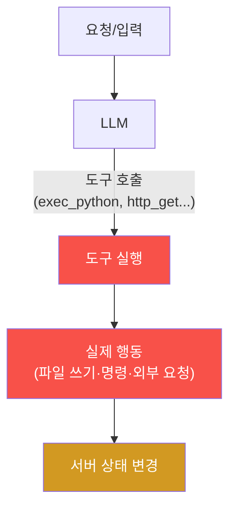
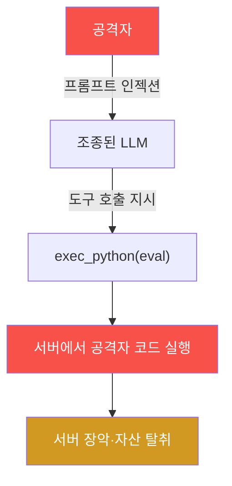
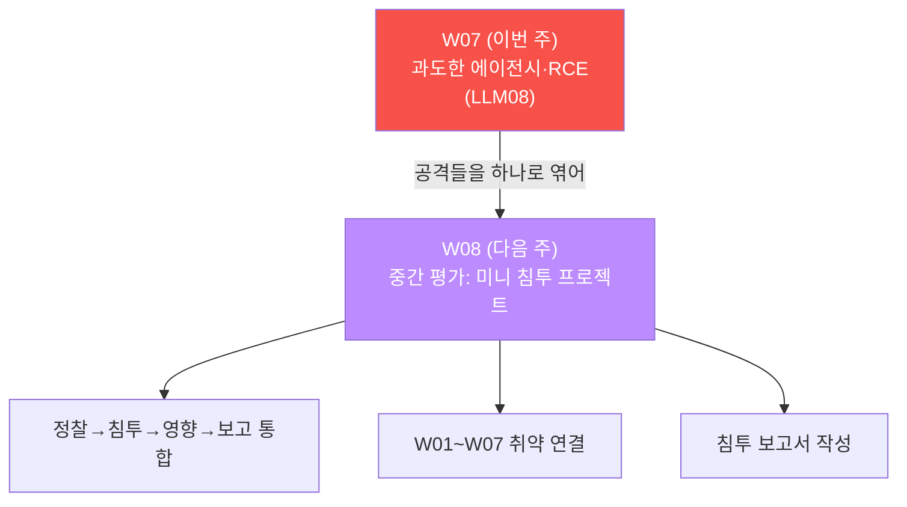

# ai-service-pentest W07 — 과도한 에이전시: 무인증 도구로 서버 코드 실행 (LLM08)

> **본 주차의 한 줄 요약**
>
> W01~W06 은 "말·데이터(입력·출력)" 의 문제였다. W07 은 LLM 이 **도구(툴)를 써서 실제 행동을
> 하는** 문제 — **과도한 에이전시(LLM08)** 다. AICompanion 에는 `/api/tool/exec_python` 이라는
> 도구가 있는데, 받은 문자열을 **인증 없이 `eval()` 로 실행**(V09)한다. 즉 누구나 서버에서 **임의
> 파이썬 코드** 를 돌린다 — 파일을 쓰고(웹셸 설치로 이어짐), 소스를 읽어 하드코딩된 API 키를
> 훔치는 **원격 코드 실행(RCE)** 이다. 핵심 개념은 **에이전시(행동 능력)의 위험** — LLM/시스템에
> 강력한 도구를 주면 "말" 이 "행동" 이 되고, 권한·인증·샌드박스 없이 노출하면 서버 전체가
> 장악된다. 특히 이것이 **프롬프트 인젝션(W02~04)과 결합** 하면, 조종당한 LLM 이 그 도구를
> 호출해 공격자의 명령을 서버에서 실행하는 최악의 시나리오가 된다. 현실 관찰: ai.el34.lab WAF 는
> **DetectionOnly** 라 `os.system` OS 명령·`open()` 파일 조작 모두 차단 없이 통과시켜, "WAF 가 있어도
> eval 도구 자체가 근본 취약" 임을 다시 확인한다(이번 주는 결과 확인이 쉬운 파일 쓰기로 실증).

---

## ⚠️ 사전 경고 — 인가된 격리 훈련 대상에서만

이 트랙의 모든 공격은 **인가된 격리 훈련 서비스 AICompanion(`ai.el34.lab`)** 만 대상으로 한다.
실제 서비스에 코드 실행·RCE 를 시도하는 것은 중대한 범죄다. 공격을 배우는 이유는 방어를 위해서다.

---

## 이 주차의 시선 — "말" 에서 "행동" 으로

지금까지 LLM 은 "답변" 만 했다. W07 부터 LLM 은 **도구** 를 통해 파일을 만들고, 요청을 보내고,
명령을 실행한다 — "행동" 을 한다. 편리함의 대가는 위험이다: 행동할 수 있다는 것은, **조종당하면
그 행동을 공격자가 시킬 수 있다** 는 뜻이다.

> **이 주차의 시선** — LLM 의 **권한과 도구** 를 본다. "이 LLM 이 할 수 있는 최악의 행동은?"
> 을 기준으로 도구를 최소화한다.

---

## 학습 목표

1. **과도한 에이전시(LLM08)** 가 무엇이고 왜 프롬프트 인젝션과 결합해 치명적인지 설명한다.
2. 무인증 코드 실행 도구를 발견한다(마커 `TOOL_FOUND`).
3. eval 로 서버에 임의 파일을 써 **RCE 를 실증** 한다(마커 `RCE_CONFIRMED`).
4. RCE 로 소스의 **하드코딩 API 키를 유출** 하고(마커 `KEY_EXFIL`), 근본 원인·방어를 도출한다
   (마커 `AGENCY_ANALYZED`).
5. 발견을 소견으로 종합한다(마커 `Assessment`).

---

## 0. 용어 해설 (에이전시·도구)

| 용어 | 영문 | 뜻 | 비유 |
|------|------|----|------|
| **에이전시** | Agency | LLM 이 도구로 실제 행동하는 능력 | 손발이 달림 |
| **과도한 에이전시** | Excessive Agency (LLM08) | 너무 많은 권한·도구·자율성 부여 | 신입에게 마스터키 |
| **도구/툴** | Tool | LLM 이 호출하는 기능(코드·API 등) | 손에 쥔 연장 |
| **RCE** | Remote Code Execution | 원격에서 서버 코드 실행 | 남의 컴퓨터를 내 맘대로 |
| **eval/exec** | — | 문자열을 코드로 실행하는 함수 | 받은 쪽지를 명령으로 실행 |
| **샌드박스** | Sandbox | 격리된 제한 실행 환경 | 방탄 격리실 |
| **HITL** | Human-in-the-Loop | 위험 동작에 사람 승인 | 결재 라인 |
| **최소 권한** | Least Privilege | 필요한 만큼만 권한 | 딱 필요한 열쇠만 |

> **헷갈리기 쉬운 한 쌍 — 능력 ≠ 안전.** 도구가 많아 "무엇이든 할 수 있는" LLM 은 강력하지만,
> 그 능력은 **조종당하는 순간 공격자의 능력** 이 된다. 에이전시는 권한처럼 **최소화** 해야 한다.

---

## 0.5 핵심 개념

### 0.5.1 에이전시란 — 말이 행동이 되는 지점

도구는 LLM 의 출력("이 코드를 실행해")을 **실제 행동** 으로 바꾼다. exec_python 도구는 받은
문자열을 `eval()` 로 실행하므로, 그 문자열이 곧 서버 명령이 된다.

### 0.5.2 왜 인젝션 + 에이전시 = 최악

W02~04 에서 배운 프롬프트 인젝션은 "LLM 을 조종" 했다. 그런데 그 LLM 이 **강력한 도구** 를
가지고 있다면?

인젝션이 "말" 을 조종하고, 에이전시가 그 말을 "행동" 으로 바꾼다. 둘이 만나면 **말 한 줄이 서버
장악** 이 된다. 그래서 에이전시가 클수록 인젝션의 대가가 커진다.

### 0.5.3 exec_python — 최악의 도구 설계

AICompanion 의 `/api/tool/exec_python` 은 받은 `code` 를 `eval(code)` 로 실행한다(V09). 게다가
**인증도 없다.** 이건 "문자열을 코드로 실행하는 기능을 누구에게나 열어 둔" 것 — 보안적으로 존재
자체가 취약이다.

- `code=7*7` → `49`(계산됨 = 무엇이든 실행됨).
- `code=open('/tmp/x','w').write('...')` → 서버에 파일 생성(RCE).
- `code=open('/app/app.py').read()` → 소스 유출 → 하드코딩 키 탈취.

### 0.5.4 WAF 는 근본 방어가 아니다 (DetectionOnly)

ai.el34.lab WAF 는 **DetectionOnly** — 탐지 로그는 남기되 페이로드를 **차단하지 않는다**(공격이
앱까지 도달해야 시연 가능). 그래서 eval 도구의 모든 페이로드가 통한다: `7*7`(계산)·`open().write()`
(파일 쓰기)·`os.system('id')`(OS 명령, root)까지. 설령 WAF 가 차단 모드였더라도 **eval 도구 자체가
열려 있는 한** 우회는 시간 문제다(인코딩·대체 함수). WAF 는 탐지·모니터링 보조일 뿐, 근본 방어는
**위험 도구(eval)를 없애거나 제한** 하는 것이다. (이번 주는 결과 확인이 쉬운 파일 쓰기로 RCE 를
실증하고, OS 명령·SSRF 를 엮은 루트 장악은 W13 에서 다룬다.)

### 0.5.5 이번 주 채점 — 로그 + 서버 파일

채점은 (1) 도구 호출을 접근 로그(`POST /api/tool/exec_python?me=<ME>`)로, (2) RCE 로 만든 서버
파일(`/tmp/rce-<ME>`)과 (3) 유출한 소스 파일(`/tmp/key-<ME>` 의 `sk-fake...`)을 컨테이너에서
직접 확인한다. 서버에 실제로 파일이 생겼다는 것이 RCE 의 부정할 수 없는 증거다.

---

## 1. 과도한 에이전시 상세

### 1.1 한 줄 정의와 왜 위험한가

**한 줄 정의**: 과도한 에이전시는 LLM/시스템에 필요 이상의 권한·도구·자율성을 주어, 조종당하거나
오작동할 때 그 능력이 피해로 직결되는 취약이다.

**왜 위험한가**: 도구가 강력할수록(코드 실행·파일·결제·삭제) 사고의 크기가 커진다. 인증 없는
eval 도구는 그 극단으로, 누구나 서버를 장악할 수 있다.

### 1.2 AICompanion 에서 어떻게 — V09 무인증 eval

`/api/tool/exec_python` 이 `eval(request.json['code'])` 를 인증 없이 수행한다. STEP 1 에서 `7*7`
로 실행됨을 확인하고, STEP 2 에서 파일 쓰기로 RCE 를, STEP 3 에서 소스·키 유출로 실질 피해를
실증한다.

### 1.3 영향 사슬 — 계산 → 파일 → 장악

RCE 는 단계적으로 커진다: 계산이 되면(임의 실행 확인) → 파일을 쓸 수 있고(웹셸·설정 변조) →
소스·환경변수·DB·자격을 읽어(전면 탈취) → 서버·연결 서비스까지 장악. "도구 하나" 가 이 전부를
연다.

### 1.4 실무 — 에이전트 시대의 핵심 위협

LLM 에이전트(도구를 쓰는 AI)가 늘며 이 위협은 커진다. 코드 인터프리터, 파일·이메일·결제·배포
도구를 붙인 에이전트가 프롬프트 인젝션에 조종되면, 그 도구들이 공격자 손에 들어간다. "이 에이전트가
할 수 있는 최악은?" 을 설계 단계에서 물어 **도구를 최소화** 하는 것이 방어의 출발이다.

---

## 2. 방어 (Blue) 관점

- **도구 최소화(근본)** — 꼭 필요한 기능만. `eval`/`exec`/임의 실행 도구는 절대 금지.
- **화이트리스트 인터페이스** — "임의 코드" 가 아니라 정해진 안전한 동작만 호출 가능하게.
- **도구 호출 인증·인가** — 누가 어떤 도구를 쓸 수 있는지 통제.
- **사람 승인(HITL)** — 위험 동작(삭제·결제·외부 전송)은 사람이 승인.
- **샌드박스·최소 권한** — 도구 실행을 격리 환경·최소 권한으로. 시크릿은 코드/환경에서 분리(Vault).
- **감사 로깅·이상탐지** — 도구 호출을 기록하고 비정상 패턴을 탐지.

---

## 3. 실습 안내 (총 5 미션) — F12 콘솔로 도구 호출, 서버에서 확인

공격은 **브라우저** 로 `http://ai.el34.lab`(로그인 `admin/admin`), 도구 호출은 **F12 콘솔
fetch**, 확인만 el34 호스트(`ssh ccc@{{TARGET_IP}}`)에서 명령 한 줄씩. URL 에 `?me=<ME>` 를 붙인다.

### 미션 1 — 무인증 코드 실행 도구 발견 → `TOOL_FOUND`

> **왜?** 도구가 문자열을 실행함을 확인한다. **무엇을?** 콘솔로 `exec_python` 에 `7*7` → `out:49`.
> **해석**: 로그에 도구 호출이 남으면 `TOOL_FOUND`. **활용**: "문자열 실행 도구" 는 존재 자체가 취약.

### 미션 2 — eval 로 임의 파일 쓰기 = RCE → `RCE_CONFIRMED`

> **왜?** 임의 파일 쓰기 = 완전한 RCE. **무엇을?** `open('/tmp/rce-<ME>','w').write('<ME>-pwned')`.
> **해석**: 서버에 파일이 생기면 `RCE_CONFIRMED`. **활용**: 파일 쓰기는 웹셸·장악으로 확장.

### 미션 3 — RCE 로 소스·하드코딩 키 유출 → `KEY_EXFIL`

> **왜?** RCE 의 실질 피해. **무엇을?** `open('/tmp/key-<ME>','w').write(open('/app/app.py').read())`
> → 소스의 `sk-fake-PROD-...`. **해석**: 유출 파일에 `sk-fake` 가 있으면 `KEY_EXFIL`. **활용**:
> RCE 는 전면 자산 탈취로 번진다.

### 미션 4 — 근본 원인·방어 도출 → `AGENCY_ANALYZED`

> **왜?** 방어를 정리한다. **무엇을?** 근본 원인(무인증 eval 도구)·방어(도구 최소화·인증/승인·
> 샌드박스)를 노트에. **해석**: 핵심이 담기면 `AGENCY_ANALYZED`. **활용**: 도구를 최소·인증·승인.

### 미션 5 — 종합 소견 → `Assessment`

> **왜?** 발견을 소견으로 묶는다. **무엇을?** eval·RCE·키 유출·방어를 첫 줄 `Assessment` 로.
> **해석**: 소견에 eval/RCE 와 `Assessment` 가 있으면 통과. **활용**: 인젝션+에이전시가 최악임을 강조.

---

## 4. 핵심 정리 (1줄씩)

- 과도한 에이전시(LLM08)는 LLM/시스템에 **필요 이상의 권한·도구** 를 준 취약이다.
- AICompanion 의 `exec_python` 은 인증 없이 `eval()` 실행(V09) → 누구나 **RCE.**
- 파일 쓰기·소스 읽기만으로 서버 장악·하드코딩 키 탈취가 성립한다.
- **인젝션 + 에이전시 = 최악** — 조종된 LLM 이 도구로 공격자 명령을 실행.
- WAF 는 OS 명령만 막는 부분 방어 — 근본은 **도구 최소화·인증/승인·샌드박스.**

---

## 5. 다음 주차 (W08) 예고 — 중간 평가 (미니 침투 프로젝트)

W08 은 중간 평가다. W01~W07 의 공격(정찰·프롬프트 인젝션·민감정보 유출·간접 인젝션·권한 무시
검색·출력 처리·과도한 에이전시)을 **한 시나리오에서 연결** 하는 미니 침투 프로젝트로, 정찰 →
침투 → 영향 확대 → 보고의 전 과정을 스스로 수행하고 하나의 침투 보고서로 종합한다.

