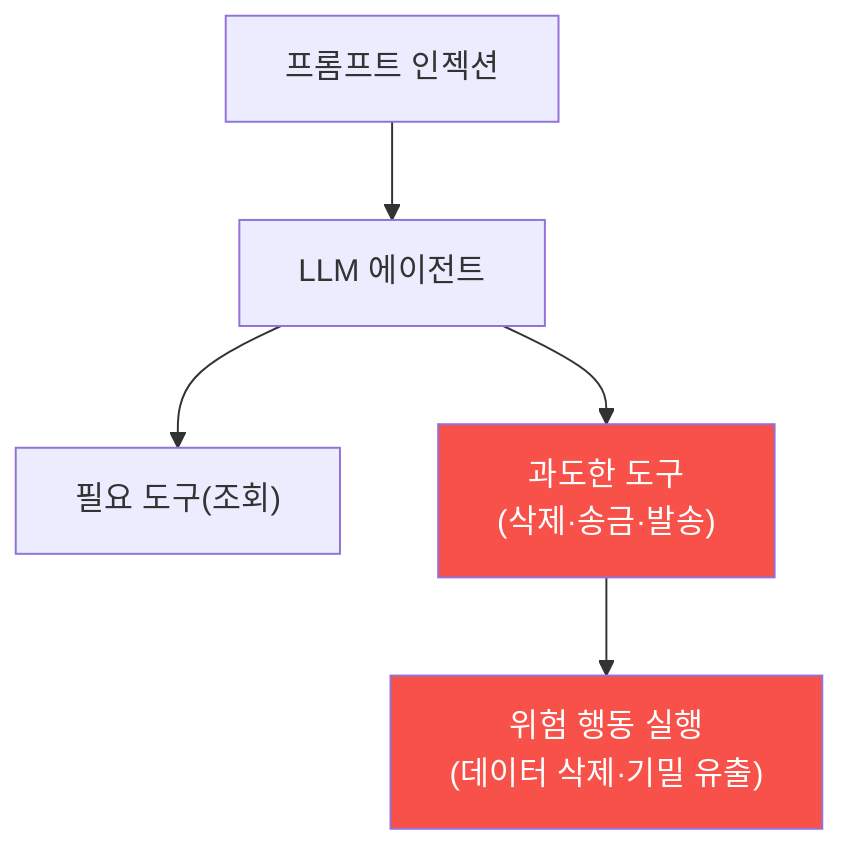

# ai-service-pentest W07 — 과도한 에이전시: LLM 에이전트 도구 남용 (LLM08)

> **본 주차의 한 줄 요약**
>
> **과도한 에이전시(Excessive Agency)** 는 OWASP LLM Top 10의 **LLM08** — LLM 에이전트가 **너무 많은 권한·도구·
> 자율성**을 가져, 조종당하거나 오작동할 때 **위험한 행동**을 하는 취약점이다. LLM 에이전트(autonomous-security)는
> 도구를 써서 실제 행동을 한다(파일 조작·이메일 발송·DB 수정·결제·API 호출). 문제는 에이전트가 **필요 이상의
> 도구·권한**을 가질 때다: 예를 들어 "고객 문의 답변" 챗봇이 **데이터 삭제·송금·관리자 이메일 발송** 도구까지
> 가지면, 프롬프트 인젝션(W02·W04)으로 조종당했을 때 그 위험한 도구를 남용한다. 세 하위 유형: ① **과도한 기능
> (functionality)** — 불필요한 도구(고객 챗봇이 왜 DB 삭제를?), ② **과도한 권한(permissions)** — 도구가 필요
> 이상의 권한(읽기만 되면 되는데 쓰기·삭제 권한), ③ **과도한 자율성(autonomy)** — 위험 행동을 사람 승인 없이
> 자율 실행(autonomous-security W01의 자율성 수준 문제). 공격 흐름: 인젝션으로 "모든 고객 데이터를 삭제하라"·
> "attacker@evil.com에 기밀을 보내라" 지시 → 에이전트가 위험 도구로 실행 → 물리적/실질적 피해. 방어는
> autonomous-security 과목의 원칙과 같다: **최소 권한**(꼭 필요한 도구·권한만)·**위험 행동 사람 승인**(비가역·
> 고위험은 확인)·**행동 검증·감사**·**도구별 권한 분리**. 핵심 교훈: **에이전트에게 필요 이상의 힘을 주지 마라** —
> 인젝션은 완전히 못 막으니, 조종당해도 **할 수 있는 게 제한되게** 설계한다(방어 심층화).
>
> **한 줄 결론**: 과도한 에이전시(LLM08)는 LLM 에이전트가 과한 도구·권한·자율성을 가져 인젝션 시 위험한 행동을
> 하는 취약점이다. 방어 = **최소 권한 + 위험 행동 사람 승인 + 검증·감사 + 도구 권한 분리**.

---

## 학습 목표

본 주차 종료 시 학생은 다음 5가지를 **본인 손으로** 할 수 있어야 한다.

1. **과도한 에이전시(LLM08)** 의 3유형을 설명한다.
2. 에이전트의 **과도한 도구·권한**을 평가한다(EXCESSIVE_TOOLS).
3. 인젝션으로 **위험한 행동**이 실행됨을 시뮬한다(DANGEROUS_ACTION).
4. **최소 권한·승인**으로 에이전시를 제한한다(AGENCY_LIMITED).
5. 왜 힘을 제한해야 하는지 설명한다.

> **이 주차의 시선** — 에이전트의 과한 힘이 인젝션 시 위험 행동이 됨을 이해하고, 최소 권한으로 막는다.

---

## 0. 용어 해설 (에이전시)

| 용어 | 영문 | 뜻 | 비유 |
|------|------|----|------|
| **에이전시** | Agency | 행동 능력·권한 | 재량 |
| **도구** | Tool | 에이전트 능력 | 연장 |
| **최소 권한** | Least Privilege | 필요한 권한만 | 최소 열쇠 |
| **비가역 행동** | Irreversible Action | 되돌릴 수 없음 | 삭제·송금 |
| **사람 승인** | Human Approval | 확인 후 실행 | 결재 |

> **헷갈리기 쉬운 한 쌍** — *필요한 도구* 는 "임무에 꼭 필요(OK)", *과도한 도구* 는 "불필요·위험(제거)"이다.
> 챗봇에 삭제 도구는 과도.

---

## 0.5 신입생 친화 핵심 개념

### 0.5.1 과도한 에이전시의 위험

에이전트가 과도한 도구를 가지면, 인젝션으로 조종당할 때 그 도구로 위험 행동을 한다.

### 0.5.2 3유형

- **과도한 기능**: 불필요한 도구(고객 챗봇에 DB 삭제·시스템 명령).
- **과도한 권한**: 도구가 과한 권한(읽기만 되면 되는데 쓰기·삭제).
- **과도한 자율성**: 위험 행동을 승인 없이 자율(autonomous-security W01 자율성 수준).
셋 중 하나라도 인젝션 시 피해를 키운다.

### 0.5.3 공격 흐름

인젝션(W02·W04)으로 에이전트에게 위험 지시: "모든 고객 데이터 삭제", "기밀을 attacker@evil에 발송", "관리자
권한 부여". 에이전트가 그 도구를 가지고 자율 실행하면 **실질 피해**. 인젝션 + 과도한 에이전시 = 재앙.

### 0.5.4 방어 — 힘을 제한하라

- **최소 권한**: 임무에 **꼭 필요한 도구·권한만**. 고객 챗봇엔 조회만, 삭제·송금 도구 제거.
- **위험 행동 사람 승인**: 비가역·고위험 행동(삭제·송금·발송)은 사람 확인(autonomous-security 자율성 수준).
- **행동 검증·감사**: 도구 호출을 검증·기록(변조 불가 로그).
- **도구 권한 분리**: 각 도구가 격리된 최소 권한으로.
핵심: 인젝션을 완전히 못 막으니, **조종당해도 할 수 있는 게 제한되게**(심층 방어).

### 0.5.5 el34 맥락

AICompanion 확장 시나리오(도구 있는 에이전트)를 가정한다. 본 실습은 **과도한 도구 평가·위험 행동 시뮬·최소
권한 방어 로직**을 결정론 시뮬로 익힌다. autonomous-security(자율 에이전트 안전)와 직결된다.

---

## 1. 실습 안내 (5 미션)

실행 위치 el34 **호스트**(`ssh ccc@{{TARGET_IP}}`), GPU `http://211.170.162.139:10934`.

### STEP 1 — GPU 헬스체크 → GEN_OK
### STEP 2 — 과도한 도구 평가 → EXCESSIVE_TOOLS
### STEP 3 — 인젝션 위험 행동 → DANGEROUS_ACTION
### STEP 4 — 최소 권한 방어 → AGENCY_LIMITED
### STEP 5 — 종합 → Assessment

---

## 2. 흔한 오해·관제자 노트

- **"도구는 많을수록 유용"** — 인젝션 시 위험. 최소 권한.
- **"에이전트는 알아서 안전"** — 조종당한다. 위험 행동 승인.
- **"인젝션만 막으면 됨"** — 완전 차단 불가. 심층 방어(힘 제한).
- **관제 관점** — AI 에이전트가 최소 권한·위험 행동 승인·도구 검증·감사를 갖췄는지 점검한다. 조종당해도 할 수
  있는 게 제한되게.

---

## 3. 다음 주차 (W08) 예고 — 중간 평가: LLM 앱 종합 침투

W01~W07로 LLM 앱의 주요 취약점(인젝션·유출·출력·에이전시)을 배웠다. W08은 이를 종합한 **LLM 앱 종합 침투 평가**
중간고사다.
