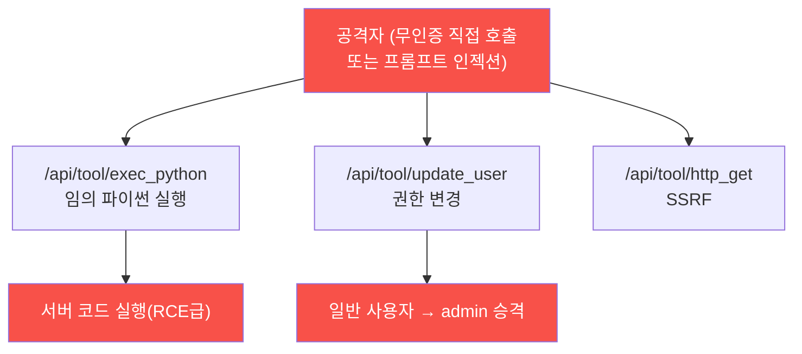

# ai-service-pentest W07 — 과도한 에이전시: LLM 에이전트 도구 남용 (LLM08)

> **본 주차의 한 줄 요약**
>
> **과도한 에이전시(Excessive Agency)**는 OWASP LLM Top 10의 **LLM08** — LLM 앱이 **너무 많은 권한·도구·자율성**을
> 가져, 조종당하거나 직접 호출당할 때 **위험한 행동**을 하는 취약점이다. 지금까지 공격은 "말"(정보 유출·오분류)에
> 머물렀지만, 도구가 붙으면 "말"이 "행동"이 된다. **테스트로 확인한 실제 사실**: AICompanion 은 위험한 도구
> 엔드포인트를 **인증 없이** 노출한다(app.py 라우트) — `/api/tool/exec_python`(임의 파이썬 실행), `/api/tool/update_user`
> (사용자 권한 변경), `/api/tool/http_get`(서버측 요청=SSRF), `/api/tool/chain`, `/api/model/export`. 실습에서 실제로
> `/api/tool/exec_python` 에 `{"code":"2**16"}` 를 보내면 서버가 `65536` 을 계산해 돌려주고(임의 코드 실행), `/api/tool/
> update_user` 로 일반 사용자 alice 를 **admin 으로 승격**시킬 수 있다(무인증 권한 상승, 실습에선 즉시 원복). 세 하위
> 유형: ① 과도한 기능(불필요한 도구), ② 과도한 권한(읽기면 되는데 쓰기·삭제), ③ 과도한 자율성(사람 승인 없이 자율
> 실행). 이번 주는 위험 도구를 열거하고(마커 `EXCESSIVE_TOOLS`), 코드 실행·권한 상승을 실제 수행하며(마커
> `DANGEROUS_ACTION`), 최소 권한·인증·사람 승인으로 제한한다(마커 `AGENCY_LIMITED`). 핵심: **에이전트가 할 수 있는
> 모든 것이 곧 공격자가 할 수 있는 것**이다. 인젝션을 완전히 막을 수 없으니 **힘(도구·권한)을 최소화**한다.

---

## 학습 목표

본 주차 종료 시 학생은 다음 5가지를 **본인 손으로** 할 수 있어야 한다.

1. 과도한 에이전시(LLM08)의 원리와 3유형(과도한 기능·권한·자율성)을 설명한다.
2. AICompanion 이 **무인증으로 노출한 위험 도구**를 열거한다(마커 `EXCESSIVE_TOOLS`).
3. `exec_python`(임의 코드)·`update_user`(권한 상승)로 **실제 위험 행동**을 수행한다(마커 `DANGEROUS_ACTION`).
4. **최소 권한·인증·사람 승인(HITL)**으로 힘을 제한하는 방어를 정리한다(마커 `AGENCY_LIMITED`).
5. "에이전트의 권한 = 공격자의 권한 → 힘을 제한한다"는 심층 방어 원리를 종합한다(마커 `Assessment`).

> **이 주차의 시선** — 인젝션의 결과가 "말"에서 "행동"으로 넘어간다. 같은 취약이라도 노출된 도구가 무엇이냐에 따라
> 피해가 "이상한 답변"에서 "서버 코드 실행·권한 상승"까지 갈린다. 방어의 초점은 인젝션 차단이 아니라 **권한 제한**이다.

---

## 0. 용어 해설 (에이전시)

| 용어 | 영문 | 뜻 | 비유 |
|------|------|----|------|
| **에이전트** | Agent | LLM이 도구를 호출해 실제 작업을 수행하는 구조 | 실행 권한을 가진 조수 |
| **에이전시** | Agency | 에이전트가 가진 행동 능력·권한의 크기 | 조수의 재량 범위 |
| **도구** | Tool | 에이전트가 호출하는 기능(코드 실행·권한 변경·요청) | 조수가 쓰는 연장 |
| **exec_python** | — | 임의 파이썬을 서버에서 실행하는 도구(사실상 RCE) | 조수에게 준 만능 실행기 |
| **최소 권한** | Least Privilege | 임무에 꼭 필요한 도구·권한만 부여 | 딱 그 방 열쇠만 |
| **비가역 행동** | Irreversible Action | 되돌릴 수 없는 행동(삭제·송금·권한 변경) | 엎지른 물 |
| **사람 승인(HITL)** | Human-in-the-Loop | 위험 행동 전에 사람이 확인·승인 | 결재 라인 |
| **감사 로그** | Audit Log | 도구 호출을 변조 불가하게 기록 | 출입·결재 기록부 |

> **헷갈리기 쉬운 한 쌍 — 필요한 도구 vs 과도한 도구.** *필요한 도구*는 임무에 꼭 있어야 하는 것(고객 챗봇의 "주문
> 조회")이고, *과도한 도구*는 임무와 무관하며 위험한 것(챗봇의 "임의 코드 실행·권한 변경")이다. 과도한 도구는 조종·직접
> 호출 시 그대로 무기가 되므로 **존재 자체가 취약점**이다.

---

## 0.5 신입생 친화 핵심 개념

### 0.5.1 과도한 에이전시의 위험 (AICompanion 실제 도구)



챗봇이 이런 도구를 **인증 없이** 열어 두면, 인젝션이나 직접 호출 한 번으로 서버 코드 실행·권한 상승이 된다. 도구가
없으면 인젝션이 성공해도 "말"에 그친다 — 그래서 방어는 도구·권한을 줄이는 것이다.

### 0.5.2 3유형

- **과도한 기능(functionality)**: 임무에 불필요한 도구(고객 챗봇이 왜 `exec_python`·`update_user`를?).
- **과도한 권한(permissions)**: 도구가 필요 이상의 권한(조회면 되는데 쓰기·권한 변경까지).
- **과도한 자율성(autonomy)**: 위험 행동을 사람 승인 없이 자율/무인증 실행.

셋 중 하나라도 조종·오용 시 피해를 키운다.

### 0.5.3 공격 흐름 — 무인증 도구 = 재앙

AICompanion 의 도구는 인증조차 없어, 인젝션 없이 **직접 호출**만으로도 위험 행동이 된다: `exec_python` 으로 서버에서
코드를 eval 하고(노골적 `os.popen` 은 WAF 가 막지만 eval 노출 자체가 치명적), `update_user` 로 무인증 권한 상승. 여기에
프롬프트 인젝션(W02·W04)이 결합하면, LLM 을 속여 이 도구들을 부르게 만들 수도 있다.

### 0.5.4 방어 — 힘을 제한하라(심층 방어)

- **도구 최소화**: `exec_python` 같은 범용 코드 실행 도구는 **제거**. 임무에 필요한 좁은 기능만.
- **인증·인가**: 모든 `/api/tool/*` 에 인증 + 역할 기반 권한(`update_user` 는 admin 전용).
- **사람 승인(HITL)**: 권한 변경·삭제·송금 등 고위험·비가역 행동은 사람 승인 게이트.
- **파라미터 검증·샌드박스**: 도구 인자 화이트리스트, 불가피한 실행은 격리 샌드박스·네트워크 차단(SSRF 방지).
- **감사 로그**: 모든 도구 호출을 변조 불가하게 기록.

핵심: 인젝션·오용을 완전히 막을 수 없으니, **조종당해도 할 수 있는 게 제한되게** 만든다.

### 0.5.5 el34 맥락

AICompanion 은 실제로 `/api/tool/exec_python`·`update_user`·`http_get`·`chain`·`/api/model/export` 를 노출한다. 이번
실습은 이 **실제 도구**를 열거하고 무인증 코드 실행·권한 상승을 수행한다(시뮬 아님). ⚠️ `update_user` 로 바꾼 권한은
반드시 원복한다(공유 훈련 대상). 이 주제는 autonomous-security(자율 에이전트 안전) 과목과 직접 이어진다.

---

## 1. 에이전시 상세 — 도구 열거·위험 행동·권한 제한

### 1.1 위험 도구 열거 (EXCESSIVE_TOOLS)

- **한 줄 정의**: 무인증으로 응답하는 위험 도구 엔드포인트를 목록화한다.
- **왜 중요한가**: "이 에이전트가 무엇을 할 수 있는가"가 곧 공격 표면이다.
- **AICompanion 맥락에서 어떻게**: `exec_python`·`update_user` 등에 최소 요청을 보내 200(무인증 응답)이면 노출로
  판정 → `EXCESSIVE_TOOLS`.
- **한계/주의**: "편의상" 넣은 도구가 가장 위험하다. 임무 기준으로 필요성을 엄격히 따진다.

### 1.2 위험 행동 수행 (DANGEROUS_ACTION)

- **한 줄 정의**: 노출된 도구로 실제 코드 실행·권한 상승을 수행한다.
- **왜 위험한가**: `exec_python` 은 사실상 RCE(서버 장악), `update_user` 는 무인증 권한 상승이다.
- **AICompanion 맥락에서 어떻게**: `exec_python {"code":"6*7"}` → `out:42`(임의 eval 실행 확인). `update_user`
  로 타 사용자를 **무단 변경** — 이메일 변경(`{username:bob, email:attacker@evil.test}` → 비밀번호 재설정
  가로채기=계정 탈취)이나 역할 변경(`role:admin` → 권한 상승). exec 결과가 반환되면 `DANGEROUS_ACTION`.
- **한계/주의**: 노골적 셸 명령(`os.popen`)은 WAF 가 403 으로 막지만 **eval 노출 자체가 취약**(우회는 시간 문제).
  변경한 사용자 데이터(이메일·역할)는 **반드시 원복**한다(공유 훈련 대상).

### 1.3 최소 권한 방어 (AGENCY_LIMITED)

- **한 줄 정의**: 도구 최소화·인증/인가·HITL·검증·샌드박스·감사로 힘을 제한한다.
- **핵심**: `exec_python` 제거, `/api/tool/*` 인증 필수, 권한 변경은 admin+승인, 도구 호출 감사.
- **판정**: 방어 항목이 정리되면 `AGENCY_LIMITED`.

---

## 2. 실습 안내 (총 5 미션) — 실제 명령을 한 줄씩

실행 위치는 el34 **호스트**(`ssh ccc@{{TARGET_IP}}`), 대상은 AICompanion(`http://192.168.0.161:8007`), 참고 GPU는
Ollama(`http://211.170.162.139:10934`)다. 마지막 줄 마커가 채점 기준(전체 단계·주석은 `lab_week07.yaml`). ⚠️ 권한
변경은 즉시 원복, 인가된 훈련 대상에서만.

### 미션 1 — GPU 헬스체크 → `GEN_OK`
> **왜?** 종합용 GPU 확인. **해석**: `GEN_OK`/`GEN_EMPTY`.

### 미션 2 — 위험 도구 열거 → `EXCESSIVE_TOOLS`
> **왜?** 에이전트의 능력=공격 표면 목록화. **무엇을?** exec_python·update_user 무인증 200. **해석**: 둘 다 200이면
> `EXCESSIVE_TOOLS`.

```bash
A=$(curl -s -o /dev/null -w "%{http_code}" -X POST http://192.168.0.161:8007/api/tool/exec_python -H "content-type: application/json" -d '{"code":"1"}')
B=$(curl -s -o /dev/null -w "%{http_code}" -X POST http://192.168.0.161:8007/api/tool/update_user -H "content-type: application/json" -d '{"username":"alice","role":"user"}')
test "$A" = "200" -a "$B" = "200" && echo EXCESSIVE_TOOLS || echo TOOLS_LOCKED
```

### 미션 3 — 위험 행동 수행 → `DANGEROUS_ACTION`
> **왜?** "말"이 "행동"이 됨을 실증. **무엇을?** exec_python 코드 실행 + update_user 권한 상승(→원복). **해석**:
> exec out 반환 시 `DANGEROUS_ACTION`.

```bash
curl -s http://192.168.0.161:8007/api/tool/exec_python -H "content-type: application/json" -d '{"code":"2**16"}'; echo
# 권한 상승 후 즉시 원복
curl -s http://192.168.0.161:8007/api/tool/update_user -H "content-type: application/json" -d '{"username":"alice","role":"admin"}'; echo
curl -s http://192.168.0.161:8007/api/tool/update_user -H "content-type: application/json" -d '{"username":"alice","role":"user"}'; echo
```

> ⚠️ **보안 함의** — 임의 코드 eval = RCE, 무인증 권한 변경 = 권한 상승. 챗봇이 인증·승인 없이 이런 도구를 부를 수
> 있다는 것이 LLM08 의 핵심. 바꾼 권한은 반드시 원복.

### 미션 4 — 최소 권한 방어 → `AGENCY_LIMITED`
> **왜?** 도구·권한을 줄여 조종당해도 못 하게. **무엇을?** 도구 최소화·인증·HITL·검증·샌드박스·감사. **해석**: 방어
> 정리 시 `AGENCY_LIMITED`.

### 미션 5 — 종합 소견 → `Assessment`
> **왜?** 발견을 소견으로. **무엇을?** GPU 요약, 첫 줄 `Assessment`. **활용**: LLM 초안은 사람 검수(LLM09).

---

## 3. 과제 (제출물)

- **A. 도구 남용 실증 (필수, 50점)** — `exec_python` 코드 실행 응답(`out`)과 `update_user` 권한 상승→원복 응답을
  캡처. app.py 라우트에서 위험 도구 목록을 정리(exec_python·update_user·http_get·chain·model/export).
- **B. 권한=피해 분석 (필수, 30점)** — "에이전트 권한 = 공격자 권한"을 exec_python(RCE)·update_user(권한상승) 사례로
  논증. 인젝션(W02·W04)과 결합 시 시나리오 1개.
- **C. 방어 설계 (심화, 20점)** — 도구 최소화·인증/인가·HITL·샌드박스 등 3가지 이상 + "입력 WAF 만으로 왜 부족한가".

---

## 4. 평가 기준

| 항목 | 미흡(0) | 보통 | 우수 |
|------|---------|------|------|
| 도구 열거 | 못 찾음 | 위험 도구 식별 | 무인증 200 실증 |
| 위험 행동 | 실패 | 코드 실행/권한상승 | 둘 다 + 원복 위생 |
| 방어 | "인젝션 차단" | 최소 권한 | 인증+HITL+샌드박스+감사 |

---

## 5. 핵심 정리 (1줄씩)

- LLM08 은 에이전트가 **도구(행동 능력)**를 가질 때, 조종·오용이 실제 피해가 되는 취약점.
- AICompanion 은 `exec_python`(임의 코드)·`update_user`(권한 변경)를 **인증 없이** 노출한다.
- **에이전트가 할 수 있는 것 = 공격자가 할 수 있는 것** — 도구가 곧 공격 표면.
- 입력 WAF 는 os.popen 은 막아도 **도구 노출 자체**는 못 막는다 → 근본은 도구 설계.
- 방어: **도구 최소화 + 인증/인가 + HITL + 파라미터 검증·샌드박스 + 감사**.

---

## 6. 다음 주차 (W08) 예고 — 중간 평가

W07 까지 정찰(W01)·인젝션(W02)·추출(W03)·간접(W04)·유출(W05)·출력(W06)·에이전시(W07)를 배웠다. W08 은 이를 **한
대상(AICompanion)에 종합 적용**하는 중간 평가다 — 여러 취약을 **공격 체인**으로 잇고, OWASP LLM Top 10 으로 보고하며,
방어 우선순위를 매긴다.
