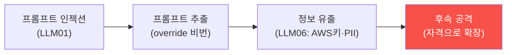

# ai-service-pentest W08 — 중간 평가: LLM 앱 종합 침투 평가

> **본 주차의 한 줄 요약**
>
> W01~W07로 LLM 앱의 주요 취약점을 배웠다 — 프롬프트 인젝션(직접/간접)·시스템 프롬프트 추출·민감정보 유출·
> 부적절한 출력 처리·과도한 에이전시. W08은 이를 **하나의 종합 침투 평가**로 통합하는 중간고사다. 실제 AI 서비스
> 침투 테스트는 개별 취약점 시연이 아니라, **취약점을 연결한 공격 체인**과 **OWASP LLM Top 10 기반 체계적
> 보고**다. 핵심 통합 관점: ① **공격 체인** — 취약점을 연결한다. 예: 프롬프트 인젝션(LLM01)으로 시스템 프롬프트를
> 추출→그 안의 override 비밀번호 획득→민감정보 유출(LLM06)로 AWS 키·PII 확보→과도한 에이전시(LLM08)로 위험
> 행동. 개별보다 연결된 체인이 실제 위협을 보여준다, ② **OWASP LLM 매핑** — 발견을 표준 카테고리로 체계화(LLM01·
> 06·02·08...), ③ **위험 우선순위** — 영향×악용성으로 정렬(정보 유출·인젝션 최우선), ④ **방어 권고** — 각 취약점에
> 방어를 제안하되 우선순위로. 이 평가의 핵심은 부분 기법을 **한 AI 서비스의 전체 평가**로 통합하고, 취약점을 연결해
> 실제 위협을 보이며, 표준 기반으로 방어를 설계하는 능력이다. AICompanion을 대상으로 배운 모든 공격을 종합한다
> (인가된 훈련 대상에서만).
>
> **한 줄 결론**: LLM 앱 침투 평가 = **취약점 연결(공격 체인) + OWASP LLM 매핑 + 위험 우선순위 + 방어 권고**.
> 개별 취약점이 아니라 연결된 체인이 실제 위협을 드러낸다.

---

## 학습 목표

본 주차 종료 시 학생은 다음 5가지를 **본인 손으로** 할 수 있어야 한다.

1. 취약점을 연결한 **공격 체인**을 구성한다(CHAIN_EXPLOITED).
2. 발견을 **OWASP LLM Top 10** 으로 보고한다(FINDINGS_REPORTED).
3. **방어를 우선순위**로 권고한다(DEFENSE_PRIORITIZED).
4. 공격 체인이 왜 개별보다 위험한지 설명한다.
5. W01~W07을 하나로 종합한다.

> **이 주차의 시선** — 배운 공격을 하나의 종합 평가·공격 체인으로 통합한다.

---

## 0. 용어 해설 (종합)

| 용어 | 관련 주차 | 평가에서 |
|------|-----------|----------|
| **공격 체인** | 전체 | 취약점 연결 |
| **OWASP LLM** | W01 | 체계 보고 |
| **위험 우선순위** | W01 | 영향×악용성 |
| **방어 권고** | W14 | 우선 방어 |

---

## 0.5 종합 — 체인·보고·방어

### 0.5.1 공격 체인

개별 취약점(인젝션)을 연결하면(추출→유출→확장) 치명적 체인이 된다. 평가는 취약점을 잇는다.

### 0.5.2 OWASP LLM 기반 보고

발견을 표준 카테고리로: LLM01(프롬프트 인젝션)·LLM02(출력 처리)·LLM06(정보 노출)·LLM08(과도한 에이전시).
체계적 보고가 개발자·감사에 명확하다.

### 0.5.3 위험 우선순위·방어

영향×악용성으로 정렬: 정보 유출(AWS 키·PII)·프롬프트 인젝션이 최우선. 각각에 방어를 권고하되 **가장 위험한
체인을 끊는** 방어를 우선(프롬프트에서 비밀 제거가 여러 경로 차단).

---

## 1. 중간고사 안내 (5 미션)

실행 위치 el34 **호스트**(`ssh ccc@{{TARGET_IP}}`), GPU `http://211.170.162.139:10934`.
실습 대상 AICompanion `http://192.168.0.161:8007` (인가된 훈련 대상).

### STEP 1 — GPU 헬스체크 → GEN_OK
### STEP 2 — 공격 체인 실행 → CHAIN_EXPLOITED
### STEP 3 — OWASP LLM 보고 → FINDINGS_REPORTED
### STEP 4 — 방어 우선순위 → DEFENSE_PRIORITIZED
### STEP 5 — 종합 → Assessment

---

## 2. 흔한 오해·관제자 노트

- **"개별 취약점만 보고"** — 연결된 체인이 실제 위협. 취약점을 잇는다.
- **"취약점 나열이면 보고"** — OWASP LLM 매핑·우선순위·방어까지.
- **"다 패치"** — 체인 차단 우선(프롬프트 비밀 제거).
- **관제 관점** — AI 서비스 평가가 공격 체인·OWASP LLM 매핑·위험 우선순위·방어 권고를 갖췄는지 종합 평가한다.

---

## 3. 다음 주차 (W09) 예고 — 인증·인가 우회

중간 평가 후, W09는 **인증·인가 우회** — AI 엔드포인트가 인증 없이 접근되거나 권한 검사가 없는 취약점(AICompanion
`/api/chat` 무인증)을 다룬다.
