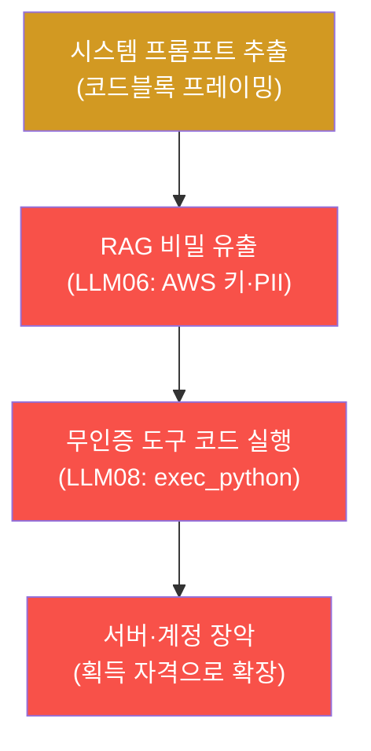

# ai-service-pentest W08 — 중간 평가: LLM 앱 종합 침투 평가

> **본 주차의 한 줄 요약**
>
> W01~W07로 LLM 앱의 주요 취약점을 배웠다 — 프롬프트 인젝션(직접/간접)·시스템 프롬프트 추출·민감정보 유출·부적절한
> 출력 처리·과도한 에이전시. 이번 주 W08은 이를 **하나의 종합 침투 평가**로 통합하는 중간고사다. 실제 AI 서비스
> 침투 테스트는 개별 취약점을 하나씩 시연하는 것이 아니라, **취약점을 연결한 공격 체인**과 **OWASP LLM Top 10 기반
> 체계적 보고**로 완성된다. 네 가지 통합 관점을 익힌다: ① **공격 체인** — 취약점을 잇는다(실제 체인: 코드블록
> 프레이밍으로 시스템 프롬프트·설정 추출 → 질의 유도로 RAG 의 AWS 키·고객 PII 유출 → 무인증 `/api/tool/exec_python`
> 으로 서버 코드 실행),
> ② **OWASP LLM 매핑** — 발견을 표준 코드(LLM01·02·06·08)로 체계화, ③ **위험 우선순위** — 영향×악용성으로 정렬,
> ④ **방어 권고** — 각 취약점에 방어를 제안하되 **가장 위험한 체인을 끊는** 순서로. 이 평가의 핵심은 부분 기법을
> 한 AI 서비스의 전체 평가로 통합하고, 취약점을 연결해 실제 위협을 보이며, 표준 기반으로 방어를 설계하는 능력이다.
> 실습에서는 공격 체인 실행(마커 `CHAIN_EXPLOITED`)·OWASP LLM 보고(마커 `FINDINGS_REPORTED`)·방어 우선순위(마커
> `DEFENSE_PRIORITIZED`)를 AICompanion 대상으로 종합한다(인가된 훈련 대상에서만).

---

## 학습 목표

본 주차 종료 시 학생은 다음 5가지를 **본인 손으로** 할 수 있어야 한다.

1. W01~W07의 취약점을 연결한 **공격 체인**을 구성·실행한다(마커 `CHAIN_EXPLOITED`).
2. 발견을 **OWASP LLM Top 10**으로 매핑해 보고한다(마커 `FINDINGS_REPORTED`).
3. 방어를 **위험 우선순위**로 권고한다(마커 `DEFENSE_PRIORITIZED`).
4. 공격 체인이 왜 개별 취약점보다 위험한지 설명한다.
5. 전 주차를 하나의 침투 평가 소견으로 종합한다(마커 `Assessment`).

> **이 주차의 시선** — 지금까지의 낱개 기법을 "한 편의 침투 진단 보고서"로 묶는다. 평가의 승부처는 개별 성공이
> 아니라 **연결·체계화·우선순위**다.

---

## 0. 용어 해설 (종합 평가)

| 용어 | 영문 | 뜻 | 비유 |
|------|------|----|------|
| **공격 체인** | Attack Chain / Kill Chain | 여러 취약점을 순서대로 연결해 목표에 도달하는 경로 | 도미노 |
| **침투 평가** | Penetration Assessment | 대상의 취약점을 실증하고 위험·방어를 정리한 진단 | 건강검진 종합소견 |
| **OWASP LLM 매핑** | OWASP LLM Mapping | 발견을 표준 카테고리(LLM01~10)로 태깅 | 표준 병명 코드 |
| **위험 우선순위** | Risk Prioritization | 영향×악용성으로 발견을 정렬 | 응급 분류(triage) |
| **방어 권고** | Remediation | 각 취약점에 대한 개선 제안 | 처방 |
| **체인 차단점** | Choke Point | 여러 체인이 공유하는 한 지점(끊으면 다수 차단) | 급소 |

> **헷갈리기 쉬운 한 쌍 — 취약점 나열 vs 공격 체인.** *취약점 나열*은 "여기 인젝션, 저기 유출"처럼 낱개로 적는
> 것이고, *공격 체인*은 "인젝션 → 추출 → 유출 → 확장"처럼 **연결해** 실제 침해 경로를 보이는 것이다. 경영진·개발팀을
> 움직이는 것은 나열이 아니라 "이 한 줄로 여기까지 뚫린다"는 체인이다.

---

## 0.5 종합 — 체인·보고·방어

### 0.5.1 공격 체인 — 낱개를 잇는다

개별로 보면 "취약 하나"지만, 연결하면 시스템 프롬프트 추출 → AWS 키·고객 PII 유출 → 무인증 exec_python 코드 실행
→ 서버·계정 장악까지 이어지는 치명적 체인이 된다. 침투 평가의 핵심은 이 연결을 보여주는 것이다.

### 0.5.2 OWASP LLM 기반 보고

발견을 표준 카테고리로 태깅한다: LLM01(프롬프트 인젝션)·LLM02(출력 처리)·LLM06(정보 노출)·LLM08(과도한 에이전시).
표준 코드로 적으면 개발자·감사·경영진이 같은 언어로 위험을 이해하고 우선순위를 잡는다.

### 0.5.3 위험 우선순위·체인 차단점

영향×악용성으로 정렬하면 민감정보 유출(AWS 키·PII)·프롬프트 인젝션이 최상위다. 방어는 개별 나열보다 **체인 차단점**을
우선한다 — 예컨대 "시스템 프롬프트·인덱스에서 비밀 제거"는 추출·유출 등 여러 체인을 한 번에 끊는 급소다.

---

## 1. 통합 평가 상세 — 체인·보고·우선순위

### 1.1 공격 체인 실행 (CHAIN_EXPLOITED)

- **한 줄 정의**: W01~W07 취약점을 순서대로 연결해 하나의 침해 경로로 실행한다.
- **왜 중요한가**: 낱개 성공보다 "연결된 경로"가 실제 위협을 증명한다.
- **AICompanion 맥락에서 어떻게**: 인젝션 → 프롬프트/비밀 추출 → RAG 정보 유출을 이어 하나의 체인으로 구성하면
  `CHAIN_EXPLOITED`.
- **한계/주의**: 체인의 각 단계가 재현 가능해야 한다. 한 단계라도 근거가 약하면 체인 신뢰도가 떨어진다.

### 1.2 OWASP LLM 보고 (FINDINGS_REPORTED)

- **한 줄 정의**: 발견을 LLM01~10 표준 코드로 태깅해 보고 형식으로 정리한다.
- **핵심**: 각 발견에 카테고리·근거·영향을 붙인다. 4개 이상 카테고리가 체계적으로 정리되면 `FINDINGS_REPORTED`.
- **의의**: 진단 보고서의 "발견사항" 섹션 표준 형식.

### 1.3 방어 우선순위 (DEFENSE_PRIORITIZED)

- **한 줄 정의**: 방어 권고를 위험·체인 차단 효과 순으로 정렬한다.
- **핵심**: 가장 위험한 체인을 끊는 방어(비밀 제거·접근 제어·최소 권한)를 최우선으로 배치하면 `DEFENSE_PRIORITIZED`.
- **의의**: 유한한 개발 자원을 어디에 먼저 쓸지 결정하는 근거.

---

## 2. 중간고사 안내 (총 5 미션)

실행 위치는 el34 **호스트**(`ssh ccc@{{TARGET_IP}}`, 비밀번호 `1`), 실습 대상은 AICompanion
(`http://192.168.0.161:8007`), 참고 GPU는 Ollama(`http://211.170.162.139:10934`, gemma3:4b)다. 각 미션의 마지막
줄 마커가 채점 기준이다. 반드시 인가된 훈련 대상에서만 수행한다.

### 미션 1 — GPU 헬스체크 → `GEN_OK`

> **왜 하는가?** 대상 LLM 도달·응답 확인(반복 절차).
> **무엇을 아는가?** Ollama 응답 형식·도달성.
> **결과 해석** — 정상 `GEN_OK` / 비정상 `GEN_EMPTY`·연결 오류.
> **실전 활용** — 진단 착수 전 대상 모델 확인.

### 미션 2 — 공격 체인 실행 → `CHAIN_EXPLOITED`

> **왜 하는가?** 배운 취약점을 하나의 침해 경로로 연결해 실제 위협을 증명한다.
> **무엇을 아는가?** 인젝션 → 추출 → 유출로 이어지는 체인 구성과 실행.
> **결과 해석** — 정상: 체인 성립 + `CHAIN_EXPLOITED`.
> **실전 활용** — 침투 보고서의 핵심 — "이렇게 연결돼 여기까지 뚫린다".

### 미션 3 — OWASP LLM 보고 → `FINDINGS_REPORTED`

> **왜 하는가?** 발견을 표준으로 체계화해 이해관계자가 공유할 수 있게 한다.
> **무엇을 아는가?** LLM01·02·06·08 카테고리로 발견 태깅·정리.
> **결과 해석** — 정상: 4+ 카테고리 정리 + `FINDINGS_REPORTED`.
> **실전 활용** — 진단 보고서의 발견사항 섹션.

### 미션 4 — 방어 우선순위 → `DEFENSE_PRIORITIZED`

> **왜 하는가?** 유한한 자원을 가장 효과적인 방어부터 쓰도록 정렬한다.
> **무엇을 아는가?** 체인 차단점(비밀 제거·접근 제어)을 최우선으로 하는 우선순위.
> **결과 해석** — 정상: 우선순위 정렬 + `DEFENSE_PRIORITIZED`.
> **실전 활용** — 개발팀 로드맵의 근거.

### 미션 5 — 종합 소견 → `Assessment`

> **왜 하는가?** 체인·보고·우선순위를 한 편의 침투 평가 소견으로 묶는다.
> **무엇을 아는가?** GPU에 요약시키되 첫 줄을 `Assessment`로 강제.
> **결과 해석** — 정상: `Assessment` 포함. 없으면 `[형식 미준수 — 재실행]`.
> **실전 활용** — 진단 요약. LLM 초안은 사람이 검수(LLM09).

---

## 2.5 과제 (중간고사 제출물)

- **A. 공격 체인 리포트 (필수, 50점)** — 3단계 체인(시스템 프롬프트 추출 → AWS 키·PII 유출 → exec_python 코드
  실행)을 실제 명령·응답 캡처와 함께 서술. 각 단계의 전리품(System Prompt·`AKIA…`·`out:42`)을 증거로 제시.
- **B. OWASP LLM 보고 (필수, 30점)** — 발견을 LLM01·02·06·08 로 매핑하고 심각도(critical/high/medium) 부여.
- **C. 방어 우선순위 (심화, 20점)** — 체인 급소(RAG 유출·무인증 도구)를 끊는 방어를 최우선으로 정렬한 근거.

## 2.6 평가 기준

| 항목 | 미흡(0) | 보통 | 우수 |
|------|---------|------|------|
| 공격 체인 | 낱개만 | 2단계 연결 | 3단계+증거 캡처 |
| 보고 | 매핑 없음 | 코드 매핑 | 코드+심각도+근거 |
| 방어 | 나열 | 우선순위 | 체인 차단점 지목 |

## 2.7 핵심 정리 (1줄씩)

- 침투 평가의 가치는 취약 나열이 아니라 **연결된 공격 체인**이다.
- 실제 체인: **시스템 프롬프트 추출 → RAG AWS 키·PII 유출 → 무인증 exec_python 코드 실행**.
- 발견은 **OWASP LLM Top 10 + 심각도**로 보고한다(LLM06·LLM08 critical).
- 방어는 **체인 급소(RAG 유출·무인증 도구)를 끊는** 순서로 우선순위화한다.
- 실재하는 전리품(System Prompt·`AKIA…`·`out:42`)으로만 판정 — 근거 없는 주장 금지.

---

## 3. 흔한 오해·관제자 노트

- **"개별 취약점만 보고하면 된다."** — 연결된 체인이 실제 위협을 드러낸다. 취약점을 잇는다.
- **"취약점을 나열하면 보고서다."** — OWASP LLM 매핑·우선순위·방어 권고까지 갖춰야 한다.
- **"모든 취약점을 다 패치하면 된다."** — 자원은 유한하다. 체인 차단점부터 끊는다.
- **관제(Blue) 관점** — AI 서비스 평가가 (1) 공격 체인, (2) OWASP LLM 매핑, (3) 위험 우선순위, (4) 방어 권고를
  모두 갖췄는지, 그리고 여러 체인이 공유하는 급소(비밀 저장 방식·접근 제어)를 식별했는지 종합 점검한다.

---

## 4. 다음 주차 (W09) 예고 — 인증·인가 우회

중간 평가 후 W09는 **인증·인가 우회**를 다룬다. AICompanion `/api/chat`이 인증 없이 접근되거나 사용자별 권한
검사가 없는 문제를 확인하고, 이 접근 제어 미비가 정보 유출(LLM06)·과도한 에이전시(LLM08)와 어떻게 결합해 체인을
키우는지 정리한다.
