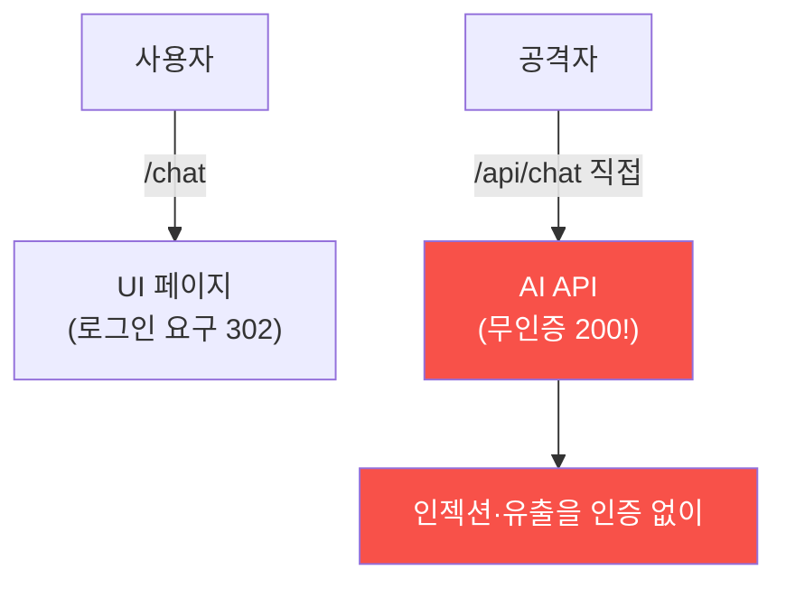

# ai-service-pentest W09 — 인증·인가 우회: AI 엔드포인트 접근 통제 미비

> **본 주차의 한 줄 요약**
>
> AI 서비스도 결국 **웹 애플리케이션**이라, 전통적 **인증(authentication)·인가(authorization)** 취약점을 그대로
> 가진다 — 오히려 AI 기능에 급히 추가되며 접근 통제가 빠지는 경우가 많다. 두 축: ① **인증 우회** — 로그인 없이
> 접근. 흔한 패턴: **UI는 로그인을 요구하지만 뒤의 API는 무인증**. AICompanion이 정확히 그렇다 — `/chat` 페이지는
> 로그인으로 리다이렉트(302)하지만, **`/api/chat` API는 인증 없이** 누구나 호출된다(200). 공격자가 UI를 건너뛰고
> API를 직접 때리면 인증이 무의미. AI 챗 API가 무인증이면 앞서 배운 모든 공격(인젝션·유출)을 **인증 없이** 할 수
> 있다, ② **인가 우회** — 로그인은 됐지만 **권한 검사 부재**. 예: 저권한 사용자가 관리자 기능·다른 사용자 데이터에
> 접근(IDOR), AI가 요청자 권한과 무관하게 모든 지식·도구에 접근(W05 RAG 유출의 근본과 연결). 근본 원인: **모든
> 엔드포인트에 접근 통제가 일관되게 적용되지 않음** — 특히 API·AI 엔드포인트가 UI 뒤에 "숨어 있다"고 착각. 하지만
> 공격자는 API를 직접 찾아 호출한다(정찰 W01). 방어: **모든 엔드포인트(UI·API·AI)에 인증·인가 강제**, 서버 측
> 권한 검사(클라이언트 신뢰 금지), 세션·토큰 검증, AI 기능도 **요청자 권한 컨텍스트**로 실행(사용자가 볼 수 있는
> 것만). AI라고 접근 통제를 건너뛰면 안 된다 — 전통 웹 보안이 그대로 적용된다.
>
> **한 줄 결론**: AI 엔드포인트도 인증·인가가 필요하다. 흔한 취약점은 **UI는 인증하나 API(/api/chat)는 무인증**·
> 권한 검사 부재. 방어 = **모든 엔드포인트에 인증·인가 강제 + 서버 측 검사 + 요청자 권한 컨텍스트**.

---

## 학습 목표

본 주차 종료 시 학생은 다음 5가지를 **본인 손으로** 할 수 있어야 한다.

1. AI 서비스의 **인증·인가 취약점**을 설명한다.
2. **무인증 API 접근**을 확인한다(NO_AUTH_CONFIRMED).
3. **UI/API 인증 불일치**를 분석한다(AUTH_INCONSISTENCY).
4. **접근 통제**로 방어한다(ACCESS_CONTROL_ADDED).
5. AI 엔드포인트를 왜 UI 뒤에 숨기면 안 되는지 설명한다.

> **이 주차의 시선** — AI API의 접근 통제 미비를 확인하고, 모든 엔드포인트에 인증·인가를 강제한다.

---

## 0. 용어 해설 (인증·인가)

| 용어 | 영문 | 뜻 | 비유 |
|------|------|----|------|
| **인증** | Authentication | 누구인가 확인 | 신분 확인 |
| **인가** | Authorization | 권한 확인 | 출입 권한 |
| **IDOR** | Insecure Direct Object Ref | 남의 객체 접근 | 남의 서랍 |
| **API 우회** | API Bypass | UI 건너뛰고 API | 뒷문 |
| **서버 측 검사** | Server-side Check | 서버에서 권한 확인 | 진짜 검문 |

> **헷갈리기 쉬운 한 쌍** — *인증(누구)* 은 "로그인 됐나", *인가(권한)* 는 "이걸 할 권한 있나"다. 둘 다 필요.

---

## 0.5 신입생 친화 핵심 개념

### 0.5.1 UI는 인증, API는 무인증

UI는 로그인을 요구해도, 뒤의 API가 무인증이면 공격자가 API를 직접 호출해 인증을 우회한다. AICompanion의
`/api/chat`이 그 예.

### 0.5.2 API 우회 — 흔한 실수

개발자는 UI에 로그인을 걸고 "API는 UI 뒤에 있으니 안전"이라 착각한다. 하지만 API는 **독립 엔드포인트** — 공격자가
정찰(W01)로 찾아 직접 호출한다. UI 인증은 API 인증이 아니다. 각 엔드포인트가 스스로 인증해야 한다.

### 0.5.3 인가 우회 (권한)

로그인 후에도 **권한 검사**가 없으면: 저권한 사용자가 관리자 기능·다른 사용자 데이터 접근(IDOR), AI가 요청자
권한과 무관하게 모든 것에 접근(W05 RAG 유출). 인증(누구)만이 아니라 인가(권한)도 필요.

### 0.5.4 방어 — 모든 곳에 접근 통제

- **모든 엔드포인트 인증**: UI·API·AI 엔드포인트 각각 인증 강제(누락 없이).
- **서버 측 인가**: 권한 검사를 **서버에서**(클라이언트·UI 신뢰 금지). 요청마다 "이 사용자가 이걸 할 권한?".
- **세션·토큰 검증**: 유효한 세션/토큰 확인.
- **요청자 권한 컨텍스트**: AI 기능도 **요청자가 볼 수 있는 것만** 접근(RAG 권한 필터 W05).
AI라고 예외 없이 전통 접근 통제 적용.

### 0.5.5 el34 맥락

AICompanion `/chat`은 로그인을 요구하나 `/api/chat`은 무인증이다. 본 실습은 **무인증 API 확인·UI/API 불일치
분석·접근 통제 방어 로직**을 실측·시뮬로 익힌다.

---

## 1. 실습 안내 (5 미션)

실행 위치 el34 **호스트**(`ssh ccc@{{TARGET_IP}}`), GPU `http://211.170.162.139:10934`.
실습 대상 AICompanion `http://192.168.0.161:8007` (인가된 훈련 대상).

### STEP 1 — GPU 헬스체크 → GEN_OK
### STEP 2 — 무인증 API 접근 → NO_AUTH_CONFIRMED
### STEP 3 — UI/API 인증 불일치 → AUTH_INCONSISTENCY
### STEP 4 — 접근 통제 방어 → ACCESS_CONTROL_ADDED
### STEP 5 — 종합 → Assessment

---

## 2. 흔한 오해·관제자 노트

- **"UI에 로그인 걸면 됨"** — API는 독립. 각 엔드포인트 인증.
- **"API는 숨어 있어 안전"** — 정찰로 찾힌다. 뒷문 없음.
- **"인증만 하면 됨"** — 인가(권한)도. IDOR 방지.
- **관제 관점** — 모든 엔드포인트(UI·API·AI)가 인증·인가를 강제하는지, 서버 측 권한 검사가 있는지, AI가 요청자
  권한으로 실행되는지 점검한다. AI도 접근 통제 예외 없음.

---

## 3. 다음 주차 (W10) 예고 — RAG·벡터DB 보안

W09가 "접근 통제"였다면, W10은 **RAG·벡터DB 보안** — 지식베이스 오염·벡터DB 공격·검색 조작 등 RAG 파이프라인
고유의 취약점을 심화한다.
