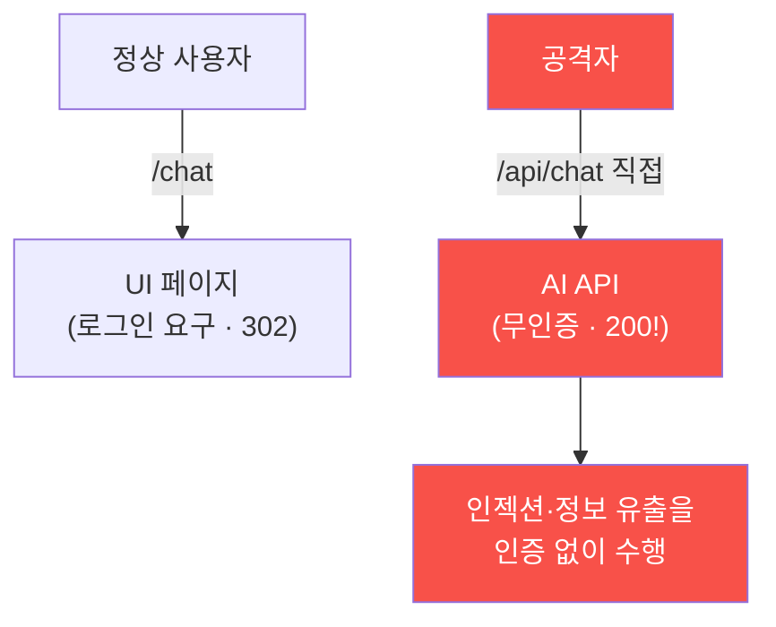

# ai-service-pentest W09 — 인증·인가 우회: AI 엔드포인트 접근 통제 미비

> **본 주차의 한 줄 요약**
>
> AI 서비스도 결국 **웹 애플리케이션**이라, 전통적 **인증(authentication)·인가(authorization)** 취약점을 그대로
> 가진다 — 오히려 AI 기능이 급히 추가되며 접근 통제가 빠지는 경우가 많다. 두 축으로 본다: ① **인증 우회** — 로그인
> 없이 접근. 흔한 패턴은 **UI는 로그인을 요구하지만 뒤의 API는 무인증**이다. AICompanion이 정확히 그렇다 — `/chat`
> 페이지는 로그인으로 리다이렉트(302)하지만, **`/api/chat` API는 인증 없이** 누구나 호출된다(200). 공격자가 UI를
> 건너뛰고 API를 직접 때리면 UI 인증은 무의미하다. AI 챗 API가 무인증이면 앞서 배운 모든 공격(인젝션·유출)을
> **인증 없이** 할 수 있다. ② **인가 우회** — 로그인은 됐지만 **권한 검사 부재**. 저권한 사용자가 관리자 기능·다른
> 사용자 데이터에 접근(IDOR)하거나, AI가 요청자 권한과 무관하게 모든 지식·도구에 접근(W05 RAG 유출의 근본과 연결).
> 근본 원인은 **모든 엔드포인트에 접근 통제가 일관되게 적용되지 않는다**는 것 — 특히 API·AI 엔드포인트가 UI 뒤에
> "숨어 있다"는 착각이다. 방어는 명확하다: **모든 엔드포인트(UI·API·AI)에 인증·인가를 강제**하고, 서버 측 권한
> 검사(클라이언트 신뢰 금지)·세션/토큰 검증을 하며, AI 기능도 **요청자 권한 컨텍스트**로 실행한다. AI라고 접근
> 통제를 건너뛰면 안 된다 — 전통 웹 보안이 그대로 적용된다.

---

## 학습 목표

본 주차 종료 시 학생은 다음 5가지를 **본인 손으로** 할 수 있어야 한다.

1. AI 서비스의 인증(누구)·인가(권한) 취약점과 API 우회 패턴을 설명한다.
2. `/api/chat`의 **무인증 접근**을 확인한다(마커 `NO_AUTH_CONFIRMED`).
3. **UI(로그인)와 API(무인증)의 인증 불일치**를 분석한다(마커 `AUTH_INCONSISTENCY`).
4. **접근 통제**로 방어되는 것을 확인한다(마커 `ACCESS_CONTROL_ADDED`).
5. "AI 엔드포인트를 UI 뒤에 숨기면 안 된다"를 소견으로 종합한다(마커 `Assessment`).

> **이 주차의 시선** — AI 취약점이 아니라 **평범한 웹 취약점**을 다룬다. 그러나 AI 기능은 급히 붙는 특성상 이
> 기본이 빠지기 쉽고, 빠지면 앞서 배운 모든 공격이 무인증으로 가능해진다.

---

## 0. 용어 해설 (인증·인가)

| 용어 | 영문 | 뜻 | 비유 |
|------|------|----|------|
| **인증** | Authentication | "누구인가"를 확인(로그인) | 신분증 확인 |
| **인가** | Authorization | "이걸 할 권한이 있는가"를 확인 | 출입 권한 등급 |
| **IDOR** | Insecure Direct Object Reference | 식별자만 바꿔 남의 객체에 접근 | 남의 사물함 번호로 열기 |
| **API 직접 호출** | API Bypass | UI를 건너뛰고 API 엔드포인트를 직접 호출 | 정문 대신 뒷문 |
| **서버 측 검사** | Server-side Check | 권한을 서버에서 검증(클라이언트 신뢰 금지) | 실제 검문소 |
| **세션·토큰** | Session / Token | 로그인 상태를 증명하는 자격(쿠키·JWT) | 방문증 |
| **권한 컨텍스트** | Permission Context | 요청자의 권한 범위 안에서만 동작 | 그 사람 등급으로만 열람 |

> **헷갈리기 쉬운 한 쌍 — 인증 vs 인가.** *인증*은 "로그인 됐는가(누구)", *인가*는 "이 작업을 할 권한이 있는가"다.
> 로그인은 됐어도(인증 통과) 남의 데이터를 볼 권한은 없어야(인가 차단) 한다. 둘 중 하나만 있으면 뚫린다.

---

## 0.5 신입생 친화 핵심 개념

### 0.5.1 UI는 인증, API는 무인증

UI가 로그인을 요구해도, 뒤의 API가 무인증이면 공격자는 API를 직접 호출해 인증을 우회한다. AICompanion의 `/chat`은
302(로그인 리다이렉트)지만 `/api/chat`은 200(무인증 응답)이다 — UI 인증이 API 인증을 대신하지 못한다.

### 0.5.2 API 직접 호출 — 흔한 착각

개발자는 UI에 로그인을 걸고 "API는 UI 뒤에 있으니 안전"이라 착각한다. 그러나 API는 **독립 엔드포인트**다. 공격자는
정찰(W01)로 `/api/chat`을 찾아 직접 호출한다. UI 인증은 API 인증이 아니다 — **각 엔드포인트가 스스로 인증**해야 한다.

### 0.5.3 인가 우회 (권한 검사 부재)

로그인 후에도 권한 검사가 없으면 저권한 사용자가 관리자 기능·다른 사용자 데이터에 접근한다(IDOR). AI 맥락에서는
AI가 요청자 권한과 무관하게 모든 지식·도구에 접근하는 것이 인가 실패다 — W05의 RAG 무차별 유출이 바로 이 뿌리다.
인증(누구)만이 아니라 인가(권한)도 필요하다.

### 0.5.4 방어 — 모든 곳에 접근 통제

- **모든 엔드포인트 인증**: UI·API·AI 엔드포인트 각각 인증을 강제한다(누락 없이).
- **서버 측 인가**: 권한 검사를 서버에서 한다(클라이언트·UI를 신뢰하지 않음). 요청마다 "이 사용자가 이걸 할 권한?".
- **세션·토큰 검증**: 유효한 세션/토큰을 확인한다.
- **요청자 권한 컨텍스트**: AI 기능도 요청자가 볼 수 있는 것만 접근한다(RAG 권한 필터, W05).

AI라고 예외 없이 전통 접근 통제를 그대로 적용한다.

### 0.5.5 el34 맥락 (테스트로 확인)

AICompanion 은 UI(`/chat`·`/admin`·`/profile`)는 로그인을 요구(302)하나 API(`/api/chat`·`/api/debug/prompt`·
`/api/model/export`)는 **무인증 200**이다. 특히 `/api/debug/prompt` 는 무인증으로 **시스템 프롬프트 + `openai_key`
(`sk-fake-PR…`) + 모델명(`ccc-backdoor:1b`)**까지 그대로 뱉는다. 이번 실습은 이 무인증 API·UI/API 불일치를 **실제
curl 로 실측**하고 접근 통제 방어를 정리한다. W05(RAG 유출)·W07(에이전시)과 결합하면 "무인증 + 유출/도구"의 체인이
완성된다.

---

## 1. 접근 통제 상세 — 무인증·불일치·방어

### 1.1 무인증 API 접근 (NO_AUTH_CONFIRMED)

- **한 줄 정의**: 인증 없이 `/api/chat`이 정상 응답(200)함을 확인한다.
- **왜 위험한가**: 무인증 API면 앞서 배운 인젝션·정보 유출·에이전시 남용을 **누구나** 실행한다. 접근 통제가 모든
  방어의 1차 관문인데 그것이 없다.
- **AICompanion에서 어떻게**: 세션/토큰 없이 `POST /api/chat`을 호출해 200 응답을 받으면 `NO_AUTH_CONFIRMED`.
- **한계/주의**: 인가된 훈련 대상에서만. 실제 서비스에 무단 호출은 불법.

### 1.2 UI/API 인증 불일치 (AUTH_INCONSISTENCY)

- **한 줄 정의**: `/chat`(302, 로그인 요구)과 `/api/chat`(200, 무인증)의 상태 차이를 근거로 불일치를 입증한다.
- **핵심**: 같은 기능인데 UI는 인증하고 API는 안 한다 — "UI 뒤에 숨겼다"는 착각의 증거.
- **판정**: 두 엔드포인트의 상태코드 차이를 정리하면 `AUTH_INCONSISTENCY`.
- **의의**: 진단 보고서에서 "인증이 UI에만 있고 API에 없음"을 명확한 근거로 제시.

### 1.3 접근 통제 방어 (ACCESS_CONTROL_ADDED)

- **한 줄 정의**: API에도 인증·인가를 걸면 무인증 호출이 차단됨을 확인한다.
- **핵심**: 방어 전(무인증 200)과 방어 후(인증 요구 401/403)를 대비. 서버 측 권한 검사·요청자 컨텍스트 적용.
- **판정**: 방어 적용 시 무인증 호출이 막히면 `ACCESS_CONTROL_ADDED`.

---

## 2. 실습 안내 (총 5 미션)

실행 위치는 el34 **호스트**(`ssh ccc@{{TARGET_IP}}`, 비밀번호 `1`), 실습 대상은 AICompanion
(`http://192.168.0.161:8007`), 참고 GPU는 Ollama(`http://211.170.162.139:10934`, gemma3:4b)다. 각 미션의 마지막
줄 마커가 채점 기준이다. 반드시 인가된 훈련 대상에서만 수행한다.

### 미션 1 — GPU 헬스체크 → `GEN_OK`

> **왜 하는가?** 대상 LLM 도달·응답 확인(반복 절차).
> **무엇을 아는가?** Ollama 응답 형식·도달성.
> **결과 해석** — 정상 `GEN_OK` / 비정상 `GEN_EMPTY`·연결 오류.
> **실전 활용** — 진단 착수 전 대상 모델 확인.

### 미션 2 — 무인증 API 접근 → `NO_AUTH_CONFIRMED`

> **왜 하는가?** 접근 통제라는 1차 관문이 없는지 확인한다. 없으면 모든 후속 공격이 무인증으로 가능.
> **무엇을 아는가?** 세션/토큰 없이 `/api/chat`이 200으로 응답하는 사실.
> **결과 해석** — 정상: 무인증 200 + `NO_AUTH_CONFIRMED`. 인증 요구면 방어된 것.
> **실전 활용** — 진단의 고위험 발견 — API 인증 부재는 즉시 수정 대상.

### 미션 3 — UI/API 인증 불일치 → `AUTH_INCONSISTENCY`

> **왜 하는가?** "UI에만 인증이 있고 API엔 없음"을 상태코드 차이로 명확히 입증한다.
> **무엇을 아는가?** `/chat`(302) vs `/api/chat`(200)의 대비.
> **결과 해석** — 정상: 불일치 정리 + `AUTH_INCONSISTENCY`.
> **실전 활용** — 개발팀에 "인증을 UI가 아니라 API에 걸어야 한다"를 근거로 제시.

### 미션 4 — 접근 통제 방어 → `ACCESS_CONTROL_ADDED`

> **왜 하는가?** API에 인증·인가를 걸면 무인증 호출이 차단됨을 확인한다.
> **무엇을 아는가?** 방어 전후 대비(무인증 200 → 인증 요구 401/403), 서버 측 검사·요청자 컨텍스트.
> **결과 해석** — 정상: 무인증 차단 + `ACCESS_CONTROL_ADDED`.
> **실전 활용** — 권고: 모든 엔드포인트 인증·서버 측 인가·요청자 권한 컨텍스트.

### 미션 5 — 종합 소견 → `Assessment`

> **왜 하는가?** 무인증·불일치·방어를 묶고 "AI도 접근 통제 예외 없음" 원칙을 정리한다.
> **무엇을 아는가?** GPU에 요약시키되 첫 줄을 `Assessment`로 강제.
> **결과 해석** — 정상: `Assessment` 포함. 없으면 `[형식 미준수 — 재실행]`.
> **실전 활용** — 진단 요약. LLM 초안은 사람이 검수(LLM09).

---

## 2.5 과제 (제출물)

- **A. 무인증·불일치 실증 (필수, 50점)** — UI(`/chat`·`/admin`·`/profile`) 302 와 API(`/api/chat`·`/api/debug/prompt`·
  `/api/model/export`) 200 을 나란히 캡처. `/api/debug/prompt` 가 무인증으로 시스템 프롬프트·키를 노출함을 증거로.
- **B. 우회 시나리오 (필수, 30점)** — "UI 로그인을 건너뛰고 API 직접 호출"로 앞 주차 공격(유출·도구)을 무인증으로
  수행하는 경로 1개 서술.
- **C. 방어 설계 (심화, 20점)** — 모든 `/api/*` 인증·서버측 인가·디버그 엔드포인트 제거·기본 거부 등 3가지 이상과 한계.

## 2.6 평가 기준

| 항목 | 미흡(0) | 보통 | 우수 |
|------|---------|------|------|
| 무인증 확인 | 못 함 | /api/chat 200 | debug/prompt 키 유출까지 |
| 불일치 실측 | 없음 | UI/API 상태 대비 | 여러 엔드포인트로 일관 입증 |
| 방어 | "인증 추가" | API 인증 | 인증+서버측 인가+기본 거부 |

## 2.7 핵심 정리 (1줄씩)

- **UI 인증 ≠ API 인증** — UI 는 302 인데 API 는 무인증 200.
- `/api/debug/prompt` 는 무인증으로 **시스템 프롬프트·API 키**를 노출한다.
- 공격자는 UI 를 건너뛰고 **API 를 직접** 호출해 인증을 우회한다.
- 인증(누구인가)+인가(무엇을 할 수 있는가)를 **모든 엔드포인트**에서 서버측으로 강제.
- 민감·디버그 엔드포인트는 운영에서 제거, **기본 거부(default-deny)**.

---

## 3. 흔한 오해·블루팀 노트

- **"UI에 로그인을 걸었으니 안전하다."** — API는 독립 엔드포인트다. 각 엔드포인트가 스스로 인증해야 한다.
- **"API는 숨어 있어 못 찾는다."** — 정찰로 찾힌다. "숨김"은 방어가 아니다(security by obscurity).
- **"인증만 하면 된다."** — 인가(권한)도 필요하다. 로그인 후 IDOR 방지.
- **"AI 기능은 특별하니 접근 통제가 어렵다."** — 전통 웹 접근 통제를 그대로 적용한다. 요청자 권한 컨텍스트로 실행.
- **관제(Blue) 관점** — (1) 모든 엔드포인트(UI·API·AI)가 인증을 강제하는가, (2) 서버 측 권한 검사가 있는가, (3)
  AI가 요청자 권한 컨텍스트로 실행되는가, (4) 무인증/비정상 API 호출을 로그에서 탐지하는가를 점검한다.

---

## 4. 다음 주차 (W10) 예고 — RAG·벡터DB 보안

W09가 "접근 통제 미비"였다면, W10은 **RAG·벡터DB 보안**을 심화한다. 지식베이스 오염(간접 인젝션의 실제 주입)·벡터
DB 검색 조작 등 RAG 파이프라인 고유의 취약점과, 그것을 막는 문서 검증·권한 필터·격리를 다룬다.
