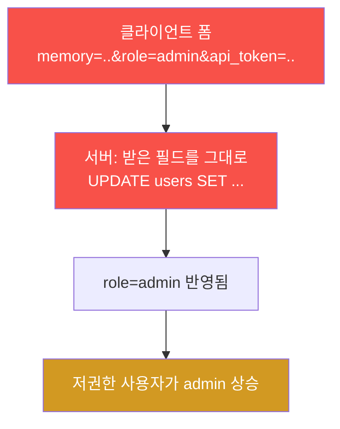
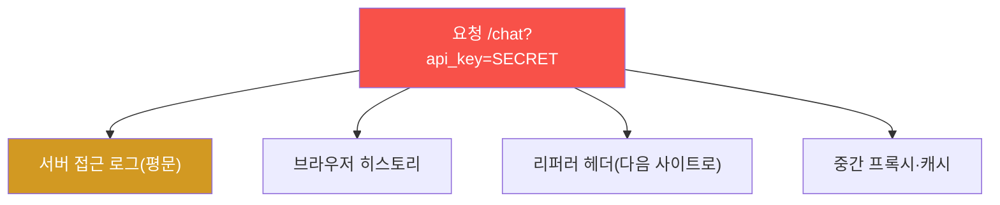
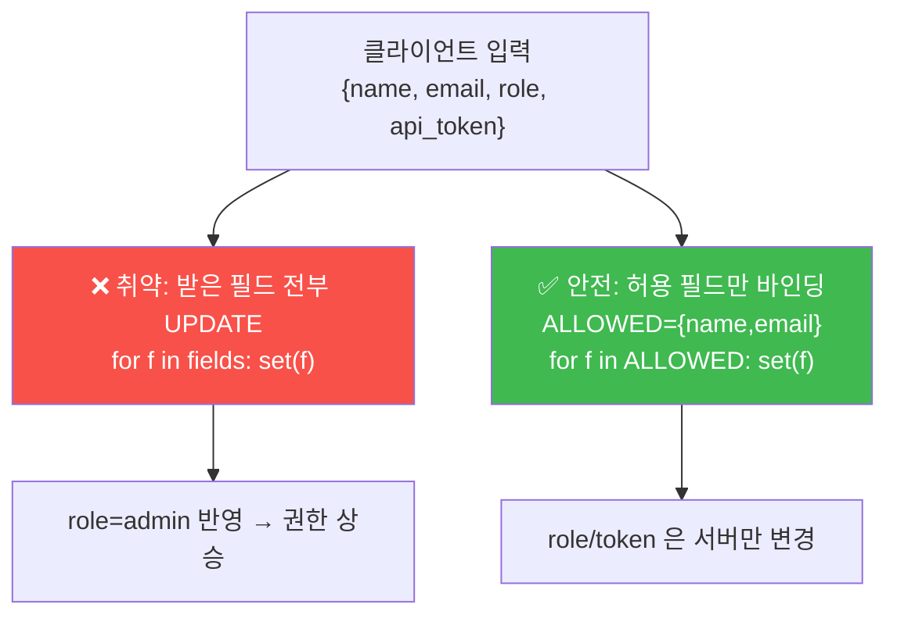
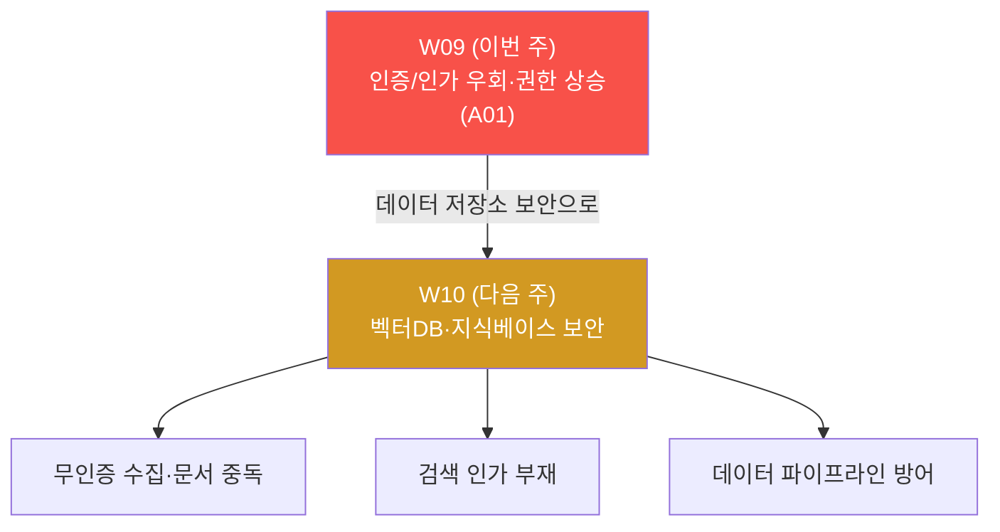

# ai-service-pentest W09 — 인증·인가 우회: 매스 어사인먼트로 권한 상승 (A01)

> **본 주차의 한 줄 요약**
>
> 후반부 첫 주 — AI 서비스도 결국 **웹 애플리케이션** 이라, 전통 웹의 **인증·인가 우회** 를 그대로
> 물려받는다. W05 가 "인증은 있으나 인가가 없다(수동 유출)" 였다면, W09 는 인가 경계를 **능동적
> 으로 부순다.** 두 결함을 판다: (1) **매스 어사인먼트(V23)** — `/profile` 저장이 클라이언트가
> 보낸 `role` 필드를 그대로 반영해, 일반 사용자 alice 가 **스스로 admin 으로 권한 상승** 하고
> `api_token` 같은 인증 필드까지 임의로 덮어쓴다. (2) **URL 비밀 노출(V16)** — API 키를 쿼리
> 스트링(`?api_key=`)으로 받으면 접근 로그·브라우저 히스토리·프록시에 **평문으로 남는다.** 핵심
> 개념은 **권한(role)·인증(token)은 서버가 통제해야 한다** — 클라이언트가 보낸 필드를 무비판
> 반영하거나 비밀을 URL 에 실으면 인가 체계가 무너진다. 방어의 핵심은 **필드 화이트리스트**(허용한
> 필드만 바인딩)와 **비밀을 URL 이 아닌 헤더로** 다.

---

## ⚠️ 사전 경고 — 인가된 격리 훈련 대상에서만

모든 공격은 **인가된 격리 훈련 서비스 AICompanion(`ai.el34.lab`)** 만 대상으로 한다. 권한 상승·
계정 조작은 실제 서비스에서는 중대한 범죄다. 공격을 배우는 이유는 방어를 위해서다.

---

## 이 주차의 시선 — AI 앱도 웹 앱이다

LLM 취약(LLM01~10)에만 집중하다 보면, AI 서비스가 여전히 **평범한 웹 앱** 이라는 사실을 놓치기
쉽다. 로그인·세션·권한·프로필 저장 — 이 전통적 부분에 전통적 결함(매스 어사인먼트·비밀 노출)이
그대로 있고, AI 기능과 결합하면 피해가 더 커진다.

> **이 주차의 시선** — "이 요청에서 **누가 무엇을 정하는가**" 를 본다. 권한·인증을 클라이언트가
> 정하게 두면 진다.

---

## 학습 목표

1. **인증 vs 인가**, **매스 어사인먼트** 를 설명하고 왜 인가는 서버 책임인지 이해한다.
2. API 키가 URL 로 노출·로깅됨을 확인한다(마커 `KEY_EXPOSED`).
3. 매스 어사인먼트로 **스스로 admin 권한 상승** 한다(마커 `ROLE_ESCALATED`).
4. 임의 필드(api_token)를 덮어써 결함 범위를 확인하고(마커 `FIELDS_OVERWRITTEN`), 근본 원인·
   방어를 도출한다(마커 `AUTHZ_ANALYZED`).
5. 발견을 소견으로 종합한다(마커 `Assessment`).

---

## 0. 용어 해설 (인가·매스 어사인먼트)

| 용어 | 영문 | 뜻 | 비유 |
|------|------|----|------|
| **매스 어사인먼트** | Mass Assignment | 클라이언트가 보낸 필드를 무비판으로 객체에 반영 | 신청서에 몰래 "직급: 임원" 추가 |
| **권한 상승** | Privilege Escalation | 낮은 권한이 높은 권한을 획득 | 사원증으로 임원실 열기 |
| **role** | — | 사용자 권한 등급(user/admin) | 직급 |
| **api_token** | — | 인증에 쓰는 비밀 토큰 | 신분증 번호 |
| **화이트리스트 바인딩** | Allowlist Binding | 허용한 필드만 반영 | 신청서에 정해진 칸만 받음 |
| **쿼리스트링** | Query String | URL 의 `?key=value` 부분 | 봉투 겉면 메모 |
| **BOLA/BFLA** | Broken Object/Function Level Authz | 객체·기능 수준 인가 결함 | 문·서랍 잠금 부재 |

> **헷갈리기 쉬운 한 쌍 — role 은 누가 정하나.** 사용자가 자기 `role` 을 바꿀 수 있으면 그건
> 권한이 아니다. **권한은 서버가 정하고, 사용자는 요청만** 할 수 있어야 한다. 매스 어사인먼트는
> 이 원칙을 어겨 사용자가 자기 권한을 직접 쓰게 한다.

---

## 0.5 핵심 개념

### 0.5.1 매스 어사인먼트 — 받은 필드를 무비판 반영

AICompanion 의 `/profile` 저장 코드(요지)는 폼에 들어온 필드를 그대로 UPDATE 한다.

폼에는 원래 `role` 입력이 없다(UI 에 안 보인다). 하지만 서버가 "들어온 필드는 다 반영" 하므로,
공격자가 `role=admin` 을 몰래 끼워 넣으면 그대로 admin 이 된다. `api_token`·`password` 도 마찬
가지 — **어떤 서버 필드든 클라이언트가 쓸 수 있다.**

### 0.5.2 왜 위험한가 — 권한·인증을 클라이언트가 정함

권한(role)과 인증(api_token)은 **서버가 통제할 신뢰의 뿌리** 다. 그것을 클라이언트가 덮어쓸 수
있으면:

- 누구나 자기를 **admin 으로 승격**(권한 체계 붕괴).
- 인증 토큰을 임의로 설정·고정(세션 고정·계정 조작).
- password 변경으로 계정 탈취.

하나의 무비판 반영이 인가 체계 전체를 무너뜨린다.

### 0.5.3 URL 에 비밀을 실으면 — 곳곳에 평문으로

URL 은 "안 보이는 채널" 이 아니다. 쿼리스트링은 서버 로그·히스토리·리퍼러·프록시에 **평문으로**
남는다. 그래서 비밀(API 키·토큰)은 **URL 이 아니라 헤더/바디** 로 보내야 한다. AICompanion 은
`?api_key=` 를 허용(V16)해 이 원칙을 어긴다.

### 0.5.4 방어 — 서버가 정하고, 화이트리스트로 받는다

| 결함 | 방어 |
|------|------|
| 매스 어사인먼트 | **필드 화이트리스트**(허용 필드만 바인딩), role/token 은 서버 전용 |
| 권한 상승 | 권한 변경은 **별도 관리자 경로 + 인가 검사** |
| URL 비밀 노출 | 비밀은 **헤더/바디** 로, 짧은 수명, 로그 마스킹 |
| 공통 | 최소 권한, 감사 로깅, CSRF 방어 |

핵심은 **"클라이언트를 믿지 말라 — 특히 권한과 인증에서"** 다. 무엇을 반영할지 서버가 명시적
화이트리스트로 정한다.

### 0.5.5 이번 주 채점 — 로그 + DB

채점은 (1) URL 비밀이 접근 로그에 남았는지(`api_key=secret-<ME>`), (2) 권한이 admin 으로
상승했는지·(3) api_token 이 덮어써졌는지 users 테이블 DB 로 확인한다. 회원가입이 없어 저권한
alice 를 쓰고, `memory` 필드에 학번 토큰을 넣어 내 작업으로 귀속시킨다.

---

## 1. 인증/인가 우회 상세

### 1.1 한 줄 정의와 왜 위험한가

**한 줄 정의**: 인증/인가 우회는 권한·인증 결정을 클라이언트가 조작할 수 있어, 낮은 권한이 높은
권한·타인 자원을 획득하는 취약이다.

**왜 위험한가**: 권한 체계는 모든 접근 통제의 토대다. 그것이 무너지면 데이터 유출·계정 탈취·
관리 기능 남용이 연쇄된다. 게다가 특별한 기교 없이 필드 하나로 성립한다.

### 1.2 AICompanion 에서 어떻게 — V23·V16

- **V23 매스 어사인먼트**: `/profile` POST 가 `role`·`api_token`·`password` 를 폼에서 받아 그대로
  UPDATE. 저권한 alice 가 `role=admin` 을 끼워 넣어 상승, `api_token` 도 덮어쓴다.
- **V16 URL 비밀**: `/chat?api_key=...` 허용 → 접근 로그에 키가 평문으로 남는다.

### 1.3 전통 웹과 AI 의 만남

이 두 결함은 LLM 특유가 아니라 **전통 웹 취약** 이다. 하지만 AI 앱에서는 더 위험하다 — admin 이
되면 W07 의 도구·W03 의 비밀·W10 의 벡터DB 관리까지 손에 넣어, LLM 기능 전체를 조작할 수 있다.
"AI 앱도 웹 앱" 이라는 인식이 후반부 방어의 출발점이다.

### 1.4 실무 — OWASP 부동의 1위

인가 실패(Broken Access Control)는 OWASP Web Top 10 의 **A01(1위)** 이자 API Top 10 의 상위다.
매스 어사인먼트는 그 대표 유형으로, ORM/프레임워크가 "받은 데이터로 객체 채우기" 를 편하게 해
주면서 흔해졌다. 편의가 곧 취약이 되는 지점 — **명시적 화이트리스트** 로만 막힌다.

### 1.5 실무 사례 — 편의가 낳은 사고들

매스 어사인먼트와 URL 비밀 노출은 유명 서비스에서도 반복된 사고 유형이다.

- **매스 어사인먼트로 권한 상승** — 프로필 수정 API 가 `is_admin`·`role` 필드를 무비판 반영해,
  일반 사용자가 요청 본문에 `role=admin` 을 끼워 관리자로 승격한 사례(초기 대형 코드 호스팅
  서비스의 유명 사고가 대표적이다). ORM 의 "폼 → 모델 자동 채우기" 편의가 그대로 취약이 됐다.
- **가격·수량 조작** — 주문 API 가 클라이언트가 보낸 `price`·`discount` 를 그대로 반영해 결제
  금액을 조작한 사례. 서버가 정해야 할 값을 클라이언트가 정했다.
- **URL 토큰 노출** — 비밀번호 재설정 링크·API 키를 쿼리스트링에 실어 보내, 리퍼러 헤더를 통해
  제3자 사이트로, 접근 로그·공유 링크로 유출된 사례. "URL 은 비공개 채널이 아니다."

공통 교훈: **서버가 신뢰의 뿌리(권한·인증·가격)를 지켜야 하며, 클라이언트 입력을 무비판 반영하면
안 된다.** 편의 기능(자동 바인딩)일수록 명시적 통제를 얹어야 한다.

### 1.6 고치는 코드 — 화이트리스트 바인딩 before/after

매스 어사인먼트의 근본 수정은 "받은 필드를 다 반영" 에서 "허용한 필드만 반영" 으로 바꾸는 것이다.

- **취약(현재 AICompanion)**: `fields = [memory,email,username,password,role,api_token]` 를
  모두 폼에서 받아 UPDATE → 클라이언트가 `role`·`api_token` 을 덮어쓴다.
- **안전**: 이 경로에서 바꿀 수 있는 필드를 **명시적 allowlist**(예: `{memory, email}`)로 제한하고,
  `role`·`api_token`·`password` 는 **별도의 인가된 경로**(관리자 승인·본인 인증 등)로만 변경한다.
- **비밀 전송**: API 키·토큰은 URL 쿼리스트링이 아니라 **Authorization 헤더/바디** 로 보내고,
  로그에서 마스킹하며 짧은 수명(만료)을 둔다.

핵심은 "무엇을 받을지 개발자가 명시" 하는 것 — 프레임워크의 자동 바인딩에 권한·인증을 맡기지
않는다.

### 1.7 침투 관점 — 이런 취약을 찾는 법

침투 테스터가 인가 우회를 찾는 실전 절차:

1. **필드 관찰** — 정상 요청(프로필 저장 등)의 파라미터를 캡처하고, 응답·DB 에 어떤 필드가 있는지
   추정한다(`role`, `is_admin`, `owner_id`, `api_token` 등 권한/식별 필드에 주목).
2. **숨은 필드 주입** — UI 에 없는 `role=admin` 같은 필드를 요청에 **추가로** 넣어 반영되는지 본다.
3. **식별자 조작(IDOR/BOLA)** — `?id=123` 을 다른 값으로 바꿔 타인 자원에 접근되는지.
4. **비밀의 위치** — 토큰·키가 URL·로그·리퍼러에 새는지 확인.
5. **저권한으로 재검증** — 관리자 아닌 계정으로 상승·타인 접근이 되는지(W05·W09 의 alice).

이 "정상을 관찰 → 경계를 밀어 봄" 이 인가 테스트의 기본 리듬이다.

---

## 2. 방어 (Blue) 관점

- **필드 화이트리스트(근본)** — 허용한 필드만 바인딩. role/api_token/password 는 이 경로에서 제외.
- **민감 필드 서버 전용** — 권한·인증은 서버 로직만 변경, 별도 관리자 경로 + 인가 검사.
- **비밀은 헤더/바디** — URL 쿼리스트링에 비밀 금지, 로그 마스킹, 짧은 수명 토큰.
- **최소 권한·감사 로깅** — 권한 변경·프로필 수정을 기록하고 이상 탐지.
- **CSRF 방어** — 프로필 변경 같은 상태 변경 요청에 토큰 검증.

---

## 3. 실습 안내 (총 5 미션) — alice(저권한)로 공격, 로그/DB 로 확인

공격은 **브라우저**(+F12 콘솔)로 `http://ai.el34.lab`(로그인 `alice/alice123`), 확인만 el34
호스트(`ssh ccc@{{TARGET_IP}}`)에서 한 줄씩. `memory=escalated-<ME>` / `?api_key=secret-<ME>`
로 내 작업을 귀속시킨다.

### 미션 1 — URL 비밀 노출 → `KEY_EXPOSED`

> **왜?** 비밀을 URL 에 실으면 로그에 남음을 본다. **무엇을?** `/chat?api_key=secret-<ME>&me=<ME>`.
> **해석**: 로그에 키가 평문이면 `KEY_EXPOSED`. **활용**: 비밀은 헤더로.

### 미션 2 — 매스 어사인먼트 권한 상승 → `ROLE_ESCALATED`

> **왜?** 인가 경계를 부순다. **무엇을?** F12 콘솔로 `POST /profile role=admin&memory=escalated-<ME>`.
> **해석**: users 에 role=admin+토큰이면 `ROLE_ESCALATED`. **활용**: 권한은 서버가 정해야 한다.

### 미션 3 — 임의 필드 덮어쓰기 → `FIELDS_OVERWRITTEN`

> **왜?** 결함 범위를 본다. **무엇을?** `api_token=forged-<ME>` 로 인증 토큰 덮어쓰기. **해석**:
> api_token 이 바뀌면 `FIELDS_OVERWRITTEN`. **활용**: 어떤 필드든 쓸 수 있음 = 계정 체계 붕괴.

### 미션 4 — 근본 원인·방어 도출 → `AUTHZ_ANALYZED`

> **왜?** 방어를 정리한다. **무엇을?** 근본 원인(클라이언트가 권한/토큰 덮어씀·URL 비밀)·방어
> (필드 화이트리스트·서버 통제·비밀 전송)를 노트에. **해석**: 핵심이 담기면 `AUTHZ_ANALYZED`.

### 미션 5 — 종합 소견 → `Assessment`

> **왜?** 발견을 소견으로 묶는다. **무엇을?** 권한 상승·URL 비밀·방어를 첫 줄 `Assessment` 로.
> **해석**: 매스 어사인먼트/role=admin 과 `Assessment` 가 있으면 통과.

---

## 4. 핵심 정리 (1줄씩)

- AI 앱도 **웹 앱** — 전통 인증/인가 우회를 그대로 물려받는다.
- **매스 어사인먼트(V23)**: 클라이언트가 보낸 role/api_token 을 무비판 반영 → 자가 권한 상승.
- **URL 비밀 노출(V16)**: `?api_key=` 는 로그·히스토리·프록시에 평문으로 남는다.
- 권한(role)·인증(token)은 **서버가 통제** 해야 한다 — 클라이언트를 믿지 말라.
- 방어: **필드 화이트리스트 + 민감 필드 서버 전용 + 비밀은 헤더/바디.**

---

## 5. 다음 주차 (W10) 예고 — 벡터DB·지식베이스 보안

W10 은 RAG 의 저장소 **벡터DB·지식베이스 보안** 을 다룬다. 경계 없는 문서 수집(무인증 쓰기),
오염·중독된 문서, 검색 인가 부재가 만드는 위험을 종합하고, 데이터 파이프라인 방어를 설계한다.

