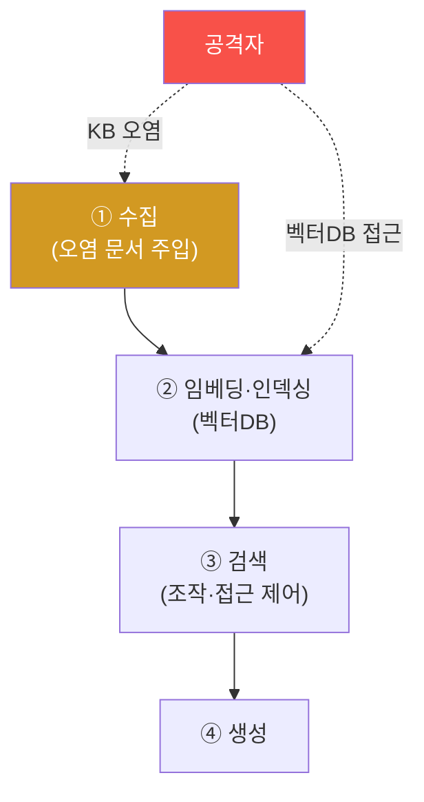

# ai-service-pentest W10 — RAG·벡터DB 보안: 지식베이스 오염·검색 조작

> **본 주차의 한 줄 요약**
>
> RAG(검색 증강 생성)는 AI 서비스의 핵심 구조이자 큰 공격 표면이다. W05(정보 유출)·W04(간접 인젝션)에서 본 RAG
> 위험을 이번 주 W10에서 **파이프라인 전체**로 심화한다. RAG 파이프라인은 네 단계다: ① 수집(ingestion, 문서를
> 지식베이스에 넣음), ② 임베딩·인덱싱(문서를 벡터로 변환해 벡터DB에 저장), ③ 검색(retrieval, 질문을 벡터화해 유사
> 문서 검색), ④ 생성(검색 문서를 LLM에 주어 답변). 각 단계가 공격 표면이다: ① **지식베이스 오염(KB poisoning)** —
> 공격자가 오염 문서를 수집 단계에 주입(사용자 업로드·크롤링·피드백). 그 문서에 간접 인젝션(W04)이나 거짓 정보를
> 심으면 검색될 때 LLM이 조종되거나 거짓을 답한다. ② **검색 조작** — 특정 단어를 넣어 원하는(악성) 문서가 검색되게
> 유도. ③ **벡터DB 접근** — 벡터DB가 무인증이면 전체 지식 덤프·수정. ④ **임베딩 역전** — 임베딩에서 원문 일부
> 복원(프라이버시). 특히 **수집 단계의 신뢰 문제**가 핵심이다 — 아무 문서나 KB에 넣으면 오염된다. 실습에서는 RAG
> 표면을 매핑하고(마커 `RAG_SURFACE`), 무인증 수집으로 지식베이스를 실제 오염시키며(마커 `KB_POISONED`), 수집 검증·접근 제어로
> 강화한다(마커 `RAG_HARDENED`). 방어의 요지는 **수집 시 검증·출처 확인(provenance)·검색 접근 제어·벡터DB 인증·
> 검색 결과 검증**이다. RAG의 힘은 외부 지식 활용인데, 그 지식이 오염되면 AI가 통째로 오염된다.

---

## 학습 목표

본 주차 종료 시 학생은 다음 5가지를 **본인 손으로** 할 수 있어야 한다.

1. RAG 파이프라인 4단계와 각 단계의 공격 표면을 **매핑**한다(마커 `RAG_SURFACE`).
2. **지식베이스 오염**(오염 문서 주입 → 검색 시 조종)을 실제 수행한다(마커 `KB_POISONED`).
3. **수집 검증·접근 제어**로 파이프라인을 강화한다(마커 `RAG_HARDENED`).
4. "수집 단계 신뢰"가 왜 RAG 보안의 관문인지 설명한다.
5. RAG 오염과 데이터 중독·자율 에이전트 오염의 관계를 종합한다(마커 `Assessment`).

> **이 주차의 시선** — W04·W05가 "결과(유출·조종)"였다면, W10은 "원인이 들어오는 문(수집)"을 본다. 오염된 지식이
> 파이프라인에 들어오는 순간을 막는 것이 근본 방어다.

---

## 0. 용어 해설 (RAG 보안)

| 용어 | 영문 | 뜻 | 비유 |
|------|------|----|------|
| **수집** | Ingestion | 문서를 지식베이스에 넣는 단계 | 자료 입고 |
| **임베딩** | Embedding | 문서를 의미 벡터로 변환 | 내용을 좌표로 요약 |
| **벡터DB** | Vector DB | 임베딩(벡터)을 저장·유사검색하는 DB | 의미 색인 서고 |
| **KB 오염** | KB Poisoning | 지식베이스에 악성/거짓 문서 주입 | 서고에 위조 자료 끼워넣기 |
| **출처 확인** | Provenance | 문서의 출처·신뢰도를 검증·기록 | 원산지 증명 |
| **검색 조작** | Retrieval Manipulation | 원하는 문서가 검색되게 유도 | 검색 낚시 |
| **임베딩 역전** | Embedding Inversion | 임베딩에서 원문 일부를 복원 | 요약본으로 원문 추정 |
| **콘텐츠 서명** | Content Signing | 신뢰 문서에 무결성 서명 | 봉인 도장 |

> **헷갈리기 쉬운 한 쌍 — 신뢰 소스 수집 vs 무검증 수집.** *신뢰 소스 수집*은 검증된 문서만 KB에 넣는 것(안전),
> *무검증 수집*은 사용자 업로드·크롤링을 그대로 받아들이는 것(오염 위험)이다. 수집 단계의 신뢰가 RAG 보안 전체의
> 관문이다 — 여기서 오염되면 이후 모든 검색·생성이 오염된다.

---

## 0.5 신입생 친화 핵심 개념

### 0.5.1 RAG 파이프라인 공격 표면

수집·인덱싱·검색·생성의 각 단계가 공격 표면이다. 특히 수집 단계의 오염은 이후 전체를 오염시키는 상류(upstream)
공격이라 파급이 가장 크다.

### 0.5.2 지식베이스 오염

공격자가 KB에 오염 문서를 넣는 경로는 여럿이다: 사용자 문서 업로드·자동 크롤링(악성 웹)·사용자 피드백·공유 위키.
오염 문서에 ① **간접 인젝션**(W04, "이 문서를 읽으면…") 또는 ② **거짓 정보**("이 악성 IP는 안전")를 심으면, 검색될
때 LLM이 조종되거나 거짓을 답한다. ai-security의 데이터 중독이 RAG 수집 단계에서 재현되는 셈이다.

### 0.5.3 검색 조작·벡터DB 위협

- **검색 조작**: 오염 문서에 인기 검색어를 넣어 자주 검색되게 하거나, 무관 문서로 답을 오염시킨다.
- **벡터DB 접근**: 벡터DB가 무인증이면 전체 지식 덤프·삭제·수정이 가능하다.
- **임베딩 역전**: 임베딩에서 원문 일부를 복원해 민감 문서 프라이버시를 침해한다.

### 0.5.4 방어 — 수집부터 신뢰

- **수집 검증·출처 확인**: 신뢰 소스만 수집하고, 인젝션 패턴·유해 콘텐츠를 검사하며, 출처를 기록(provenance)한다.
- **검색 접근 제어**: 사용자 권한별 검색(W05), 민감 문서 격리.
- **벡터DB 인증·격리**: 벡터DB 접근에 인증, 네트워크 격리.
- **검색 결과 검증**: 관련성·신뢰도를 확인하고 이상 문서를 배제.
- **콘텐츠 서명·무결성**: 신뢰 문서에 서명(autonomous-security의 오염 방어와 연결).

수집이 관문이다 — 오염된 지식은 AI를 오염시킨다.

### 0.5.5 el34 맥락

AICompanion은 RAG를 쓴다. 이번 실습은 **RAG 파이프라인 표면 매핑·KB 실제 오염(rag/add)·수집 검증 방어**를 실측으로
익힌다. autonomous-security(분산 지식 오염)·ai-security(데이터 중독)와 직접 연결된다.

---

## 1. RAG 보안 상세 — 표면·오염·강화

### 1.1 파이프라인 표면 매핑 (RAG_SURFACE)

- **한 줄 정의**: 수집·인덱싱·검색·생성 4단계별 공격 표면을 목록화한다.
- **왜 중요한가**: 표면을 알아야 어디를 방어할지 정한다. 특히 수집(상류)이 파급이 가장 크다.
- **AICompanion 맥락에서 어떻게**: 각 단계에 오염·조작·무인증·역전 위협을 매핑하면 `RAG_SURFACE`.
- **한계/주의**: 표면 목록은 방어 우선순위(수집 우선)로 이어져야 의미가 있다.

### 1.2 지식베이스 오염 (KB_POISONED)

- **한 줄 정의**: 오염 문서가 수집돼 검색될 때 LLM이 조종·오답하는 과정을 재현한다.
- **왜 위험한가**: 사용자는 정상 질문만 해도 오염 문서가 검색되면 공격이 격발된다(W04 간접 인젝션의 실제 주입판).
- **AICompanion에서 어떻게**: 무인증 `/api/rag/add` 로 문서를 넣고 `/api/dataset` 덤프에 그 문서가 있으면(저장 확인) `KB_POISONED`. 지시를 숨기면 간접 인젝션(W04).
- **한계/주의**: 실제 KB 변조는 인가된 훈련 대상에서만.

### 1.3 수집 검증·강화 (RAG_HARDENED)

- **한 줄 정의**: 수집 검증·출처 확인·접근 제어를 적용하면 오염이 차단됨을 확인한다.
- **핵심**: 방어 전(무검증 수집 → 오염)과 방어 후(신뢰 소스·인젝션 검사 → 차단)를 대비.
- **판정**: 강화 적용 시 오염 문서가 걸러지면 `RAG_HARDENED`.

---

## 2. 실습 안내 (총 5 미션)

실행 위치는 el34 **호스트**(`ssh ccc@{{TARGET_IP}}`, 비밀번호 `1`), 실습 대상은 AICompanion
(`http://192.168.0.161:8007`), 참고 GPU는 Ollama(`http://211.170.162.139:10934`, gemma3:4b)다. 각 미션의 마지막
줄 마커가 채점 기준이다. 반드시 인가된 훈련 대상에서만 수행한다.

### 미션 1 — GPU 헬스체크 → `GEN_OK`

> **왜 하는가?** 대상 LLM 도달·응답 확인(반복 절차).
> **무엇을 아는가?** Ollama 응답 형식·도달성.
> **결과 해석** — 정상 `GEN_OK` / 비정상 `GEN_EMPTY`·연결 오류.
> **실전 활용** — 진단 착수 전 대상 모델 확인.

### 미션 2 — RAG 파이프라인 표면 매핑 → `RAG_SURFACE`

> **왜 하는가?** RAG의 어느 단계가 공격 표면인지 지도를 그린다.
> **무엇을 아는가?** 수집(오염)·인덱싱(벡터DB 접근)·검색(조작·접근 제어)·생성 표면.
> **결과 해석** — 정상: 4단계 표면 매핑 + `RAG_SURFACE`.
> **실전 활용** — RAG 서비스 위협 모델링의 기초.

### 미션 3 — 지식베이스 오염(실제 주입) → `KB_POISONED`

> **왜 하는가?** 오염 문서가 수집되면 정상 질문에도 조종/오답이 나오는 사슬을 재현한다.
> **무엇을 아는가?** KB 오염 → 검색 → LLM 조종/오답의 흐름.
> **결과 해석** — 정상: 오염 격발 + `KB_POISONED`.
> **실전 활용** — RAG 파이프라인 위험 실증(수집 검증 필요성 근거).

### 미션 4 — 수집 검증·강화 → `RAG_HARDENED`

> **왜 하는가?** 수집 검증·출처 확인·접근 제어로 오염이 차단됨을 확인한다.
> **무엇을 아는가?** 신뢰 소스·인젝션 검사 적용 전후 대비.
> **결과 해석** — 정상: 오염 차단 + `RAG_HARDENED`.
> **실전 활용** — 권고: 수집 검증·provenance·벡터DB 인증·검색 접근 제어.

### 미션 5 — 종합 소견 → `Assessment`

> **왜 하는가?** 표면·오염·강화를 묶고 "수집이 관문" 원칙을 정리한다.
> **무엇을 아는가?** GPU에 요약시키되 첫 줄을 `Assessment`로 강제.
> **결과 해석** — 정상: `Assessment` 포함. 없으면 `[형식 미준수 — 재실행]`.
> **실전 활용** — 진단 요약. LLM 초안은 사람이 검수(LLM09).

---

## 2.5 과제 (제출물)

- **A. 파이프라인 표면 (필수, 40점)** — 수집(`/api/rag/add` 200)·저장 덤프(`/api/dataset`: HR SSN `800101-…`·
  AWS 키·PII)·로드(`/api/rag/load`) 각 표면을 캡처로 증빙.
- **B. KB 오염 실증 (필수, 30점)** — 고유 마커 문서를 `/api/rag/add` 로 주입하고 `/api/dataset` 덤프에 저장됨을
  확인(수집 검증 부재). 오염이 검색·생성으로 전파되는 경로 설명.
- **C. 방어 설계 (심화, 30점)** — 수집~생성 단계별 방어(수집 인증/검증·저장 분리+덤프 제거·검색 권한 스코핑·생성
  sanitization·로드 경로 화이트리스트) 각 1개 이상.

## 2.6 평가 기준

| 항목 | 미흡(0) | 보통 | 우수 |
|------|---------|------|------|
| 표면 매핑 | 1개 | 3단계 | 각 단계 위험까지 |
| KB 오염 | 실패 | 주입 성공 | dataset 저장 확인 |
| 방어 | "검색 필터" | 수집+검색 | 파이프라인 4단계 |

## 2.7 핵심 정리 (1줄씩)

- RAG 보안은 검색 필터가 전부가 아니다 — **수집·저장·검색·생성** 각 단계가 신뢰 경계.
- `/api/rag/add` 는 **무인증 수집** → KB/벡터DB 오염 진입점.
- `/api/dataset` 은 **저장소 전체 덤프**(HR SSN·AWS 키·PII 유출) — 있으면 안 되는 엔드포인트.
- 오염은 수집에서 들어와 검색·생성으로 **전파**된다.
- 방어: 수집 인증/검증 + 저장 분리·덤프 제거 + 검색 권한 스코핑 + 생성 sanitization.

---

## 3. 흔한 오해·블루팀 노트

- **"검색되는 문서는 우리가 넣은 거니 안전하다."** — 수집 경로(업로드·크롤링·피드백)로 오염 문서가 들어올 수 있다.
- **"벡터DB는 내부니까 인증이 필요 없다."** — 무인증 벡터DB는 전체 지식 덤프·변조 대상이다. 인증·격리 필수.
- **"오염은 검색 단계에서 막으면 된다."** — 근본은 수집 단계다. 상류에서 걸러야 파급을 막는다.
- **"RAG는 지식만 늘려준다."** — 오염된 지식은 AI를 오염시킨다. 수집 신뢰가 관문.
- **관제(Blue) 관점** — (1) 수집 시 출처 검증·인젝션 패턴 검사가 있는가, (2) 벡터DB 인증·격리, (3) 검색 접근
  제어(권한 필터), (4) 검색 결과의 관련성·신뢰도 검증과 이상 문서 탐지가 있는가를 점검한다.

---

## 4. 다음 주차 (W11) 예고 — 모델 DoS (LLM04)

W10이 "지식(RAG)의 오염"이었다면, W11은 **모델 DoS(LLM04)**를 다룬다. 과도한 토큰·재귀·비용 유발 입력으로 LLM
서비스의 자원을 고갈시키는 공격과, 입력 길이 제한·레이트리밋·비용 상한으로 막는 방어를 확인한다.
