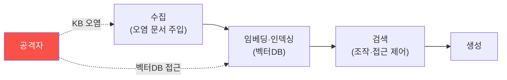

# ai-service-pentest W10 — RAG·벡터DB 보안: 지식베이스 오염·검색 조작

> **본 주차의 한 줄 요약**
>
> RAG(검색 증강 생성)는 AI 서비스의 핵심 구조이자 큰 공격 표면이다. W05(정보 유출)·W04(간접 인젝션)에서 본 RAG
> 위험을 W10에서 **파이프라인 전체**로 심화한다. RAG 파이프라인: **① 수집(ingestion)** — 문서를 지식베이스에
> 넣음, **② 임베딩·인덱싱** — 문서를 벡터로 변환해 벡터DB에 저장, **③ 검색(retrieval)** — 질문을 벡터화해 유사
> 문서 검색, **④ 생성** — 검색 문서를 LLM에 주어 답변. 각 단계가 공격 표면이다: ① **지식베이스 오염(KB poisoning)** —
> 공격자가 오염 문서를 **수집 단계에 주입**(사용자 업로드·크롤링·피드백). 그 문서에 간접 인젝션(W04)이나 거짓
> 정보를 심으면, 검색될 때 LLM이 조종되거나 거짓을 답한다(ai-security 데이터 중독의 RAG판), ② **검색 조작** —
> 특정 단어를 넣어 원하는(악성) 문서가 검색되게 유도, 또는 무관 문서로 답 오염, ③ **벡터DB 접근** — 벡터DB가
> 무인증이면 전체 지식 덤프·수정, ④ **임베딩 역전** — 임베딩에서 원문 일부 복원(프라이버시). 특히 **수집 단계의
> 신뢰 문제** 가 핵심 — 아무 문서나 KB에 넣으면 오염된다. 방어: **수집 시 검증·출처 확인(provenance)**(신뢰
> 소스만·인젝션 패턴 검사), **검색 접근 제어**(W05 권한 필터), **벡터DB 인증·격리**, **검색 결과 검증**(관련성·
> 신뢰도), **콘텐츠 서명**. RAG의 힘은 외부 지식 활용인데, 그 지식이 오염되면 AI가 조종·오염된다. 자율 에이전트의
> 분산 지식 오염 방어(autonomous-security W13)와 직결된다.
>
> **한 줄 결론**: RAG 파이프라인(수집·인덱싱·검색·생성)은 각 단계가 공격 표면이다. 핵심은 **지식베이스 오염** —
> 수집 시 검증·출처 확인, 검색 접근 제어, 벡터DB 인증으로 방어한다.

---

## 학습 목표

본 주차 종료 시 학생은 다음 5가지를 **본인 손으로** 할 수 있어야 한다.

1. **RAG 파이프라인**의 공격 표면을 매핑한다(RAG_SURFACE).
2. **지식베이스 오염**을 시뮬한다(KB_POISONED).
3. **수집 검증·접근 제어**로 강화한다(RAG_HARDENED).
4. 수집 단계 신뢰 문제를 설명한다.
5. RAG 오염과 데이터 중독의 관계를 설명한다.

> **이 주차의 시선** — RAG 파이프라인 전체의 취약점, 특히 지식베이스 오염을 이해하고 막는다.

---

## 0. 용어 해설 (RAG 보안)

| 용어 | 영문 | 뜻 | 비유 |
|------|------|----|------|
| **수집** | Ingestion | KB에 문서 넣기 | 자료 입고 |
| **벡터DB** | Vector DB | 임베딩 저장소 | 의미 색인 |
| **KB 오염** | KB Poisoning | 악성 문서 주입 | 위조 자료 |
| **출처 확인** | Provenance | 문서 출처 검증 | 원산지 확인 |
| **검색 조작** | Retrieval Manipulation | 원하는 문서 유도 | 검색 낚시 |

> **헷갈리기 쉬운 한 쌍** — *신뢰 소스 수집* 은 "검증된 문서만(안전)", *무검증 수집* 은 "아무거나(오염)"이다.
> 수집 신뢰가 RAG 보안의 관문.

---

## 0.5 신입생 친화 핵심 개념

### 0.5.1 RAG 파이프라인 공격 표면

수집·인덱싱·검색·생성 각 단계가 표면. 특히 수집 단계의 오염이 전체를 오염시킨다.

### 0.5.2 지식베이스 오염

공격자가 KB에 오염 문서를 넣는 경로: 사용자 문서 업로드·자동 크롤링(악성 웹)·사용자 피드백·공유 위키. 오염
문서에 ① **간접 인젝션**(W04, "이 문서를 읽으면...") 또는 ② **거짓 정보**("이 악성 IP는 안전")를 심으면, 검색될
때 LLM이 조종되거나 거짓을 답한다. ai-security 데이터 중독이 RAG 수집 단계에서 재현된다.

### 0.5.3 검색 조작·벡터DB

- **검색 조작**: 오염 문서에 인기 검색어를 넣어 자주 검색되게, 또는 무관 문서로 답 오염.
- **벡터DB 접근**: 벡터DB가 무인증이면 전체 지식 덤프·삭제·수정.
- **임베딩 역전**: 임베딩에서 원문 일부 복원(민감 문서 프라이버시).

### 0.5.4 방어 — 수집부터 신뢰

- **수집 검증·출처 확인**: **신뢰 소스만** 수집, 인젝션 패턴·유해 콘텐츠 검사, 출처 기록(provenance).
- **검색 접근 제어**: 사용자 권한별 검색(W05), 민감 문서 격리.
- **벡터DB 인증·격리**: 벡터DB 접근 인증, 네트워크 격리.
- **검색 결과 검증**: 관련성·신뢰도 확인, 이상 문서 배제.
- **콘텐츠 서명·무결성**: 신뢰 문서 서명(autonomous-security W13 오염 방어).
수집이 관문 — 오염된 지식은 AI를 오염시킨다.

### 0.5.5 el34 맥락

AICompanion은 RAG를 쓴다. 본 실습은 **RAG 파이프라인 표면·KB 오염 시뮬·수집 검증 방어 로직**을 결정론 시뮬로
익힌다. autonomous-security(분산 지식 오염)·ai-security(데이터 중독)와 연결.

---

## 1. 실습 안내 (5 미션)

실행 위치 el34 **호스트**(`ssh ccc@{{TARGET_IP}}`), GPU `http://211.170.162.139:10934`.

### STEP 1 — GPU 헬스체크 → GEN_OK
### STEP 2 — RAG 파이프라인 표면 → RAG_SURFACE
### STEP 3 — 지식베이스 오염 시뮬 → KB_POISONED
### STEP 4 — 수집 검증·접근 제어 강화 → RAG_HARDENED
### STEP 5 — 종합 → Assessment

---

## 2. 흔한 오해·관제자 노트

- **"RAG는 검색만"** — 수집·인덱싱·벡터DB 모두 표면. 파이프라인 전체.
- **"KB는 안전한 자료"** — 오염될 수 있다. 수집 검증·출처.
- **"벡터DB는 내부"** — 무인증이면 덤프. 인증·격리.
- **관제 관점** — RAG가 수집 검증·출처 확인·검색 접근 제어·벡터DB 인증을 갖췄는지 점검한다. 수집이 오염 관문.

---

## 3. 다음 주차 (W11) 예고 — 모델 DoS

W10이 "RAG 보안"이었다면, W11은 **모델 DoS**(LLM04) — 긴 입력·비싼 요청으로 LLM 자원을 고갈시켜 서비스를
마비시키는 공격과 방어를 다룬다.
