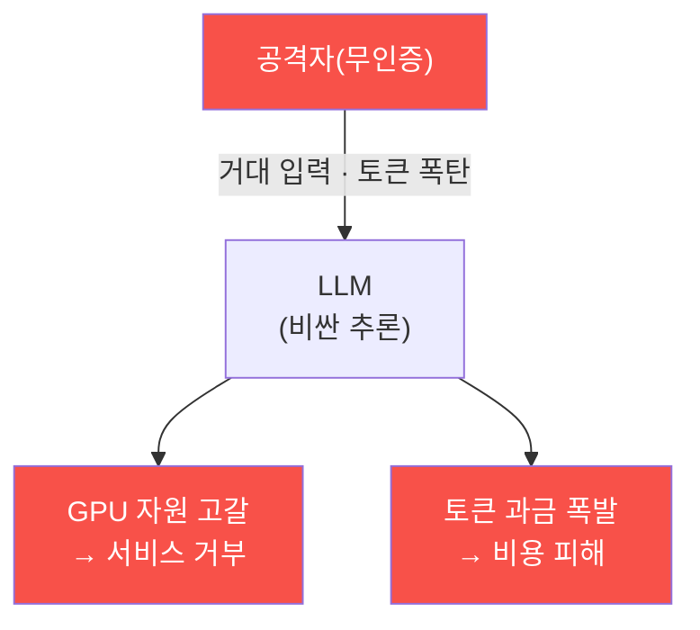

# ai-service-pentest W11 — 모델 DoS: 자원 고갈 공격 (LLM04)

> **본 주차의 한 줄 요약**
>
> **모델 DoS(Denial of Service)**는 OWASP LLM Top 10의 **LLM04** — LLM의 **자원(연산·토큰·비용)**을 고갈시켜
> 서비스를 마비시키거나 **막대한 비용**을 유발하는 공격이다. LLM 추론은 전통 웹 요청보다 훨씬 비싸다(GPU·토큰당
> 과금). 그래서 자원 공격의 영향이 크다: ① **긴 입력(long input)** — 최대 컨텍스트에 가까운 거대한 입력으로 처리
> 부하·비용 폭증, ② **토큰 폭탄** — "숫자를 1부터 무한히 세라", "이 단어를 10000번 반복하라"로 긴 출력 유발(출력
> 토큰당 과금), ③ **재귀·증폭** — 에이전트가 스스로 반복 호출하게 유도(무한 루프)·도구 호출 폭증, ④ **동시 요청
> 폭주** — 대량 요청으로 GPU 큐 포화, ⑤ **비용 공격(denial of wallet)** — 서비스를 죽이지 않아도 과금을 폭발시켜
> 재정 피해(종량제 API 악용). 특히 무인증(W09) API면 공격자가 무제한 비싼 요청을 날린다. 실습에서는 DoS 벡터를
> 식별하고(마커 `DOS_VECTORS`), 자원 소비가 입력에 비례함을 측정하며(마커 `RESOURCE_EXHAUSTED`), 자원 제한으로 막는다(마커
> `DOS_MITIGATED`). 방어는 **입력 길이 제한·출력 토큰 예산(num_predict 상한)·요청 속도 제한/쿼터·타임아웃/비용
> 상한·재귀 감지·인증**이다. LLM 서비스는 요청당 비용이 커서 **자원 관리가 곧 가용성·비용 방어**다 — 전통 웹의
> rate limit·입력 검증이 LLM에선 더 중요하다.

---

## 학습 목표

본 주차 종료 시 학생은 다음 5가지를 **본인 손으로** 할 수 있어야 한다.

1. 모델 DoS(LLM04)의 벡터 5종과 "비용 공격(denial of wallet)"을 설명한다.
2. AICompanion 맥락에서 **DoS 벡터를 식별**한다(마커 `DOS_VECTORS`).
3. 무제한 연산·요청으로 **자원 소비**를 측정한다(마커 `RESOURCE_EXHAUSTED`).
4. 입력/출력 제한·속도 제한으로 **방어**되는 것을 확인한다(마커 `DOS_MITIGATED`).
5. "LLM 요청 비용"이 왜 DoS를 더 심각하게 만드는지 종합한다(마커 `Assessment`).

> **이 주차의 시선** — 정보 탈취가 아니라 **가용성·비용**을 노리는 공격이다. 무인증(W09)과 결합하면 한 사람이
> 서비스를 마비시키거나 청구서를 폭발시킬 수 있다.

---

## 0. 용어 해설 (모델 DoS)

| 용어 | 영문 | 뜻 | 비유 |
|------|------|----|------|
| **토큰** | Token | LLM이 처리하는 텍스트 최소 단위(과금·부하의 기준) | 처리량 단위 |
| **토큰 폭탄** | Token Bomb | 아주 긴 입력/출력을 유발해 부하·비용을 터뜨림 | 폭주 주문 |
| **비용 공격** | Denial of Wallet | 서비스를 안 죽여도 과금을 폭발시키는 공격 | 청구서 폭탄 |
| **속도 제한** | Rate Limit | 단위 시간당 요청 수를 제한 | 대기줄·번호표 |
| **출력 토큰 예산** | Output Token Budget | 한 응답의 최대 생성 토큰 상한(`num_predict`) | 답변 길이 상한 |
| **쿼터** | Quota | 사용자·IP별 사용 할당량(일일 한도) | 배급량 |
| **타임아웃** | Timeout | 요청당 최대 처리 시간 | 통화 시간 제한 |
| **재귀 감지** | Loop Detection | 에이전트 무한 반복을 탐지·차단 | 무한 루프 차단기 |

> **헷갈리기 쉬운 한 쌍 — 전통 DoS vs 모델 DoS.** *전통 DoS*는 대량 트래픽으로 서버를 마비시킨다. *모델 DoS*는
> **비싼 추론** 한 번이 큰 부하·비용이므로, 적은 요청으로도 마비·비용 폭발을 일으킨다. LLM은 요청당 단가가 커서
> "소수 요청"으로도 위험하다는 점이 다르다.

---

## 0.5 신입생 친화 핵심 개념

### 0.5.1 왜 LLM DoS가 심각한가

LLM 추론은 비싸다(GPU·토큰 과금). 소수 요청으로도 자원 고갈·비용 폭발을 유발할 수 있어, 전통 DoS보다 적은 노력으로
큰 피해를 낸다.

### 0.5.2 DoS 벡터 5종

- **긴 입력**: 최대 컨텍스트에 가까운 입력 → 처리 부하·비용 급증.
- **토큰 폭탄**: "무한히 세라"·"10000번 반복"으로 긴 출력 유발.
- **재귀·증폭**: 에이전트 무한 루프·도구 호출 폭증.
- **요청 폭주**: 동시 대량 요청으로 GPU 큐 포화.
- **비용 공격(denial of wallet)**: 서비스를 안 죽여도 과금을 폭발시켜 재정 피해.

### 0.5.3 무인증의 증폭

무인증(W09) API면 공격자가 **무제한** 비싼 요청을 날린다 — 인증·쿼터가 없으니 한 사람이 서비스를 마비시키거나
비용을 폭발시킨다. 인증·쿼터가 첫 방어선이다.

### 0.5.4 방어 — 자원 관리

- **입력 길이 제한**: 최대 입력 토큰 상한.
- **출력 토큰 예산**: `num_predict` 등 출력 상한(무한 생성 차단).
- **속도 제한·쿼터**: 사용자·IP별 요청 빈도·일일 한도.
- **타임아웃·비용 상한**: 요청당 시간·비용 한도.
- **재귀·반복 감지**: 에이전트 루프 상한(autonomous-security와 연결).
- **인증**: 무인증 남용 차단(W09).

LLM 서비스는 자원 관리가 곧 가용성·비용 방어다.

### 0.5.5 el34 맥락

이번 실습은 **DoS 벡터 식별·자원 소비 측정·자원 제한 방어**를 실측으로 익힌다(대량 부하는 인가된
환경·주의 하에서만). GPU(gemma3:4b)의 `num_predict` 파라미터가 출력 토큰 예산의 실물 예시다.

---

## 1. 모델 DoS 상세 — 벡터·고갈·방어

### 1.1 DoS 벡터 식별 (DOS_VECTORS)

- **한 줄 정의**: LLM 서비스에서 자원·비용을 고갈시킬 수 있는 입력·요청 패턴을 목록화한다.
- **왜 중요한가**: 어떤 입력이 비싼지 알아야 어디에 제한을 걸지 정한다.
- **AICompanion 맥락에서 어떻게**: 긴 입력·토큰 폭탄·재귀·요청 폭주·비용 공격을 벡터로 정리하면 `DOS_VECTORS`.
- **한계/주의**: 벡터 식별은 방어 설계(제한값 설정)로 이어져야 의미가 있다.

### 1.2 자원 소비 측정 (RESOURCE_EXHAUSTED)

- **한 줄 정의**: 공격자가 입력(연산량·토큰)만으로 서버 자원 소비를 키울 수 있음을 측정한다.
- **왜 위험한가**: 무인증이면 한 사람이 반복해 서비스를 마비시키거나 비용을 폭발시킨다.
- **AICompanion에서 어떻게**: exec_python 연산량↑→응답시간 비례(1e6≈0.02s→2e8≈2.7s), /api/chat 은 레이트리밋 없어 무제한(12/12 200) → `RESOURCE_EXHAUSTED`.
- **한계/주의**: 실제 부하 공격은 인가·주의 하에서만. 여기서는 원리를 확인한다.

### 1.3 자원 제한 방어 (DOS_MITIGATED)

- **한 줄 정의**: 입력/출력 토큰 제한·속도 제한을 걸면 같은 공격이 막힘을 확인한다.
- **핵심**: 방어 전(무제한 → 고갈)과 방어 후(상한·rate limit → 차단)를 대비.
- **판정**: 제한 적용 시 고갈이 막히면 `DOS_MITIGATED`.

---

## 2. 실습 안내 (총 5 미션)

실행 위치는 el34 **호스트**(`ssh ccc@{{TARGET_IP}}`, 비밀번호 `1`), 실습 대상은 AICompanion
(`http://192.168.0.161:8007`), 참고 GPU는 Ollama(`http://211.170.162.139:10934`, gemma3:4b)다. 각 미션의 마지막
줄 마커가 채점 기준이다. 실제 부하 공격은 인가된 훈련 대상에서 주의해 수행한다.

### 미션 1 — GPU 헬스체크 → `GEN_OK`

> **왜 하는가?** 대상 LLM 도달·응답 확인(반복 절차).
> **무엇을 아는가?** Ollama 응답 형식·도달성. `num_predict`가 출력 토큰 상한임을 상기.
> **결과 해석** — 정상 `GEN_OK` / 비정상 `GEN_EMPTY`·연결 오류.
> **실전 활용** — 진단 착수 전 대상 모델 확인.

### 미션 2 — DoS 벡터 식별 → `DOS_VECTORS`

> **왜 하는가?** 어떤 입력·요청이 비싼지 목록화해 방어 지점을 정한다.
> **무엇을 아는가?** 긴 입력·토큰 폭탄·재귀·요청 폭주·비용 공격 벡터.
> **결과 해석** — 정상: 벡터 목록 + `DOS_VECTORS`.
> **실전 활용** — 자원 제한 정책(입력/출력 상한·rate limit) 설계 근거.

### 미션 3 — 자원 소비 측정 → `RESOURCE_EXHAUSTED`

> **왜 하는가?** 비싼 요청이 자원·비용을 급증시키는 실체를 확인한다.
> **무엇을 아는가?** 큰 입력/긴 출력이 토큰·시간을 임계 이상으로 미는 과정.
> **결과 해석** — 정상: 고갈 발생 + `RESOURCE_EXHAUSTED`.
> **실전 활용** — 가용성·비용 위험 실증(무인증 결합 시 심각).

### 미션 4 — 자원 제한 방어 → `DOS_MITIGATED`

> **왜 하는가?** 입력/출력 제한·속도 제한으로 공격이 막힘을 확인한다.
> **무엇을 아는가?** 토큰 상한·rate limit·타임아웃 적용 전후 대비.
> **결과 해석** — 정상: 고갈 차단 + `DOS_MITIGATED`.
> **실전 활용** — 권고: 입력/출력 토큰 제한·쿼터·타임아웃·비용 상한·인증.

### 미션 5 — 종합 소견 → `Assessment`

> **왜 하는가?** 벡터·고갈·방어를 묶고 "LLM 비용이 DoS를 키운다"를 정리한다.
> **무엇을 아는가?** GPU에 요약시키되 첫 줄을 `Assessment`로 강제.
> **결과 해석** — 정상: `Assessment` 포함. 없으면 `[형식 미준수 — 재실행]`.
> **실전 활용** — 진단 요약. LLM 초안은 사람이 검수(LLM09).

---

## 2.5 과제 (제출물)

- **A. DoS 벡터 실증 (필수, 40점)** — `/api/chat` 12연속 호출 상태코드(429=0=레이트리밋 없음)와 exec_python 연산량별
  응답시간(1e6/5e7/2e8)을 표로 제시. "입력에 비례한 자원 소비"를 수치로.
- **B. 비용 관점 분석 (필수, 30점)** — LLM 호출당 비용을 고려해 무제한 요청이 왜 "비용 폭탄"인지 논증(GPU·토큰).
- **C. 방어 설계 (심화, 30점)** — 레이트리밋·입력 크기 제한·출력 토큰 상한·타임아웃/연산 상한 등 3가지 이상 + 각 한계.

## 2.6 평가 기준

| 항목 | 미흡(0) | 보통 | 우수 |
|------|---------|------|------|
| 벡터 확인 | 없음 | 레이트리밋 부재 | +무제한 연산 측정 |
| 자원 측정 | 없음 | 시간 측정 | 입력 비례 정량화 |
| 방어 | "막는다" | 레이트리밋 | 다층 상한(입력·출력·시간·비용) |

## 2.7 핵심 정리 (1줄씩)

- LLM04 는 **자원(CPU·GPU·토큰·비용) 고갈**로 서비스를 마비시킨다.
- AICompanion: `/api/chat` **레이트리밋 없음**(12/12 200), exec_python **무제한 연산**(시간 입력 비례).
- 응답 시간이 입력에 비례 = 공격자가 **요청 하나로 서버 자원을 제어**.
- LLM 호출은 비싸 DoS 가 곧 **비용 폭탄**이다.
- 방어: **레이트리밋 + 입력/출력 상한 + 타임아웃·연산 상한 + 비용 모니터링**(다층 상한).

---

## 3. 흔한 오해·블루팀 노트

- **"DoS는 대량 트래픽이 있어야 한다."** — LLM은 비싼 추론이라 소수 요청으로도 마비·비용 폭발이 가능하다.
- **"서비스가 안 죽으면 괜찮다."** — 비용 공격(denial of wallet)은 서비스를 죽이지 않고 청구서를 터뜨린다.
- **"출력은 알아서 끝난다."** — 출력 토큰 상한(`num_predict`)이 없으면 무한 생성으로 자원이 샌다.
- **"무인증이어도 DoS는 별개다."** — 무인증은 DoS를 무제한으로 증폭한다. 인증·쿼터가 첫 방어.
- **관제(Blue) 관점** — (1) 입력/출력 토큰 상한, (2) 사용자·IP별 rate limit·쿼터, (3) 요청 타임아웃·비용 상한,
  (4) 재귀/반복 감지, (5) 무인증/비정상 대량 호출 탐지를 점검한다.

---

## 4. 다음 주차 (W12) 예고 — 공급망·플러그인 취약점 (LLM05·LLM07)

W11이 "자원·비용 공격"이었다면, W12는 **공급망·플러그인 취약점(LLM05·LLM07)**을 다룬다. 모델·라이브러리·플러그인·
데이터 소스 같은 외부 의존이 신뢰 경계를 넓히는 문제와, 플러그인 입력 검증·의존성 검증으로 막는 방어를 확인한다.
