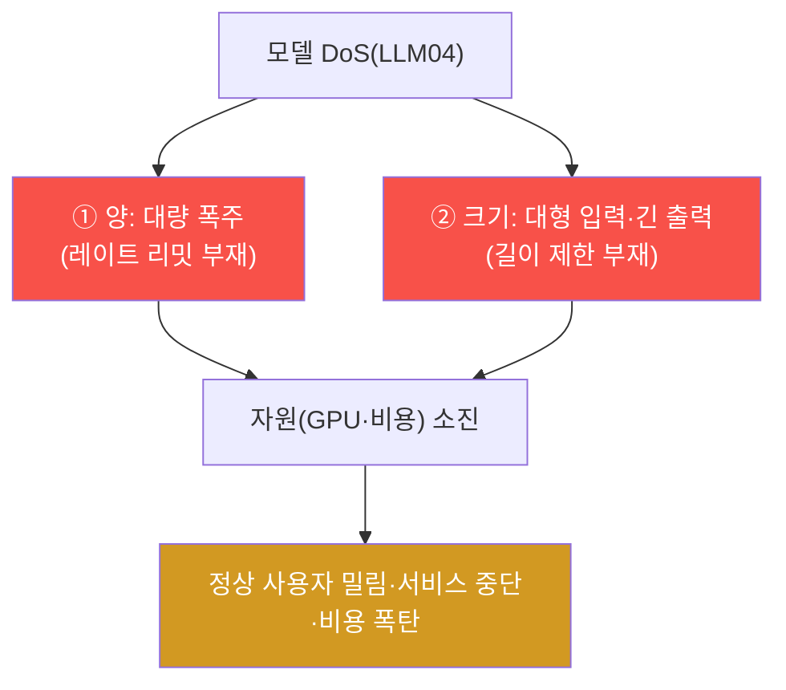
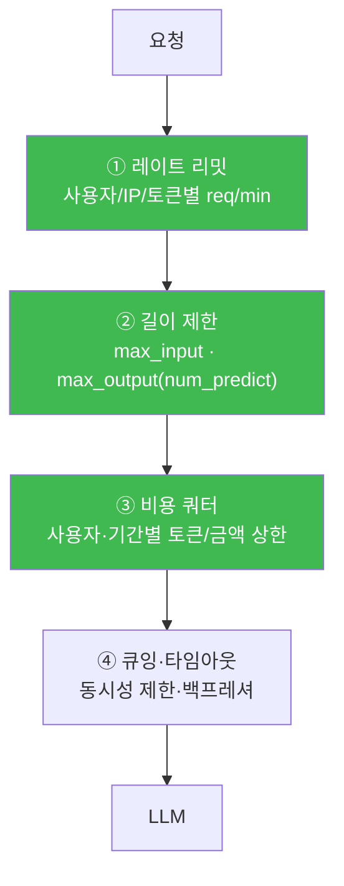
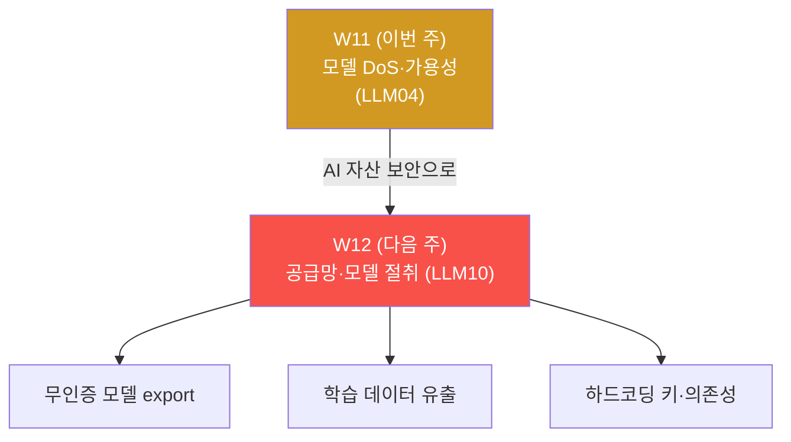

# ai-service-pentest W11 — 모델 서비스 거부(DoS): 레이트 리밋 부재·자원 고갈 (LLM04)

> **본 주차의 한 줄 요약**
>
> W11 은 **모델 서비스 거부(DoS, LLM04)** 다. 가용성(availability)도 보안의 한 축(CIA)이며, LLM
> 서비스는 **요청당 추론 비용이 크다** 는 특수성 때문에 DoS 에 특히 취약하다. AICompanion 은
> `/api/chat` 에 **레이트 리밋이 전혀 없어**(V20) 한 사용자가 짧은 시간에 수십·수백 요청을 퍼부어
> 자원(CPU·GPU·비용)을 소진시키고 정상 사용자를 밀어낼 수 있다. 게다가 **입력 크기 제한도 없어**,
> 거대한 입력·긴 출력 요청 하나가 비용을 비대칭적으로 키운다(자원 증폭 — 적은 요청으로 큰 부하).
> 핵심 개념은 **LLM 앱의 비용 구조** — 전통 웹은 요청당 비용이 작지만 LLM 은 크므로, 레이트
> 리밋에 더해 **입력·출력 길이 제한 + 비용 쿼터 + 큐잉** 이 필수다. 종량제 API 환경에서 이 결함은
> 곧 **비용 폭탄** 이 된다.

---

## ⚠️ 사전 경고 — 인가된 격리 훈련 대상에서만

모든 공격은 **인가된 격리 훈련 서비스 AICompanion(`ai.el34.lab`)** 만 대상으로 한다. 부하는
소규모(수십 건)로 제한해 훈련 서비스를 마비시키지 않는다 — 개념 확인이 목적이다.

---

## 이 주차의 시선 — 가용성도 보안이다

보안은 기밀성·무결성만이 아니라 **가용성(서비스가 계속 동작함)** 도 포함한다(CIA). W11 은 "정보를
빼내는" 대신 "서비스를 멈추는" 공격을 본다. 특히 LLM 의 비싼 비용 구조가 이 공격을 어떻게
증폭하는지 이해한다.

> **이 주차의 시선** — "이 요청은 얼마나 비싼가" 를 본다. 요청당 비용이 큰 시스템은 자원 통제가
> 생존 조건이다.

---

## 학습 목표

1. **모델 DoS(LLM04)** 와 LLM 의 비용 구조가 왜 DoS 를 증폭하는지 설명한다.
2. 레이트 리밋 부재를 확인한다(마커 `NO_RATELIMIT`).
3. 대량 폭주로 부하를 만들고(마커 `FLOOD_SENT`), 대형 입력으로 비용을 증폭한다(마커
   `COST_AMPLIFIED`).
4. DoS 근본 원인·방어를 도출한다(마커 `DOS_ANALYZED`).
5. 발견을 소견으로 종합한다(마커 `Assessment`).

---

## 0. 용어 해설 (DoS·자원)

| 용어 | 영문 | 뜻 | 비유 |
|------|------|----|------|
| **서비스 거부** | Denial of Service (LLM04) | 자원 소진으로 서비스 중단 | 창구를 혼자 다 차지 |
| **레이트 리밋** | Rate Limit | 시간당 요청 수 제한 | 1인당 번호표 개수 제한 |
| **자원 증폭** | Amplification | 적은 요청으로 큰 부하 유발 | 작은 힘으로 큰 피해 |
| **비용 쿼터** | Cost Quota | 사용자·기간별 비용 상한 | 월 사용 한도 |
| **큐잉/백프레셔** | Queuing/Backpressure | 과부하 시 요청을 줄 세움·조절 | 대기줄·입장 제한 |
| **가용성** | Availability | 서비스가 계속 동작하는 성질 | 항상 열린 창구 |

> **헷갈리기 쉬운 한 쌍 — 전통 DoS vs LLM DoS.** 전통 웹은 요청당 비용이 작아 **엄청난 양** 이
> 필요하다. LLM 은 요청당 추론 비용이 커 **적은 양으로도** 마비·비용 폭탄이 난다. 그래서 LLM 은
> "양(레이트)" 뿐 아니라 "**요청당 비용(크기)**" 도 통제해야 한다.

---

## 0.5 핵심 개념

### 0.5.1 두 갈래 DoS — 양과 크기

DoS 는 두 축이다 — **요청 수(양)** 와 **요청당 비용(크기)**. AICompanion 은 둘 다 무제한이라 양쪽
으로 공격 가능하다.

### 0.5.2 왜 LLM 이 특히 취약한가 — 비용 구조

전통 웹 요청은 처리에 밀리초·적은 자원이 든다. LLM 추론은 **초 단위·GPU·토큰당 과금** 이 든다.
그래서:

- **소량 폭주도 치명적** — 수십~수백 동시 요청이 GPU 큐를 채워 정상 사용자를 밀어낸다.
- **대형 입력이 비대칭** — 2만 자 입력은 그만큼 토큰·연산·비용을 쓴다. 요청 하나로 큰 부하.
- **종량제면 비용 폭탄** — 외부 LLM API 종량제라면 공격이 곧 청구서 폭증.

### 0.5.3 방어 — 레이트 리밋 + 비용·길이 통제

| 축 | 방어 |
|----|------|
| 양 | 사용자/IP/토큰별 **레이트 리밋**, 동시성 제한 |
| 크기 | **입력·출력 길이 제한**(최대 토큰), 요청당 비용 상한 |
| 비용 | 사용자·기간별 **비용 쿼터**, 초과 시 차단 |
| 과부하 | **큐잉·백프레셔·타임아웃**, 자동 확장·서킷브레이커 |
| 탐지 | 이상 트래픽 패턴 탐지·차단 |

전통 DoS 방어(레이트 리밋)에 **LLM 특유의 비용·길이 통제** 를 반드시 더해야 한다.

### 0.5.4 이번 주 채점 — 요청 로그

채점은 접근 로그로 한다 — (1) 연속 요청이 전부 처리됐는지(레이트 리밋 부재), (2) 폭주 20건 이상,
(3) 대형 입력 요청(`&big=1`)이 처리됐는지. `?me=<ME>` 토큰으로 귀속한다.

---

## 1. 모델 DoS 상세

### 1.1 한 줄 정의와 왜 위험한가

**한 줄 정의**: 모델 DoS 는 대량·고비용 요청으로 LLM 자원·비용을 소진시켜 서비스를 중단시키거나
비용을 폭증시키는 공격이다.

**왜 위험한가**: 가용성이 무너지면 서비스 자체가 멈추고, 종량제라면 직접적 금전 피해가 난다.
LLM 의 비싼 비용 구조 때문에 적은 노력으로 큰 피해가 가능하다.

### 1.2 AICompanion 에서 어떻게 — V20 무제한

`/api/chat` 에 레이트 리밋·입력 크기 제한이 전혀 없다(V20). STEP 1 에서 연속 요청이 전부
처리됨을 확인하고, STEP 2 에서 폭주로 부하를, STEP 3 에서 2만 자 입력으로 비용 증폭을 실증한다.

### 1.3 실무 — 비용이 곧 위협

LLM API 를 붙인 서비스에서 DoS 는 "다운" 뿐 아니라 **"청구서"** 로 나타난다. 무제한 요청·거대
입력을 방치하면 하룻밤 사이 막대한 API 비용이 청구될 수 있다. 그래서 실무에서는 사용자별 쿼터·
길이 제한을 기능 출시 전에 반드시 건다.

---

## 1.4 실무 사례 — "다운"이 아니라 "청구서"

LLM 서비스의 DoS 는 전통 웹과 피해 양상이 다르다.

- **하룻밤 비용 폭탄** — 종량제 LLM API 를 붙인 서비스에서, 레이트 리밋 없이 자동화 스크립트가
  수만 요청을 보내 하룻밤에 막대한 API 청구가 발생한 사례. 서버는 멀쩡한데 **지갑이 털린다.**
- **긴 출력 유도** — "10000단어로 써줘" 처럼 **최대 출력** 을 유도해 요청당 비용·지연을 키운 사례.
  입력은 짧아도 출력 토큰이 폭증한다.
- **재귀·증폭 프롬프트** — 모델이 스스로 긴 사고 과정을 생성하게 유도(추론 모델의 `<think>` 남용)해
  요청당 연산을 비대칭적으로 키우는 기법.
- **GPU 큐 포화** — 동시 요청으로 GPU 추론 큐를 채워 정상 사용자의 응답을 지연·차단.

교훈: LLM DoS 방어는 "요청 수" 뿐 아니라 **"요청·응답의 비용(토큰·연산)"** 을 통제해야 한다.

## 1.5 왜 LLM 은 요청당 비싼가 — 토큰 경제학

전통 웹 요청과 LLM 요청의 비용 구조를 비교하면 방어의 방향이 보인다.

| 구분 | 전통 웹 요청 | LLM 추론 요청 |
|------|--------------|---------------|
| 처리 시간 | 밀리초 | 초~수십 초(CPU면 더) |
| 비용 결정 | 고정(대체로) | **토큰 수에 비례**(입력+출력) |
| 자원 | CPU 약간 | GPU/메모리 대량 |
| 증폭 여지 | 작음 | 큼(긴 입력·긴 출력·추론) |

즉 LLM 은 **요청 하나의 비용이 입력·출력 길이에 비례** 하고 절대값도 크다. 그래서 "양(레이트)"
만 막으면 부족하고 **"크기(토큰 한도)"** 와 **"비용(쿼터)"** 을 함께 막아야 한다.

## 1.6 고치는 코드 — 레이트 리밋·쿼터 설계

- **① 레이트 리밋** — 사용자/IP/API 토큰별 분당·시간당 요청 수 제한(예: 슬라이딩 윈도우·토큰
  버킷). 익명·저신뢰 사용자는 더 엄격히.
- **② 길이 제한** — 입력 토큰 상한(초과 시 거부·절단)과 출력 상한(`num_predict`/`max_tokens`)을
  강제. AICompanion 은 이 둘이 없어 2만 자 입력이 그대로 통했다.
- **③ 비용 쿼터** — 사용자·기간별 토큰/금액 상한을 두고 초과 시 차단·알림. 종량제 API 비용을 캡.
- **④ 큐잉·타임아웃·서킷브레이커** — 과부하 시 요청을 줄 세우고(백프레셔), 긴 요청은 타임아웃,
  급증 시 서킷브레이커로 보호. 이상 트래픽은 탐지·자동 차단.

이 네 겹이 겹쳐야 "양·크기·비용·과부하" 를 모두 막는다. 하나만으로는 우회된다(레이트만 있으면
대형 입력으로, 길이만 있으면 대량으로).

---

## 2. 방어 (Blue) 관점

- **레이트 리밋(근본)** — 사용자/IP/토큰별 시간당 요청 수 제한, 동시성 제한.
- **입력·출력 길이 제한** — 최대 입력 토큰·최대 생성 토큰을 강제.
- **비용 쿼터** — 사용자·기간별 비용 상한, 초과 시 차단·알림.
- **큐잉·백프레셔·타임아웃** — 과부하 시 요청을 조절, 긴 요청 타임아웃.
- **자동 확장·서킷브레이커·이상 탐지** — 급증 트래픽에 대응·차단.

---

## 3. 실습 안내 (총 5 미션) — F12 콘솔로 부하, 로그로 확인

공격은 **브라우저 F12 콘솔** 로 `http://ai.el34.lab`(로그인 `admin/admin`), 확인만 el34 호스트
에서 한 줄씩. 부하는 소규모(수십 건)로 제한한다. `?me=<ME>` 토큰으로 귀속한다.

### 미션 1 — 레이트 리밋 부재 확인 → `NO_RATELIMIT`
> 콘솔로 6개 연속 요청 → 모두 200(차단 없음). 로그 5건 이상이면 통과.

### 미션 2 — 대량 폭주 → `FLOOD_SENT`
> 25건 폭주(소규모). 로그 20건 이상이면 통과.

### 미션 3 — 대형 입력 비용 증폭 → `COST_AMPLIFIED`
> 2만 자 입력을 `&big=1` 로 전송. 로그에 기록되면 통과.

### 미션 4 — 근본 원인·방어 → `DOS_ANALYZED`
> 제한 부재·요청당 고비용, 방어(레이트 리밋·크기/비용 제한·큐잉)를 노트에.

### 미션 5 — 종합 소견 → `Assessment`
> 레이트 리밋 부재·폭주·방어를 첫 줄 `Assessment` 로.

---

## 4. 핵심 정리 (1줄씩)

- 모델 DoS(LLM04)는 대량·고비용 요청으로 **가용성·비용** 을 공격한다.
- AICompanion 은 레이트 리밋·입력 크기 제한이 없다(V20) — 양·크기 양쪽 취약.
- LLM 은 **요청당 추론 비용이 커** 적은 요청으로도 마비·비용 폭탄이 난다.
- 방어: **레이트 리밋 + 입출력 길이 제한 + 비용 쿼터 + 큐잉/타임아웃 + 이상 탐지.**
- 가용성도 보안(CIA)이며, LLM 은 비용 통제가 생존 조건이다.

---

## 5. 다음 주차 (W12) 예고 — 공급망·모델 절취 (LLM10)

W12 는 **AI 공급망·모델 절취(LLM10)** 를 다룬다. 무인증 모델 export, 학습 데이터(PII 포함) 유출,
정적 자산의 하드코딩 키 등 AI 자산의 무결성·기밀성 결함과 방어를 판다.

