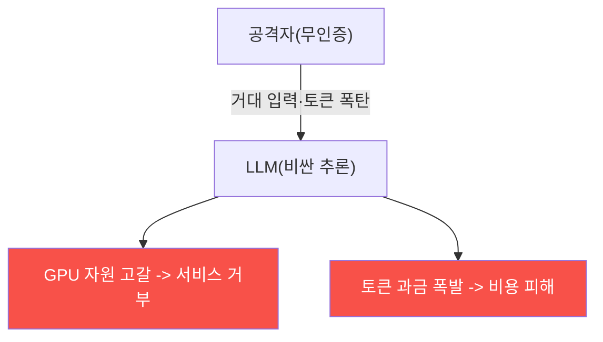

# ai-service-pentest W11 — 모델 DoS: 자원 고갈 공격 (LLM04)

> **본 주차의 한 줄 요약**
>
> **모델 DoS(Denial of Service)** 는 OWASP LLM Top 10의 **LLM04** — LLM의 **자원(연산·토큰·비용)** 을 고갈시켜
> 서비스를 마비시키거나 **막대한 비용**을 유발하는 공격이다. LLM 추론은 전통 웹 요청보다 **훨씬 비싸다**(GPU·
> 토큰당 과금). 그래서 자원 공격의 영향이 크다: ① **긴 입력(long input)** — 최대 컨텍스트에 가까운 거대한 입력을
> 보내 처리 부하·비용 폭증, ② **토큰 폭탄** — "숫자를 1부터 무한히 세라", "이 단어를 10000번 반복하라"로 긴 출력
> 유발(출력 토큰당 과금), ③ **재귀·증폭** — 에이전트가 스스로 반복 호출하게 유도(무한 루프)·도구 호출 폭증,
> ④ **동시 요청 폭주** — 대량 요청으로 GPU 큐 포화, ⑤ **비용 공격(denial of wallet)** — 서비스를 죽이지 않아도
> **과금을 폭발**시켜 재정 피해(종량제 API 악용). 특히 무인증(W09) API면 공격자가 무제한 비싼 요청을 날린다.
> 결과: 정상 사용자 서비스 거부·GPU 자원 고갈·청구서 폭탄. 방어: **입력 길이 제한**(최대 토큰), **출력 토큰 예산**
> (num_predict 상한), **요청 속도 제한(rate limit)**·사용자별 쿼터, **타임아웃·비용 상한**, **재귀·반복 감지**,
> **인증**(무인증 남용 차단). LLM 서비스는 요청당 비용이 커서 **자원 관리가 곧 가용성·비용 방어**다. 전통 웹의
> rate limit·입력 검증이 LLM엔 더 중요하다.
>
> **한 줄 결론**: 모델 DoS(LLM04)는 긴 입력·토큰 폭탄·재귀·요청 폭주로 LLM 자원·비용을 고갈시킨다. 방어 =
> **입력/출력 토큰 제한 + 속도 제한·쿼터 + 타임아웃·비용 상한 + 인증**.

---

## 학습 목표

본 주차 종료 시 학생은 다음 5가지를 **본인 손으로** 할 수 있어야 한다.

1. **모델 DoS(LLM04)** 의 벡터를 설명한다.
2. **DoS 벡터**를 식별한다(DOS_VECTORS).
3. **자원 고갈**을 시뮬한다(RESOURCE_EXHAUSTED).
4. **자원 제한**으로 방어한다(DOS_MITIGATED).
5. LLM 요청 비용이 왜 DoS를 심각하게 하는지 설명한다.

> **이 주차의 시선** — 비싼 LLM 요청을 악용한 자원·비용 공격을 이해하고, 자원 관리로 막는다.

---

## 0. 용어 해설 (모델 DoS)

| 용어 | 영문 | 뜻 | 비유 |
|------|------|----|------|
| **토큰 폭탄** | Token Bomb | 긴 입출력 유발 | 폭주 주문 |
| **비용 공격** | Denial of Wallet | 과금 폭발 | 청구서 폭탄 |
| **속도 제한** | Rate Limit | 요청 빈도 제한 | 대기줄 |
| **토큰 예산** | Token Budget | 입출력 상한 | 예산 한도 |
| **쿼터** | Quota | 사용자별 할당 | 배급 |

> **헷갈리기 쉬운 한 쌍** — *전통 DoS* 는 "트래픽으로 마비", *모델 DoS* 는 "비싼 추론으로 마비·비용 폭발"이다.
> LLM은 요청당 비용이 커서 더 위험.

---

## 0.5 신입생 친화 핵심 개념

### 0.5.1 왜 LLM DoS가 심각한가

LLM 추론은 비싸다(GPU·토큰 과금). 소수 요청으로도 자원 고갈·비용 폭발을 유발. 전통 DoS보다 적은 노력으로 큰 피해.

### 0.5.2 DoS 벡터

- **긴 입력**: 최대 컨텍스트에 가까운 입력 → 처리 부하.
- **토큰 폭탄**: "무한히 세라"·"10000번 반복"으로 긴 출력.
- **재귀·증폭**: 에이전트 무한 루프·도구 호출 폭증.
- **요청 폭주**: 동시 대량 요청으로 큐 포화.
- **비용 공격**: 서비스를 안 죽여도 과금 폭발(denial of wallet).

### 0.5.3 무인증의 증폭

무인증(W09) API면 공격자가 **무제한** 비싼 요청을 날린다 — 인증·쿼터가 없으니 한 사람이 서비스를 마비시키거나
비용을 폭발시킨다. 인증·쿼터가 첫 방어선.

### 0.5.4 방어 — 자원 관리

- **입력 길이 제한**: 최대 입력 토큰 상한.
- **출력 토큰 예산**: `num_predict` 등 출력 상한(무한 생성 차단).
- **속도 제한·쿼터**: 사용자·IP별 요청 빈도·일일 한도.
- **타임아웃·비용 상한**: 요청당 시간·비용 한도.
- **재귀·반복 감지**: 에이전트 루프 상한(autonomous-security W02).
- **인증**: 무인증 남용 차단.
LLM 서비스는 자원 관리가 곧 가용성·비용 방어다.

### 0.5.5 el34 맥락

본 실습은 **DoS 벡터 식별·자원 고갈 시뮬·자원 제한 방어 로직**을 결정론 시뮬로 익힌다(실제 부하 공격은 인가된
환경·주의 하에서만).

---

## 1. 실습 안내 (5 미션)

실행 위치 el34 **호스트**(`ssh ccc@{{TARGET_IP}}`), GPU `http://211.170.162.139:10934`.

### STEP 1 — GPU 헬스체크 → GEN_OK
### STEP 2 — DoS 벡터 식별 → DOS_VECTORS
### STEP 3 — 자원 고갈 시뮬 → RESOURCE_EXHAUSTED
### STEP 4 — 자원 제한 방어 → DOS_MITIGATED
### STEP 5 — 종합 → Assessment

---

## 2. 흔한 오해·관제자 노트

- **"DoS는 트래픽만"** — LLM은 비싼 추론. 소수 요청으로 고갈.
- **"비용은 걱정 없다"** — denial of wallet. 토큰 예산·쿼터.
- **"무인증도 괜찮다"** — 무제한 남용. 인증·쿼터.
- **관제 관점** — AI 서비스가 입력/출력 토큰 제한·속도 제한·쿼터·타임아웃·인증을 갖췄는지 점검한다. 자원 관리가
  가용성·비용 방어.

---

## 3. 다음 주차 (W12) 예고 — 공급망·플러그인 취약점

W11이 "모델 DoS"였다면, W12는 **공급망·플러그인**(LLM05/07) — 모델·플러그인·의존성의 공급망 취약점과 안전하지
않은 플러그인 통합을 다룬다.
