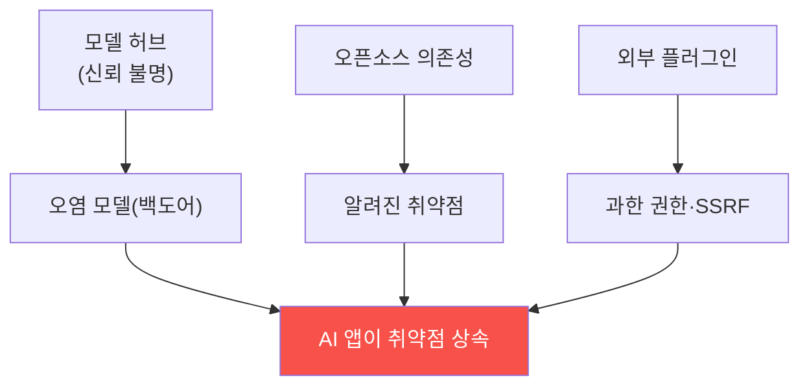

# ai-service-pentest W12 — 공급망·플러그인 취약점 (LLM05·LLM07)

> **본 주차의 한 줄 요약**
>
> AI 서비스는 자기가 만들지 않은 **외부 구성요소**에 크게 의존한다 — 사전학습 모델·오픈소스 라이브러리·플러그인·
> 데이터셋·API. 이 **공급망(LLM05)** 과 **플러그인(LLM07)** 이 큰 위험이다. **공급망(LLM05)**: ① **오염된 모델** —
> 신뢰할 수 없는 출처(허브)의 모델에 **백도어**가 심겼을 수 있다(ai-safety-adv의 QLoRA 가중치 백도어처럼 — 특정
> 트리거에 악성 동작), ② **취약한 의존성** — LLM 앱의 파이썬 패키지·라이브러리에 알려진 취약점(전통 SCA), ③ **오염된
> 데이터셋** — 학습·파인튜닝 데이터 중독(ai-security), ④ **모델 파일 역직렬화** — pickle 등 모델 로딩 시 코드 실행.
> **플러그인(LLM07)**: LLM이 외부 기능을 쓰는 플러그인/도구가 **안전하지 않게 통합**되면 — 입력 검증 없이 LLM
> 출력을 플러그인에 넘기거나(W06 출력 처리), 플러그인이 과한 권한을 가지면(W07 과도한 에이전시), 인젝션이 플러그인을
> 통해 **실제 시스템 공격**(SSRF·명령 실행·데이터 접근)으로 확장된다. 핵심 위험은 **신뢰의 전이** — "믿을 수 없는
> 구성요소를 믿는" 것. 방어: **모델 출처 검증**(신뢰 허브·서명·해시), **의존성 스캔·고정**(SCA·SBOM·lockfile),
> **안전한 역직렬화**(safetensors 등), **플러그인 샌드박스·최소 권한·입력 검증**, **플러그인 출력 검증**. AI 앱의
> 보안은 그 구성요소의 보안만큼 강하다 — 공급망을 검증하지 않으면 남의 취약점·백도어를 물려받는다.
>
> **한 줄 결론**: 공급망(LLM05)·플러그인(LLM07)은 외부 모델·의존성·플러그인의 백도어·취약점·과도한 권한을 물려
> 받는 위험이다. 방어 = **모델 출처 검증·의존성 스캔·안전한 역직렬화 + 플러그인 샌드박스·최소 권한·입출력 검증**.

---

## 학습 목표

본 주차 종료 시 학생은 다음 5가지를 **본인 손으로** 할 수 있어야 한다.

1. **공급망(LLM05)·플러그인(LLM07)** 위험을 설명한다.
2. AI 공급망 **공격 표면**을 매핑한다(SUPPLY_SURFACE).
3. **오염 모델·안전하지 않은 플러그인** 위험을 평가한다(SUPPLY_RISK).
4. **출처 검증·샌드박스**로 방어한다(SUPPLY_SECURED).
5. 신뢰 전이 문제를 설명한다.

> **이 주차의 시선** — 외부 구성요소의 백도어·취약점을 물려받는 위험을 이해하고 검증한다.

---

## 0. 용어 해설 (공급망)

| 용어 | 영문 | 뜻 | 비유 |
|------|------|----|------|
| **공급망** | Supply Chain | 외부 구성요소 | 부품 공급 |
| **오염 모델** | Poisoned Model | 백도어 모델 | 위조 부품 |
| **SBOM** | Software Bill of Materials | 구성요소 목록 | 부품 명세 |
| **역직렬화** | Deserialization | 파일→객체 로딩 | 조립 |
| **플러그인 샌드박스** | Plugin Sandbox | 플러그인 격리 | 격리실 |

> **헷갈리기 쉬운 한 쌍** — *내가 만든 코드* 는 "내가 통제", *외부 구성요소* 는 "남을 믿음(검증 필요)"이다. 검증
> 없는 신뢰가 위험.

---

## 0.5 신입생 친화 핵심 개념

### 0.5.1 공급망 신뢰 전이

외부 모델·의존성·플러그인의 취약점·백도어를 AI 앱이 물려받는다. 남을 믿으면 남의 위험을 상속.

### 0.5.2 공급망(LLM05)

- **오염 모델**: 허브의 모델에 백도어(트리거→악성). ai-safety-adv QLoRA 가중치 백도어가 실증.
- **취약한 의존성**: 파이썬 패키지 취약점(전통 SCA).
- **오염 데이터셋**: 학습 데이터 중독(ai-security).
- **역직렬화**: pickle 모델 로딩 시 코드 실행.

### 0.5.3 플러그인(LLM07)

LLM이 외부 기능을 쓰는 플러그인이 안전하지 않게 통합되면:
- **입력 검증 부재**: LLM 출력을 플러그인에 그대로(W06) → SSRF·명령 실행.
- **과한 권한**: 플러그인이 필요 이상 권한(W07) → 인젝션이 시스템 공격으로 확장.
- **플러그인 출력 미검증**: 플러그인 응답이 다시 인젝션(간접, W04).
인젝션 + 안전하지 않은 플러그인 = 실제 시스템 침해.

### 0.5.4 방어 — 검증과 격리

- **모델 출처 검증**: 신뢰 허브·**서명·해시** 확인, 안전한 포맷(safetensors).
- **의존성 스캔·고정**: SCA·SBOM·lockfile로 취약 패키지 탐지·고정.
- **플러그인 샌드박스**: 플러그인을 격리 실행(최소 권한).
- **플러그인 입출력 검증**: LLM→플러그인 입력 검증, 플러그인→LLM 출력 검증.
남을 믿기 전에 검증한다.

### 0.5.5 el34 맥락

본 실습은 **공급망 표면·오염 모델/플러그인 위험·검증 방어 로직**을 결정론 시뮬로 익힌다. ai-safety-adv(모델
백도어)·ai-security(데이터 중독)와 연결.

---

## 1. 실습 안내 (5 미션)

실행 위치 el34 **호스트**(`ssh ccc@{{TARGET_IP}}`), GPU `http://211.170.162.139:10934`.

### STEP 1 — GPU 헬스체크 → GEN_OK
### STEP 2 — 공급망 표면 매핑 → SUPPLY_SURFACE
### STEP 3 — 오염 모델·플러그인 위험 → SUPPLY_RISK
### STEP 4 — 출처 검증·샌드박스 방어 → SUPPLY_SECURED
### STEP 5 — 종합 → Assessment

---

## 2. 흔한 오해·관제자 노트

- **"허브 모델은 안전"** — 백도어 가능. 출처·서명 검증.
- **"플러그인은 편의"** — 인젝션 확장 통로. 샌드박스·검증.
- **"의존성은 신경 안 씀"** — 취약점 상속. SCA·SBOM.
- **관제 관점** — AI 앱이 모델 출처·의존성·플러그인을 검증·격리하는지, 안전한 포맷·최소 권한인지 점검한다.
  구성요소만큼만 안전하다.

---

## 3. 다음 주차 (W13) 예고 — 멀티모달·고급 우회

W12가 "공급망"이었다면, W13은 **멀티모달·고급 우회** — 이미지·오디오를 통한 인젝션, 인코딩·다국어 등 고급 필터
우회 기법을 다룬다.
