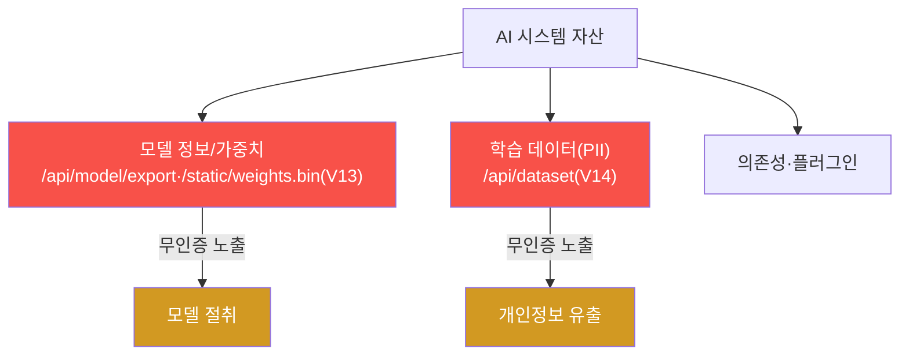
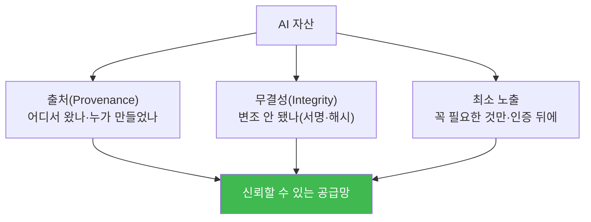
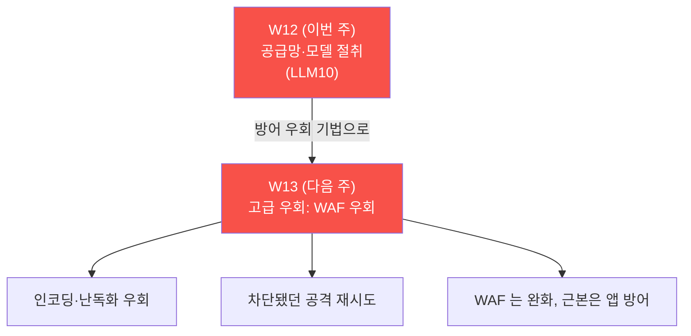

# ai-service-pentest W12 — 공급망·모델 절취: 무인증 모델·학습 데이터 유출 (LLM10)

> **본 주차의 한 줄 요약**
>
> W12 는 **AI 공급망·모델 절취(LLM10)** 다. 모델·학습 데이터·가중치는 조직의 **핵심 지적 자산**
> 이자 개인정보 저장고인데, AICompanion 은 이를 **인증 없이 통째로 내준다.** `/api/model/export`
> (V13)는 모델 정보와 **가중치 위치** 를, `/static/weights.bin` 은 그 **가중치 파일** 을,
> `/api/dataset`(V14)은 **학습 데이터(직원 주민번호·고객 PII 포함)** 를 노출한다. 즉 공격자는
> 로그인만 하면 모델을 통째로 복제(모델 절취)하고, 학습 데이터의 개인정보까지 유출한다. 핵심
> 개념은 **AI 공급망 자산의 보호** — 모델·가중치·데이터·의존성·플러그인 등 AI 시스템을 이루는
> 모든 자산은 **인증·인가·무결성(서명)·최소 노출** 로 지켜야 하며, 특히 학습 데이터의 PII 는
> 유출 시 개인정보 사고(법적 책임)로 직결된다.

---

## ⚠️ 사전 경고 — 인가된 격리 훈련 대상에서만

모든 공격은 **인가된 격리 훈련 서비스 AICompanion(`ai.el34.lab`)** 만 대상으로 한다. 공격을
배우는 이유는 방어를 위해서다.

---

## 이 주차의 시선 — AI 를 이루는 자산 전체를 보라

AI 서비스는 코드만이 아니라 **모델·가중치·학습 데이터·의존성·플러그인** 이라는 자산의 집합이다.
공격 표면은 "앱" 을 넘어 이 **공급망 전체** 로 넓어진다. W12 는 그 자산들이 어떻게 노출·절취
되는지, 어떻게 지키는지 본다.

> **이 주차의 시선** — "이 시스템의 자산은 무엇이고, 각각 어떻게 보호되나" 를 본다.

---

## 학습 목표

1. **공급망·모델 절취(LLM10)** 의 범위(모델·가중치·데이터·의존성)를 설명한다.
2. 무인증 모델 export 로 모델·가중치 위치를 절취한다(마커 `MODEL_STOLEN`).
3. 노출된 위치에서 가중치를 다운로드하고(마커 `WEIGHTS_PULLED`), 무인증 학습 데이터(PII)를
   유출한다(마커 `DATASET_LEAKED`).
4. 공급망 근본 원인·방어를 도출한다(마커 `SUPPLY_ANALYZED`).
5. 발견을 소견으로 종합한다(마커 `Assessment`).

---

## 0. 용어 해설 (공급망·모델 자산)

| 용어 | 영문 | 뜻 | 비유 |
|------|------|----|------|
| **AI 공급망** | AI Supply Chain | 모델·데이터·의존성·플러그인 등 구성 자산 사슬 | 부품 공급망 |
| **모델 절취** | Model Theft | 모델·가중치를 복제·탈취 | 설계도 도난 |
| **가중치** | Weights | 학습된 모델의 파라미터(핵심 자산) | 완성된 설계도 |
| **아티팩트** | Artifact | 모델·체크포인트 등 산출물 파일 | 제조 산출물 |
| **무결성 서명** | Integrity Signature | 자산이 변조되지 않았음을 서명으로 보장 | 봉인·인증서 |
| **최소 노출** | Minimal Exposure | 꼭 필요한 것만 외부에 공개 | 필요한 것만 진열 |
| **PII 익명화** | Anonymization | 개인정보를 식별 불가하게 처리 | 이름 가리기 |

> **헷갈리기 쉬운 한 쌍 — 코드 보안 ≠ 자산 보안.** 앱 코드를 잘 지켜도, 모델·데이터 엔드포인트가
> 무인증이면 **자산 자체** 가 샌다. AI 보안은 코드뿐 아니라 **모델·데이터·공급망** 을 포함한다.

---

## 0.5 핵심 개념

### 0.5.1 AI 공급망의 자산과 노출점

각 자산에 인증·인가가 없으면, 로그인한 누구나(또는 무인증) 모델을 복제하고 데이터를 유출한다.

### 0.5.2 모델 절취 — 정보에서 가중치로

`/api/model/export` 는 모델명·파라미터뿐 아니라 **가중치 파일 위치(`weights_uri`)** 를 알려 준다.
공격자는 그 위치(`/static/weights.bin`)에서 가중치를 그대로 내려받아 **모델을 통째로 복제** 한다.
학습에 든 비용·지적 자산이 한 번에 유출된다.

### 0.5.3 학습 데이터 유출 — PII 는 사고다

`/api/dataset` 는 학습/참조 데이터를 인증 없이 노출한다. 그 안에 **직원 주민번호·고객 PII** 가
섞여 있어, 단순 데이터 유출을 넘어 **개인정보 사고(법적 책임)** 가 된다. 학습 데이터는 수집·정제
단계에서 PII 를 제거·익명화하고 접근을 통제해야 한다.

### 0.5.4 방어 — 자산에 인증·무결성·최소 노출

| 자산 | 방어 |
|------|------|
| 모델·가중치 | 엔드포인트 인증·인가, 최소 노출(불필요한 export 제거), 아티팩트 무결성 서명 |
| 학습 데이터 | PII 제거·익명화, 접근 통제·감사 로깅 |
| 의존성·플러그인 | 출처·무결성 검증(서명·해시), 샌드박스, 버전 고정 |
| 공통 | 최소 권한, 감사 로깅, 자산 인벤토리 관리 |

핵심은 **AI 자산도 "인증·무결성·최소 노출" 로 지켜야 한다** — 코드 보안만으로는 부족하다.

### 0.5.5 이번 주 채점 — 요청 로그

채점은 접근 로그로 한다 — 모델 export·가중치 다운로드·데이터셋 유출을 `?me=<ME>` 로 호출했는지
확인한다. 모두 GET 이라 브라우저 주소창으로 수행한다.

---

## 1. 공급망·모델 절취 상세

### 1.1 한 줄 정의와 왜 위험한가

**한 줄 정의**: 공급망·모델 절취는 모델·가중치·학습 데이터·의존성 등 AI 자산이 인증·무결성 통제
없이 노출·탈취·오염되는 취약이다.

**왜 위험한가**: 모델은 막대한 학습 비용의 지적 자산이고, 학습 데이터는 개인정보를 담는다. 이들이
새면 경쟁력 상실·개인정보 사고·모델 오염(공급망 공격)으로 이어진다.

### 1.2 AICompanion 에서 어떻게 — V13·V14

- **V13 모델 export**: `/api/model/export` 가 인증 없이 모델 정보·가중치 위치를 노출 →
  `/static/weights.bin` 다운로드로 절취 완성.
- **V14 학습 데이터**: `/api/dataset` 가 인증 없이 PII 포함 데이터를 노출.

### 1.3 실무 — 공급망은 넓다

실제 AI 공급망 공격은 다양하다 — 오염된 사전학습 모델·데이터셋(백도어), 악성 의존성 패키지,
변조된 모델 허브 아티팩트. 방어는 **출처·무결성 검증(서명·해시), 자산 인벤토리, 최소 노출** 이며,
W12 의 무인증 노출은 그 기본(인증·인가)조차 없는 극단 사례다.

---

## 1.4 실무 사례 — AI 공급망은 넓고 얕은 곳이 많다

AI 공급망 공격은 모델·데이터·의존성·플러그인 어디서든 들어온다.

- **오염된 사전학습 모델(백도어)** — 모델 허브에서 받은 가중치에 **트리거 백도어** 가 심겨, 특정
  입력에서만 악성 동작을 하는 사례. 겉으론 정상 성능이라 탐지가 어렵다(el34 GPU 의 `ccc-backdoor`
  모델명이 이 개념의 훈련용 예다).
- **중독된 데이터셋** — 공개 데이터셋·크롤링 데이터에 악성 샘플을 섞어 학습시켜, 모델에 편향·
  백도어·유출 성향을 심는 사례(데이터 포이즈닝).
- **악성 의존성 패키지** — 파이썬/노드 패키지 이름을 오타·유사하게 만든(타이포스쿼팅) 악성
  라이브러리가 학습·서빙 파이프라인에 침투한 사례.
- **모델·아티팩트 유출** — W12 처럼 모델 export·가중치·학습 데이터가 인증 없이 노출돼 지적 자산·
  PII 가 통째로 새는 사례.

공통 교훈: **"내가 쓰는 모델·데이터·코드를 어디서 받았고 변조되지 않았는가"** 를 검증해야 한다.

## 1.5 방어의 축 — 무결성·출처·최소 노출

- **출처(Provenance)** — 모델·데이터·의존성의 출처를 기록·검증한다. 신뢰된 레지스트리·서명된
  아티팩트만 사용. **SBOM(Software Bill of Materials)** 처럼 "AI-BOM"(모델·데이터·의존성 목록)을
  관리한다.
- **무결성** — 아티팩트에 **서명·해시** 를 붙여 배포·로드 시 검증한다. 변조되면 거부.
- **최소 노출** — 모델 export·가중치·데이터 엔드포인트를 **인증·인가 뒤로** 두고, 불필요한 노출
  (디버그·export API)을 제거한다. 학습 데이터는 수집 단계에서 PII 제거·익명화.

## 1.6 방어 체크리스트 — 공급망 단계별

| 단계 | 위험 | 방어 |
|------|------|------|
| **수집** | 중독된 데이터·PII | 출처 검증, PII 제거·익명화, 샘플 검사 |
| **학습** | 백도어·편향 | 신뢰된 파이프라인, 재현 가능 빌드, 무결성 로그 |
| **배포** | 변조된 아티팩트 | 서명·해시 검증, 신뢰 레지스트리 |
| **서빙** | 자산 유출·무인증 노출 | 엔드포인트 인증/인가, 최소 노출, 감사 로깅 |
| **의존성** | 악성/취약 패키지 | 버전 고정, 취약점 스캔, 서명 검증 |

AI 보안은 "모델을 잘 만드는 것" 을 넘어 **모델·데이터·코드가 흐르는 전 과정** 을 지키는 것이다.

---

## 2. 방어 (Blue) 관점

- **자산 엔드포인트 인증·인가(근본)** — 모델·가중치·데이터 API 에 접근 통제, 최소 노출.
- **아티팩트 무결성 서명·출처 검증** — 모델·의존성·플러그인의 서명·해시 검증.
- **학습 데이터 PII 제거·익명화** — 수집·정제 단계에서 개인정보 처리, 접근 통제.
- **최소 권한·감사 로깅** — 자산 접근을 기록·감사, 이상 탐지.
- **자산 인벤토리** — 무엇이 어디에 있고 누가 접근 가능한지 관리.

---

## 3. 실습 안내 (총 5 미션) — 브라우저 주소창으로 공격, 로그로 확인

공격은 **브라우저** 로 `http://ai.el34.lab`(로그인 `admin/admin`), 확인만 el34 호스트에서 한
줄씩. 모두 GET 이라 주소창에서 수행하고 `?me=<ME>` 로 귀속한다.

### 미션 1 — 무인증 모델 export → `MODEL_STOLEN`
> `/api/model/export?me=<ME>` → 모델 정보·`weights_uri`. 로그에 남으면 통과.

### 미션 2 — 가중치 다운로드 → `WEIGHTS_PULLED`
> `/static/weights.bin?me=<ME>` → 가중치 다운로드. 로그에 남으면 통과.

### 미션 3 — 학습 데이터(PII) 유출 → `DATASET_LEAKED`
> `/api/dataset?me=<ME>` → 주민번호·PII. 로그에 남으면 통과.

### 미션 4 — 근본 원인·방어 → `SUPPLY_ANALYZED`
> 자산에 인증/인가·무결성 부재·PII 잔존, 방어(인증·서명·PII 제거)를 노트에.

### 미션 5 — 종합 소견 → `Assessment`
> 모델·데이터 절취·방어를 첫 줄 `Assessment` 로.

---

## 4. 핵심 정리 (1줄씩)

- 공급망·모델 절취(LLM10)는 **모델·가중치·데이터·의존성** 자산을 노린다.
- AICompanion 은 모델 export(V13)·가중치·학습 데이터(V14)를 **인증 없이** 노출.
- 모델 절취는 지적 자산 유출, 학습 데이터 PII 유출은 **개인정보 사고** 다.
- 방어: **자산 인증/인가 + 아티팩트 무결성 서명 + 학습 데이터 PII 제거 + 최소 노출.**
- AI 보안은 코드뿐 아니라 **모델·데이터·공급망 전체** 를 포함한다.

---

## 5. 다음 주차 (W13) 예고 — 고급 우회 (WAF 우회)

지금까지 WAF(ModSec)에 막혔던 공격(경로순회·OS 명령·XSS)을 **우회** 하는 고급 기법을 다룬다.
인코딩·난독화로 방어 규칙을 넘어, **"WAF 는 완화이지 근본 방어가 아니다"** 를 실증한다.

