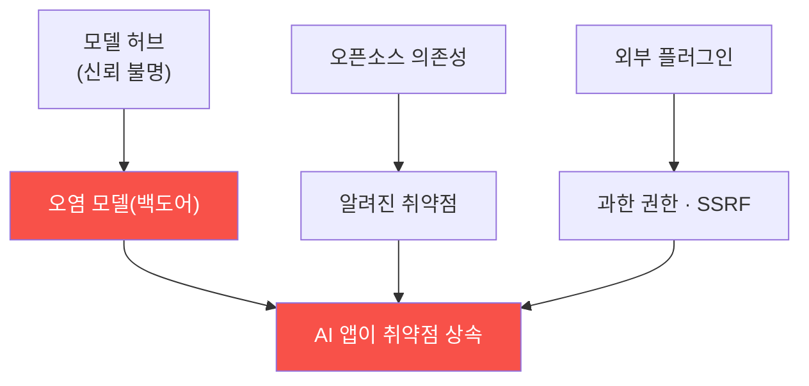

# ai-service-pentest W12 — 공급망·플러그인 취약점 (LLM05·LLM07)

> **본 주차의 한 줄 요약**
>
> AI 서비스는 자기가 만들지 않은 **외부 구성요소**에 크게 의존한다 — 사전학습 모델·오픈소스 라이브러리·플러그인·
> 데이터셋·API. 이 **공급망(LLM05)**과 **플러그인(LLM07)**이 큰 위험이다. **공급망(LLM05)**: ① 오염된 모델(신뢰할
> 수 없는 허브의 모델에 백도어 — 특정 트리거에 악성 동작, ai-safety-adv의 QLoRA 가중치 백도어처럼), ② 취약한
> 의존성(파이썬 패키지·라이브러리의 알려진 취약점, 전통 SCA), ③ 오염된 데이터셋(학습·파인튜닝 데이터 중독,
> ai-security), ④ 모델 파일 역직렬화(pickle 등 로딩 시 코드 실행). **플러그인(LLM07)**: LLM이 외부 기능을 쓰는
> 플러그인/도구가 안전하지 않게 통합되면 — 입력 검증 없이 LLM 출력을 플러그인에 넘기거나(W06), 플러그인이 과한
> 권한을 가지면(W07), 인젝션이 플러그인을 통해 **실제 시스템 공격**(SSRF·명령 실행·데이터 접근)으로 확장된다. 핵심
> 위험은 **신뢰의 전이** — "믿을 수 없는 구성요소를 믿는" 것이다. 실습에서는 공급망 표면을 매핑하고(마커
> `SUPPLY_SURFACE`), 오염 모델·안전하지 않은 플러그인 위험을 평가하며(마커 `SUPPLY_RISK`), 출처 검증·샌드박스로
> 강화한다(마커 `SUPPLY_SECURED`). 방어는 **모델 출처 검증(서명·해시·safetensors)·의존성 스캔/고정(SCA·SBOM·
> lockfile)·플러그인 샌드박스·최소 권한·입출력 검증**이다. AI 앱의 보안은 그 구성요소의 보안만큼만 강하다.

---

## 학습 목표

본 주차 종료 시 학생은 다음 5가지를 **본인 손으로** 할 수 있어야 한다.

1. 공급망(LLM05)·플러그인(LLM07) 위험과 "신뢰 전이" 개념을 설명한다.
2. AI 공급망의 **공격 표면**을 매핑한다(마커 `SUPPLY_SURFACE`).
3. **오염 모델·안전하지 않은 플러그인** 위험을 평가한다(마커 `SUPPLY_RISK`).
4. **출처 검증·샌드박스**로 방어되는 것을 확인한다(마커 `SUPPLY_SECURED`).
5. "AI 앱은 구성요소의 보안만큼만 강하다"를 소견으로 종합한다(마커 `Assessment`).

> **이 주차의 시선** — 취약점이 "내 코드" 밖, "내가 가져다 쓴 것"에 있다. 검증 없이 물려받은 백도어·취약점이
> 어떻게 앱 전체의 위험이 되는지 본다.

---

## 0. 용어 해설 (공급망·플러그인)

| 용어 | 영문 | 뜻 | 비유 |
|------|------|----|------|
| **공급망** | Supply Chain | 앱이 의존하는 외부 구성요소 전체 | 부품 공급망 |
| **오염 모델** | Poisoned Model | 백도어가 심긴 모델(트리거→악성) | 위조 부품 |
| **의존성** | Dependency | 앱이 쓰는 외부 라이브러리·패키지 | 하청 부품 |
| **SCA** | Software Composition Analysis | 의존성의 알려진 취약점 스캔 | 부품 결함 검사 |
| **SBOM** | Software Bill of Materials | 구성요소 목록·버전 명세 | 부품 명세서 |
| **역직렬화** | Deserialization | 파일을 객체로 로딩(pickle 등) | 부품 조립 |
| **safetensors** | — | 코드 실행 없는 안전한 모델 포맷 | 조립 안전 규격 |
| **플러그인 샌드박스** | Plugin Sandbox | 플러그인을 격리·최소 권한으로 실행 | 격리 작업실 |

> **헷갈리기 쉬운 한 쌍 — 내 코드 vs 외부 구성요소.** *내 코드*는 내가 통제·검증한다. *외부 구성요소*(모델·패키지·
> 플러그인)는 남이 만든 것이라 **검증 없이는 신뢰할 수 없다.** 검증 없는 신뢰가 곧 남의 백도어·취약점을 상속하는
> 경로다.

---

## 0.5 신입생 친화 핵심 개념

### 0.5.1 공급망 신뢰 전이

외부 모델·의존성·플러그인의 취약점·백도어를 AI 앱이 그대로 물려받는다. 남을 검증 없이 믿으면 남의 위험을 상속한다.

### 0.5.2 공급망 위험 (LLM05)

- **오염 모델**: 허브의 모델에 백도어(트리거→악성). ai-safety-adv의 QLoRA 가중치 백도어가 실증 사례.
- **취약한 의존성**: 파이썬 패키지의 알려진 취약점(전통 SCA로 탐지).
- **오염 데이터셋**: 학습·파인튜닝 데이터 중독(ai-security).
- **역직렬화**: pickle 모델 로딩 시 임의 코드 실행 → safetensors 같은 안전 포맷 필요.

### 0.5.3 플러그인 위험 (LLM07)

LLM이 외부 기능을 쓰는 플러그인이 안전하지 않게 통합되면 다음이 생긴다.

- **입력 검증 부재**: LLM 출력을 플러그인에 그대로 넘김(W06) → SSRF·명령 실행.
- **과한 권한**: 플러그인이 필요 이상 권한(W07) → 인젝션이 시스템 공격으로 확장.
- **플러그인 출력 미검증**: 플러그인 응답이 다시 간접 인젝션(W04)의 통로가 됨.

인젝션 + 안전하지 않은 플러그인 = 실제 시스템 침해.

### 0.5.4 방어 — 검증과 격리

- **모델 출처 검증**: 신뢰 허브·서명·해시 확인, 안전한 포맷(safetensors).
- **의존성 스캔·고정**: SCA·SBOM·lockfile로 취약 패키지 탐지·버전 고정.
- **플러그인 샌드박스**: 플러그인을 격리 실행(최소 권한).
- **플러그인 입출력 검증**: LLM→플러그인 입력, 플러그인→LLM 출력을 모두 검증.

남을 믿기 전에 검증한다.

### 0.5.5 el34 맥락 (테스트로 확인)

AICompanion 에서 실측: `/api/llm/config` 가 백엔드(ollama)·모델(**`ccc-backdoor:1b`**)·내부 URL(`http://192.168.0.109:11434`)을
무인증 노출하고, `/api/model/export` 가 모델 아티팩트(가중치 URI)를 무인증 유출한다(모델 탈취 LLM10). **모델명이
`ccc-backdoor`** 라는 것은 검증 없이 배포된 오염 모델(LLM05)의 신호다. 추가로 플러그인 체이닝(`/api/tool/chain`:
http_get→exec_python, LLM07)·pickle 대화 import(안전하지 않은 역직렬화) 표면이 있다. 이번 실습은 이 **실제**
공급망 표면·오염 모델·아티팩트 유출을 확인하고 방어를 정리한다. ai-safety-adv(모델 백도어)·ai-security(데이터
중독)와 직접 연결된다.

---

## 1. 공급망·플러그인 상세 — 표면·위험·강화

### 1.1 공급망 표면 매핑 (SUPPLY_SURFACE)

- **한 줄 정의**: 모델·의존성·데이터셋·플러그인 등 외부 구성요소를 표면으로 목록화한다.
- **왜 중요한가**: 무엇을 가져다 쓰는지 알아야 어디를 검증할지 정한다(SBOM의 목적).
- **AICompanion 맥락에서 어떻게**: 모델(gemma3)·파이썬 의존성·RAG 데이터·도구를 표면으로 정리하면 `SUPPLY_SURFACE`.
- **한계/주의**: 표면 목록은 검증 정책(서명·SCA·샌드박스)으로 이어져야 한다.

### 1.2 오염 모델·플러그인 위험 평가 (SUPPLY_RISK)

- **한 줄 정의**: 각 구성요소의 위험(백도어·취약점·과한 권한)을 평가한다.
- **핵심**: 신뢰 불명 모델·미검증 의존성·과권한 플러그인을 고위험으로 판정.
- **판정**: 위험 요소를 정리하면 `SUPPLY_RISK`.
- **의의**: "신뢰 전이"가 실제 위험임을 근거로 제시.

### 1.3 출처 검증·샌드박스 강화 (SUPPLY_SECURED)

- **한 줄 정의**: 출처 검증·의존성 고정·플러그인 샌드박스를 적용하면 위험이 낮아짐을 확인한다.
- **핵심**: 방어 전(미검증)과 방어 후(서명·SCA·샌드박스)를 대비.
- **판정**: 강화 적용 시 위험이 통제되면 `SUPPLY_SECURED`.

---

## 2. 실습 안내 (총 5 미션)

실행 위치는 el34 **호스트**(`ssh ccc@{{TARGET_IP}}`, 비밀번호 `1`), 실습 대상은 AICompanion
(`http://192.168.0.161:8007`), 참고 GPU는 Ollama(`http://211.170.162.139:10934`, gemma3:4b)다. 각 미션의 마지막
줄 마커가 채점 기준이다. 반드시 인가된 훈련 대상에서만 수행한다.

### 미션 1 — GPU 헬스체크 → `GEN_OK`

> **왜 하는가?** 대상 LLM 도달·응답 확인(반복 절차).
> **무엇을 아는가?** Ollama 응답 형식·도달성.
> **결과 해석** — 정상 `GEN_OK` / 비정상 `GEN_EMPTY`·연결 오류.
> **실전 활용** — 진단 착수 전 대상 모델 확인.

### 미션 2 — 공급망 표면 매핑 → `SUPPLY_SURFACE`

> **왜 하는가?** 앱이 가져다 쓰는 외부 구성요소를 목록화해 검증 대상을 정한다.
> **무엇을 아는가?** 모델·의존성·데이터셋·플러그인 표면(SBOM의 개념).
> **결과 해석** — 정상: 표면 매핑 + `SUPPLY_SURFACE`.
> **실전 활용** — 공급망 위협 모델링·SBOM 작성의 기초.

### 미션 3 — 오염 모델·플러그인 위험 평가 → `SUPPLY_RISK`

> **왜 하는가?** 각 구성요소의 위험(백도어·취약점·과권한)을 평가한다.
> **무엇을 아는가?** 신뢰 불명 모델·미검증 의존성·과권한 플러그인의 위험.
> **결과 해석** — 정상: 위험 평가 + `SUPPLY_RISK`.
> **실전 활용** — "신뢰 전이"를 근거로 검증 필요성 제시.

### 미션 4 — 출처 검증·샌드박스 → `SUPPLY_SECURED`

> **왜 하는가?** 검증·격리를 적용하면 위험이 통제됨을 확인한다.
> **무엇을 아는가?** 서명·SCA·샌드박스 적용 전후 대비.
> **결과 해석** — 정상: 위험 통제 + `SUPPLY_SECURED`.
> **실전 활용** — 권고: 모델 서명·safetensors·SCA/SBOM·플러그인 샌드박스.

### 미션 5 — 종합 소견 → `Assessment`

> **왜 하는가?** 표면·위험·강화를 묶고 "구성요소의 보안만큼만 강하다"를 정리한다.
> **무엇을 아는가?** GPU에 요약시키되 첫 줄을 `Assessment`로 강제.
> **결과 해석** — 정상: `Assessment` 포함. 없으면 `[형식 미준수 — 재실행]`.
> **실전 활용** — 진단 요약. LLM 초안은 사람이 검수(LLM09).

---

## 3. 흔한 오해·관제자 노트

- **"유명 허브의 모델이니 안전하다."** — 출처·서명·해시를 검증하지 않으면 백도어 모델일 수 있다.
- **"의존성은 최신이면 된다."** — SCA·SBOM으로 알려진 취약점을 스캔하고 lockfile로 고정해야 한다.
- **"pickle로 모델을 빠르게 로딩한다."** — 역직렬화 코드 실행 위험. safetensors 같은 안전 포맷을 쓴다.
- **"플러그인은 기능만 준다."** — 과권한·입력 미검증 플러그인은 인젝션을 시스템 공격으로 확장한다.
- **관제(Blue) 관점** — (1) 모델 출처·서명 검증, (2) 의존성 SCA·SBOM·버전 고정, (3) 안전한 모델 포맷, (4) 플러그인
  샌드박스·최소 권한·입출력 검증을 점검한다.

---

## 4. 다음 주차 (W13) 예고 — 멀티모달·고급 우회

W12가 "외부 구성요소의 위험"이었다면, W13은 **멀티모달·고급 우회**를 다룬다. 입력 필터를 회피하는 인코딩·다국어
기법과, 이미지·오디오 같은 멀티모달 입력에 지시를 숨기는 공격을 확인하고, 왜 단순 문자열 필터가 근본 방어가 아닌지를
정리한다.
