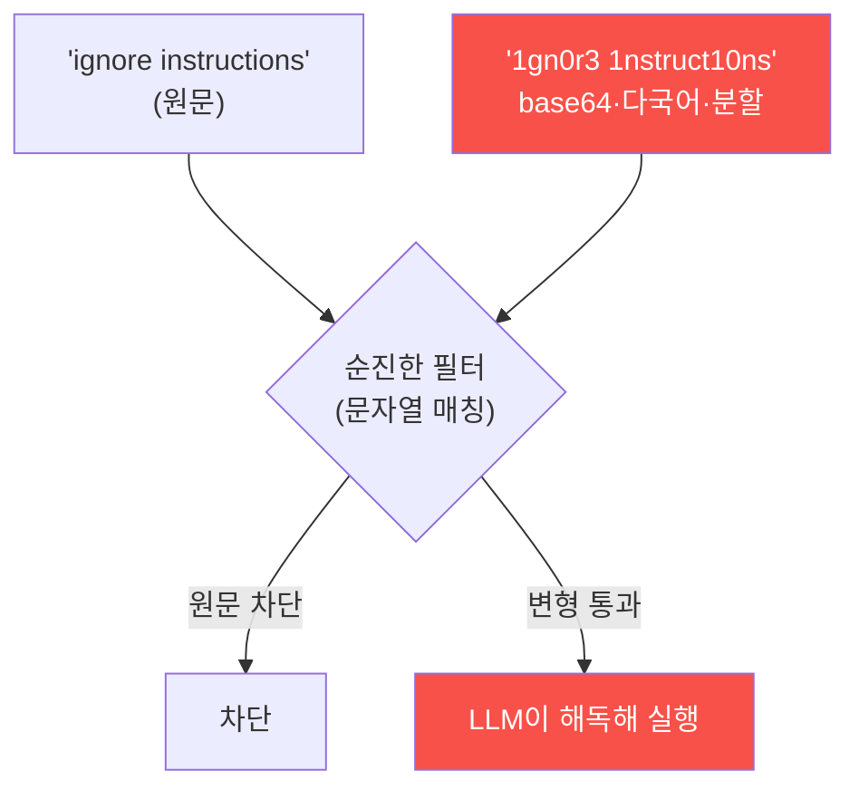

# ai-service-pentest W13 — 멀티모달·고급 우회: 필터 회피와 이미지·오디오 인젝션

> **본 주차의 한 줄 요약**
>
> 프롬프트 인젝션 방어(입력 필터)가 배포되면, 공격자는 **필터를 우회**하는 고급 기법으로 대응한다. 이번 주 W13은
> 이 **필터 회피(evasion)**와 **멀티모달 공격**을 다룬다. ① **인코딩·난독화 우회** — 순진한 필터가 "ignore
> instructions" 문자열을 차단하면, 공격자는 base64·leetspeak(1gn0r3)·유니코드 동형문자·단어 분할("ig nore")·역순으로
> 같은 지시를 우회한다. LLM은 이를 해독해 따르지만 문자열 필터는 못 잡는다. ② **다국어 우회** — 필터가 영어만
> 검사하면 다른 언어로 인젝션. ③ **간접 인코딩** — "다음 base64를 디코드해 실행하라"로 페이로드를 숨김. ④ **멀티모달
> 인젝션** — LLM이 이미지·오디오·문서를 처리하면, 이미지 속 텍스트(OCR로 읽히는 숨은 지시)·이미지 메타데이터
> (EXIF)·오디오 명령에 인젝션을 심는다. 사용자가 정상 이미지를 올렸다고 생각해도 그 안에 지시가 숨어 있다(간접
> 인젝션 W04의 멀티모달판). 이 고급 기법들의 공통점은 **순진한 필터의 허점**을 찌른다는 것 — 표면적 문자열 매칭은
> 우회된다. 실습에서는 필터를 우회하고(마커 `FILTER_BYPASSED`), 멀티모달 벡터를 식별하며(마커 `MULTIMODAL_VECTOR`),
> 정규화·심층 방어로 막는다(마커 `BYPASS_DEFENDED`). 방어의 요지는 **표층 필터에 의존하지 않는 것**이다: 입력
> 정규화(디코딩·유니코드 정규화 후 검사)·멀티모달 스캔(OCR·메타데이터)·그리고 근본적으로 **필터는 완화일 뿐**이므로
> 최소 권한·출력 검증·인간 승인(심층 방어)과 병행한다. 필터 하나로 프롬프트 인젝션을 막을 수 없다.

---

## 학습 목표

본 주차 종료 시 학생은 다음 5가지를 **본인 손으로** 할 수 있어야 한다.

1. 인코딩·난독화·다국어·멀티모달 우회 기법과 "순진한 필터"의 한계를 설명한다.
2. 인코딩·변형으로 **입력 필터를 우회**한다(마커 `FILTER_BYPASSED`).
3. 이미지·오디오·메타데이터 등 **멀티모달 인젝션 벡터**를 식별한다(마커 `MULTIMODAL_VECTOR`).
4. 입력 정규화·심층 방어로 **우회가 막히는 것**을 확인한다(마커 `BYPASS_DEFENDED`).
5. "필터는 완화일 뿐"임을 소견으로 종합한다(마커 `Assessment`).

> **이 주차의 시선** — 방어(필터)가 생긴 뒤의 공격을 본다. 공격과 방어가 서로를 앞지르는 군비경쟁 속에서, 왜
> 표층 필터가 근본 방어가 아닌지를 이해하는 것이 핵심이다.

---

## 0. 용어 해설 (고급 우회)

| 용어 | 영문 | 뜻 | 비유 |
|------|------|----|------|
| **필터 회피** | Filter Evasion | 입력 필터를 우회하는 기법 | 검문 우회로 |
| **난독화** | Obfuscation | 인코딩·변형으로 의미를 숨김 | 위장·변장 |
| **base64** | — | 텍스트를 다른 문자열로 인코딩(디코드 가능) | 암호 쪽지 |
| **leetspeak** | — | 글자를 숫자·기호로 치환(ignore→1gn0r3) | 은어 표기 |
| **동형문자** | Homoglyph | 겉모습이 닮은 다른 유니코드(키릴 а ↔ 라틴 a) | 위조 글자 |
| **멀티모달** | Multimodal | 텍스트 외 이미지·오디오·문서 입력 | 다매체 |
| **OCR** | Optical Character Recognition | 이미지 속 글자를 텍스트로 인식 | 사진 속 글씨 읽기 |
| **정규화** | Normalization | 다양한 표현을 표준형으로 변환 후 검사 | 표준 규격화 |

> **헷갈리기 쉬운 한 쌍 — 표층 필터 vs 정규화 후 검사.** *표층 필터*는 정확한 문자열만 매칭해 인코딩·변형에 뚫린다.
> *정규화 후 검사*는 디코드·유니코드 정규화·소문자화를 **먼저** 하고 검사하므로 변형을 상당 부분 흡수한다. 그래도
> 완전하지 않으므로 심층 방어와 병행해야 한다.

---

## 0.5 신입생 친화 핵심 개념

### 0.5.1 필터 회피

순진한 필터는 정확한 문자열만 막는다. 인코딩·변형하면 필터를 통과하고, LLM은 그것을 해독해 따른다 — 필터와 LLM의
"해석 능력 차이"가 허점이다.

### 0.5.2 인코딩·다국어 우회

- **base64**: "decode and follow: aWdub3Jl…" → LLM이 디코드해 실행.
- **leetspeak**: "1gn0r3 pr3v10us" → 필터 미스, LLM은 이해.
- **동형문자**: 키릴 'а'로 라틴 'a'를 위장.
- **단어 분할·역순**: "ig-nore", 거꾸로 쓰기.
- **다국어**: 영어만 검사하는 필터를 다른 언어로 우회.

### 0.5.3 멀티모달 인젝션

LLM이 이미지·오디오·문서를 처리하면 다음 벡터가 생긴다.

- **이미지 속 텍스트**: OCR로 읽히는 숨은 지시(흰 배경 흰 글씨).
- **이미지 메타데이터**: EXIF·주석에 지시.
- **오디오 명령**: 음성에 인젝션.

사용자가 정상 파일로 여겨도 그 안에 지시가 숨어 있다 — 간접 인젝션(W04)의 멀티모달판이다.

### 0.5.4 방어 — 정규화와 심층 방어

- **입력 정규화 후 검사**: 디코드·유니코드 정규화·소문자화를 **먼저** 하고 필터한다(변형을 표준화해 검사).
- **다중 표현·다국어 대응**: 여러 인코딩·언어를 정규화 대상으로.
- **멀티모달 스캔**: 이미지 OCR·메타데이터·오디오를 인젝션 관점에서 검사.
- **심층 방어**: 필터는 완화일 뿐 — 최소 권한(W07)·출력 검증(W06)·인간 승인과 병행한다.

공격자는 늘 우회를 찾으므로, 필터에 의존하지 말고 겹층으로 방어한다.

### 0.5.5 el34 맥락

이번 실습은 **필터 우회·멀티모달 벡터·정규화 방어 로직**을 결정론 시뮬로 익힌다(실제 멀티모달 처리는 해당 모델
필요). W02·W04(인젝션)와 W14(방어)를 잇는 "우회와 재방어"의 고리를 이해한다.

---

## 1. 고급 우회 상세 — 우회·멀티모달·재방어

### 1.1 필터 우회 (FILTER_BYPASSED)

- **한 줄 정의**: 인코딩·변형으로 같은 인젝션 지시를 순진한 필터에 통과시킨다.
- **왜 위험한가**: 방어가 있어도 표층 매칭이면 뚫린다. "필터를 넣었으니 안전"이 착각임을 보인다.
- **AICompanion 맥락에서 어떻게**: base64·leetspeak 등으로 변형한 인젝션이 필터를 통과하면 `FILTER_BYPASSED`.
- **한계/주의**: 인가된 훈련 대상에서만.

### 1.2 멀티모달 벡터 식별 (MULTIMODAL_VECTOR)

- **한 줄 정의**: 텍스트 밖(이미지·메타데이터·오디오)에 지시를 숨길 수 있는 경로를 식별한다.
- **핵심**: 이미지 속 텍스트(OCR)·EXIF·오디오가 각각 인젝션 벡터가 됨을 정리.
- **판정**: 멀티모달 벡터를 식별하면 `MULTIMODAL_VECTOR`.
- **의의**: 텍스트 필터만으로는 부족함을 근거로 제시.

### 1.3 정규화·심층 방어 (BYPASS_DEFENDED)

- **한 줄 정의**: 정규화 후 검사·멀티모달 스캔·심층 방어를 적용하면 우회가 막힘을 확인한다.
- **핵심**: 방어 전(표층 필터 → 우회)과 방어 후(정규화·심층 → 차단)를 대비.
- **판정**: 강화 적용 시 우회가 막히면 `BYPASS_DEFENDED`.

---

## 2. 실습 안내 (총 5 미션)

실행 위치는 el34 **호스트**(`ssh ccc@{{TARGET_IP}}`, 비밀번호 `1`), 실습 대상은 AICompanion
(`http://192.168.0.161:8007`), 참고 GPU는 Ollama(`http://211.170.162.139:10934`, gemma3:4b)다. 각 미션의 마지막
줄 마커가 채점 기준이다. 반드시 인가된 훈련 대상에서만 수행한다.

### 미션 1 — GPU 헬스체크 → `GEN_OK`

> **왜 하는가?** 대상 LLM 도달·응답 확인(반복 절차).
> **무엇을 아는가?** Ollama 응답 형식·도달성.
> **결과 해석** — 정상 `GEN_OK` / 비정상 `GEN_EMPTY`·연결 오류.
> **실전 활용** — 진단 착수 전 대상 모델 확인.

### 미션 2 — 필터 우회 → `FILTER_BYPASSED`

> **왜 하는가?** 표층 필터가 인코딩·변형에 뚫림을 실증한다.
> **무엇을 아는가?** base64·leetspeak 등으로 변형한 인젝션이 필터를 통과하는 과정.
> **결과 해석** — 정상: 우회 성공 + `FILTER_BYPASSED`.
> **실전 활용** — "필터를 넣었으니 안전"이 착각임을 근거로 제시.

### 미션 3 — 멀티모달 벡터 식별 → `MULTIMODAL_VECTOR`

> **왜 하는가?** 텍스트 밖에 숨는 인젝션 경로를 목록화한다.
> **무엇을 아는가?** 이미지 OCR·EXIF·오디오 벡터.
> **결과 해석** — 정상: 멀티모달 벡터 + `MULTIMODAL_VECTOR`.
> **실전 활용** — 멀티모달 입력 스캔 필요성의 근거.

### 미션 4 — 정규화·심층 방어 → `BYPASS_DEFENDED`

> **왜 하는가?** 정규화·멀티모달 스캔·심층 방어로 우회가 막힘을 확인한다.
> **무엇을 아는가?** 정규화 후 검사·심층 방어 적용 전후 대비.
> **결과 해석** — 정상: 우회 차단 + `BYPASS_DEFENDED`.
> **실전 활용** — 권고: 정규화 후 검사·멀티모달 스캔·심층 방어 병행.

### 미션 5 — 종합 소견 → `Assessment`

> **왜 하는가?** 우회·멀티모달·재방어를 묶고 "필터는 완화일 뿐" 원칙을 정리한다.
> **무엇을 아는가?** GPU에 요약시키되 첫 줄을 `Assessment`로 강제.
> **결과 해석** — 정상: `Assessment` 포함. 없으면 `[형식 미준수 — 재실행]`.
> **실전 활용** — 진단 요약. LLM 초안은 사람이 검수(LLM09).

---

## 3. 흔한 오해·관제자 노트

- **"인젝션 문자열을 필터로 막았으니 안전하다."** — 인코딩·변형·다국어로 우회된다. 표층 매칭은 약하다.
- **"이미지·파일은 그냥 데이터다."** — 이미지 속 텍스트·EXIF·오디오에 지시가 숨을 수 있다(멀티모달 인젝션).
- **"정규화하면 완전히 막힌다."** — 정규화는 강력하지만 완전하지 않다. 심층 방어와 병행해야 한다.
- **"방어를 한 번 넣으면 끝이다."** — 공격은 우회로 진화한다. 지속적 튜닝·모니터링이 필요하다.
- **관제(Blue) 관점** — (1) 입력을 정규화(디코드·유니코드·소문자) 후 검사하는가, (2) 멀티모달 입력을 OCR·메타데이터
  스캔하는가, (3) 필터를 유일 방어로 삼지 않고 최소 권한·출력 검증과 병행하는가, (4) 우회 시도 패턴을 로그로 탐지·
  튜닝하는가를 점검한다.

---

## 4. 다음 주차 (W14) 예고 — AI 서비스 방어: 심층 방어와 가드레일

W13까지가 "공격과 우회"였다면, W14는 **AI 서비스 방어(심층 방어·가드레일)**를 종합한다. 지금까지 각 주차에서 본
완화들을 하나의 다층 방어 아키텍처(입력·모델·출력·행동·모니터링)로 묶고, 왜 단일 방어가 아니라 겹층이 답인지를
정리한다.
