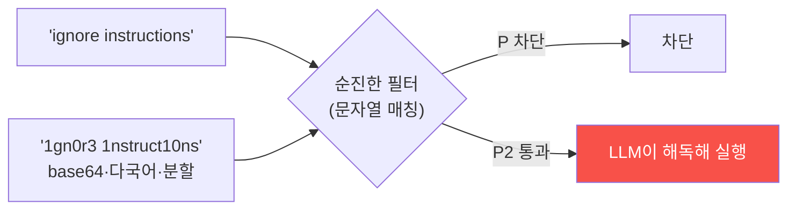

# ai-service-pentest W13 — 멀티모달·고급 우회: 필터 회피와 이미지·오디오 인젝션

> **본 주차의 한 줄 요약**
>
> 프롬프트 인젝션 방어(입력 필터)가 배포되면, 공격자는 **필터를 우회**하는 고급 기법으로 대응한다. W13은 이
> **필터 회피(evasion)** 와 **멀티모달 공격**을 다룬다. ① **인코딩·난독화 우회** — 순진한 필터가 "ignore
> instructions" 문자열을 차단하면, 공격자는 **base64**·**leetspeak**(1gn0r3)·**유니코드 동형문자**·**단어 분할**
> ("ig nore")·**역순**으로 같은 지시를 우회한다. LLM은 이를 해독해 따르지만 문자열 필터는 못 잡는다, ② **다국어
> 우회** — 필터가 영어만 검사하면 다른 언어로 인젝션, ③ **간접 인코딩** — "다음 base64를 디코드해 실행하라"로
> 페이로드를 숨김, ④ **멀티모달 인젝션** — LLM이 이미지·오디오·문서를 처리하면, **이미지 속 텍스트**(OCR로 읽히는
> 숨은 지시)·**이미지 메타데이터**·**오디오 명령**에 인젝션을 심는다. 사용자가 정상 이미지를 올렸다고 생각해도
> 그 안에 지시가 숨어 있다(간접 인젝션 W04의 멀티모달판). 이 고급 기법들의 공통점은 **순진한 필터의 허점**을
> 찌른다는 것 — 표면적 문자열 매칭은 우회된다. 방어(W14)는 **표층 필터에 의존하지 않는다**: 입력 정규화
> (디코딩·유니코드 정규화 후 검사), 다국어·다중 표현 대응, 멀티모달 입력 스캔(이미지 OCR·메타데이터 검사),
> 그리고 근본적으로 **필터는 완화일 뿐**이므로 최소 권한·출력 검증·인간 승인(심층 방어)과 병행한다. 필터 하나로
> 프롬프트 인젝션을 막을 수 없다 — 공격자는 늘 우회를 찾는다.
>
> **한 줄 결론**: 고급 우회는 인코딩·다국어·멀티모달(이미지·오디오)로 순진한 입력 필터를 회피한다. 방어 =
> **입력 정규화 후 검사 + 멀티모달 스캔 + 심층 방어**(필터는 완화일 뿐, 최소 권한·출력 검증 병행).

---

## 학습 목표

본 주차 종료 시 학생은 다음 5가지를 **본인 손으로** 할 수 있어야 한다.

1. **필터 회피** 기법(인코딩·다국어)을 설명한다.
2. 순진한 필터를 **우회**한다(FILTER_BYPASSED).
3. **멀티모달 인젝션** 벡터를 이해한다(MULTIMODAL_VECTOR).
4. **정규화·심층 방어**로 대응한다(BYPASS_DEFENDED).
5. 왜 필터만으로 부족한지 설명한다.

> **이 주차의 시선** — 필터를 우회하는 고급 기법을 이해하고, 정규화·심층 방어로 대응한다.

---

## 0. 용어 해설 (고급 우회)

| 용어 | 영문 | 뜻 | 비유 |
|------|------|----|------|
| **필터 회피** | Filter Evasion | 필터 우회 | 검문 우회 |
| **난독화** | Obfuscation | 인코딩·변형 | 위장 |
| **동형문자** | Homoglyph | 닮은 유니코드 | 위조 글자 |
| **멀티모달** | Multimodal | 이미지·오디오 | 다매체 |
| **정규화** | Normalization | 표준형 변환 | 표준화 |

> **헷갈리기 쉬운 한 쌍** — *표층 필터(문자열 매칭)* 는 "우회당함", *정규화 후 검사* 는 "변형을 표준화해 검사(강함)"
> 이다. 표층 매칭은 약하다.

---

## 0.5 신입생 친화 핵심 개념

### 0.5.1 필터 회피

순진한 필터는 정확한 문자열만 막는다. 인코딩·변형하면 우회되고, LLM은 이를 해독해 따른다.

### 0.5.2 인코딩·다국어 우회

- **base64**: "decode and follow: aWdub3Jl..." → LLM이 디코드해 실행.
- **leetspeak**: "1gn0r3 pr3v10us" → 필터 미스, LLM 이해.
- **동형문자**: 키릴 'а'로 라틴 'a' 위장.
- **단어 분할·역순**: "ig-nore", 거꾸로.
- **다국어**: 영어 필터를 다른 언어로 우회.

### 0.5.3 멀티모달 인젝션

LLM이 이미지·오디오·문서를 처리하면:
- **이미지 속 텍스트**: OCR로 읽히는 숨은 지시(흰 배경 흰 글씨).
- **이미지 메타데이터**: EXIF에 지시.
- **오디오 명령**: 음성에 인젝션.
사용자가 정상 파일로 여겨도 지시가 숨어 있다 — 간접 인젝션(W04)의 멀티모달판.

### 0.5.4 방어 — 정규화와 심층 방어

- **입력 정규화 후 검사**: 디코드·유니코드 정규화·소문자화 **후** 필터(변형을 표준화해 검사).
- **다중 표현·다국어 대응**: 여러 인코딩·언어를 정규화.
- **멀티모달 스캔**: 이미지 OCR·메타데이터·오디오를 인젝션 검사.
- **심층 방어**: 필터는 **완화일 뿐** — 최소 권한(W07)·출력 검증(W06)·인간 승인 병행. 필터 하나로 못 막는다.
공격자는 늘 우회를 찾으니, 필터에 의존하지 말고 겹층으로.

### 0.5.5 el34 맥락

본 실습은 **필터 우회·멀티모달 벡터·정규화 방어 로직**을 결정론 시뮬로 익힌다(실제 멀티모달은 해당 모델 필요).

---

## 1. 실습 안내 (5 미션)

실행 위치 el34 **호스트**(`ssh ccc@{{TARGET_IP}}`), GPU `http://211.170.162.139:10934`.

### STEP 1 — GPU 헬스체크 → GEN_OK
### STEP 2 — 필터 우회 → FILTER_BYPASSED
### STEP 3 — 멀티모달 인젝션 벡터 → MULTIMODAL_VECTOR
### STEP 4 — 정규화·심층 방어 → BYPASS_DEFENDED
### STEP 5 — 종합 → Assessment

---

## 2. 흔한 오해·관제자 노트

- **"필터 하나면 인젝션 차단"** — 우회당함. 정규화+심층 방어.
- **"문자열 매칭이면 됨"** — 인코딩·다국어 우회. 정규화 후 검사.
- **"이미지는 안전"** — 멀티모달 인젝션. 스캔.
- **관제 관점** — AI 서비스가 입력 정규화 후 필터·멀티모달 스캔·심층 방어(최소 권한·출력 검증)를 갖췄는지 점검
  한다. 필터는 완화일 뿐.

---

## 3. 다음 주차 (W14) 예고 — AI 서비스 방어

W13이 "고급 우회"였다면, W14는 **AI 서비스 방어** — 지금까지의 모든 공격에 대한 방어(가드레일·입출력 검증·최소
권한·모니터링)를 종합한다.
